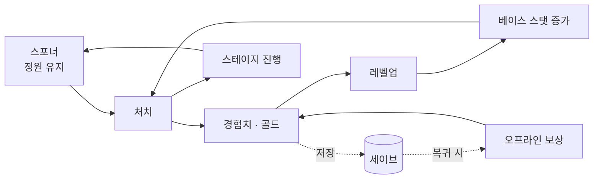

# Idle Game

> Unity 기반 **방치형(Idle) + 능동 전투 하이브리드**.
> 자동으로 도는 성장 루프 위에, 플레이어가 직접 개입하는 전투를 얹었다.

`Unity 6` · `C#` · 1인 개발 · 2026.03 ~ 진행 중
---

## 성장 루프

방치형의 완성도는 콘텐츠 개수가 아니라 **사이클이 사람 손 없이 한 바퀴 도는가**로 결정된다.
그래서 마일스톤을 "스킬 10개·장비 20개" 같은 물량이 아니라 **루프가 몇 바퀴 도는가**로 잘랐다.



적이 끊기지 않고 공급되고 → 처치가 경험치·골드가 되고 → 레벨업이 **실제로** 스탯을 올리고 →
누적 처치가 스테이지를 넘기고 → 앱을 껐다 켜도 진행이 남으며 → 자리를 비운 시간이 보상이 된다.

## 설계 하이라이트

### 제어 주체를 추상화해 두 모드를 한 파이프라인으로

방치 모드와 능동 모드를 별도 코드로 만들지 않았다. **"누가 조종하는가"** 를 인터페이스로 뽑아,
입력 소스만 교체하면 동일한 상태 머신·전투 파이프라인이 두 모드를 모두 처리한다.

```
IMoveInputSource ← JoystickInputReader   (능동: 플레이어)
                 ← AutoBattleInputSource (방치: AI)
```

이 프로젝트의 핵심 설계 판단이며, 상세는 [입력·제어 모드 명세](docs/specs/player/input.md)에 있다.

### 원인을 저장하고 결과는 재계산한다

세이브에 **최종 공격력 517을 담지 않고 "레벨 12"를 담는다.** 로드할 때 레벨 테이블로 스탯을
다시 산출하므로, 밸런스 패치로 성장 곡선이 바뀌면 **기존 세이브도 로드 즉시 새 곡선을 따른다.**
최종 수치를 저장했다면 이미 플레이 중인 유저는 영원히 옛 수치를 들고 다니게 된다.

같은 이유로 스테이지도 배열 인덱스가 아니라 문자열 식별자로 저장한다 —
인덱스를 쓰면 스테이지를 중간에 하나 끼워 넣는 순간 모든 유저의 진행이 한 칸씩 밀린다.

→ [세이브 시스템 명세](docs/specs/core/save.md)

### 값이 늘어날 자리를 페이로드로 열어 둔다

처치 보상은 `Publish(int exp)`가 아니라 `Publish(in KillRewardPayload)`로 발행한다.
드랍·업적이 추가돼도 **필드만 늘리면 되고** 발행 측과 기존 구독자는 바뀌지 않는다(OCP).
적 스폰 주입(`EnemySpawnParams`)도 같은 패턴을 따른다. 값 타입이라 힙 할당도 없다.

### 스탯을 키 기반으로 두어 성장 규칙을 데이터로 밀어냈다

베이스 스탯이 고정 필드(`MaxHp`, `AttackPower`, …)였을 때는 새 스탯을 레벨 성장에 넣을 때마다
모델과 오케스트레이터를 함께 고쳐야 했다. `StatType` 키 기반으로 바꾼 뒤로는
**레벨 테이블(SO)에 항목을 추가하는 데이터 작업**만으로 끝난다.

→ [스탯 명세](docs/specs/player/stats.md) · [성장 명세](docs/specs/player/progression.md)

## 진행 현황

| 마일스톤 | 내용 | 상태 |
|---|---|---|
| **M0** 루프 닫기 | 레벨→스탯 리졸버 · 적 스포너 + 오브젝트 풀 · 골드 재화 · 세이브/로드 | 구현 완료 · 동작 확인 |
| **M1** Vertical Slice | 스테이지 진행(1~5) · 오프라인 보상 · 세이브 스키마 v2 | 구현 완료 · 밸런스 미조정 |
| | 장비 드랍 · 인벤토리 · HUD 실체화 | 미착수 |
| **M2** 빌드의 깊이 | 전직 · 스킬 포인트 · 스킬 습득 UI | 계획 |
| **M3** 보스·능동 전투 | 보스 패턴 · 능동 모드 진입점 | 계획 |
| **M4** 경제 확장 | 강화 · 상점 · 재화 Sink | 계획 |

전체 로드맵과 우선순위 근거는 [콘텐츠 로드맵](docs/gdd/content-roadmap.md)에 있다.

## 테스트

EditMode 단위 테스트 **113건 전부 통과**(1.8초). 순수 C# 로직(MonoBehaviour 비종속)이라 에디터 재생 없이 돈다.

| 대상 | 잠그는 것 |
|---|---|
| 레벨 테이블 · 리졸버 | **레벨 1과 50의 스탯이 다른가** — 성장 루프가 끊겼던 결함의 회귀 방어 |
| 성장 컨트롤러 | 경험치 이월 · 다중 레벨업 · 상한 클램프 |
| 지갑 | `TrySpend`가 잔액 부족 시 **잔액을 건드리지 않는가**(원자성) |
| 오브젝트 풀 | `Rent → Return → Rent`가 같은 인스턴스를 재사용하는가 |
| 세이브 | 왕복 · 손상 폴백 · 백업 복구 · 버전 가드 · 마이그레이션 연쇄 |
| 스테이지 | 클리어 경계 · 삭제된 스테이지 폴백 · 오프라인 처치가 진행을 밀지 않는가 |
| 오프라인 보상 | 시간·처치율 비례 · 상한 클램프 · 시계 되돌림 방어 |

저장 **정책**은 메모리 대역(`FakeSaveRepository`)으로 파일 I/O 없이 검증한다.
`ISaveRepository`가 추상이라 가능한 교체이며, 이것이 DIP를 지킨 실익이다.

## 문서

기능을 구현할 때마다 **왜 그렇게 설계했는지**를 명세로 남겼다.
문서 폴더는 코드의 `Features/<도메인>` 구조를 그대로 미러링한다.

| 분류 | 내용 |
|---|---|
| [**문서 허브**](docs/README.md) | 전체 아키텍처 개요 + 명세 인덱스 |
| [`gdd/`](docs/gdd) | 무엇을·왜 만드는가 — 코어 루프 · 재화 흐름 · 마일스톤 |
| [`specs/`](docs/specs) | 완성된 시스템의 구조와 설계 근거 (as-built) |
| [`design/`](docs/design) | 구현 전·중의 방향과 계획서 |
| [`reports/`](docs/reports) | 진단 리포트 · 리팩터링 기록 |
| [`conventions/`](docs/conventions) | 명세 작성 규칙 · 커밋 컨벤션 |

`design/`의 계획서가 구현을 거쳐 `specs/`의 as-built 명세로 이어지고,
그 과정에서 발견한 문제는 `reports/`에 진단으로 남긴다.
계획과 실제가 갈리면 **갈린 지점과 이유**를 계획서에 as-built로 덧붙인다.

### Player 도메인 명세

플레이어 하나를 10개 시스템으로 쪼개고, 각각의 구조·설계 근거·다이어그램을 문서로 고정했다.

- [상태 머신](docs/specs/player/state-machine.md) · [스탯](docs/specs/player/stats.md) · [스킬](docs/specs/player/skills.md) · [전투](docs/specs/player/combat.md) · [입력](docs/specs/player/input.md)
- [이동](docs/specs/player/movement.md) · [성장](docs/specs/player/progression.md) · [장비](docs/specs/player/equipment.md) · [버프](docs/specs/player/buffs.md) · [표현](docs/specs/player/presentation.md)

읽는 순서는 [`specs/player/README.md`](docs/specs/player/README.md) §0에 정리해 두었다.

## 실행

Unity Hub에서 프로젝트를 열고 `Assets/Dev/SampleScene`을 재생한다.
테스트는 `Window → General → Test Runner → EditMode`에서 실행한다.

코드 규칙은 [CLAUDE.md](CLAUDE.md), 문서·커밋 규약은 [`conventions/`](docs/conventions) 참조.
