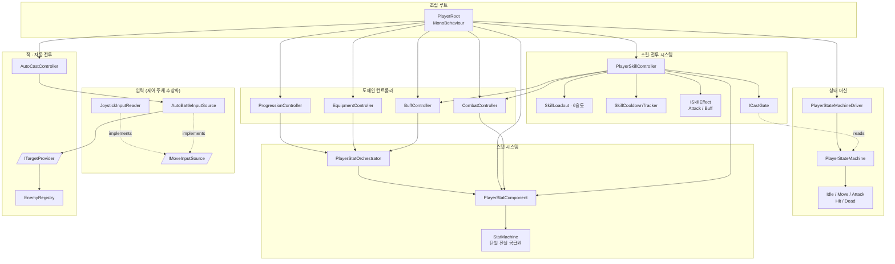

# Idle Game — 기술 문서 허브

> Unity 기반 **방치형(Idle) + 능동 전투 하이브리드** 게임의 아키텍처 및 기능별 기술 명세서.
> 설계 원칙: OOP · SOLID · 확장 가능성 · 테스트 가능성 ([CLAUDE.md](../CLAUDE.md) 준수)

---

## 0. 이 문서는 무엇인가

이 저장소의 설계 의도와 시스템 구조를 기록한 문서 모음입니다. 두 층위로 구성됩니다.

1. **전체 아키텍처 개요** — 아래 본문. 프로젝트 전체를 한눈에.
2. **기능별 상세 기술 명세서** — [`specs/`](./specs) 폴더. 각 시스템의 설계·구조·다이어그램.

**아키텍처 명세** — [`specs/`](./specs) (완성된 시스템의 구조·설계 근거). 코드 `Features/<도메인>`를 미러링하는 **도메인 폴더**로 구성한다.

| 도메인 | 인덱스 | 내용 |
|--------|--------|------|
| **Player** | [`specs/player/`](./specs/player) | 상태 머신·스탯·스킬·전투·입력·이동·성장·장비·버프·표현 + `PlayerRoot` 조립 명세 (10개 시스템). 심사자용 추천 순서는 [player/README.md](./specs/player/README.md) §0 참조 |

**설계·계획** — [`design/`](./design) (구현 전·중의 방향)

| 문서 | 내용 |
|------|------|
| [combat-skill-plan.md](./design/combat-skill-plan.md) | 스킬 시스템 구현 계획서(연혁) |
| [player-root-refactoring-proposal.md](./design/player-root-refactoring-proposal.md) | PlayerRoot 리팩터링 제안 |

**분석·기록** — [`reports/`](./reports) (진단·작업 로그)

| 문서 | 내용 |
|------|------|
| [stat-system-refactoring-guide.md](./reports/stat-system-refactoring-guide.md) | 스탯 시스템 진단 리포트 |
| [refactoring-worklog-2026-07-09.md](./reports/refactoring-worklog-2026-07-09.md) | 리팩터링 작업 로그 |
| [cast-gate-default-argument-mismatch.md](./reports/cast-gate-default-argument-mismatch.md) | CastGate 기본 인자 불일치·`Attack` 상태 정리 |
| [unused-duplicate-models-cleanup.md](./reports/unused-duplicate-models-cleanup.md) | 미사용·중복 모델 정리와 변환 로직 단일화 |
| [base-stat-resolver-level-scaling.md](./reports/base-stat-resolver-level-scaling.md) | 베이스 스탯 리졸버 레벨 스케일링 구현 |

**규약** — [`conventions/`](./conventions)

| 문서 | 내용 |
|------|------|
| [spec-writing.md](./conventions/spec-writing.md) | 기술 명세서 작성 규칙(문서 종류·섹션 템플릿·Mermaid 규약) |
| [git-commit-convention.md](./conventions/git-commit-convention.md) | Git 커밋 컨벤션 |

---

## 1. 게임 개요

**순수 방치형 + 능동 전투**의 하이브리드 구조입니다.

- **방치 모드**: AI가 적을 탐색·접근·자동 공격하며 성장. (`AutoBattleInputSource` + `AutoCastController`)
- **능동 모드**: 보스/레이드/PvP에서 플레이어가 조이스틱 이동 + 스킬 버튼으로 직접 조작. (`JoystickInputReader` + `SkillButton`)

두 모드를 별도 코드로 만들지 않았습니다. **"제어 주체(플레이어/AI)"를 인터페이스로 추상화**해, 입력 소스만 교체하면 동일한 상태 머신·전투 파이프라인이 두 모드를 모두 처리합니다. 이것이 이 프로젝트의 핵심 설계 판단입니다.

---

## 2. 아키텍처 원칙

이 프로젝트는 세 가지 규칙을 관통해서 지킵니다.

### 2.1 Composition Root — 조립은 한 곳에서만

객체 생성과 의존성 연결은 오직 [`PlayerRoot`](../Assets/Idle%20Game/Scripts/Features/Player/Composition/PlayerRoot.cs) 한 곳에서 일어납니다. 나머지 클래스는 **필요한 의존성을 생성자로 주입받기만** 합니다.

```
PlayerRoot.Compose()   →  객체 생성 + 의존성 주입
PlayerRoot.Initialize()→  초기 데이터 적용(스탯/장비/버프)
PlayerRoot.Update()    →  ITickable 목록만 순회
```

`PlayerRoot`는 "얇은 글루(glue)"입니다. 비즈니스 로직을 갖지 않고, 누가 누구에게 의존하는지만 결정합니다.

### 2.2 DIP — 구체가 아니라 추상에 의존

MonoBehaviour(Unity 종속)와 순수 C# 로직을 분리합니다. 로직 클래스는 인터페이스에만 의존하므로 **EditMode 단위 테스트에서 목(mock)으로 교체**할 수 있습니다.

| 추상 | 역할 | 구현 교체 예 |
|------|------|--------------|
| `IMoveInputSource` | 이동 입력 공급 | 조이스틱 / AI 자동전투 |
| `ITargetProvider` | 공격 대상 선택 | 최근접 적 / (향후) 최저 HP 적 |
| `ICastGate` | 시전 중 잠금 판정 | 상태 머신 기반 |
| `ISkillEffect` | 스킬 효과 실행 | 공격 / 버프 / (향후) 소환·디버프 |
| `ITickable` | 프레임 갱신 대상 | 스탯·버프·스킬·자동시전 |

### 2.3 ITickable — Update 순회의 개방·폐쇄

프레임 갱신이 필요한 시스템은 모두 `ITickable`을 구현하고, `PlayerRoot`가 리스트로 순회합니다. **새 틱 시스템을 추가해도 `Update()`를 수정하지 않습니다(OCP).**

---

## 3. 시스템 맵

`PlayerRoot`가 조립하는 전체 객체 그래프입니다. 화살표는 의존(참조) 방향입니다.



세 개의 핵심 시스템(상태 머신 · 스탯 · 스킬)은 각자 독립적인 책임을 가지며, `PlayerRoot`에서만 서로 연결됩니다.

---

## 4. 폴더 구조

```
Assets/Idle Game/Scripts/
├── Core/Game/              게임 매니저
├── Data/
│   ├── Definitions/        ScriptableObject 데이터 (Skill/Buff/Equipment/Stat 정의)
│   └── Input/              입력 리더
├── Shared/                 프로젝트 공통 값 객체·열거형
│   ├── Enums/              StatType, ModifierOp, ModifierLayer, SkillType
│   ├── ValueObjects/       StatModifier, StatDefinition
│   └── Serialization/      직렬화용 구조체
└── Features/
    ├── Player/             ── 명세: specs/player/
    │   ├── Composition/    PlayerRoot (조립 루트) ── player/README.md
    │   ├── StateMachine/   상태 머신 ── state-machine.md
    │   ├── Stats/          스탯 시스템 ── stats.md
    │   ├── Skills/         스킬 시스템 ── skills.md
    │   ├── Combat/         전투 진입점 ── combat.md
    │   ├── Buffs/          버프 컨트롤러 ── buffs.md
    │   ├── Equipment/      장비 컨트롤러 ── equipment.md
    │   ├── Progression/    레벨/경험치 ── progression.md
    │   ├── Input/          입력 소스 구현 ── input.md
    │   ├── Movement/       이동 컨트롤러 ── movement.md
    │   └── Presentation/   HUD, 스킬 버튼 ── presentation.md
    └── Enemy/              적 유닛·레지스트리·타겟 제공자
```

폴더 = 기능(Feature) 단위로 나뉘며, 각 기능은 `Contracts`(인터페이스) / `Core`(핵심 로직) / `Effects`·`States`·`Adapters`(구현) 하위 구조를 따릅니다.

---

## 5. 문서 규약

문서 작성 규칙(문서 종류·공통 섹션 템플릿·Mermaid 규약·커밋 규칙)의 **단일 기준은 [`conventions/spec-writing.md`](./conventions/spec-writing.md)** 입니다. 이 허브는 규칙을 중복 기술하지 않고 인덱스 역할만 합니다. (규칙 변경은 그 문서에서만 하고, 여기서는 반복하지 않습니다.)

요약: 모든 문서는 **한국어** + GitHub 렌더링 **Mermaid**(Diagram as Code). 상세 템플릿·규칙은 [`spec-writing.md`](./conventions/spec-writing.md) 참조.
