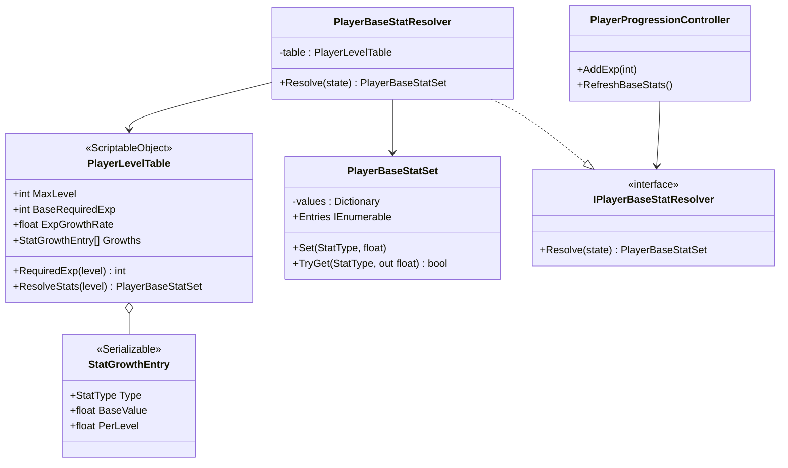
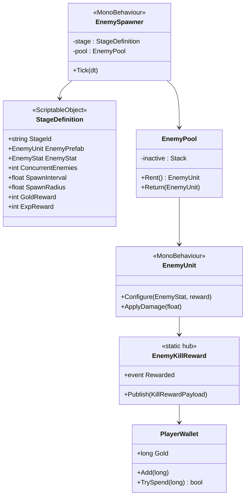
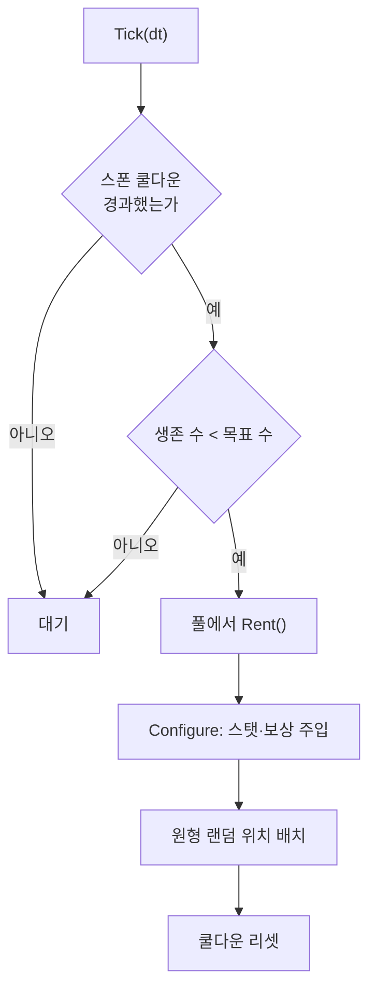
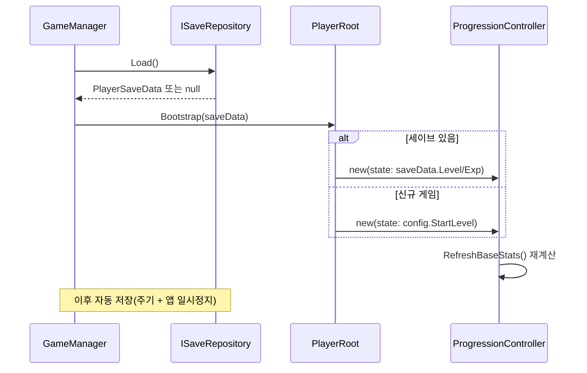

# M0 — 루프 닫기(Close the Loop) 구현 계획서

> **종류**: 설계 명세 (TDD) · **상태**: Draft
> **최종 갱신**: 2026-07-21 · **관련 기획서**: [content-roadmap.md](../gdd/content-roadmap.md) §5.2 (M0)
> **관련 명세**: [progression.md](../specs/player/progression.md) · [stats.md](../specs/player/stats.md) · [kill-exp-reward.md](../specs/enemy/kill-exp-reward.md)
> **관련 계획서**: [player-data-management-plan.md](./player-data-management-plan.md) (세이브·재화의 정본 — 이 문서는 그중 M0 범위만 구현한다)

---

## 0. 이 계획서의 출발점

[content-roadmap.md](../gdd/content-roadmap.md) §2가 진단한 대로, 이 프로젝트는 **성장 루프가 한 바퀴도 돌지 않는다.** 끊긴 곳은 세 군데다.

| # | 끊긴 지점 | 코드 근거 |
|---|-----------|-----------|
| 1 | **레벨업해도 강해지지 않는다** | `PlayerBaseStatResolver.Resolve(progressionState, config)`가 **`progressionState`를 받고도 쓰지 않는다.** 반환값이 전적으로 `config`의 시작 스탯이라, 레벨 1과 레벨 100의 스탯이 동일하다 |
| 2 | **적이 다시 나오지 않는다** | `EnemyUnit.Die()`가 `SetActive(false)`로 끝난다. 적을 재공급하는 주체가 코드 어디에도 없다 |
| 3 | **성장이 휘발된다** | 저장·로드가 전무하다. `GameManager`는 `Start()`/`Update()`가 빈 스텁이다 |

M0는 **이 셋을 닫아 "방치할 수 있는 상태"를 만드는 것**만을 목표로 한다. 재미·밸런싱·콘텐츠 물량은 M1 이후다.

## 1. 개요·목적

플레이어가 앱을 켜 두고 자리를 비웠을 때 **적이 계속 공급되고 → 처치로 경험치·골드가 쌓이고 → 레벨업이 실제로 스탯을 올리고 → 앱을 껐다 켜도 그 진행이 남아 있는** 최소 사이클을 완성한다.

핵심 설계 판단은 셋이다.

1. **"레벨 → 스탯"의 단일 출처는 데이터(SO)다.** 성장 공식을 코드에 하드코딩하지 않고 `PlayerLevelTable`(SO)에 둔다. 현재 `PlayerProgressionController.RequiredExpForNextLevel()`이 `100 + (level-1) * 20`을 **코드에 박아 두고 있는데**, 이는 기획자가 밸런스를 만질 수 없는 구조다.
2. **베이스 스탯 집합을 `StatType` 키 기반으로 전환한다.** 현재 `PlayerBaseStatSet`은 8개 고정 필드라 `StatType` 20종 중 8종만 레벨 성장에 참여할 수 있다. 레벨업으로 치명타율을 올리는 것이 **구조적으로 불가능**하다.
3. **적 공급은 스테이지 데이터가 결정한다.** 스포너는 "무엇을 몇 마리 유지할지"를 스스로 알지 않고 `StageDefinition`(SO)에서 받는다. 스테이지 추가가 **에셋 생성 1건**으로 끝나게 한다([content-roadmap.md](../gdd/content-roadmap.md) §3.5의 "단일 씬 + 데이터 교체" 결정).

## 2. 범위(Scope)

| 구분 | 내용 |
|------|------|
| **포함** | `PlayerLevelTable`(SO) 신설 · `PlayerBaseStatSet`의 `StatType` 키 전환 · `PlayerBaseStatResolver`가 레벨 반영 · `EnemySpawner` + 오브젝트 풀 · `StageDefinition`(SO) · 골드 재화(`PlayerWallet`, 금액 `long`) · `EnemyKillReward`의 골드 확장 · 세이브/로드(`ISaveRepository` + `FileSaveRepository` 원자적 쓰기 + `ISaveMigration` 계약 pass-through) · `PlayerRoot`의 세이브 주입 분기 · `GameManager` 실체화 · `NumberFormatter` |
| **미포함(Out of scope)** | 스테이지 **진행·해금**(M1) · 오프라인 보상(M1) · 아이템 드랍·인벤토리(M1) · 상점·강화(M4) · 전직(M2) · 스킬 습득 UI(M2) · **밸런스 수치 튜닝**(구조만 세우고 값은 임시) · 세이브 암호화·서버 저장 |

**스테이지 해금을 M0에서 빼는 이유**: M0의 목표는 "루프가 도는가"이지 "진행이 있는가"가 아니다. M0에서는 **스테이지 1 하나만** 존재하고 무한 반복한다. 그 상태로 루프가 도는 것을 확인한 뒤 M1에서 스테이지를 늘린다. 이렇게 잘라야 M0에서 실패했을 때 원인이 스포너인지 해금 로직인지 헷갈리지 않는다.

## 3. 요구사항 → 설계 해석

| 요구사항 | 설계적 해석 |
|----------|-------------|
| 레벨이 오르면 실제로 강해진다 | `PlayerLevelTable`이 레벨→스탯을 결정. `PlayerBaseStatResolver`가 테이블을 읽어 `PlayerBaseStatSet`을 만든다. **`Resolve`에서 `config` 인자를 제거**해 `Resolve(PlayerProgressionState)`로 바꾼다 — `config`는 "시작 상태"를 담고, "레벨→성장 규칙"은 `PlayerLevelTable`의 책임이라, 두 출처를 동시에 참조하면 스탯의 진실 공급원이 둘로 갈라진다(SRP). 시그니처가 바뀌므로 호출부(`PlayerProgressionController`)도 **함께 갱신**한다 |
| 기획자가 코드 없이 밸런스를 조정한다 | 필요 경험치·스탯 성장을 **전부 SO 필드로**. 레벨 100개를 손으로 채우지 않도록 **공식(기본값 + 레벨당 증가) + 선택적 오버라이드** 구조 |
| 적이 끊기지 않고 공급된다 | `EnemySpawner`가 **동시 생존 수를 목표치로 유지**한다(지속 스폰). 죽은 적을 풀에 반납하고 재사용 |
| 스테이지 추가가 값싸다 | `StageDefinition`(SO)이 프리팹·동시 수·스탯 배율을 담는다. 스포너는 이를 주입받을 뿐 스테이지를 모른다 |
| 골드가 쌓인다 | `PlayerWallet`(순수 C#)이 잔액을 소유(금액 `long` — 정본 §11 인플레이션 대비). `EnemyKillReward`가 골드도 함께 발행 |
| 껐다 켜도 진행이 남는다 | `PlayerSaveData`를 정본 §5.1 섹션 구조(`ProgressionSaveSection`·`WalletSaveSection`)로 저장. `FileSaveRepository`가 원자적으로 쓰고, `ISaveRepository` 뒤로 저장 매체를 격리 |

## 4. 시스템 구조





## 5. 데이터 구조 (기획자가 조정할 값)

### 5.1 `PlayerLevelTable`

레벨 100개를 손으로 채우는 것은 비현실적이므로 **공식 기반**으로 둔다.

| 필드 | 의미 | 임시값 |
|------|------|--------|
| `MaxLevel` | 최고 레벨 | 100 |
| `BaseRequiredExp` | 레벨 1→2 필요 경험치 | 100 |
| `ExpGrowthRate` | 레벨당 필요 경험치 배율(기하) | 1.12 |
| `Growths[]` | `StatType`별 `BaseValue`(레벨1) + `PerLevel`(레벨당 가산) | 아래 |
| `SkillPointRewards[]` **(M2)** | 특정 레벨에서 지급할 스킬 포인트 `(Level, Reward)` sparse 목록. `SkillPointReward(level)` 조회, 미등록 레벨은 0 | M2에서 추가 |

`ResolveStats(level)` = `BaseValue + PerLevel × (level - 1)` (선형).

**선형을 택한 이유**: 지수 성장은 [content-roadmap.md](../gdd/content-roadmap.md) §3.6의 **float 안전 상한(1e7)** 을 순식간에 넘긴다. 유한형(레벨 100 상한)에서는 선형으로도 충분한 성장감을 주며, 상한 관리가 자명하다. 필요하면 `PerLevel`에 곡률을 추가하는 것으로 확장 가능하다.

> **float 상한 검증**: `AttackPower = 10 + 5 × 99 = 505`. 장비·버프 곱연산을 최대 100배로 가정해도 50,500. **안전 상한 1,677만의 0.3%** — 여유가 충분하다.

> **이 테이블이 레벨 성장의 통합 정본이다(로드맵 [§5.4](../gdd/content-roadmap.md)).** 레벨→경험치·레벨→베이스 스탯은 **M0**에서, 레벨→스킬 포인트(`SkillPointRewards[]`)는 **M2**에서 **같은 SO에 컬럼으로 얹는다.** 포인트 전용 테이블을 따로 만들지 않는다 — 기획자가 한 곳에서 레벨별 곡선·스탯·포인트를 함께 조정하게 하기 위함이다. [skill-menu-plan.md](./skill-menu-plan.md) §6.4는 이 테이블을 **확장**할 뿐 신설하지 않는다. 스탯 성장(`Growths[]`, 매 레벨 공식)과 포인트 지급(`SkillPointRewards[]`, 특정 레벨만 sparse)은 **성격이 달라** 별도 컬럼으로 둔다.

### 5.2 `StageDefinition`

| 필드 | 의미 | M0 임시값 |
|------|------|-----------|
| `EnemyPrefab` | 스폰할 적 프리팹 | `Enemy_Slime` |
| `EnemyStat` | 적 스탯 SO | `EnemyStat` |
| `ConcurrentEnemies` | **동시 생존 목표 수** | 5 |
| `SpawnInterval` | 스폰 간격(초) | 1.0 |
| `SpawnRadius` | 스폰 원 반경 | 8 |
| `ExpReward` / `GoldReward` | 처치 보상 | 10 / 5 |

## 6. 상세 로직

### 6.1 스포너 — 지속 스폰(동시 수 유지)



**웨이브가 아니라 지속 스폰을 택한 근거**: 방치형의 성과 지표는 **초당 처치량(DPS 환산)** 이다. 웨이브 방식은 웨이브 사이에 **전투 공백**이 생겨 이 지표가 불안정해지고, M1의 오프라인 보상 공식(`초당 처치량 × 경과시간`)과 단위가 어긋난다. 동시 생존 수를 일정하게 유지하면 처치율이 안정되어 **두 시스템이 같은 지표를 공유**한다.

### 6.2 처치 보상 — 페이로드 확장

현재 `EnemyKillReward.Publish(int exp)`는 경험치만 전달한다. 골드가 추가되면서 **인자가 늘어날 때마다 시그니처를 바꾸는 것**을 피하기 위해 페이로드 구조체로 감싼다.

```
readonly struct KillRewardPayload { int Exp; int Gold; }
EnemyKillReward.Publish(in KillRewardPayload)
```

**OCP 근거**: 향후 아이템 드랍(M1)이 추가되면 `Publish(exp, gold, itemId, ...)`처럼 인자가 계속 늘어난다. 페이로드로 감싸면 **필드만 추가**하면 되고, 기존 구독자(`EnemyExpRewardHandler`)는 자기가 관심 있는 필드만 읽는다(ISP).

### 6.3 세이브 — 원인을 저장하고 결과는 재계산

[player-data-management-plan.md](./player-data-management-plan.md)가 확정한 원칙을 따른다. **최종 공격력 517을 저장하지 않고 "레벨 12"를 저장**한 뒤 로드 시 `PlayerLevelTable`로 재계산한다.



**엣지 케이스**

| 상황 | 처리 |
|------|------|
| 세이브 파일 없음 | 신규 게임으로 시작(예외 아님) |
| 세이브 파일 손상(JSON 파싱 실패) | `save.bak` 복구 시도 → 실패 시 경고 로그 + 신규 게임으로 폴백(정본 §6.8). **앱이 죽지 않는다** |
| 저장된 레벨 > `MaxLevel` | `MaxLevel`로 클램프(밸런스 패치로 상한이 내려간 경우) |
| 앱 강제 종료 | `OnApplicationPause(true)` / `OnApplicationQuit`에서 저장 |

## 7. 인터페이스·의존성 (구현보다 먼저 확정)

| 계약 | 시그니처 | 소유 |
|------|----------|------|
| `IPlayerBaseStatResolver` | `PlayerBaseStatSet Resolve(PlayerProgressionState)` | **변경** — 기존 `Resolve(state, config)`에서 `config` 제거. 성장 규칙 출처를 `PlayerLevelTable`로 일원화(SRP). 호출부(`PlayerProgressionController`)도 함께 수정 |
| `IExpReceiver` | `void AddExp(int)` | **변경 없음** |
| `IGoldReceiver` | `void AddGold(long)` | 신설 — `PlayerWallet`이 구현 |
| `ISaveRepository` | `bool TryLoad(out PlayerSaveData)` / `void Save(PlayerSaveData)` / `void Delete()` | 신설 — `FileSaveRepository`가 구현(정본 §7) |
| `ISaveable` | `void CaptureState(PlayerSaveData)` / `void RestoreState(PlayerSaveData)` | 신설 — 각 도메인이 자기 섹션만 담당(정본 §4.2) |
| `ISaveMigration` | `int FromVersion` / `void Migrate(PlayerSaveData)` | 신설 — **계약만 확정**, M0는 등록 0개 pass-through(정본 §6.6) |
| `EnemyKillReward.Publish` | `Publish(in KillRewardPayload)` | **변경** (기존 `int exp` → 페이로드) |

**`IGoldReceiver`를 `IExpReceiver`와 분리하는 이유(ISP)**: 골드를 받는 주체(`PlayerWallet`)와 경험치를 받는 주체(`PlayerProgressionController`)는 **다른 객체**다. 하나의 `IRewardReceiver`로 합치면 `PlayerWallet`이 `AddExp`를, 성장 컨트롤러가 `AddGold`를 억지로 구현해야 한다.

## 8. 설계 포인트 (SOLID 매핑)

| 원칙 | 적용 |
|------|------|
| **SRP** | 스포너는 "적을 공급"만, 풀은 "재사용"만, `StageDefinition`은 "무엇을 얼마나"만 안다 |
| **OCP** | `KillRewardPayload`로 보상 종류가 늘어도 발행 시그니처가 안 바뀐다. 스탯 성장이 `StatType` 키 기반이라 새 스탯을 레벨 성장에 넣어도 `PlayerStatOrchestrator`가 안 바뀐다 |
| **LSP** | `ISaveRepository`를 파일→서버로 바꿔도 호출부가 동일하게 동작한다 |
| **ISP** | `IExpReceiver` / `IGoldReceiver` 분리. 보상 허브는 필요한 계약만 안다 |
| **DIP** | `PlayerBaseStatResolver`가 SO를 주입받고, `GameManager`가 `ISaveRepository` 추상에 의존한다 |

**가장 중요한 리팩터 — `PlayerBaseStatSet`의 키 기반 전환**

```
// 현재: 8개 고정 필드 → StatType 20종 중 8종만 성장 가능
public sealed class PlayerBaseStatSet { public float MaxHp; public float MaxMp; ... }

// 변경: StatType 키 → 새 스탯 추가 시 이 클래스도 오케스트레이터도 안 바뀜
public sealed class PlayerBaseStatSet { Dictionary<StatType, float> ... }
```

`PlayerStatOrchestrator.ApplyBaseStats()`가 현재 8줄을 하드코딩하는데, 이는 **새 스탯을 레벨 성장에 넣을 때마다 수정해야 하는 OCP 위반**이다. 키 기반 전환 후에는 `foreach`로 순회한다. 영향 범위는 3개 파일(`PlayerBaseStatSet`·`PlayerStatOrchestrator`·`PlayerBaseStatResolver`)로 작다.

## 9. Unity 특화

| 항목 | 설계 |
|------|------|
| **오브젝트 풀링** | `EnemyPool`이 `Stack<EnemyUnit>` 보유. `Instantiate`/`Destroy`를 런타임에 반복하지 않는다. 초기 크기 = `ConcurrentEnemies × 2` |
| **`EnemyRegistry`와 풀의 상호작용** | `EnemyUnit.OnEnable`/`OnDisable`이 레지스트리에 등록/해제하므로 **풀 반납 = `SetActive(false)` = 자동 해제**. 기존 구조를 그대로 활용한다 |
| **정적 상태 잔류** | `EnemyKillReward`가 이미 `[RuntimeInitializeOnLoadMethod]`로 구독자를 리셋한다. `EnemyRegistry`도 **동일 처리를 추가**해야 한다(도메인 리로드 비활성 시 유령 적 잔류) |
| **성능 예산** | 스폰 Tick은 프레임당 O(1). `EnemyRegistry.All` 순회는 최근접 타겟 탐색에서 O(n), n ≤ 20이므로 무시 가능 |
| **저장 경로** | `Application.persistentDataPath`(정본 §9) |
| **원자적 쓰기** | `save.tmp` 기록·Flush → 기존 `save.json`을 `save.bak`로 백업 → `save.tmp`를 `save.json`으로 rename. 쓰기 중 강제 종료 시 기존 세이브 생존(정본 §6.5) |
| **자동 저장 시점** | 주기(30~60초, 정본 §6.3) + 중요 이벤트(레벨업) + `OnApplicationPause(true)`. `OnApplicationQuit`은 모바일에서 보장되지 않아 **유일 의존 금지**(정본 §9). 매 프레임 저장하지 않는다(모바일 I/O) |

## 10. 테스트 케이스 (EditMode, 순수 C#)

| # | 대상 | 검증 |
|---|------|------|
| 1 | `PlayerLevelTable.RequiredExp` | 레벨 1→2가 `BaseRequiredExp`와 같다. 레벨이 오를수록 단조 증가한다 |
| 2 | `PlayerLevelTable.ResolveStats` | 레벨 1의 `AttackPower` = `BaseValue`. 레벨 N = `Base + PerLevel × (N-1)` |
| 3 | **`PlayerBaseStatResolver`가 레벨을 반영한다** | 레벨 1과 레벨 50의 결과가 **다르다** (← 현재 버그의 회귀 테스트) |
| 4 | `PlayerProgressionController.AddExp` | 경험치 초과분이 다음 레벨로 이월된다. 여러 레벨 동시 상승이 가능하다 |
| 5 | `PlayerProgressionController` | `MaxLevel` 도달 시 더 이상 오르지 않고 경험치가 넘치지 않는다 |
| 6 | `PlayerWallet` | `TrySpend`가 잔액 부족 시 `false`를 반환하고 **잔액을 건드리지 않는다**(원자성) |
| 7 | `EnemyPool` | `Rent` → `Return` → `Rent`가 **같은 인스턴스**를 재사용한다 |
| 8 | 세이브 왕복 | `CaptureState` → 직렬화 → 역직렬화 → `RestoreState` 후 레벨·경험치·골드가 일치한다 |
| 9 | 세이브 손상 | 잘못된 JSON을 주면 예외를 던지지 않고 신규 게임으로 폴백한다 |

## 11. 리스크·미결정(TBD)

| 항목 | 내용 |
|------|------|
| **성장 곡선 계수** | `PerLevel` 값은 임시. 실제 튜닝은 M1에서 스테이지 난이도와 함께 |
| **`GoldGainRate` 연결** | `StatType.GoldGainRate`가 이미 존재. M0에서는 **연결하지 않고** 보상을 그대로 지급한다. M4의 경제 확장에서 배율로 연결 |
| **`PlayerProgressionData` 중복 모델** | `PlayerBaseStatSet`과 중복이며 오타(`BaseAttakPower`)까지 있는 **미사용 클래스**로 보인다. M0에서 삭제 여부 확인 필요 |
| **적 스탯의 스테이지 스케일링** | M0는 단일 스테이지라 배율이 불필요. M1에서 `StageDefinition`에 배율 필드 추가 |
| **재화 식별자·다중 통화** | 정본은 `WalletSaveSection`을 `(CurrencyId, long)` 목록으로 둔다. M0는 골드 하나만 다루므로 `CurrencyId`를 문자열/enum 중 무엇으로 둘지는 정본 §11대로 미룬다. `PlayerWallet`의 잔액 API는 `long` 기준 |

## 12. 확장 여지 (지금 만들지 않되 막지 않을 것)

- **스테이지 진행**: `StageDefinition`을 교체하는 `StageController`만 얹으면 된다. 스포너는 이미 스테이지를 주입받는 구조라 수정이 없다.
- **아이템 드랍**: `KillRewardPayload`에 필드를 추가하고 새 핸들러를 구독시킨다. 발행 측(`EnemyUnit`)과 기존 구독자는 안 바뀐다.
- **오프라인 보상**: 시간 기준선은 정본의 `WorldSaveSection.LastSaveUtcTicks`가 담당한다. 이 섹션은 정본 §13 단계3(M1)에서 도입되므로 **M0 세이브에는 넣지 않는다** — M0는 `Progression`·`Wallet` 섹션만 저장한다(정본 단계1과 일치). M1의 오프라인 공식(`초당 처치량 × 경과시간`)이 이 값을 쓴다.
- **보스**: `EnemyUnit`을 상속하거나 `StageDefinition`에 보스 필드를 추가한다. 스포너는 프리팹을 주입받을 뿐이라 무관하다.

## 13. 파일 위치

| 구분 | 파일 | 경로 |
|------|------|------|
| 데이터 | `PlayerLevelTable` | `Scripts/Data/Definitions/` |
| 데이터 | `StageDefinition` | `Scripts/Data/Definitions/` |
| 성장 | `PlayerBaseStatSet`(수정) | `Scripts/Features/Player/Stats/Models/` |
| 성장 | `PlayerBaseStatResolver`(수정) | `Scripts/Features/Player/Stats/Resolution/` |
| 성장 | `PlayerStatOrchestrator`(수정) | `Scripts/Features/Player/Stats/Orchestration/` |
| 재화 | `PlayerWallet` · `IGoldReceiver` | `Scripts/Features/Player/Wallet/` (정본 §14) |
| 재화 | `EnemyGoldRewardHandler` | `Scripts/Features/Enemy/` (`EnemyExpRewardHandler`와 대칭) |
| 적 | `EnemySpawner` · `EnemyPool` | `Scripts/Features/Enemy/Spawning/` |
| 적 | `KillRewardPayload`(수정) | `Scripts/Features/Enemy/` |
| 저장 | `PlayerSaveData`(+섹션 DTO) | `Scripts/Core/Save/Model/` (정본 §14) |
| 저장 | `ISaveRepository` · `FileSaveRepository` · `SaveService` · `ISaveable` | `Scripts/Core/Save/` |
| 저장 | `ISaveMigration`(계약) | `Scripts/Core/Save/Migration/` |
| 게임 | `GameManager`(수정) | `Scripts/Core/Game/` |
| 공용 | `NumberFormatter` | `Scripts/Shared/Utils/` |

## 14. 착수 순서

1. **레벨 테이블 + 리졸버** — 가장 작고 독립적. 다른 시스템을 건드리지 않고 §0의 결함 1을 닫는다.
2. **스포너 + 풀** — 결함 2를 닫는다. 1의 효과를 관찰할 무대가 된다.
3. **골드 + 보상 페이로드** — 재화 축 신설.
4. **세이브 + `GameManager`** — 결함 3을 닫는다. 앞의 셋이 다 있어야 저장할 것이 생긴다.
