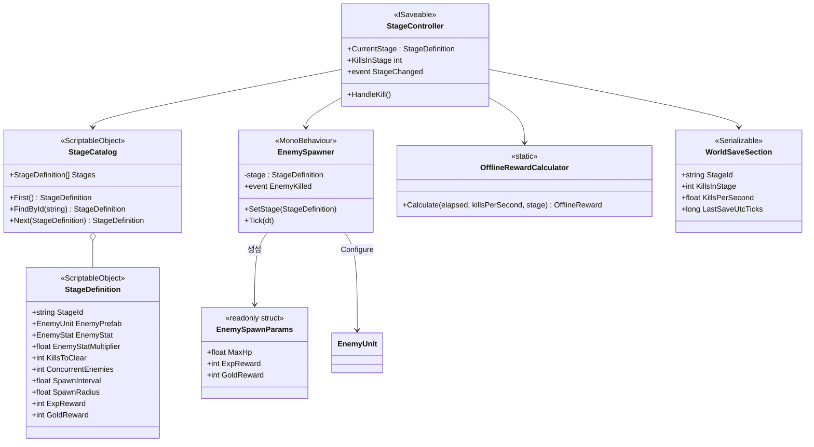
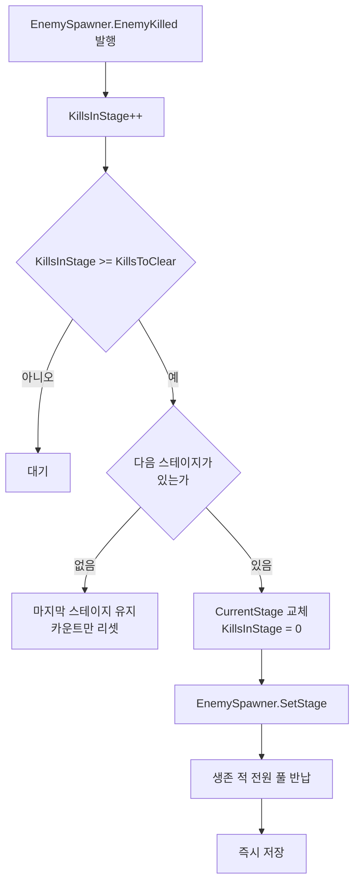
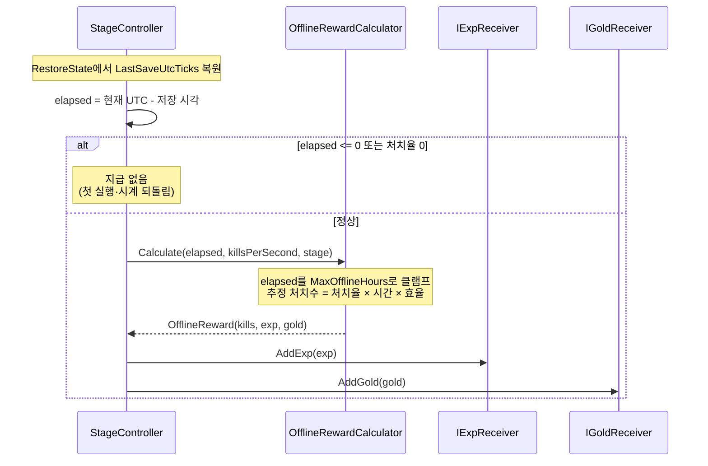

# M1 — Vertical Slice(진척의 척도) 구현 계획서

> **종류**: 설계 명세 (TDD) · **상태**: **1·2단계 구현 완료**(스테이지 진행·오프라인 보상) — 씬 에셋 생성·런타임 검증 대기. 3·4단계(인벤토리·HUD)는 미착수
> **최종 갱신**: 2026-08-23 · **관련 기획서**: [content-roadmap.md](../gdd/content-roadmap.md) §5.3 (M1)
> **관련 계획서**: [m0-close-the-loop-plan.md](./m0-close-the-loop-plan.md) (선행 마일스톤) · [player-data-management-plan.md](./player-data-management-plan.md) (세이브 정본)
> **관련 명세**: [specs/core/save.md](../specs/core/save.md) · [specs/enemy/kill-exp-reward.md](../specs/enemy/kill-exp-reward.md) · [progression.md](../specs/player/progression.md)

---

## 0. 이 계획서의 출발점

M0로 성장 루프는 한 바퀴 돈다. 적이 계속 공급되고, 처치가 경험치·골드가 되고, 레벨업이 스탯을 올리고, 껐다 켜도 남는다.

그런데 **플레이어가 어디까지 왔는지 알 방법이 없다.** 스테이지가 하나뿐이라 무한 반복이고, 자리를 비운 동안에는 아무 일도 일어나지 않는다. [content-roadmap.md](../gdd/content-roadmap.md) §5.3의 표현대로 *"무한 사냥터에 목표와 눈금을 준다"* 가 M1의 목적이다.

| 현재 없는 것 | 코드 근거 |
|---|---|
| **진척** | `StageDefinition`이 하나뿐이고 `EnemySpawner`가 `[SerializeField]`로 고정 참조한다. 런타임 교체 진입점이 없다 |
| **난이도 곡선** | `StageDefinition`에 배율 필드가 없다. 모든 적이 같은 `EnemyStat`을 쓴다 |
| **방치의 보상** | 앱이 꺼진 동안의 시간이 아무것도 만들지 않는다. `WorldSaveSection`이 없어 기준 시각조차 저장되지 않는다 |

## 1. 개요·목적

**방치만으로 스테이지 1에서 5까지 나아가고, 앱을 껐다 켜면 그동안의 성과를 받는다.**

핵심 설계 판단은 다섯이다.

1. **스테이지 목록은 카탈로그가 소유하고, 세이브는 인덱스가 아니라 `StageId`를 저장한다.** 순서를 바꾸거나 중간에 스테이지를 끼워 넣어도 기존 세이브가 엉뚱한 스테이지를 가리키지 않는다.
2. **난이도 배율은 스포너가 적용하고, 적은 최종 수치만 받는다.** `EnemyUnit`이 `StageDefinition`·배율 규칙을 알면 스테이지 개념이 적에게 새어 들어간다.
3. **클리어 조건은 누적 처치 수다.** M1에 보스가 없으므로(로드맵 §5.5) 판정 가능한 축은 처치량·시간뿐이고, 처치량이 방치형의 성과 지표(초당 처치량)와 단위가 같다.
4. **오프라인 보상은 이론값이 아니라 실측 처치율로 계산한다.** M0가 스포너를 정원 유지 방식으로 만든 이유가 여기서 회수된다 — 온라인과 오프라인이 **같은 지표**를 쓴다.
5. **v1→v2 마이그레이션은 내용이 없어도 등록한다.** 등록하지 않으면 기존 유저의 로드마다 "마이그레이션이 없습니다" 경고가 찍힌다.

## 2. 범위(Scope)

| 구분 | 내용 |
|------|------|
| **포함(이번 착수)** | `StageCatalog`(SO) 신설 · `StageDefinition` 확장(`StageId`·클리어 조건·적 배율) · `EnemySpawnParams`(readonly struct) 도입과 `EnemyUnit.Configure` 계약 변경 · `EnemySpawner.SetStage`/`EnemyKilled` 신설 · `StageController` 신설 · `WorldSaveSection`(현재 스테이지·누적 처치·처치율·마지막 저장 시각) · **세이브 스키마 v2 + `SaveMigration_V1ToV2`** · `OfflineRewardCalculator` · 복귀 보상 지급 |
| **미포함(후속 단계)** | 장비 드랍·인벤토리·장착(3단계) · HUD 실체화(4단계) · 보스(M3) · 스테이지 6 이상 · 상점·강화(M4) · **밸런스 수치 튜닝**(구조만 세우고 값은 임시) · 오프라인 보상 UI 팝업 |

**드랍·인벤토리를 뒤로 미루는 이유**: [player-data-management-plan.md](./player-data-management-plan.md) §13은 인벤토리(단계2)를 `WorldSaveSection`(단계3)보다 먼저 두었다. 그 근거는 *"세이브 파이프라인이 검증된 뒤에 큰 구조 변경을 해야 롤백이 쉽다"* 였는데, **그 검증은 M0에서 이미 끝났다.** 남은 판단 기준은 "무엇이 M1 DoD에 더 가까운가"이며, DoD의 세 축 중 둘(스테이지 5 도달·오프라인 보상)이 이번 범위다. 인벤토리는 세 번째 축("벽을 장비로 뚫는다")을 담당하므로 다음 사이클로 둔다.

## 3. 요구사항 → 설계 해석

| 요구사항 | 설계적 해석 |
|----------|-------------|
| 스테이지가 여러 개이고 순서가 있다 | `StageCatalog`(SO)가 `StageDefinition[]`을 소유. 스테이지 추가 = 배열에 항목 추가 |
| 클리어하면 다음으로 넘어간다 | `StageController`가 누적 처치 수를 세고 목표 도달 시 다음 스테이지를 스포너에 주입 |
| 뒤로 갈수록 어렵다 | `StageDefinition.EnemyStatMultiplier`. 스포너가 배율을 적용해 `EnemySpawnParams`를 만든다 |
| 스테이지 추가가 값싸다 | 에셋 1건 생성 + 카탈로그 배열에 추가. 코드 수정 0 |
| 진척이 저장된다 | `WorldSaveSection`에 `StageId`·누적 처치. `StageController`가 `ISaveable` 구현 |
| 자리를 비운 시간이 보상이 된다 | `LastSaveUtcTicks`와 실측 처치율로 경과분을 환산해 기존 보상 경로(`IExpReceiver`·`IGoldReceiver`)에 지급 |
| 구버전 세이브가 깨지지 않는다 | 스키마 v2 + `ISaveMigration` 구현 등록(M0에서 심어 둔 호출 지점의 첫 실사용) |
| 시계를 돌려 보상을 반복 수령할 수 없다 | 경과 시간이 음수면 0으로, 상한을 넘으면 상한으로 클램프 |

## 4. 시스템 구조



| 구성요소 | 책임 | 알지 못하는 것 |
|---|---|---|
| `StageCatalog` | 스테이지 목록과 순서 | 진행 상태, 클리어 판정 |
| `StageDefinition` | 한 스테이지의 스폰 규칙·난이도·목표 | 자기가 몇 번째인지, 다음이 무엇인지 |
| `EnemySpawner` | 정원 유지 스폰, 처치 사실 재발행 | 스테이지 진행·클리어 조건 |
| `StageController` | 클리어 판정·전환·진척 저장·오프라인 정산 | 적 개체, 스폰 규칙 |
| `OfflineRewardCalculator` | 경과 시간 → 보상 환산 | 저장·지급 경로 |

## 5. 데이터 구조 (기획자가 조정할 값)

### 5.1 `StageDefinition` 추가 필드

| 필드 | 의미 | M1 임시값 |
|------|------|-----------|
| `StageId` | 세이브에 기록되는 안정 식별자 | `"stage_01"` … `"stage_05"` |
| `KillsToClear` | 클리어에 필요한 누적 처치 수 | 20 / 30 / 45 / 65 / 90 |
| `EnemyStatMultiplier` | 적 스탯 배율(체력 등) | 1.0 / 1.4 / 2.0 / 2.8 / 4.0 |

기존 필드(`ConcurrentEnemies`·`SpawnInterval`·`SpawnRadius`·`ExpReward`·`GoldReward`)는 그대로 두고 스테이지마다 다른 값을 준다.

> **`StageId`를 문자열로 두는 이유**: 세이브에 배열 인덱스를 저장하면 스테이지를 중간에 끼워 넣는 순간 **모든 기존 유저의 진행이 한 칸씩 밀린다.** 문자열 식별자는 순서와 무관하며, 카탈로그에서 사라진 id는 첫 스테이지로 폴백하면 된다.

### 5.2 `StageCatalog`

| 필드 | 의미 |
|------|------|
| `Stages[]` | 순서대로 나열된 `StageDefinition` 참조 |

`FindById`는 선형 탐색으로 충분하다(스테이지 5개). `Next`는 배열에서 현재 위치의 다음 항목을 돌려주고, 마지막이면 `null`(= 더 진행할 곳 없음)을 준다.

### 5.3 `WorldSaveSection` (스키마 v2)

| 필드 | 의미 | 없을 때(구버전) |
|------|------|----------------|
| `StageId` | 현재 스테이지 | 빈 문자열 → 첫 스테이지 |
| `KillsInStage` | 현재 스테이지 누적 처치 | 0 |
| `KillsPerSecond` | 최근 실측 처치율(오프라인 환산용) | 0 → 오프라인 보상 없음 |
| `LastSaveUtcTicks` | 마지막 저장 시각(UTC) | 0 → 오프라인 보상 없음 |

### 5.4 오프라인 보상 설정

`StageCatalog` 또는 별도 SO에 둔다(§11 TBD).

| 필드 | 의미 | 임시값 |
|------|------|--------|
| `MaxOfflineHours` | 정산 상한 시간 | 8 |
| `OfflineEfficiency` | 온라인 대비 효율 | 0.5 |

> **상한과 효율을 두는 이유**: 상한이 없으면 한 달 방치가 최종 콘텐츠를 통째로 건너뛴다. 효율 계수는 "접속해서 노는 편이 낫다"는 유인을 남긴다. 둘 다 밸런스 손잡이라 SO에 노출한다.

## 6. 상세 로직

### 6.1 스테이지 전환



**전환 시 생존 적을 정리하는 이유**: 이전 스테이지의 배율로 초기화된 적이 남아 있으면, 새 스테이지에서 **약한 적이 섞여 도는 구간**이 생긴다. 정원이 새 적으로 다 채워질 때까지 클리어 속도가 왜곡되고, 그 왜곡이 실측 처치율(오프라인 보상의 입력)까지 오염시킨다.

**마지막 스테이지에서 반복하는 이유**: M1은 스테이지 5까지다. "더 갈 곳 없음"을 막다른 길로 만들면 방치가 무의미해지므로, 마지막 스테이지를 무한 반복하며 성장은 계속되게 둔다(M0의 단일 스테이지 동작과 같다).

### 6.2 적 스탯 주입 — 배율 적용 지점

```
현재: EnemyUnit.Configure(EnemyStat stat, int exp, int gold)   → maxHp = stat.maxHp
변경: EnemyUnit.Configure(in EnemySpawnParams p)               → maxHp = p.MaxHp
```

스포너가 `stat.maxHp × stage.EnemyStatMultiplier`를 계산해 페이로드에 담는다.

> **`KillRewardPayload`와 같은 패턴을 쓰는 이유(OCP)**: 적에게 주입할 값은 앞으로 늘어난다(공격력 배율, 드랍 테이블, 보스 패턴). 인자를 늘리면 그때마다 시그니처와 모든 호출부가 바뀐다. 값 타입이라 스폰 경로에 힙 할당도 없다.

> **배율을 적이 아니라 스포너가 적용하는 이유(SRP)**: `EnemyUnit`이 `StageDefinition`을 받으면 적이 "스테이지"라는 상위 개념을 알게 된다. 적은 자기 체력이 얼마인지만 알면 되고, 그 값이 어떤 규칙에서 나왔는지는 몰라야 한다.

### 6.3 처치 신호 — 누가 세는가

`StageController`가 처치를 세려면 신뢰할 수 있는 신호가 필요하다. 후보는 둘이었다.

| 후보 | 문제 |
|------|------|
| `EnemyKillReward.Rewarded` 구독 | `Publish`가 **경험치·골드가 모두 0이면 발행을 건너뛴다.** 보상 없는 적(향후 잡몹·소환수)이 생기면 클리어 카운트에서 조용히 누락된다 |
| `EnemyUnit.Despawned` 직접 구독 | 컨트롤러가 개별 적 인스턴스를 알아야 한다. 스폰·풀 반납 주체는 스포너인데 구독 관리가 이중화된다 |

**결정: `EnemySpawner`가 `EnemyKilled` 이벤트를 재발행한다.** 스포너는 이미 `Despawned`를 구독해 풀에 반납하고 있으므로 신호가 손에 있고, 스테이지와 스포너는 어차피 짝을 이룬다. `StageController`는 적 개체를 전혀 모른 채 "한 마리 죽었다"는 사실만 받는다.

### 6.4 오프라인 보상



**기존 보상 경로를 그대로 쓰는 이유**: 오프라인 보상이 레벨업·표시 갱신을 따로 처리하면 온라인 경로와 두 벌이 된다. `IExpReceiver.AddExp`에 넣으면 다중 레벨업 처리(M0에서 이미 구현)와 `ProgressChanged` 발행이 공짜로 따라온다.

**처치율 측정**: 세션 중 `누적 처치 / 누적 경과 시간`을 지수이동평균(EMA)으로 갱신해 저장한다. 순간값을 쓰면 전투 공백 한 번에 크게 흔들리고, 단순 평균을 쓰면 초반 로딩 구간이 영구히 반영된다.

**엣지 케이스**

| 상황 | 처리 |
|------|------|
| 첫 실행(`LastSaveUtcTicks == 0`) | 보상 없음 |
| 시계를 과거로 되돌림(`elapsed < 0`) | 0으로 클램프, 보상 없음 |
| 시계를 미래로 돌림 | `MaxOfflineHours` 상한이 이득을 제한한다(§11에 완전 방어는 서버 시각 필요로 명시) |
| 처치율 0(즉시 종료한 세션) | 보상 없음 |
| 오프라인 중 레벨이 `MaxLevel` 도달 | `AddExp`가 이미 상한을 처리한다 |
| 스테이지가 클리어될 만큼 처치 | **스테이지 전환은 하지 않는다**(§11 TBD) |

### 6.5 세이브 스키마 v2

`PlayerSaveData`에 `World` 섹션을 추가하고 `CurrentVersion`을 2로 올린다.

```
SaveService.CurrentVersion : 1 → 2
PlayerSaveData.World       : WorldSaveSection (신규)
```

**`SaveMigration_V1ToV2`는 실질적으로 아무 일도 하지 않는다.** `JsonUtility`는 없는 필드를 기본값으로 채우므로 변환할 것이 없기 때문이다. 그럼에도 **등록한다** — 등록하지 않으면 v1 세이브를 가진 모든 기존 유저의 로드마다 `"[Save] v1 → v2 마이그레이션이 없습니다"` 경고가 찍힌다. 그 경고는 진짜 문제를 알리기 위한 신호인데, 정상 상황에서 울리면 신호로서의 값을 잃는다.

## 7. 인터페이스·의존성 (구현보다 먼저 확정)

| 계약 | 시그니처 | 소유 |
|------|----------|------|
| `EnemyUnit.Configure` | `void Configure(in EnemySpawnParams)` | **변경** (기존 `Configure(EnemyStat, int, int)`) |
| `EnemySpawner.SetStage` | `void SetStage(StageDefinition)` | 신설 — 런타임 스테이지 교체 진입점 |
| `EnemySpawner.EnemyKilled` | `event Action` | 신설 — 처치 사실 재발행(§6.3) |
| `EnemySpawner.ClearAlive` | `void ClearAlive()` | 신설 — 전환 시 생존 적 일괄 반납 |
| `StageCatalog.FindById` | `StageDefinition FindById(string)` | 신설 — 없으면 `null` |
| `StageCatalog.Next` | `StageDefinition Next(StageDefinition)` | 신설 — 마지막이면 `null` |
| `StageController` | `ISaveable` 구현 + `event Action<StageDefinition> StageChanged` | 신설 |
| `OfflineRewardCalculator.Calculate` | `OfflineReward Calculate(TimeSpan, float, StageDefinition, OfflineRewardConfig)` | 신설 — 순수 함수(정적) |
| `ISaveMigration` | `SaveMigration_V1ToV2` | 신설 — **첫 구현체** |

**`OfflineRewardCalculator`를 정적 순수 함수로 두는 이유**: 입력(경과 시간·처치율·스테이지·설정)만으로 출력이 정해진다. 상태도 Unity 의존도 없어 EditMode 테스트에서 경계값을 직접 넣어볼 수 있다. 시간을 인자로 받는 것이 핵심이다 — 내부에서 `DateTime.UtcNow`를 읽으면 테스트가 불가능해진다.

## 8. 설계 포인트 (SOLID 매핑)

| 원칙 | 적용 |
|------|------|
| **SRP** | 스포너는 "공급"만, `StageController`는 "진척"만, 카탈로그는 "목록"만, 계산기는 "환산"만 |
| **OCP** | 스테이지 추가 = 에셋 1건 + 배열 항목. `EnemySpawnParams`로 적 주입 값이 늘어도 시그니처 불변. 마이그레이션은 구현 추가만 |
| **LSP** | `StageController`가 `ISaveable`로서 다른 조각과 동일하게 취급된다 |
| **ISP** | 오프라인 보상 지급은 `IExpReceiver`·`IGoldReceiver`만 안다. 지갑도 성장도 "오프라인"이라는 개념을 모른다 |
| **DIP** | `StageController`가 스포너의 구체 타입 대신 이벤트·주입 진입점에만 의존한다 |

## 9. Unity 특화

| 항목 | 설계 |
|------|------|
| **스테이지 전환 시 풀** | `ClearAlive()`가 생존 적을 전원 `Return`한다. 프리팹이 바뀌면 기존 풀은 폐기하고 새 풀을 만든다 — 다른 프리팹 인스턴스를 같은 풀에 섞으면 `Rent`가 엉뚱한 적을 준다 |
| **시각 취득** | `DateTime.UtcNow`. 로컬 시각은 시간대 변경·서머타임에 흔들린다 |
| **`long` 직렬화** | `LastSaveUtcTicks`는 `long`. `JsonUtility`가 `DateTime`을 직렬화하지 못한다 |
| **저장 시점** | 스테이지 전환은 **즉시 저장**한다(M0 §9의 "중요 이벤트" 항목). 주기 저장만 믿으면 전환 직후 강제 종료 시 진척이 통째로 날아간다 |
| **성능 예산** | 처치 카운트는 이벤트당 O(1). `FindById`는 스테이지 수만큼 선형이지만 로드 시 1회뿐 |
| **초기화 순서** | `PlayerRoot.Compose`에서 컨트롤러 생성 → 세이브 등록 → `Initialize`의 `LoadAndRestore` 시점에 복원·오프라인 정산 → 스포너에 스테이지 주입 |

## 10. 테스트 케이스 (EditMode)

| # | 대상 | 검증 |
|---|------|------|
| 1 | `StageCatalog.FindById` | 존재하는 id를 찾고, 없는 id는 `null`을 준다 |
| 2 | `StageCatalog.Next` | 다음 스테이지를 주고, 마지막에서는 `null`을 준다 |
| 3 | `StageController` | `KillsToClear`에 도달하면 다음 스테이지로 넘어가고 카운트가 0으로 리셋된다 |
| 4 | `StageController` | 마지막 스테이지에서는 전환하지 않고 카운트만 리셋한다 |
| 5 | `StageController` | 한 번의 처치로 두 스테이지가 넘어가지 않는다(경계) |
| 6 | 세이브 왕복 | `StageId`·누적 처치가 저장·복원된다 |
| 7 | 세이브 복원 | 카탈로그에 없는 `StageId`(삭제된 스테이지)면 첫 스테이지로 폴백한다 |
| 8 | `SaveMigration_V1ToV2` | v1 세이브를 로드해도 경고 없이 v2로 올라가고 진행이 보존된다 |
| 9 | `OfflineRewardCalculator` | 경과 시간에 비례해 보상이 늘고, `MaxOfflineHours`를 넘으면 상한에서 멈춘다 |
| 10 | `OfflineRewardCalculator` | 경과가 음수/0이거나 처치율이 0이면 보상이 0이다 |
| 11 | `OfflineRewardCalculator` | 효율 계수가 결과에 곱해진다 |
| 12 | `EnemySpawnParams` | 스테이지 배율이 적용된 체력으로 적이 초기화된다 |

## 11. 리스크·미결정(TBD)

| 항목 | 내용 |
|------|------|
| **오프라인 중 스테이지 전환** | 8시간분 처치가 여러 스테이지를 클리어할 수 있으나, M1은 **전환하지 않고 보상만** 지급한다. 오프라인 전환을 허용하면 "방치로 최종 스테이지 도달"이 가능해져 M1 DoD("도중에 최소 한 번 벽에 막힌다")와 충돌한다 |
| **시계 조작 완전 방어** | 로컬 시각 기반이라 미래로 돌리면 상한까지는 이득을 본다. 완전 방어는 서버 시각이 필요하며 [server-application-plan.md](./server-application-plan.md) 범위 |
| **오프라인 설정 SO의 위치** | `StageCatalog`에 얹을지 별도 `OfflineRewardConfig`로 뺄지 미정. 재화 배율(M4)과 함께 조정될 값이라 별도가 유력 |
| **처치율 EMA 계수** | 평활 계수는 임시값. 실측 후 조정 |
| **밸런스 수치 전반** | `KillsToClear`·`EnemyStatMultiplier`는 임시. DoD의 "최소 한 번 벽에 막힌다"를 실측하며 조정 |
| **스테이지별 적 프리팹 교체** | 프리팹이 바뀌면 풀을 새로 만든다. 스테이지를 오가며 반복 전환하면 인스턴스가 누적될 수 있어 폐기 처리 필요 |

## 12. 확장 여지 (지금 만들지 않되 막지 않을 것)

- **드랍 테이블(3단계)**: `StageDefinition`에 필드를 추가하고 `EnemySpawnParams`·`KillRewardPayload`에 얹는다. 스포너·적·기존 구독자는 바뀌지 않는다.
- **보스 스테이지(M3)**: `StageDefinition`에 보스 프리팹·패턴 참조를 추가하고 클리어 조건을 "보스 처치"로 분기한다. `StageController`의 판정부만 확장한다.
- **스테이지 6 이상**: 카탈로그 배열에 항목 추가. 코드 수정 없음.
- **오프라인 보상 팝업(4단계)**: `StageController`가 정산 결과를 이벤트로 발행하면 UI가 구독한다. 지급 경로는 그대로.

## 13. 파일 위치

| 구분 | 파일 | 경로 |
|------|------|------|
| 데이터 | `StageCatalog` · `StageDefinition`(수정) | `Scripts/Data/Definitions/` |
| 적 | `EnemySpawnParams` · `EnemySpawner`(수정) · `EnemyUnit`(수정) | `Scripts/Features/Enemy/`, `Enemy/Spawning/` |
| 진행 | `StageController` | `Scripts/Features/Stage/` (신설 도메인) |
| 오프라인 | `OfflineRewardCalculator` · `OfflineReward` · `OfflineRewardConfig` | `Scripts/Features/Stage/Offline/` |
| 저장 | `WorldSaveSection`(→ `PlayerSaveData`) | `Scripts/Core/Save/Model/` |
| 저장 | `SaveMigration_V1ToV2` | `Scripts/Core/Save/Migration/` |
| 조립 | `PlayerRoot`(수정) | `Scripts/Features/Player/Composition/` |
| 테스트 | `StageControllerTests` · `OfflineRewardTests` · `SaveMigrationTests` | `Tests/Editor/` |

## 14. 착수 순서

1. **`StageDefinition` 확장 + `StageCatalog` 신설** — 데이터부터. 다른 코드를 건드리지 않는다.
2. **`EnemySpawnParams` 도입 + `EnemyUnit.Configure` 계약 변경 + 스포너의 배율 적용** — 계약 변경이라 먼저 못 박는다. 이 시점에 난이도 스케일이 동작한다.
3. **`EnemySpawner`에 `SetStage`·`EnemyKilled`·`ClearAlive` 추가** — 진행 제어의 진입점 확보.
4. **`StageController` 신설 + 세이브 v2 + 마이그레이션** — 진척이 저장된다. 여기까지가 B-1.
5. **`OfflineRewardCalculator` + 복귀 정산** — B-2. 4의 `WorldSaveSection`이 있어야 시간 기준선이 생긴다.
6. **EditMode 테스트 12건** — 각 단계와 병행하되, 5 이후 통합 검증.

> **2를 3보다 앞에 두는 이유**: 계약 변경(`Configure`)은 뒤로 미룰수록 고쳐야 할 호출부가 늘어난다. 진행 제어를 붙이기 전에 적 주입 계약을 확정해 두면, `SetStage`가 새 계약 위에서 한 번에 완성된다.

---

## 15. as-built 기록 (2026-08-23, 1·2단계 구현 완료)

계획과 실제 구현이 갈린 지점과, 구현하며 확정된 사항을 남긴다.

| 항목 | 계획 | 실제 | 사유 |
|------|------|------|------|
| **난이도 배율의 적용 범위** | "적 스탯 배율" | **체력에만 적용** | `EnemyAttacker`가 `EnemyStat`을 읽지 않고 자체 `SerializeField`(`attackRange`·`attackInterval`)로 동작한다. 공격력 스케일링은 `EnemyAttacker`가 스탯을 참조하도록 고치는 별도 작업이 선행되어야 한다 |
| **배율 계산 위치** | 스포너가 적용 | **`StageDefinition.BuildSpawnParams()`** | 계산 규칙이 스테이지 데이터에 속한다. 스포너는 결과를 전달만 하므로 배율의 존재조차 모른다 — SRP가 한 단계 더 깔끔해졌다 |
| **처치 통로** | `StageController` 내부 처리 | **`HandleKill()` public** | 처치 소스가 스포너만이 아닐 수 있고(보스·이벤트 몹), 테스트에서 처치를 주입할 통로가 필요했다. §4 다이어그램의 설계와 일치한다 |
| **생존 수 집계** | 명시 없음 | **스포너가 `_active` 목록 보유** | 기존 구현은 `EnemyRegistry.All`(전역)로 셌다. `ClearAlive()`가 전역을 비우면 다른 스포너·보스까지 회수하게 되어, 자기가 내보낸 적만 추적하도록 바꿨다 |
| **풀 폐기** | 명시 없음 | **`EnemyPool.DestroyAll()` 신설** | 프리팹이 바뀌면 기존 재고는 다른 종류의 적이라 재사용할 수 없다. 폐기하지 않으면 스테이지를 오갈 때마다 인스턴스가 씬에 누적된다 |
| **즉시 저장 배선** | `StageController`가 저장 | **`SaveRequested` 이벤트** | `SaveService`가 컨트롤러를 `ISaveable`로 이미 참조하므로, 역참조를 두면 서로 물린다. 요청만 방송하고 배선은 `PlayerRoot`가 결정한다(DIP) |
| **오프라인 시각 취득** | `DateTime.UtcNow` | **`Func<DateTime>` 주입** | 계산기뿐 아니라 컨트롤러도 시각을 읽는다. 주입하지 않으면 "8시간 비운 뒤 복귀"를 테스트할 수 없다 |
| **테스트 건수** | 12건 | **약 40건** | 경계값(목표 한 마리 전/후, 한 번의 처치로 두 스테이지 금지)과 방어 경로(손상된 Ticks·삭제된 StageId)를 케이스로 분리했다 |

### 남은 작업

1. ~~**에셋 생성**~~ **완료(2026-08-23)** — `Stage_01`~`Stage_05`·`StageCatalog`·`OfflineRewardConfig`. 스테이지 추가가 에셋 생성만으로 끝나는 설계가 실제로 확인됐다
2. ~~**씬 배선**~~ **완료(2026-08-23)** — `PlayerRoot`의 세 참조와 `GameManager` 배치
3. **런타임 검증** — 스테이지 전환·오프라인 보상 실지급은 **아직 미확인**. 프로젝트가 `runInBackground: 0`이라 에디터가 포커스를 잃으면 게임이 멈춰, 20킬 도달까지 자동 관찰이 되지 않았다(25초에 1킬). 창을 포커스한 채로 관찰하거나 설정을 켜야 한다. `KillsToClear`·`EnemyStatMultiplier` 튜닝도 이때 함께
4. **as-built 명세** — 검증 후 `specs/stage/`에 신설(현재는 이 계획서가 정본)
