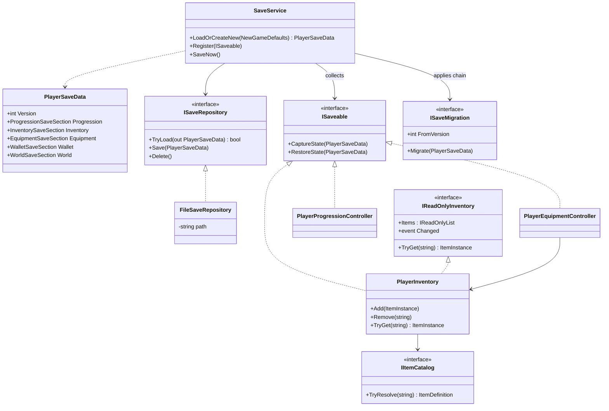
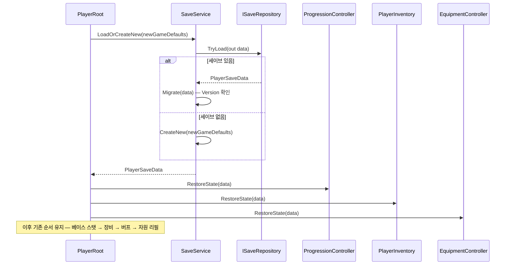
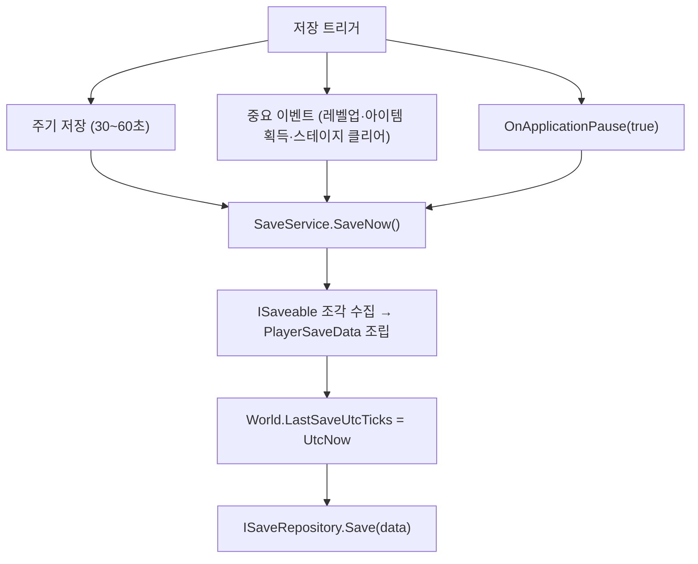
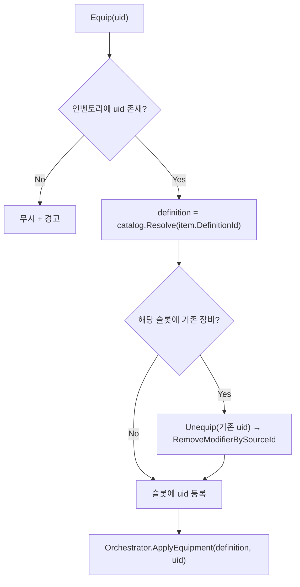
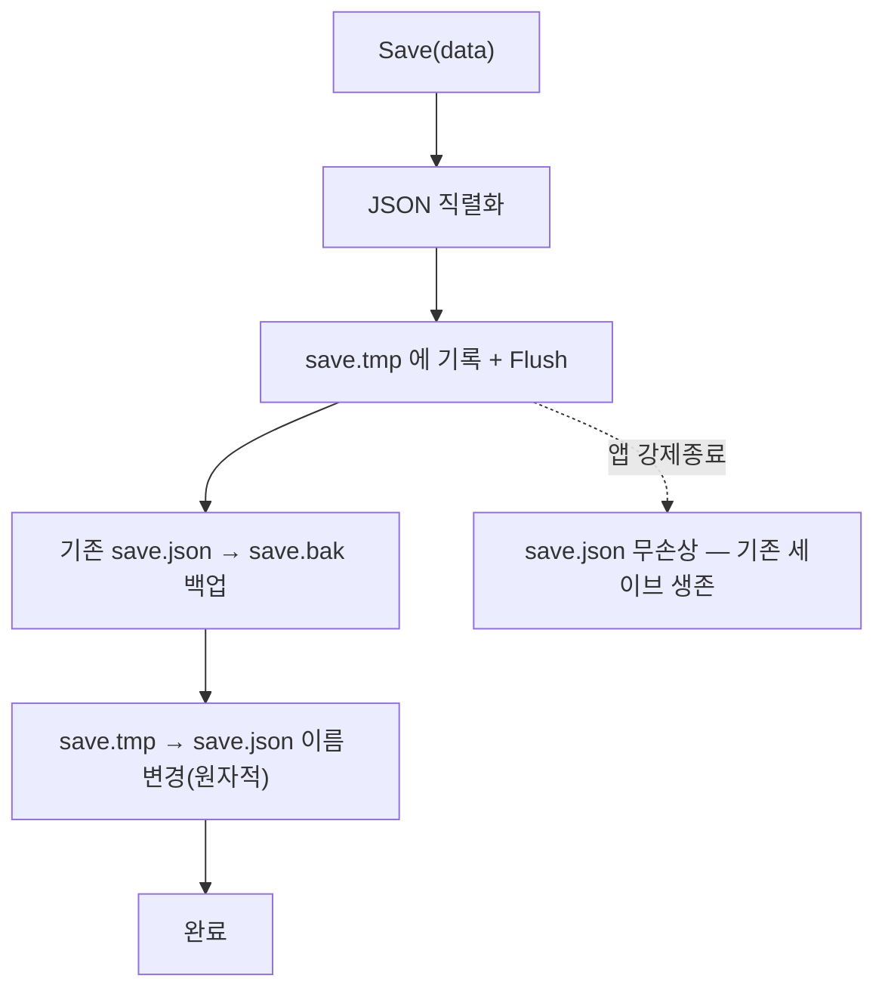
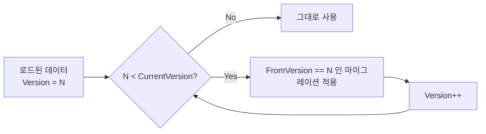

# 플레이어 데이터 관리 체계 구현 계획서

> **종류**: 설계 명세 (TDD) · **상태**: Draft — **단계1(진행도·재화 영속화) 구현 완료**, 단계2~4 미착수
> **최종 갱신**: 2026-08-23 · **관련 기획서**: [content-roadmap.md](../gdd/content-roadmap.md) — 세이브·재화는 **M0**, 인벤토리·아이템은 **M1** · **as-built**: [specs/core/save.md](../specs/core/save.md)(단계1 구현 결과)
> **관련 명세**: [progression.md](../specs/player/progression.md) · [equipment.md](../specs/player/equipment.md) · [stats.md](../specs/player/stats.md) · [player/README.md](../specs/player/README.md)
>
> 이 문서가 플레이어 데이터·영속화의 **정본**이다. 같은 주제를 다루던 `data-persistence.md`는 재화(`WalletSaveSection`)·인벤토리 읽기 계약(`IReadOnlyInventory`)·마이그레이션 계약(`ISaveMigration`)을 이 문서로 흡수한 뒤 폐기했다.

---

## 0. 이 계획서의 출발점

코드를 대조한 결과, 이 프로젝트에는 **"플레이어가 소유한 정보"라는 계층이 존재하지 않는다.**

스탯 계산 체계([[stats]])는 `base + modifier` 재계산 구조로 잘 잡혀 있지만, 그 계산의 **입력**이 되는 데이터가 어디에도 모여 있지 않다:

| 정보 | 현재 위치 | 문제 |
|------|-----------|------|
| 레벨·경험치 | `PlayerProgressionController`가 생성자에서 `config.StartLevel`로 `PlayerProgressionState` 직접 생성 | **외부 데이터를 주입할 구멍이 없다.** 항상 신규 게임 상태로 시작 |
| 장비 | `PlayerEquipmentController._equippedByItemId` — `Dictionary`가 `EquipmentDefinition`(SO)를 직접 보유 | **아이템 인스턴스 개념이 없다.** 강화 수치·중복 소유·슬롯 표현 불가 |
| 아이템(인벤토리) | **없음** | 획득·소모 개념 자체가 부재 |
| 재화(골드) | **없음** | 보상·상점·강화가 딛고 설 자원 축이 없다 |
| 위치·스테이지 | `Transform`에만 존재 | 복원 불가 |
| 저장·로드 | **없음** (`GameManager`는 빈 스텁) | 재기동 시 모든 진행이 소실 |

`PlayerRoot.Initialize()`가 `progression.Initialize()` → `equipment.Initialize(startEquipments)`를 부르는 현재 구조는 **"신규 게임"이라는 단 하나의 시나리오만** 표현한다.

이 계획서는 그 빠진 계층을 신설한다: **소유 데이터(Save State)를 정적 원본(Definition)·파생 결과(Derived)로부터 분리하고, 영속화 경로를 추상 뒤에 둔다.**

---

## 1. 개요·목적

플레이어의 **소유 정보(레벨·경험치·아이템·장비·위치)를 단일 진실 공급원으로 모으고, 저장·복원하는 체계**다.

핵심 판단은 **"저장하는 것은 원인이지 결과가 아니다"** 이다. 최종 공격력 517을 저장하지 않고 "레벨 12 + 강화+3 검 장착"을 저장한 뒤 로드 시 **재계산**한다. 근거는 셋이다.

1. **밸런스 패치 안전성** — 수치를 저장하면 기존 유저가 옛 밸런스에 고착된다.
2. **세이브 크기·치팅** — 결과값 저장은 변조 즉시 치팅이 성립한다.
3. **기존 구조와의 일관성** — `StatMachine`이 이미 `base + modifier` 재계산 구조([[stats]] §6)다. 이 철학을 데이터 계층 전체로 확장하는 것뿐이다.

두 번째 판단은 **"세이브에는 객체 참조가 아니라 ID만 넣는다"** 이다. `EquipmentDefinition`(SO)을 직렬화하지 않고 `"sword_iron"` 같은 ID를 저장한 뒤, **카탈로그**가 ID→SO를 해석한다.

## 2. 범위(Scope)

| 구분 | 내용 |
|------|------|
| **포함** | 세이브 데이터 모델(`PlayerSaveData` + 섹션), 저장소 추상(`ISaveRepository`)·로컬 파일 구현, 저장 조율(`SaveService`), 조각 계약(`ISaveable`), 아이템 도메인(`ItemDefinition`·`ItemInstance`·`IItemCatalog`·`PlayerInventory`), 인벤토리 읽기 계약(`IReadOnlyInventory`), 재화(`WalletSaveSection`), 장착 슬롯(`EquipSlot`), `PlayerProgressionController`·`PlayerEquipmentController`의 상태 주입 리팩터링, `PlayerRoot`의 로드/신규 분기, 자동 저장 정책, 마이그레이션 **계약(`ISaveMigration`) 확정** |
| **미포함(Out of scope)** | **서버 저장 구현**(§7의 `ISaveRepository` 뒤로 격리만 하고 구현은 하지 않음), 아이템 **밸런싱**·드랍 테이블, 상점·강화 UI, 인벤토리 UI([[presentation]] 별도 과제 — 이 계획은 UI가 붙을 **계약**까지만), 오프라인 보상 **계산식**(시간 기준선만 저장), 마이그레이션 **구현체**(계약만 확정하고 첫 `IMigration` 작성은 4단계), 세이브 **암호화·체크섬**(§11 — 4단계), 레벨 테이블 SO 이관([[progression]] §11의 별도 과제) |

> **HP/MP는 저장하지 않는다.** 방치형은 복귀 시 자원 만충이 자연스럽고, 이미 `RefillResourcesToMax()`가 있다([[stats]] §6.3). 저장하면 "빈사 상태 저장 → 로드 즉시 사망" 함정만 생긴다. 이건 §3의 "파생 결과는 저장하지 않는다"의 직접 귀결이다.

## 3. 요구사항·설계 목표 (요구사항 → 설계 해석)

| 요구사항 | 설계적 해석 |
|----------|-------------|
| 플레이어 정보를 한 곳에서 관리 | `PlayerSaveData`를 소유 상태의 단일 진실 공급원으로. 파생값은 담지 않음 |
| 재기동해도 진행이 유지 | `ISaveRepository`로 영속화. `PlayerRoot`가 부팅 시 로드 |
| 저장 매체를 나중에 서버로 교체 | 컨트롤러는 `ISaveRepository`(추상)만 안다. 파일/서버 구현 교체가 컨트롤러에 무영향(DIP) |
| 밸런스 패치가 기존 세이브를 깨지 않음 | 결과(최종 스탯)를 저장하지 않고 원인(레벨·아이템 ID)만 저장 → 로드 시 재계산 |
| 같은 장비의 강화·중복 소유 표현 | 장비는 **고유 UID를 가진 인스턴스**(`ItemInstance`). 소모품은 스택 카운트 |
| 슬롯당 하나만 장착 | `EquipSlot` enum 도입. 장착 시 동일 슬롯 기존 장비 자동 해제 |
| 앱이 강제 종료돼도 세이브 보존 | 원자적 쓰기(temp → rename). 덮어쓰기 중 종료 시 기존 파일 생존 |
| 향후 구조 변경 가능 | `Version` 필드를 1단계부터 포함. 마이그레이션 체인 훅 확보 |
| 방치형 오프라인 진행 | `LastSaveUtcTicks` 저장 — 복귀 시 경과 시간 계산의 기준선 |

## 4. 시스템 구조

### 4.1 데이터 3계층 (이 계획의 뼈대)

| 계층 | 내용 | 수명 | 저장? |
|------|------|------|:---:|
| **Definition** (정적 원본) | `ItemDefinition`·`EquipmentDefinition`·`PlayerProgressionConfig` (SO) | 빌드 고정, 패치로만 변경 | ✕ |
| **Save State** (소유 상태) | 레벨·경험치·아이템 인스턴스·장착 슬롯·스테이지 | 플레이 중 변함, 영구 보존 | **○** |
| **Derived** (파생 결과) | 최종 스탯(`StatMachine`)·현재 HP/MP·HUD 스냅샷 | 매 프레임 재계산 | ✕ |

### 4.2 구성요소

| 구성요소 | 종류 | 책임 |
|----------|------|------|
| `PlayerSaveData` | class (직렬화 DTO) | 세이브 루트. `Version` + 섹션들 |
| `ProgressionSaveSection` | class | 레벨·경험치·승급 |
| `InventorySaveSection` | class | 보유 아이템 인스턴스 + 스택 |
| `EquipmentSaveSection` | class | 슬롯→UID 매핑 |
| `WalletSaveSection` | class | 재화(골드 등) |
| `WorldSaveSection` | class | 스테이지·스폰·마지막 저장 시각 |
| `ISaveRepository` | interface | 저장소 계약(Load/Save/Delete). **매체를 숨김** |
| `FileSaveRepository` | class | 로컬 JSON 구현(원자적 쓰기) |
| `SaveService` | class | 조각 수집·조립·저장 시점 조율 |
| `ISaveable` | interface | 시스템별 상태 캡처/복원 조각 계약 |
| `ISaveMigration` | interface | 한 버전(N→N+1) 변환 단계. **계약만 확정, 구현은 4단계** |
| `ItemDefinition` | ScriptableObject | 아이템 정적 원본(ID·종류·스택 가능 여부) |
| `IItemCatalog` | interface | ID → Definition 해석 |
| `ItemInstance` | class | 고유 아이템 런타임 개체(UID·강화) |
| `PlayerInventory` | class | 보유 아이템 소유·획득·소모. `IReadOnlyInventory` 구현 |
| `IReadOnlyInventory` | interface | UI용 읽기 전용 조회 + 변경 이벤트. **쓰기 차단** |
| `EquipSlot` | enum | 장착 부위 |



> **핵심 경계**: 컨트롤러는 `ISaveRepository`를 모른다. `SaveService`만 저장소를 알고, 컨트롤러는 `ISaveable` 조각만 내준다. 저장 매체 교체(파일→서버)가 컨트롤러에 전혀 닿지 않는다.

## 5. 데이터 구조

### 5.1 세이브 DTO (순수 데이터 — Unity 의존 없음)

```csharp
[Serializable]
public sealed class PlayerSaveData
{
    public int Version = 1;                 // 마이그레이션 기준
    public ProgressionSaveSection Progression;
    public InventorySaveSection Inventory;
    public EquipmentSaveSection Equipment;
    public WalletSaveSection Wallet;
    public WorldSaveSection World;
}
```

| 섹션 | 필드 | 의미 |
|------|------|------|
| `ProgressionSaveSection` | `Level`·`Exp`·`PromotionTier` | 기존 `PlayerProgressionState`와 1:1 (이미 순수 POCO라 그대로 매핑) |
| `InventorySaveSection` | `List<ItemInstanceData> Items`<br>`List<StackEntry> Stacks` | 고유 장비 / 스택 소모품 |
| `EquipmentSaveSection` | `List<SlotEntry> Equipped` | `(EquipSlot, string Uid)` — 인벤토리 아이템을 UID로 참조 |
| `WalletSaveSection` | `List<CurrencyEntry> Balances` | `(CurrencyId, long Amount)` — 골드·보석 등 |
| `WorldSaveSection` | `StageId`·`SpawnPointId`·`LastSaveUtcTicks` | 위치 복원 + 오프라인 기준선 |

> **왜 재화를 인벤토리 스택에 섞지 않는가**: 골드는 아이템이 아니다. 인벤토리 용량·정렬·장착의 대상이 아니고, 상점·보상·과금이 모두 **직접** 참조하는 최상위 자원이다. `List<StackEntry>`에 `"gold"`를 끼워 넣으면 "잔액 조회"가 인벤토리 순회가 되고, 나중에 용량 제한(§11)을 넣는 순간 재화가 칸을 잡아먹는 버그가 된다. **키-금액 맵을 별도 섹션으로 분리**하는 것이 통상적인 처리다. `Dictionary` 대신 `List<CurrencyEntry>`인 이유는 §9(직렬화기)와 같다.

```csharp
[Serializable]
public sealed class ItemInstanceData
{
    public string Uid;            // 개체 고유 식별자(Guid)
    public string DefinitionId;   // 카탈로그 조회 키("sword_iron")
    public int EnhanceLevel;      // 강화 수치
}
```

### 5.2 아이템은 두 종류로 나눈다 (현업 표준)

| 종류 | 예 | 모델 | 이유 |
|------|-----|------|------|
| **Stackable** | 포션·재료·재화 | `(itemId, count)` 스택 | 개별 정체성이 없다. 포션 50개는 "인스턴스 50개"가 아니라 숫자 50 |
| **Unique Instance** | 장비 | `ItemInstance { Uid, DefinitionId, EnhanceLevel }` | 같은 철검이라도 +0과 +7은 **다른 물건**. UID 없이는 구분 불가 |

이 구분을 안 하면 "강화한 검"과 "안 한 검"을 동시에 가질 수 없다. 현재 `PlayerEquipmentController`가 `Dictionary`의 키로 `ItemId`(정의 ID)를 쓰는 것이 정확히 이 한계다.

### 5.3 신규 SO — `ItemDefinition`

`EquipmentDefinition`은 `ItemId`와 `Modifiers`만 있어 **슬롯 개념이 없다.** 슬롯을 추가한다:

```csharp
public enum EquipSlot { Weapon, Armor, Helmet, Boots, Accessory1, Accessory2 }
```

| 데이터 | 위치 | 의미 |
|--------|------|------|
| `Slot` | `EquipmentDefinition`에 필드 추가 | 이 장비가 들어갈 부위. 슬롯당 1개 규칙의 근거 |
| `ItemId`·`Modifiers` | 기존 유지 | 카탈로그 키 + 스탯 보정([[equipment]]) |

> **왜 `EquipmentDefinition`을 갈아엎지 않는가**: 이미 `PlayerStatOrchestrator.ApplyEquipment`가 `item:{ItemId}` SourceId 규약으로 modifier를 태깅한다([[stats]] §6.4). 이 규약은 그대로 살리고 **필드만 추가**하는 것이 변경 폭이 최소다. 단, SourceId는 정의 ID가 아니라 **UID 기준**으로 바뀌어야 한다(§6.4).

## 6. 상세 로직·상태

### 6.1 부팅 흐름 — 로드 / 신규 분기는 한 곳뿐



**불변식**: `PlayerRoot.Initialize`의 기존 순서 계약(베이스 스탯 → 장비 → 버프 → `RefillResourcesToMax`, [player/README §6.1](../specs/player/README.md))은 **그대로 유지된다.** 복원은 그 앞에 "상태 주입" 단계를 하나 더할 뿐, 순서를 건드리지 않는다.

### 6.2 컨트롤러 상태 주입 리팩터링

현재 `PlayerProgressionController`는 생성자에서 초기 상태를 **직접 만든다.** 이게 세이브 주입을 막는 유일한 장애물이다.

```csharp
// Before — 초기 상태의 출처가 config로 하드코딩
_state = new PlayerProgressionState { Level = config.StartLevel, ... };

// After — 초기 상태를 주입받는다. 컨트롤러는 출처(세이브/신규)를 모른다
public PlayerProgressionController(
    PlayerProgressionConfig config,
    IPlayerBaseStatResolver resolver,
    PlayerStatOrchestrator orchestrator,
    PlayerProgressionState initialState)
```

`PlayerRoot`의 인스펙터 필드 `startEquipments`는 **`NewGameDefaults`로 개명**한다. 그건 "항상 적용할 장비"가 아니라 "세이브가 없을 때만 쓰는 초기값"이기 때문이다 — 이름이 역할을 속이고 있다.

### 6.3 저장 시점 정책



> **모바일에서 `OnApplicationQuit`은 호출이 보장되지 않는다.** 백그라운드로 보낸 앱을 OS가 임의로 죽이기 때문이다. 실질적인 마지막 저장 기회는 **`OnApplicationPause(true)`** 이며, 이걸 놓치면 유저는 "게임이 진행을 먹었다"고 느낀다.

### 6.4 장착 — 슬롯 교체와 SourceId



**SourceId 규약 변경**: 현재 `item:{ItemId}`(정의 ID)는 같은 종류 장비를 둘 이상 장착할 때 충돌한다(예: 반지 2개). **`item:{uid}`(인스턴스 ID)** 로 바꾼다. `RemoveModifierBySourceId`가 개체 단위로 정확히 동작하게 하기 위함이다.

### 6.5 원자적 쓰기 (`FileSaveRepository`)



그냥 덮어쓰면 쓰는 도중 프로세스가 죽었을 때 **세이브 전체가 유실**된다. 이건 실무에서 실제로 유저 이탈을 만드는 사고이므로 1단계부터 넣는다.

### 6.6 마이그레이션 — 계약은 지금, 구현은 나중

§6.1의 `Migrate(data)` 단계는 1단계에서 **계약만 확정하고 통과(pass-through)** 시킨다. 등록된 마이그레이션이 없으면 아무 일도 일어나지 않는다.

```csharp
public interface ISaveMigration
{
    int FromVersion { get; }          // 이 마이그레이션이 소비하는 버전
    void Migrate(PlayerSaveData data); // N → N+1로 변환 (Version 증가는 SaveService 책임)
}
```



각 구현은 **한 단계(N→N+1)만** 책임진다. 여러 버전을 건너뛴 세이브도 단계를 순차 적용해 최신화된다 — 새 버전이 생기면 마이그레이션을 **하나 추가**할 뿐 기존 것은 수정되지 않는다(OCP).

> **왜 구현을 미루는가**: 지금은 출시 전이라 v1 이전 세이브가 **세상에 없다.** 마이그레이션을 지금 구현하면 변환할 대상이 없는 코드를 테스트 없이 쌓게 된다(YAGNI). 반대로 **계약과 호출 지점**을 지금 못박지 않으면, 나중에 `SaveService`의 로드 경로를 헤집어야 한다. 그래서 **훅만 심고 구현은 4단계**다.

### 6.7 인벤토리 읽기 계약 (`IReadOnlyInventory`)

인벤토리 **UI는 이 계획의 범위 밖**이지만(§2), UI가 붙을 **계약**은 지금 정의한다. 계약 없이 구현부터 하면 UI가 나중에 `PlayerInventory`의 구체 타입을 직접 참조하게 되고, 그 시점엔 이미 늦다.

```csharp
public interface IReadOnlyInventory
{
    IReadOnlyList<ItemInstance> Items { get; }
    bool TryGet(string uid, out ItemInstance item);
    event Action Changed;             // 획득·소모·강화 시 발행
}
```

`PlayerInventory`가 이를 구현하고, **UI에는 `IReadOnlyInventory`만 노출**한다(ISP). 프레젠테이션 계층이 `Add`/`Remove`를 호출할 수 없게 되어, 아이템 증감 경로가 도메인 한 곳으로 강제된다. 갱신은 폴링이 아니라 `Changed` 구독이다 — 매 프레임 리스트를 훑는 UI는 인벤토리가 커질수록 그대로 프레임 비용이 된다.

### 6.8 엣지 케이스

| 상황 | 처리 |
|------|------|
| 세이브 파일 없음 | `NewGameDefaults`로 신규 생성 |
| 세이브 파일 손상(JSON 파싱 실패) | `save.bak` 복구 시도 → 실패 시 신규 생성 + 경고 로그 |
| 세이브의 `DefinitionId`가 카탈로그에 없음 (패치로 아이템 삭제됨) | 해당 아이템을 **건너뛰고** 경고 로그. 세이브 전체를 버리지 않는다 |
| 장착 UID가 인벤토리에 없음 (데이터 불일치) | 해당 슬롯을 빈 상태로 복원 |
| `Version`이 현재보다 높음 (구버전 앱으로 신버전 세이브 열기) | 로드 거부 + 안내. 덮어쓰면 유저 데이터 파괴 |

## 7. 인터페이스·의존성(경계) — **구현보다 먼저 확정**

| 계약 | 방향 | 설명 |
|------|------|------|
| `ISaveRepository.TryLoad(out PlayerSaveData)` | `SaveService`가 **호출** | 저장소에서 로드. 실패 시 `false` |
| `ISaveRepository.Save(PlayerSaveData)` | `SaveService`가 **호출** | 영속화. 구현이 원자성 보장 |
| `ISaveable.CaptureState(PlayerSaveData)` | `SaveService`가 **호출** | 각 시스템이 자기 섹션을 채운다 |
| `ISaveable.RestoreState(PlayerSaveData)` | `PlayerRoot`/`SaveService`가 **호출** | 각 시스템이 자기 섹션을 읽어 복원 |
| `ISaveMigration.Migrate(PlayerSaveData)` | `SaveService`가 **호출** | `FromVersion` → +1 변환. 1단계는 등록 0개(pass-through) |
| `IItemCatalog.TryResolve(string id)` | 인벤토리·장비가 **호출** | ID → `ItemDefinition`. 미존재 시 `false` |
| `IReadOnlyInventory.Items` / `.Changed` | **UI가 구독·조회** | 읽기 전용. 프레젠테이션의 쓰기 경로를 차단 |
| `PlayerInventory.Add/Remove/TryGet` | 도메인이 **호출** | 아이템 소유 진입점(쓰기) |
| `PlayerEquipmentController.Equip(string uid)` | 외부가 **호출** | **UID 기반**으로 변경(기존은 `EquipmentDefinition` 직접) |

> **경계 원칙 1 — 저장소 격리**: 어떤 컨트롤러도 파일 경로·JSON·`Application.persistentDataPath`를 알지 못한다. 이것이 나중에 서버 저장으로 갈아탈 때 컨트롤러를 한 줄도 안 고치는 근거다.
>
> **경계 원칙 2 — 조각 자치**: 새 시스템(퀘스트·업적)이 저장 대상이 되어도 `SaveService`·`FileSaveRepository`·`PlayerRoot.Update`는 **수정되지 않는다.** 새 `ISaveable` 구현을 등록만 하면 된다.
>
> 다만 정직하게 짚어둔다 — **`PlayerSaveData`(DTO 루트)는 수정된다.** `ISaveable`이 구체 DTO를 인자로 받는 구조라, 퀘스트를 추가하면 `QuestSaveSection` 필드가 루트에 붙는다. 즉 **조율 로직은 닫혀 있고 데이터 스키마는 열려 있다.** 이 비대칭은 의도적이다: DTO를 완전히 닫으려면 섹션을 `Dictionary<string, object>` 같은 무형 자루로 만들어야 하는데, 그러면 컴파일 타임 타입 안전성과 마이그레이션 추적성을 잃는다. **스키마 변경은 어차피 마이그레이션 대상**(§6.6)이므로, 필드 추가가 눈에 보이는 편이 오히려 안전하다.
>
> **경계 원칙 3 — 읽기·쓰기 분리**: UI는 `IReadOnlyInventory`만 본다. 아이템 증감은 도메인을 통과해야 하고, UI는 결과를 `Changed`로 통보받을 뿐이다(§6.7).

## 8. 설계 포인트 (SOLID 매핑)

| 원칙 | 적용 |
|------|------|
| **SRP** | 저장 매체(`FileSaveRepository`)·조율(`SaveService`)·버전 변환(`ISaveMigration`)·상태 소유(각 컨트롤러)·아이템 조회(`IItemCatalog`)가 각각 한 책임 |
| **OCP** | 새 저장 대상은 `ISaveable` 구현 + 등록으로, 새 세이브 버전은 `ISaveMigration` 하나 추가로. `SaveService`·`PlayerRoot.Update` 불변 (단, DTO 스키마는 열려 있음 — §7 경계 원칙 2) |
| **LSP** | `ISaveRepository`를 인메모리 목으로 대체해 저장·복원 라운드트립을 EditMode에서 단독 검증 |
| **ISP** | `ISaveable`은 캡처·복원 2개뿐. UI는 `IReadOnlyInventory`만 보고 쓰기 API를 못 본다. 저장 대상 시스템이 저장소·직렬화를 알 필요 없음 |
| **DIP** | 컨트롤러가 구체 저장소가 아닌 `ISaveRepository` 추상에 의존. 파일↔서버 교체 자유 |

**하이라이트 패턴**
- **Repository로 매체 격리**: 저장 매체를 인터페이스 뒤로 숨겨, 로컬 전용으로 출발하되 서버 권위 구조로 가는 문을 닫지 않는다.
- **원인 저장 / 결과 재계산**: `StatMachine`의 `base + modifier` 철학([[stats]])을 데이터 영속성까지 일관 확장 — 밸런스 패치가 기존 세이브를 깨지 않는다.
- **조각 자치(ISaveable)**: 중앙 세이브 클래스를 매번 수정하는 대신, 각 시스템이 자기 데이터를 책임진다.
- **Definition / Instance 분리**: 정적 원본과 개체를 갈라 강화·랜덤 옵션·중복 소유를 표현.

## 9. Unity 특화

- **직렬화기 선택 — Newtonsoft 권장**: `JsonUtility`는 `Dictionary`와 다형성을 직렬화하지 못하는데 인벤토리는 둘 다 필요하다. `com.unity.nuget.newtonsoft-json` 패키지를 추가한다. (`JsonUtility`를 고집하면 모든 딕셔너리를 `List<Entry>`로 평탄화해야 한다 — §5.1의 `List<SlotEntry>`가 그 대비책이지만, 확장할수록 비용이 커진다.)
- **저장 경로**: `Application.persistentDataPath`. 에디터·기기 경로가 달라 에디터 테스트가 실기기 세이브를 오염시키지 않는다.
- **생명주기 훅**: `OnApplicationPause(true)`가 실질 저장 시점(§6.3). `OnApplicationQuit`은 모바일에서 보장되지 않으므로 **유일 의존 금지**.
- **순수 C# 유지**: `SaveService`·`PlayerInventory`는 MonoBehaviour가 아니다. `PlayerRoot`가 생성·주입하고, 주기 저장은 `ITickable`로 등록해 기존 틱 순회에 얹는다 — `PlayerRoot.Update` 수정 불필요(OCP).
- **성능 예산**: 저장은 이벤트·주기 기반이라 매 프레임 비용 0. 다만 JSON 직렬화는 GC Alloc이 있으므로 **주기 저장 간격을 30초 이상**으로 두고, 세이브가 커지면 백그라운드 스레드 쓰기로 이관(§12).

## 10. 테스트 케이스

| 대상 | 확인 항목 |
|------|-----------|
| 라운드트립 | `Save` → `TryLoad` 결과가 원본과 동일(레벨·경험치·아이템·장착) |
| 세이브 없음 | `TryLoad` 실패 → `NewGameDefaults`로 신규 생성 |
| 손상 파일 | 깨진 JSON → `.bak` 복구, 그마저 실패 시 신규 생성(예외 전파 없음) |
| 원자성 | `save.tmp` 잔존 상태에서 로드 → 기존 `save.json`이 그대로 읽힘 |
| 미지의 아이템 ID | 카탈로그 미존재 아이템 → 스킵 + 경고, 나머지 아이템은 정상 로드 |
| 슬롯 교체 | 같은 슬롯 재장착 → 기존 modifier 제거 확인(`SourceId` 단위) |
| 동종 2개 장착 | 같은 정의의 반지 2개 → modifier가 **2배** 적용(UID SourceId 검증) |
| 상태 주입 | 목 `PlayerProgressionState` 주입 → 해당 레벨로 베이스 스탯 산출 |
| 버전 역전 | `Version`이 앱보다 높음 → 로드 거부(덮어쓰기 금지) |
| 재화 라운드트립 | 골드 증감 후 `Save`→`TryLoad` → 잔액 동일. 인벤토리 아이템 수에 영향 없음 |
| 마이그레이션 통과 | 등록된 `ISaveMigration` 0개 + 최신 버전 세이브 → 데이터 무변경 통과 |
| 마이그레이션 체인 | 목 마이그레이션 `v1→v2`·`v2→v3` 등록 후 v1 세이브 로드 → 두 단계 순차 적용, `Version == 3` |
| 인벤토리 변경 이벤트 | `Add`/`Remove` 호출 → `IReadOnlyInventory.Changed` 1회 발행. 실패한 `Remove`는 미발행 |

> `ISaveRepository`를 인메모리 목으로 대체하면 파일 I/O 없이 EditMode에서 전 과정 검증 가능하다.

## 11. 리스크·미결정(TBD)

- **세이브 변조(치팅)**: 로컬 JSON은 평문이라 누구나 레벨을 999로 고칠 수 있다. **로컬 전용 단계에서는 이를 수용**한다. 체크섬(HMAC)이 아니라 **서버 권위**로 가야 한다 — 클라 검증은 원리적으로 뚫린다. **(2026-07-22 갱신)** PvP 필수·핵 방지 필수가 기획으로 확정되어, 서버 권위는 조건부가 아니라 **확정된 종착점**이다. 이관 경로·검증 방식은 [server-application-plan.md](./server-application-plan.md)가 정본.
- **기기 시간 조작**: `LastSaveUtcTicks` 기반 오프라인 보상은 시계를 앞으로 돌리면 무한 파밍된다. 최소 방어로 "저장 시각이 이전 저장보다 과거면 무효" 검증을 넣되, 근본 해결은 서버 시간이다.
- **`EquipmentDefinition` SourceId 규약 변경의 파급**: `item:{ItemId}` → `item:{uid}` 변경은 [[stats]] §6.4·[[equipment]]의 문서 갱신을 동반한다. 기존 세이브가 없으므로 지금이 바꾸기 가장 싼 시점이다.
- **`PlayerProgressionConfig`의 역할 중복**: `StartLevel`·`StartExp`가 SO에 있는데 세이브가 생기면 이 필드는 **신규 게임 전용**이 된다. 이름/그룹을 `[Header("New Game Defaults")]`로 재정리 필요.
- ~~**미사용 모델 `PlayerProgressionData`**~~: **이미 삭제됨(2026-07-21, 커밋 58906bd)** — 세이브 DTO 신설을 기다리지 않고 M0 레벨 테이블 작업에서 선행 정리됐다.
- **인벤토리 용량 제한 미정**: 무한 인벤토리로 시작한다. 용량·정렬·자동 판매는 기획 확정 후. (재화는 `WalletSaveSection`으로 분리돼 있어 용량 제한이 들어와도 칸을 잡아먹지 않는다 — §5.1)
- **재화 식별자 체계 미정**: `CurrencyId`를 문자열(`"gold"`)로 둘지 enum으로 둘지 결정 필요. 문자열은 확장이 자유롭지만 오타가 런타임까지 산다. 종류가 소수로 고정될 것 같으면 enum이 낫다. **골드 하나만 있는 지금은 결정을 미룬다.**
- **`WalletSaveSection`의 금액 타입**: `long`으로 시작한다. 방치형은 인플레이션이 심해 `int` 상한(21억)을 실제로 넘길 수 있다. 그 위(자릿수 폭발)는 BigInteger가 아니라 **가수·지수 표현**이 통상적이나, 밸런싱이 정해지기 전엔 과설계다.

## 12. 확장 여지 (지금 만들지 않되 막지 않을 것)

- **서버 저장소**: `ServerSaveRepository : ISaveRepository`를 추가하고 `PlayerRoot`의 주입만 교체. 컨트롤러 전부 불변.
- **스키마 마이그레이션 구현체**: 계약(`ISaveMigration`)과 호출 지점은 1단계에 심는다(§6.6). 실제 `v1→v2` 구현은 첫 스키마 변경이 생길 때 **하나 추가**할 뿐이다.
- **재화 종류 확장**: `WalletSaveSection`이 `(CurrencyId, Amount)` 목록이라, 보석·이벤트 토큰 추가는 **엔트리 추가**로 끝난다. DTO 필드 추가도 마이그레이션도 필요 없다 — 이것이 재화를 전용 필드(`long Gold`)가 아니라 키-금액 맵으로 둔 이유다.
- **랜덤 옵션(어픽스)**: `ItemInstanceData`에 `RolledAffix[]` 추가. 장비 modifier 산출을 Definition 고정값 → Definition + 어픽스 합산으로 확장.
- **비동기·백그라운드 저장**: 세이브가 커지면 직렬화·파일 쓰기를 스레드풀로. `ISaveRepository`를 `Task` 반환으로 확장.
- **클라우드 세이브 병합**: 로컬·원격 충돌 시 `LastSaveUtcTicks` 비교 후 유저 선택. 리포지토리 계층에서 흡수 가능.
- **다중 캐릭터·세이브 슬롯**: `PlayerSaveData`를 슬롯 배열로 감싸면 됨(`ISaveRepository`에 슬롯 인자 추가).

## 13. 단계별 구현 로드맵

각 단계는 **독립적으로 동작하는 세로 슬라이스**다.

| 단계 | 내용 | 이 순서인 이유 |
|:---:|------|---------------|
| **1** | ~~`PlayerSaveData`·`ISaveRepository`·`FileSaveRepository`(원자적 쓰기)·`SaveService`·`ISaveable`·**`ISaveMigration` 계약**(pass-through) + **Progression·Wallet만** 저장/로드 연결~~ **완료(2026-08-23)** — as-built: [specs/core/save.md](../specs/core/save.md) | 가장 작은 슬라이스로 파이프라인 전체를 먼저 검증. `PlayerProgressionState`가 이미 순수 POCO라 착수 비용 최저. `Wallet`은 아이템 도메인에 의존하지 않아 여기 얹는 비용이 거의 0 |
| **2** | `ItemDefinition`·`IItemCatalog`·`ItemInstance`·`PlayerInventory`(+`IReadOnlyInventory`) 신설 + `EquipSlot` 도입 + `PlayerEquipmentController` UID 기반 리팩터링 + SourceId 규약 변경 | 구조 변경이 가장 크다. 세이브 파이프라인이 검증된 뒤에 해야 롤백이 쉽다 |
| **3** | `WorldSaveSection`(스테이지·스폰·`LastSaveUtcTicks`) + ~~자동 저장 정책(주기·이벤트·Pause)~~(**단계1에서 선행 구현** — `SaveService.Tick` + `GameManager`의 Pause/Quit 훅) | 방치형 핵심 루프의 시간 기준선 확보. 저장 **정책**은 단계1의 파이프라인을 검증하려면 어차피 필요해 앞당겨졌고, 남은 것은 **무엇을 저장할지**(시간 기준선)다 |
| **4** | 마이그레이션 **구현체**, 무결성 검증, 서버 리포지토리 대비 | 출시 준비 단계. 계약은 1단계에 있으므로 여기선 구현만 얹는다 |

## 14. 신규/수정 파일 요약

| 구분 | 파일 | 위치(제안) | 단계 |
|------|------|------------|:---:|
| 신규 | `PlayerSaveData.cs` (+ 섹션 DTO) | `Core/Save/Model` | 1 |
| 신규 | `ISaveRepository.cs` | `Core/Save` | 1 |
| 신규 | `FileSaveRepository.cs` | `Core/Save` | 1 |
| 신규 | `SaveService.cs` | `Core/Save` | 1 |
| 신규 | `ISaveable.cs` | `Core/Save` | 1 |
| 신규 | `ISaveMigration.cs` | `Core/Save/Migration` | 1 (계약) |
| 신규 | `PlayerWallet.cs` | `Features/Player/Wallet` | 1 |
| 수정 | `PlayerProgressionController.cs` | 초기 상태 주입 + `ISaveable` 구현 | 1 |
| 수정 | `PlayerRoot.cs` | 로드/신규 분기, `SaveService` 배선, `startEquipments` → `NewGameDefaults` 개명 | 1 |
| 신규 | `ItemDefinition.cs` | `Data/Definitions` | 2 |
| 신규 | `EquipSlot.cs` | `Shared/Enums` | 2 |
| 신규 | `IItemCatalog.cs` · `ItemCatalog.cs` | `Features/Player/Inventory` | 2 |
| 신규 | `ItemInstance.cs` | `Features/Player/Inventory` | 2 |
| 신규 | `IReadOnlyInventory.cs` | `Features/Player/Inventory` | 2 |
| 신규 | `PlayerInventory.cs` | `Features/Player/Inventory` | 2 |
| 수정 | `EquipmentDefinition.cs` | `Slot` 필드 추가 | 2 |
| 수정 | `PlayerEquipmentController.cs` | UID 기반 장착·슬롯 교체 + `ISaveable` | 2 |
| 수정 | `PlayerStatOrchestrator.cs` | SourceId를 `item:{uid}`로 | 2 |
| ~~삭제~~ **완료** | `PlayerProgressionData.cs` | 미사용 모델 정리([[progression]] §11) — 2026-07-21 커밋 58906bd에서 이미 삭제됨 | 1 |
| 수정 | `docs/specs/player/progression.md` · `equipment.md` · `stats.md` · `README.md` | 같은 PR에서 갱신 | 각 단계 |
