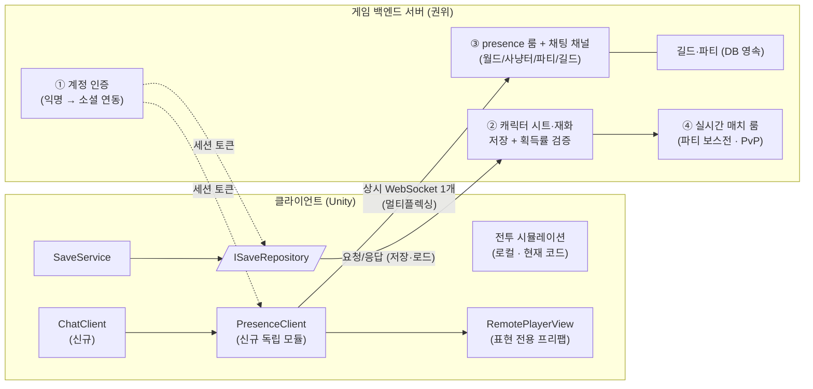
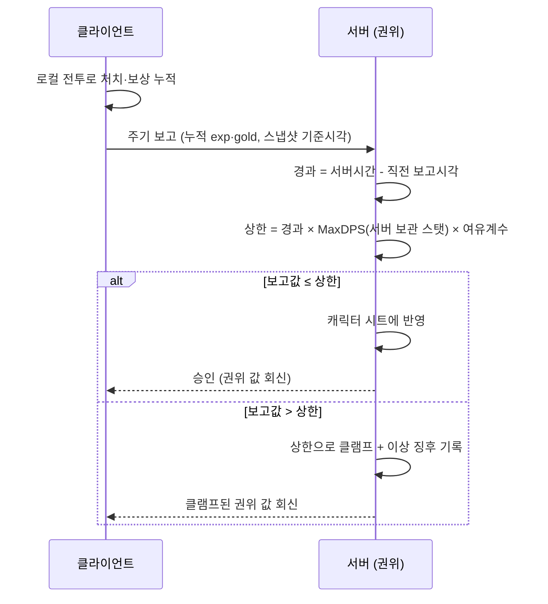

# 서버 적용 계획서 (Server Application Plan)

> **종류**: 설계 명세 (TDD) · **상태**: Draft — 방향 확정, 기술 스택은 스파이크에서 선정
> **최종 갱신**: 2026-07-22 · **관련 기획서**: [content-roadmap.md](../gdd/content-roadmap.md) §3.5(존재 공유·PvP·핵 방지·채팅) · §8(서버·계정 인프라)
> **관련 계획서**: [player-data-management-plan.md](./player-data-management-plan.md) (세이브 정본 — 이 문서는 그 저장 매체가 서버로 확장되는 경로를 확정한다)

---

## 0. 이 계획서의 출발점 — 확정된 요구사항 4가지

[content-roadmap.md](../gdd/content-roadmap.md) §3.5의 기획 확정(2026-07-15·07-22)이 서버의 형태를 결정한다.

| # | 확정 사항 | 기술적 의미 |
|---|-----------|-------------|
| 1 | **존재 공유** — 사냥터를 공유하되 몬스터·스킬 이펙트는 비공유. **위치와 스킬 모션**만 공유한다 | 서버가 전투 시뮬레이션을 알 필요가 없다. presence는 상태 비저장 릴레이로 충분 |
| 2 | **채팅 필수** — 월드·사냥터·파티·길드 채널, 모든 위치에서 접근 | 상시 연결(WebSocket) 인프라 + 파티·길드의 영속 상태(DB)가 필요하다 |
| 3 | **PvP는 필수이며 "손맛 있는 실시간 전투"** — 조작(이동·회피·스킬 타이밍)이 승부를 가른다. 착수는 모험·성장 등 코어 시스템 완비 후(M4 이후). **파티 보스전(협동 레이드)도 필수** | 서버 권위가 확정된 종착점이며, **실시간 매치 룸 인프라**(서버 권위 틱 + 클라 예측)가 최후순위 트랙으로 필요하다. 파티 보스전 → PvP 순으로 같은 인프라 위에 쌓는다 |
| 4 | **핵(치팅) 방지 필수** | 가치 있는 데이터(성장·재화·PvP 결과)의 진실 공급원을 서버로 옮겨야 한다 |

핵심 판단: **"전투는 클라이언트 로컬, 데이터와 판정은 서버 권위"의 하이브리드**다. 몬스터를 공유하지 않으므로 전투 연산을 서버에 올리는 것은 과설계이고, 반대로 PvP·핵 방지가 필수이므로 캐릭터 시트·재화를 클라이언트에 두는 것은 과소설계다.

## 1. 개요·목적

게임 백엔드 서버 1종을 두고 다음 4개 층을 담당하게 한다.

1. **계정 인증** — 익명(디바이스)으로 시작, 소셜 연동은 후순위
2. **캐릭터 시트·재화의 권위 저장 + 검증** — 클라이언트는 사본으로 연출만
3. **presence + 채팅** — 하나의 상시 WebSocket에 멀티플렉싱
4. **실시간 매치 룸(파티 보스전·PvP)** — 순수 C# 전투 모듈을 서버(.NET) 틱 시뮬로 이식

단, **지금(M0~M1) 서버를 만들지 않는다.** 이 문서의 1차 산출물은 "서버 없이 개발하되 위 4개를 꽂을 소켓(계약)을 지키는 것"(§7)이고, 실제 서버는 §11의 단계 순서로 들어온다.

## 2. 범위(Scope)

| 구분 | 내용 |
|------|------|
| **포함** | 서버 아키텍처 방향 확정 · 4개 층의 책임 정의 · 핵 방지 전략 · 클라이언트가 지금부터 지켜야 할 계약 · 단계별 도입 순서 · 기술 스택 후보와 선정 기준 |
| **미포함(Out of scope)** | 기술 스택 최종 선정(→ presence 스파이크에서 결정) · 서버 코드 구현 · 프로토콜 상세(메시지 스키마) · 과금/영수증 검증 상세 · 운영(배포·모니터링·스케일링) · 채팅 욕설 필터 등 운영 정책 |

**스택 선정을 미루는 이유**: 요구사항 조합(채널 채팅 + 길드/파티 + presence + 권위 스토리지)은 문서로 비교하는 것보다 **스파이크 1회로 검증하는 것이 싸다.** 후보와 기준만 §11에 못박는다.

## 3. 요구사항 → 설계 해석

| 요구사항 | 설계적 해석 |
|----------|-------------|
| 핵으로 성장·재화를 조작할 수 없어야 | **서버가 소유한 값만 진짜다.** 클라이언트 변조는 "자기 화면만 속이는 행위"가 되도록, 캐릭터 시트·재화·PvP 결과·랭킹을 서버가 소유한다. 클라이언트 측 보호(난독화·메모리 보호)는 보조 수단 — 원리적으로 뚫리므로 1선 방어로 삼지 않는다 |
| 몬스터가 로컬인데 파밍 보상을 검증해야 | 킬 단위 검증은 불가능하므로 **획득률 상한 검증**으로 대체한다: `서버 시간 경과 × 스탯 기반 최대 DPS`를 넘는 보고는 클램프. 오프라인 보상 공식(로드맵 §3.5 "공식 근사")과 같은 함수를 서버에서 재사용한다 |
| PvP가 "손맛"(조작이 승부)이면서 조작 불가능해야 | **서버 권위 실시간 매치** — 매치 룸이 고정 틱으로 전투를 시뮬하고 클라는 입력만 보낸다. 손맛은 클라 예측(내 캐릭터 즉답)·보간(상대)·판정 보상으로 확보. **매치 한정으로 고정 타임스텝** 필요(필드 전투는 여전히 결정론 불필요 — 로드맵 §3.5 결정은 필드에 한해 유지) |
| 파티 보스전(협동)이 가능해야 | **공유 상태 + 로컬 판정**(§6.4) — 보스 HP·패턴 타임라인만 서버 소유, 내 캐릭터의 회피 판정·데미지 계산은 로컬. **예고형(telegraph) 패턴이 지연을 흡수**하므로 예측·판정 보상 없이 성립한다 |
| 사냥터에서 타인의 모습·대화가 보여야 | **사냥터 presence 룸 = 사냥터 채팅 채널** — 같은 스코프이므로 하나의 연결에 멀티플렉싱한다. 전투 상호작용이 없어 지연에 관대하다(저빈도 전송 + 클라 보간) |
| 파티·길드 채팅 | 릴레이가 아니라 **영속 소셜 상태**(가입·탈퇴·권한이 DB에 남음). 게임 백엔드의 그룹 기능 요구 |
| 서버 도입 전에도 개발이 진행돼야 | 저장 매체를 `ISaveRepository` 뒤로 격리([player-data-management-plan.md](./player-data-management-plan.md) 경계 원칙 1)하고, 전투 로직을 순수 C#으로 유지해 이식 가능성을 지킨다 |

## 4. 시스템 구조

| 구성요소 | 위치 | 책임 |
|----------|------|------|
| `ServerSaveRepository` | 클라 (신규) | `ISaveRepository` 구현체. 파일 → 서버 교체 시 `PlayerRoot` 주입만 변경(정본 §12) |
| `PresenceClient` | 클라 (신규) | 위치·행동(스킬 모션 enum) 송수신. 전투 코드와 무의존 — `OnStateChanged`·Transform을 읽기만 한다 |
| `ChatClient` | 클라 (신규) | 채널 구독·발화. `PresenceClient`와 연결을 공유 |
| `RemotePlayerView` | 클라 (신규) | 원격 플레이어 표현 전용 프리팹 — `PlayerRoot` 조립 없음. 위치 보간 + 모션 재생만 |
| 인증·권위 저장·룸·소셜 | 서버 | 게임 백엔드 제공 기능 사용(자체 구현 최소화) |
| 매치 룸·전투 모듈 | 서버 (후) | 현 전투 로직(순수 C#)을 .NET 틱 시뮬로 이식. **파티 보스전 → PvP 순**으로 구축(레이드가 지연에 관대해 징검다리가 된다) |

## 5. 데이터 구조

서버가 소유하는 데이터(= 핵 방지의 대상). **원인을 저장하고 결과는 재계산**하는 세이브 원칙(정본 §"원인 저장")이 서버에서도 그대로 유효하다.

| 데이터 | 소유 | 비고 |
|--------|------|------|
| 계정·세션 | 서버 | 익명 디바이스 ID → 소셜 연동 시 병합 |
| 캐릭터 시트(레벨·경험치·전직 차수·습득 스킬) | **서버** | "원인" 값. 스탯은 서버도 `PlayerLevelTable` 규칙으로 재계산 가능 |
| 재화·인벤토리·장비 | **서버** | 획득은 검증 대상, 소비는 서버 차감 |
| 길드·파티 | **서버** | 영속. 채팅 채널 스코프의 근거 |
| presence 상태(위치·행동) | 서버(휘발) | 저장하지 않는 릴레이. 접속 종료 시 소멸 |
| 몬스터·전투 수치·스킬 이펙트 | 클라(로컬) | **서버로 보내지 않는다** — 공유하지 않기로 확정된 것은 전송도 하지 않는다 |

presence 페이로드 초안(스파이크에서 확정): `playerId · 룸 ID(섬/사냥터/해역) · 위치 · 방향 · 행동 enum(Idle/Move/Casting/낚시 등 — `PlayerStateID` 파생) · 외형(장비 스킨) · 시전 스킬 ID(모션 재생용)`.

## 6. 상세 로직

### 6.1 파밍 보상 검증 — 획득률 상한

- **서버 시간 기준**이므로 기기 시계 조작이 무력화된다(정본 §11의 시간 조작 리스크 해소).
- `MaxDPS`는 [stats.md](../specs/player/stats.md) §6.3의 DPS 환산 공식을 서버에서 재사용한다 — 공격력·공속·치명타로 계산되는 순수 함수라 이식 비용이 없다.
- 오프라인 보상도 같은 구조다: `초당 처치량 × 경과시간 × 효율계수`(로드맵 §3.5)를 **서버가 계산**해 내려준다.

### 6.2 presence·채팅 — 룸과 채널

| 채널 | 스코프 | 특성 |
|------|--------|------|
| 월드 | 전체 접속자 | 채팅만. 빈도 제한 필요 |
| 사냥터 | **presence 룸과 동일** | 채팅 + 위치·모션 공유. 입장/퇴장 = 룸 join/leave 한 번으로 처리 |
| 파티 | 파티 멤버 | 영속 아님(세션 단위) — 상세는 스파이크 후 확정 |
| 길드 | 길드 멤버 | 영속(DB). 오프라인 멤버 메시지 보관 여부는 TBD |

presence 전송은 **저빈도(초당 2~5회) + 클라이언트 보간**. 전투 상호작용이 없으므로 끊겨도 게임은 정상 동작한다(연출만 사라짐).

### 6.3 PvP — 서버 권위 실시간 매치 (최후순위, 원칙만 선확정)

**형태**: 룸 기반 실시간 1v1. 비동기 오토배틀이 아니다 — 조작이 승부를 갈라야 한다(기획 확정, 2026-07-22).

**넷코드 모델 선택**:

| 모델 | 판정 |
|------|------|
| 호스트-클라이언트(한 기기가 서버 역할) | **탈락** — 호스트가 곧 치터가 될 수 있어 핵 방지 필수와 모순 |
| **서버 권위 틱 시뮬 + 클라 예측** | **채택** — 매치 룸이 고정 틱(20~30Hz)으로 전투를 시뮬, 클라는 입력만 전송. "서버가 가진 값만 진짜" 원칙의 자연 연장 |
| 결정론적 롤백(Quantum류) | 손맛은 최상급이나 전투 코드 전체의 완전 결정론(플랫폼 간 부동소수점 일치)을 요구 — 재작성에 가까워 보류 |

**손맛의 3요소** (어떤 스택을 골라도 필요한 표준 기법):
1. **클라 예측** — 내 이동·시전을 즉시 로컬 반영, 서버 판정 도착 시 오차 보정(reconciliation)
2. **보간** — 상대 상태를 한 틱 늦게 부드럽게 재생
3. **판정 보상(lag compensation)** — 서버가 "그 클라가 그 순간 봤던 과거"로 되감아 판정

**비동기안 대비 달라지는 점**: 회피가 손맛의 핵심이므로 **이동·위치가 판정에 포함**된다 → 이동·상태머신도 서버 이식 대상. 매치 한정 고정 타임스텝 필요. `ITickable(dt)` 구조 덕에 전환 비용은 낮다.

**착수 조건**: M3 능동 전투(솔로 보스)의 재미가 검증된 뒤, 파티 보스전(§6.4)으로 룸 인프라를 먼저 실전 검증한 뒤 들어간다. 손맛 없는 전투를 네트워크에 올리면 비용만 실시간이 된다.

### 6.4 파티 보스전 — 공유 상태 + 로컬 판정 ("몬스터 비공유"의 유일한 예외)

레이드 보스 하나만 서버 소유로 승격하고, 필드 전투 구조는 불변으로 유지한다.

| 서버(레이드 룸)가 소유 | 각 클라이언트가 소유 |
|------|------|
| 보스 HP(단일 진실) · 위치·패턴 타임라인 · 페이즈·광폭화 타이머 · 참가·보상 분배 | 내 캐릭터의 이동·회피·피격 판정 · 내 데미지 계산(로컬 전투 코드 그대로) · 패턴의 내 화면 연출 · 파티원 모습(presence 수신) |

**흐름**:
1. **보스 행동은 서버가 예고한다** — "T+2.0초에 위치 X에 장판" 패턴 이벤트를 브로드캐스트 → 전원이 같은 보스를 같은 위치에서 본다.
2. **회피는 로컬 판정** — 장판 적중 여부는 내 기기가 판정(내 위치의 진실은 나에게 — 필드와 동일 원칙). 지연으로 "피했는데 맞는" 일이 없다.
3. **공격은 보고·검증** — 로컬 계산한 데미지를 보고 → 서버가 §6.1과 같은 상한 검증(MaxDPS) → 공유 HP 차감 → 전원에 브로드캐스트.
4. **보상은 서버 분배** — 참가·기여도·보상 전부 서버 소유.

**성립 조건 — 예고형(telegraph) 패턴**: "예고 2초 → 발동" 구조의 예고 시간이 네트워크 지연을 통째로 흡수하므로, 예측·판정 보상 없이 공정하다. 순간 발동형 패턴은 지연만큼 불공정해지므로 금물. 이는 M3 솔로 보스의 손맛 설계와 동일한 요구라, **M3의 보스 패턴을 예고형 타임라인 데이터(SO)로 만들면 로컬 재생 = 솔로 보스, 서버 재생 = 파티 보스**로 같은 콘텐츠가 재사용된다(§7 계약).

**멀티 전투 구축 순서**: 파티 보스전이 실시간 PvP보다 쉽다(플레이어 간 대결 판정 없음 → 예측·보상 불필요, 지연 허용치 큼). 룸 생성·매치메이킹·브로드캐스트 인프라는 PvP와 공유되므로, **레이드 → PvP 순**으로 쌓아 가장 어려운 PvP를 검증된 인프라 위에서 시작한다.

### 6.5 엣지 케이스

| 상황 | 처리 |
|------|------|
| 오프라인 플레이(서버 미접속) | 로컬 진행 허용 → 재접속 시 §6.1 검증으로 정산. 방치형의 오프라인 특성을 해치지 않는다 |
| 검증 반복 실패(누적 이상 징후) | 즉시 차단이 아니라 **기록 후 운영 판단**(오탐 방지). 자동 제재 정책은 TBD |
| presence 연결 끊김 | 전투·성장은 무영향. 재연결 시 룸 재입장. 원격 플레이어는 타임아웃 후 페이드아웃 |
| 서버 점검 | 로컬 시뮬은 계속, 저장은 로컬 큐잉 → 복구 후 정산 |

## 7. 인터페이스·의존성(경계) — 지금부터 지켜야 할 계약

서버가 없는 지금 단계의 **실질 산출물**이다. 이 계약이 지켜지면 서버 도입은 "구현 추가"이고, 깨지면 "구조 수술"이 된다.

| 계약 | 상태 | 내용 |
|------|------|------|
| `ISaveRepository` 경계 | 정본 확정 | 컨트롤러는 저장 매체를 모른다. 서버 적용 = `ServerSaveRepository` 추가 + 주입 교체뿐 |
| **원인 저장·결과 재계산** | 정본 확정 | 서버 검증 비용을 결정하는 핵심. 결과(공격력 517)를 저장하기 시작하면 서버 검증이 불가능해진다 |
| **전투 로직 순수 C# 유지** | 현행 유지 | MonoBehaviour 종속을 Driver·Root로 격리하는 현 원칙이 곧 PvP 서버 이식성이다. **전투 코어에 UnityEngine 의존을 새로 넣지 않는다** |
| `PlayerStateContext.IsOwner` | 필드 존재 | 원격 플레이어 구분의 자리. presence 도입 전까지 기본 `true` 유지 |
| `PlayerRegistry`·`EnemyRegistry` 서비스화 | TBD(기존) | 전역 정적 → 주입으로 전환해야 화면에 다수 플레이어 표현 가능([combat.md](../specs/player/combat.md) §11) |
| 원격 표현 분리 | 신규 원칙 | 원격 플레이어는 `PlayerRoot`를 조립하지 않는다 — `RemotePlayerView`(표현 전용)로. 조립 루트가 "내 캐릭터 전용"임을 전제로 유지 |
| presence 독립 모듈 | 로드맵 §3.5 확정 | 전투 코드에 네트워크 의존을 넣지 않는다. `PresenceClient`는 상태를 **읽기만** 한다 |
| **보스 패턴 데이터 주도** | 신규 원칙 (M3부터) | 보스 패턴을 하드코딩이 아닌 **예고형 타임라인 데이터(SO)**로 작성한다. 로컬 재생이면 솔로 보스(M3), 서버 재생·브로드캐스트면 파티 보스전(§6.4) — 재생 주체만 바뀐다 |

## 8. 설계 포인트 (SOLID 매핑)

| 원칙 | 적용 |
|------|------|
| **SRP** | 전투(로컬 시뮬)·저장(Repository)·존재 공유(PresenceClient)·채팅(ChatClient)이 서로를 모른다. 서버도 층별 책임 분리 |
| **OCP** | 저장 매체 추가(파일→서버)가 컨트롤러 수정 없이 구현체 추가로 끝난다 |
| **LSP** | `FileSaveRepository`↔`ServerSaveRepository` 교체 시 호출부 동작 동일(정본 §8) |
| **ISP** | presence는 위치·상태 읽기 계약만, 채팅은 채널 계약만 — 전투 계약과 분리 |
| **DIP** | 클라 로직은 서버 SDK 구체가 아니라 자체 인터페이스(`ISaveRepository`·presence 추상)에 의존 → 스택 교체 가능 |

**하이라이트 — "서버 권위 = 이식이 아니라 재사용"**: 세이브가 원인만 저장하고, 스탯·DPS·오프라인 보상이 전부 순수 함수이므로, 서버 검증 로직은 새로 짜는 것이 아니라 **클라 코드를 서버에서 실행하는 것**이다. 현 아키텍처 원칙(순수 C# 분리)이 그대로 서버 자산이 된다.

## 9. Unity 특화

| 항목 | 설계 |
|------|------|
| **연결 수** | 상시 WebSocket **1개**(presence+채팅 멀티플렉싱) + 요청/응답(인증·저장). 모바일 배터리·소켓 수 관리 |
| **앱 생명주기** | `OnApplicationPause(true)` 시 저장 보고 + presence 룸 퇴장. 복귀 시 재입장·정산 |
| **원격 표현 예산** | 사냥터당 원격 플레이어 표시 상한(예: 10~20명) + 컬링. `RemotePlayerView`는 물리·전투 없이 Transform 보간 + 애니만 — GC Alloc 없는 수신 버퍼 재사용 |
| **보간** | 저빈도 수신(2~5Hz)을 `Update`에서 선형 보간. 스냅 대신 지수 감쇠 이동 |
| **스킬 모션 재생** | 시전 스킬 ID → 애니메이션 트리거 매핑. 이펙트·데미지는 재생하지 않는다(비공유 확정) |

## 10. 테스트 케이스

| # | 대상 | 검증 |
|---|------|------|
| 1 | `ServerSaveRepository` | `ISaveRepository` 계약 준수 — `FileSaveRepository`와 같은 테스트 스위트 통과(LSP) |
| 2 | 획득률 검증(서버, 순수 함수) | 상한 이내 보고는 승인, 초과 보고는 클램프. 경계값(정확히 상한) 승인 |
| 3 | 시간 역행 | 보고 시각이 직전보다 과거면 무효 처리 |
| 4 | 오프라인 정산 | 로컬 누적 → 재접속 정산 결과가 상한 공식과 일치 |
| 5 | presence 왕복 | 송신 페이로드 → 수신 → `RemotePlayerView` 상태 반영. 연결 끊김 시 전투 무영향 |
| 6 | 매치 룸 틱 시뮬(후) | 같은 입력 시퀀스 → 같은 결과(고정 틱 결정론). 판정은 클라 보고가 아닌 서버 계산이 소유 |
| 7 | 채널 격리 | 사냥터 A의 채팅·presence가 B에 새지 않는다 |
| 8 | 레이드 데미지 집계(후) | 파티원들의 보고 데미지가 상한 검증을 거쳐 공유 HP에 순서 무관하게 일관 반영된다 |

## 11. 리스크·미결정(TBD)

| 항목 | 내용 | 해소 시점 |
|------|------|-----------|
| **기술 스택** | 후보: **Nakama**(채널 채팅·그룹·파티·스토리지 내장 — 요구 조합과 부합, 1순위 검토) vs 관리형 BaaS 조합(UGS·Firebase·PlayFab — 길드·채널은 자체 구현 필요) vs 자체 소켓 서버. 기준: 채팅 채널+길드 내장 여부 · .NET 커스텀 로직 실행(전투 모듈 이식) · 비용 · 운영 부담 | **presence 스파이크** (로드맵 §8 — M1 종료 전 시기 결정) |
| **PvP 넷코드 스택** | 방식은 실시간으로 확정(§6.3). 남은 것: Photon Fusion(예측·판정 보상 내장) vs Unity NGO+전용 서버 vs 자체 .NET 매치 서버(`Battle.Core` 재사용 극대화) — 예측 품질 스파이크로 검증 | PvP 착수 시(코어 시스템 완비 후, 파티 보스전 다음) |
| **검증 여유계수** | MaxDPS 상한의 오탐/미탐 트레이드오프. 버프·순간 폭딜을 흡수할 계수 필요 | 서버 세이브 도입 시 |
| **자동 제재 정책** | 이상 징후 누적 시 차단 기준 — 초기에는 기록만 | 운영 개시 전 |
| **세이브 이관** | 로컬 파일 → 서버 최초 업로드 시 기존 세이브 검증 정책(관대 승인 vs 상한 소급) | 서버 세이브 도입 시 |
| **채팅 운영 정책** | 금칙어·신고·차단 | 운영 개시 전 |

## 12. 확장 여지 (지금 만들지 않되 막지 않을 것)

- **레이드 확장(다인원·월드 보스)**: §6.4의 룸 구조를 파티 밖(월드 보스 공유 HP)·대인원으로 확장할 여지. 패턴 타임라인 방식은 인원과 무관하게 동일.
- **랭킹**: 캐릭터 시트가 서버에 있으므로 조회 뷰만 추가하면 된다 — 검증을 §6.1에서 이미 하고 있기 때문.
- **관전·리플레이**: 매치가 서버 틱 시뮬이므로 입력 로그 = 리플레이가 부산물로 생긴다.
- **크로스 플랫폼**: 계정이 서버에 있으므로 기기 교체·다기기 동시 로그인 정책만 추가.

## 13. 파일 위치 (예정)

| 구분 | 파일 | 경로 |
|------|------|------|
| 저장 | `ServerSaveRepository` | `Scripts/Core/Save/` (정본 §14의 `ISaveRepository` 옆) |
| presence | `PresenceClient` · 페이로드 DTO | `Scripts/Core/Network/Presence/` (신설) |
| 채팅 | `ChatClient` · 채널 enum | `Scripts/Core/Network/Chat/` (신설) |
| 표현 | `RemotePlayerView` | `Scripts/Features/RemotePlayer/` (신설 — `Features/Player`와 분리) |
| 보스 패턴 | 예고형 타임라인 SO | `Scripts/Data/Definitions/` (M3에서 신설 — §7 "보스 패턴 데이터 주도") |
| 서버 | 전투 모듈 이식·검증 함수·매치 룸 | 별도 서버 리포지토리 (스파이크 시 결정) |
