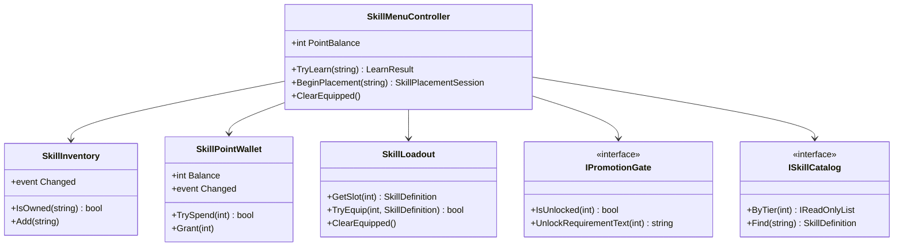
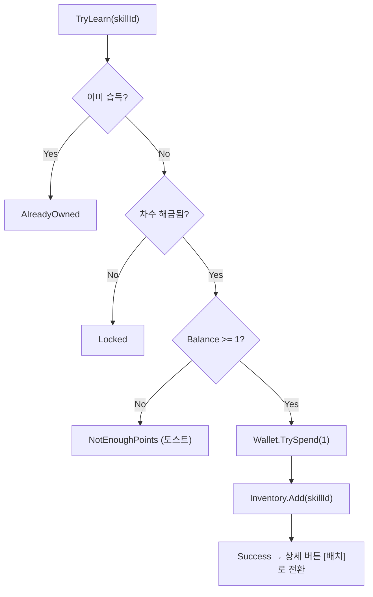
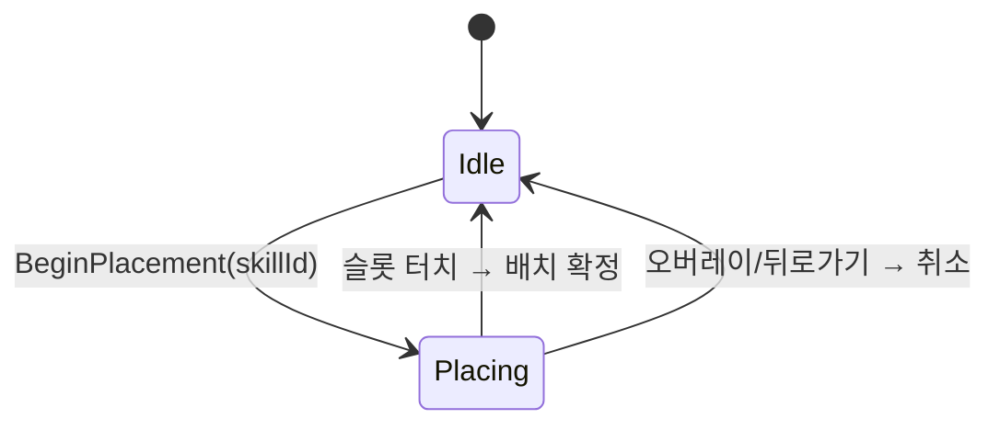
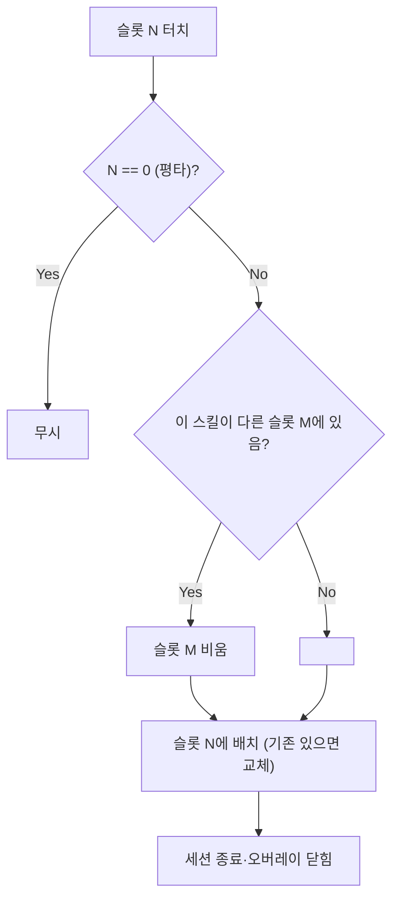
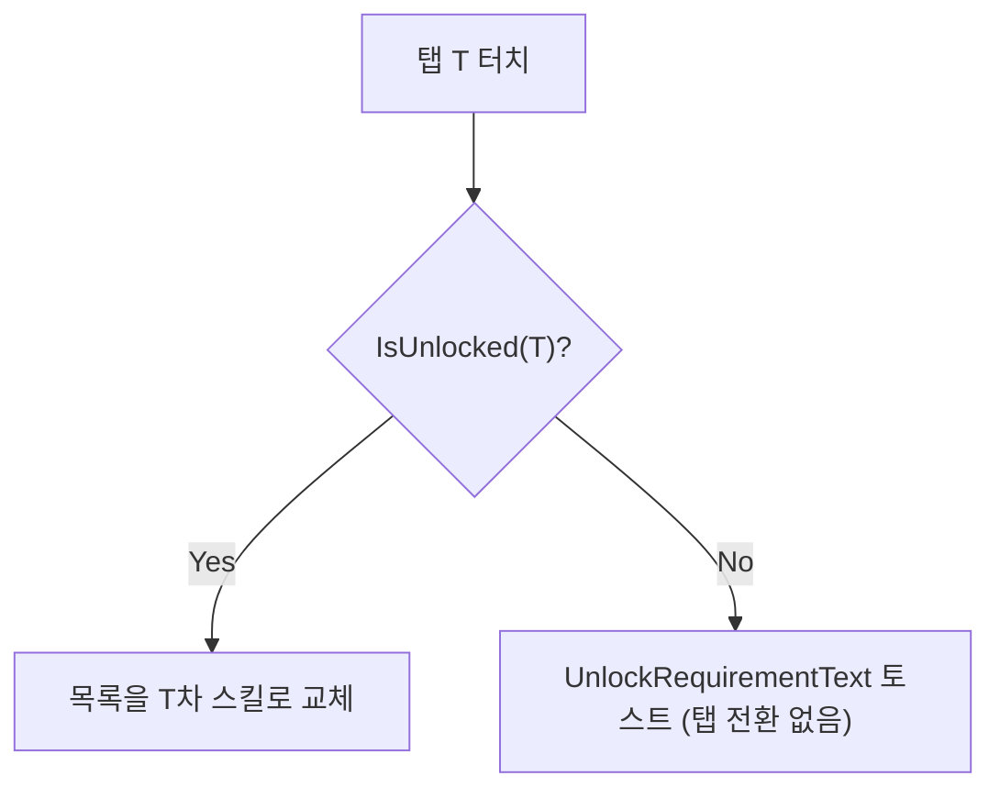
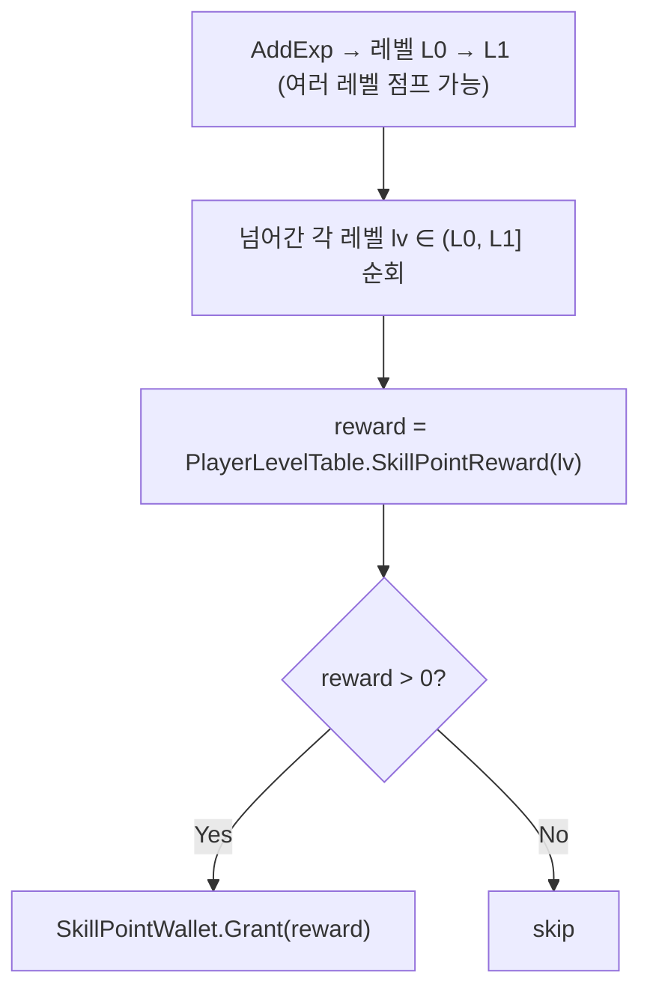

# 스킬 창(Skill Menu) 구현 계획서

> **종류**: 설계 명세 (TDD) · **상태**: Draft
> **최종 갱신**: 2026-07-21 · **관련 기획서**: [content-roadmap.md](../gdd/content-roadmap.md) — **M2**(빌드의 깊이). 선행 과제인 전직 시스템은 M2 앞부분에서 해소
> **관련 명세**: [skills.md](../specs/player/skills.md) · [progression.md](../specs/player/progression.md) · **관련 계획서**: [combat-skill-plan.md](./combat-skill-plan.md)

---

## 0. 이 계획서의 출발점

스킬 창 **UI 기획(명세)** 을 현재 코드와 대조한 결과, UX 흐름은 촘촘하지만 그것을 지탱할 **도메인 모델이 대부분 없음**을 확인했다. 지금 코드는 "배치(equip)"까지만 다룬다([[skills]]의 `SkillLoadout`). 기획이 요구하는 **습득(learn/own)·스킬 포인트·전직 차수·태그 분류**는 데이터/도메인에 존재하지 않는다. 이 계획서는 **그 격차를 메우는 것**이 핵심이며, UI는 그 위에 얹는다.

### 확정된 기획 결정 (2026-07-10)
| 쟁점 | 결정 |
|------|------|
| 스킬 포인트 획득 | **특정 레벨에 지급**(레벨 테이블에 "이 레벨에서 +N" 지정) |
| 배치 중복 처리 | **이동**(이미 배치된 스킬을 다른 슬롯에 놓으면 원래 슬롯을 비움) |
| 배우기 확인 | **명세대로 즉시 습득**(확인 팝업 없음). 환불 없음 |
| 전직(승급) 시스템 | **선행 과제로 분리**(이 스코프 밖). 차수 해금은 그 위에 얹힘 — §2·§12 참조 |
| 포인트 지급 데이터 | 레벨별 지급량은 **M0에서 신설된 `PlayerLevelTable`에 포인트 컬럼(`SkillPointRewards[]`)을 얹어** 담음(로드맵 §5.4 — 신설이 아니라 확장) |

---

## 1. 개요·목적

플레이어가 **스킬을 열람·습득·배치**하는 메뉴 시스템이다. 전직 차수 탭으로 스킬을 분류해 보여주고, 스킬 포인트로 미습득 스킬을 습득하며, 습득한 스킬을 6슬롯 로드아웃([[skills]])에 배치한다.

핵심 판단은 **"습득(소유)"과 "배치(편성)"의 책임 분리**다. 현재 `SkillLoadout`은 배치만 안다. "습득했지만 배치하지 않은" 상태가 존재하므로, 소유를 담는 계층(`SkillInventory`)과 포인트를 담는 계층(`SkillPointWallet`)을 **별도**로 두고, UI는 이들을 조율하는 파사드(`SkillMenuController`)만 호출한다. UI가 `SkillLoadout`·`SkillDefinition`을 직접 만지지 않게 해 [[skills]]가 지켜 온 계층 경계를 유지한다.

## 2. 범위(Scope)

| 구분 | 내용 |
|------|------|
| **포함** | 습득 상태(`SkillInventory`), 포인트 지갑(`SkillPointWallet`), 차수 해금 판정(`IPromotionGate`), 메뉴 유스케이스 파사드(`SkillMenuController`), 데이터 확장(`SkillDefinition`에 차수·태그), 태그 정의(`SkillTag`), 차수 설정(`PromotionTierConfig`), **M0 `PlayerLevelTable`에 스킬 포인트 컬럼(`SkillPointRewards[]`) 추가 + 레벨업 포인트 지급 훅**, UI(창·목록·상세 팝업·배치 오버레이·확인/토스트·백스택 라우터), `SkillLoadout`에 비우기/이동/역조회 API 추가 |
| **미포함(Out of scope)** | 시전 파이프라인·쿨다운([[skills]] 기존 구현 재사용), **전직(승급) 시스템 — `PromotionTier`를 올리는 주체([[progression]] §11에서 현재 미구현). 차수 해금이 이에 의존하므로 선행 필요(§12 G1)**, 실제 세이브 파일 포맷([[progression]] 세이브 시스템 확장 시 통합), 경험치 곡선·베이스 스탯의 SO 이관(**M0에서 완료** — `PlayerLevelTable`이 이미 담당. 이 계획은 그 위에 **포인트 컬럼만** 추가), 밸런싱 수치·스킬 트리(선행 스킬) |

## 3. 요구사항·설계 목표 (기획 항목 → 설계 해석)

| 기획 항목 | 설계적 해석 |
|-----------|-------------|
| 전직 차수 탭(1~4차), 미해금은 잠금+토스트 | `PromotionTierConfig`로 차수별 해금 조건 데이터화. `IPromotionGate.IsUnlocked(tier)` 판정. 잠금 탭은 **전환 없이** 토스트만 |
| 스킬 목록: 아이콘/이름/분류 태그 1 + 속성 태그 ≤2 | `SkillType`(공격/버프)=분류 태그. **속성 태그는 `SkillTag`(SO) 리스트**로 분리(≤2 표시). enum에 섞지 않음 |
| 미습득 스킬 비활성 톤(상세는 가능) | `SkillInventory.IsOwned(id)`로 톤 결정. 상세 팝업은 소유와 무관하게 오픈 |
| 잔여 스킬 포인트 상단 고정 표시 | `SkillPointWallet.Balance` + 변경 이벤트 구독 |
| 배우기: 포인트 있으면 습득(−1)/없으면 토스트 | `SkillMenuController.TryLearn(id)` — **검증 통과 후 마지막에 차감**(자원 원자성, [[skills]] §6.2 패턴 계승) |
| 배치 모드: 전투 슬롯과 동일 구성, 오버레이 | `SkillPlacementSession` 상태 객체. 슬롯 터치 시 배치·모드 종료, 오버레이/뒤로가기 취소 |
| 중복 배치 불가 = **이동** | `SkillLoadout.Move`/`TryEquip`이 동일 스킬의 기존 슬롯을 먼저 비움 |
| 슬롯 전체 비우기(기본 공격 제외) + 확인 | `SkillLoadout.ClearEquipped()`(슬롯 0 유지) + 확인 팝업 |
| 포인트 환불 없음 | 습득은 비가역. `SkillInventory`에서 제거 API를 노출하지 않음 |

## 4. 현재 코드 자산 vs 격차

| 필요 개념 | 현재 상태 | 조치 |
|-----------|-----------|------|
| 배치(6슬롯) | ✅ `SkillLoadout` (0=평타 고정, `TryEquip`) | 비우기·이동 API **추가** |
| 시전·쿨다운 | ✅ `PlayerSkillController` 등 | 재사용(수정 없음) |
| 스킬 데이터 | △ `SkillDefinition`(차수·태그 **없음**) | 필드 추가 |
| 습득 상태 | ❌ 없음 | `SkillInventory` **신규** |
| 스킬 포인트 | ❌ 없음(progression은 `PromotionTier`만) | `SkillPointWallet` **신규** + `PlayerLevelTable`로 지급(§6.4) |
| 차수 해금 | ❌ 없음(`PromotionTier` 미사용·**미증가**) | `PromotionTierConfig`+`IPromotionGate` **신규**. 단 전직 시스템은 **선행 과제**(§12 G1) |
| 레벨→포인트 지급표 | △ M0에서 `PlayerLevelTable`(SO)이 경험치·스탯 컬럼까지 신설됨 | 같은 테이블에 **포인트 컬럼(`SkillPointRewards[]`) 추가**(§6.4) |
| 속성 태그 | ❌ 없음(`SkillType` 2종뿐) | `SkillTag`(SO) **신규** |
| 메뉴 UI | ❌ 없음(`SkillButton`은 전투용) | 신규 UI 세트 |

> **재사용 원칙**: 배치·시전은 이미 검증된 구현을 그대로 쓴다. 스킬 창은 그 위에 **소유·포인트·차수** 계층을 얹는 작업이다(DRY).

## 5. 시스템 구조

```
Presentation   SkillWindow · SkillTierTabBar · SkillListView · SkillDetailPopup
   │ (호출/구독)   SkillPlacementOverlay · ConfirmDialog · Toast
   ▼
Application    SkillMenuController  ← 유스케이스 파사드(배우기/배치/비우기)
   │             ├─ SkillInventory      (습득 집합)        [신규]
   │             ├─ SkillPointWallet    (포인트 소유/차감)  [신규]
   │             ├─ SkillLoadout        (배치) — 이동/비우기 추가
   │             ├─ IPromotionGate      (차수 해금 판정)    [신규]
   │             └─ ISkillCatalog       (전체 스킬 조회)    [신규]
   ▼
Data           SkillDefinition(+Tier,+Tags) · SkillTag(SO) · PromotionTierConfig(SO)
```



## 6. 데이터 구조

### 6.1 `SkillDefinition` 확장 (기존 SO에 필드 추가)
| 신규 필드 | 타입 | 의미 |
|-----------|------|------|
| `PromotionTier` | `int` (1~4) | 어느 차수 탭에 속하는지 |
| `AttributeTags` | `SkillTag[]` | 속성 태그(광역·스플래시 등). UI는 최대 2개 표시 |
| `Description` | `string` (multiline) | 상세 팝업 설명 |

> 분류 태그(공격/버프)는 기존 `Type`(`SkillType`)을 그대로 태그로 표시한다. 속성 태그만 새로 추가한다.

### 6.2 `SkillTag` (신규 ScriptableObject)
| 필드 | 의미 |
|------|------|
| `TagId`·`DisplayName` | 식별·표기 |
| `Color`(선택)·`Icon`(선택) | UI 뱃지 스타일 |

> **왜 enum이 아니라 SO인가**: 공격이면서 광역이 동시에 성립하므로 배타 enum 부적합. 속성이 늘어도 코드 수정 없이 에셋만 추가(OCP). 태그의 표기·색을 데이터로 관리해 UI가 단순해진다.

### 6.3 `PromotionTierConfig` (신규 ScriptableObject)
| 필드 | 의미 |
|------|------|
| `Tier` | 차수 번호 |
| `UnlockRequirementText` | 잠금 토스트 문구("2차 전직 필요" 등) |
| `RequiredPromotionTier` | 해금에 필요한 progression `PromotionTier` 값 |

### 6.4 `PlayerLevelTable` 확장 (M0 SO에 컬럼 추가)
`PlayerLevelTable`은 **M0에서 이미 신설**되어 레벨→경험치·레벨→베이스 스탯을 담고 있다([m0-close-the-loop-plan.md](./m0-close-the-loop-plan.md) §5.1, 로드맵 §5.4). 이 계획은 그 **같은 SO에 스킬 포인트 지급 컬럼을 얹을** 뿐 새 테이블을 만들지 않는다 — 레벨 성장의 단일 정본을 한 곳에 유지한다.

| 추가 필드 | 의미 |
|------|------|
| `SkillPointRewards[]` | `(Level:int, Reward:int)` 목록. 특정 레벨에만 지급하려면 그 레벨만 등록(sparse) |
| `SkillPointReward(level) → int` | 해당 레벨의 지급량(미등록 레벨은 0) |

> **왜 별도 컬럼인가**: 스탯 성장(`Growths[]`)은 매 레벨 적용되는 **공식**이고, 포인트 지급은 특정 레벨에만 있는 **sparse 목록**이라 성격이 다르다. 한 테이블에 두되 컬럼을 나눠, 밸런서가 "몇 레벨에 몇 포인트"를 코드 수정 없이 조정한다. 지급 규칙(데이터)과 지급 트리거([[progression]] 레벨업)를 분리해 SRP를 유지한다.

### 6.5 세이브 대상(런타임 상태)
직렬화는 [[progression]] 세이브 시스템 확장 시 통합하되, 저장 단위는 지금 확정한다.

| 상태 | 저장 형태 | 소유 |
|------|-----------|------|
| 습득 스킬 | `SkillId` 문자열 집합 | `SkillInventory` |
| 잔여 포인트 | `int` | `SkillPointWallet` |
| 배치 | 슬롯별 `SkillId`(6칸, 0=평타) | `SkillLoadout` |
| 차수 해금 | progression `PromotionTier`에서 파생(별도 저장 불필요). 단 이 값을 올리는 전직 시스템은 **선행 과제**(§12 G1) | [[progression]] |

> **비가역 습득 ⇒ 저장 신뢰성이 특히 중요**하다. 습득/포인트 차감은 반드시 같은 트랜잭션 경계에서 원자적으로 반영한다.

## 7. 상세 로직·상태

### 7.1 배우기 (`TryLearn`)

> 포인트 차감(`TrySpend`)을 **마지막 게이트**에 두어, 실패 경로에서 포인트가 새지 않게 한다([[skills]] §6.2와 동일 원칙).

### 7.2 배치 모드 (`SkillPlacementSession`)

- 진입: `[배치]` 터치 → 전투 슬롯과 동일 구성의 슬롯 UI를 중앙 생성, 나머지에 반투명 오버레이.
- **슬롯 0(평타)은 잠금 표시**(터치 불가) — `SkillLoadout.TryEquip`이 슬롯 0을 거부하는 규칙과 UI를 일치.
- **이동 규칙(중복 방지)**: 배치하려는 스킬이 **이미 다른 슬롯에 있으면 그 슬롯을 먼저 비운 뒤** 새 슬롯에 넣는다. 새 슬롯에 기존 스킬이 있으면 교체.
- UI 보조: 그 스킬이 현재 있는 슬롯을 하이라이트해 "같은 스킬을 또 누르는" 혼란을 줄인다.



### 7.3 슬롯 전체 비우기 (`ClearEquipped`)
- `[슬롯 전체 비우기]` → 확인 팝업(예/아니오).
- 예 → 슬롯 1~5 해제, **슬롯 0(평타) 유지** → 팝업 닫힘.
- 아니오/외부 터치 → 팝업만 닫힘.

### 7.4 차수 탭 전환


### 7.5 포인트 지급 훅 ([[progression]] 연동)

- **레벨당 지급 보장(G3)**: [[progression]] `AddExp`는 while 루프로 **한 번에 여러 레벨**을 올릴 수 있다([[progression]] §6.1). 훅은 최종 레벨이 아니라 **넘어간 레벨 각각**에 대해 `Lookup→Grant`를 돌려야 지급이 새지 않는다.
- **멱등성(G3)**: 잔여 포인트의 **단일 진실은 `SkillPointWallet`에 저장된 값**이다. 지급은 오직 **레벨업 이벤트(레벨 증가분)** 에서만 1회 일어나고, 세이브/로드는 잔여 포인트를 복원할 뿐 재지급하지 않는다 → 재기동 시 이중 지급 없음.
- **책임 분리(SRP)**: 지급 규칙=`PlayerLevelTable`(데이터), 지급 트리거=[[progression]] 레벨업, 소비=스킬 창. 스킬 창은 지급 시점을 모른다.

## 8. 인터페이스·의존성(경계)

| 계약 | 방향 | 설명 |
|------|------|------|
| `SkillMenuController.TryLearn/BeginPlacement/ClearEquipped` | UI가 **호출** | 메뉴 유스케이스 단일 진입점 |
| `SkillInventory.IsOwned`·`Changed` | UI가 **조회·구독** | 미습득 톤·목록 갱신 |
| `SkillPointWallet.Balance`·`Changed` | UI가 **조회·구독** | 상단 포인트 표시 |
| `SkillPointWallet.Grant` | [[progression]]이 **호출** | 특정 레벨 도달 시 지급 |
| `IPromotionGate.IsUnlocked/UnlockRequirementText` | 컨트롤러·UI가 **조회** | 탭 잠금·토스트 |
| `ISkillCatalog.ByTier/Find` | 컨트롤러가 **조회** | 탭별 목록·id 역참조 |
| `SkillLoadout.TryEquip/ClearEquipped/IndexOf` | 컨트롤러가 **호출** | 배치·비우기·역조회(기존 확장). `IndexOf(skill)`은 이동 규칙과 UI 하이라이트가 공용(G4) |
| `SkillMenuController.BeginPlacement` | UI가 **호출** | **소유 가드**: `SkillInventory.IsOwned` 통과 시에만 배치 세션 시작(미습득 배치 차단, G5) |

> **경계 원칙**: UI는 `SkillDefinition`·`SkillLoadout`을 직접 변경하지 않는다. 모든 변경은 `SkillMenuController`를 통과해, 변경 이벤트로 UI가 갱신된다(폴링 금지). 이는 [[skills]]가 `ICastGate` 뒤로 상태 전이를 숨긴 것과 같은 결이다.

## 9. 설계 포인트 (SOLID 매핑)

| 원칙 | 적용 |
|------|------|
| **SRP** | 소유(`Inventory`)·포인트(`Wallet`)·배치(`Loadout`)·해금(`Gate`)·조율(`Controller`)·표시(UI)를 각각 분리 |
| **OCP** | 새 속성 태그=`SkillTag` 에셋 추가. 새 차수=`PromotionTierConfig` 추가. 코드 불변 |
| **LSP** | `IPromotionGate`·`ISkillCatalog`를 목 구현으로 대체해 컨트롤러 테스트 |
| **ISP** | UI는 파사드 메서드만, 각 계층은 자기 계약만 노출(뚱뚱한 인터페이스 없음) |
| **DIP** | 컨트롤러가 구체 SO/씬 오브젝트가 아닌 `IPromotionGate`·`ISkillCatalog` 추상에 의존 |

**하이라이트 패턴**
- **파사드(`SkillMenuController`)**: UI의 유일한 진입점으로 유스케이스를 모아 UI-도메인 결합을 끊는다.
- **자원 안전 검증 순서**: 포인트 차감을 최종 게이트로 배치([[skills]] 계승).
- **관찰(Observer)**: 상태 변경 이벤트로 목록/상세/포인트 표시를 동기화.

## 10. Unity 특화

- **순수 C# 도메인**: `SkillInventory`·`SkillPointWallet`·`SkillMenuController`는 MonoBehaviour 아님 → `PlayerRoot`가 생성·주입, EditMode 테스트 가능(기존 컨트롤러들과 동일).
- **UI 갱신 비용**: 목록은 스킬 수만큼 항목 생성 → 스크롤 재사용(오브젝트 풀) 여지. 1차 구현은 단순 생성, 스킬이 많아지면 풀링(성능 예산: 탭 전환 시에만 재구성, 매 프레임 비용 없음).
- **오버레이/팝업 스택(백스택 라우터, 확정 산출물)**: 배치 오버레이·확인 팝업·상세 팝업이 겹치고, "뒤로가기=최상단 UI 취소 / 외부 터치=해당 팝업만 닫기"가 뒤섞여 개별 처리로는 취소 흐름이 어긋나기 쉽다. → 열린 UI를 스택으로 관리하는 **`SkillMenuUiRouter`를 STEP 8의 명시적 산출물로 둔다**(§14·§15). 1차엔 push/pop + 뒤로가기 라우팅만 담고, 화면 전환 애니메이션은 확장 여지로 남긴다.
- **조립 지점**: `PlayerRoot`가 `SkillPointWallet`·`SkillInventory`를 생성해 `SkillMenuController`와 UI에 주입. progression과 wallet을 연결(포인트 지급 훅).

## 11. 테스트 케이스

| 대상 | 확인 항목 |
|------|-----------|
| `TryLearn` 검증 순서 | 이미 습득/잠금 차수/포인트 부족 시 실패, **포인트 미차감** |
| 포인트 원자성 | 실패 경로에서 `Wallet.TrySpend` 미호출 |
| 습득 성공 | 포인트 −1, `IsOwned` true, `Changed` 발행 |
| 배치 이동 | 다른 슬롯에 있던 스킬을 새 슬롯에 두면 원래 슬롯 비워짐 |
| 배치 교체 | 스킬 있는 슬롯에 배치 시 기존 스킬 대체 |
| 슬롯 0 보호 | 배치 모드에서 슬롯 0 터치 무시, `TryEquip(0,..)` false |
| 슬롯 역조회(G4) | 배치된 스킬의 `IndexOf` 정확, 미배치 스킬은 −1 |
| 소유 가드(G5) | 미습득 스킬에 `BeginPlacement` 호출 시 세션 미시작 |
| 전체 비우기 | 슬롯 1~5 해제, 슬롯 0 유지 |
| 다중 레벨 지급(G3) | 한 번에 여러 레벨 상승 시 넘어간 **각 레벨**의 포인트 합산 지급 |
| 지급 멱등성(G3) | 세이브 잔여 포인트 로드 후 재기동 시 재지급 없음 |
| 차수 잠금 | `IsUnlocked=false` 탭 터치 시 목록 불변, 토스트 문구 반환 |
| 환불 불가 | `SkillInventory`에 제거 경로 없음(회귀 방지) |

> 컨트롤러는 `IPromotionGate`·`ISkillCatalog` 목과 순수 `Inventory`/`Wallet`으로 EditMode 검증.

## 12. 리스크·미결정(TBD)

- **G1 — 전직(승급) 시스템 선행 의존(차단성)**: 차수 해금은 progression `PromotionTier`를 읽지만, [[progression]] §11에서 이 값은 **아무도 증가시키지 않는다**. 전직 시스템(선행 과제, §2 미포함)이 없으면 **1차 외 탭이 영구 잠금**된다. → 스킬 창 UI/도메인은 이 선행과 **독립적으로 구현·테스트 가능**(목 `IPromotionGate`)하되, 실제 해금 동작은 전직 과제 완료가 전제.
- **세이브 통합 시점**: 습득/포인트/배치 직렬화는 [[progression]] 세이브 시스템에 아직 없음. 그 전까지는 런타임 초기값으로만 동작 → 세이브 도입 시 원자적 저장 필수(비가역 습득).
- **G7 — 로드아웃 무결성**: 배치를 `SkillId`로 저장하므로, 로드 시 **미습득·삭제·개명된 id**가 슬롯에 남을 수 있음 → 복원 시 "소유하지 않거나 카탈로그에 없는 슬롯은 비운다" 방어 필요.
- **G8 — 분류 태그의 `SkillType` 결속**: 분류 태그를 전투용 `SkillType`(공격/버프)으로 재사용(§6.1). 합리적이나, 전투 타입이 아닌 분류(예: "이동기")를 태그로 쓰려면 막힘 → 필요 시 분류 태그를 `SkillTag`로 일반화하는 리팩터 여지.
- **미해금 차수 미리보기**: 잠금 탭은 전환 불가라 그 안 스킬이 전혀 안 보임. 성장 동기부여용 "미리보기" 필요 여부는 기획 미정.
- **목록 정렬·필터**: 정렬 기준(습득 우선/차수 내 순서/분류별) 미정. 스킬 증가 시 결정 필요.
- **선행 스킬(스킬 트리)**: 현재 차수만 게이트. 같은 차수 내 선행 관계는 확장 여지로 남김(§13).
- **속성 태그 3개 이상 정의된 스킬**: 데이터엔 다수 허용하되 UI는 2개까지 — 초과분 표시 정책(자르기/우선순위) 미정.

## 13. 확장 여지 (지금 만들지 않되 막지 않을 것)

- **스킬 트리**: `SkillDefinition`에 `Prerequisites[]`를 더해 `TryLearn` 게이트에 한 줄 추가로 확장(파사드 구조 불변).
- **환불/리스펙**: 정책이 바뀌면 `SkillInventory.Remove` + `Wallet.Grant`로 열 수 있으나 지금은 의도적으로 닫음.
- **다중 로드아웃 프리셋**: `SkillLoadoutConfig`(이미 존재) 복제로 "전투용/보스용" 프리셋 전환.
- **드래그&드롭 배치**: 현재 터치-슬롯 방식 위에 `SkillLoadout.TryEquip` 재사용으로 확장.
- **스킬 강화/레벨**: `SkillDefinition` 파생 또는 별도 강화 상태 계층.

## 14. 구현 순서 (로드맵)

각 단계는 컴파일되는 최소 단위. 도메인(순수 C#)부터 세우고 UI는 마지막에 얹는다.

- **STEP 1 — 데이터 확장**: `SkillDefinition`에 `PromotionTier`·`AttributeTags`·`Description` 추가, `SkillTag`·`PromotionTierConfig` SO 신규, **M0 `PlayerLevelTable`에 `SkillPointRewards[]` 컬럼 추가**.
  검증: 에디터에서 태그/차수 에셋 생성·스킬에 지정, 레벨 테이블에 포인트 지급 레벨 등록.
- **STEP 2 — 소유·포인트**: `SkillInventory`, `SkillPointWallet`(순수 C#, 변경 이벤트).
  검증: EditMode — 습득 추가·포인트 차감·원자성.
- **STEP 3 — 해금·목록 조회**: `IPromotionGate`+구현(progression `PromotionTier` 참조), `ISkillCatalog`+구현.
  검증: 목 progression으로 차수별 목록·잠금 판정.
- **STEP 4 — 배치 확장**: `SkillLoadout.ClearEquipped`, `IndexOf`(역조회, G4), 이동 규칙(동일 스킬 기존 슬롯 비우기).
  검증: 이동/교체/슬롯 0 보호/역조회 엣지 케이스.
- **STEP 5 — 파사드**: `SkillMenuController`(TryLearn/BeginPlacement[소유 가드 G5]/ClearEquipped) + `SkillPlacementSession`.
  검증: EditMode — 배우기 플로우·배치 이동·전체 비우기·미습득 배치 차단.
- **STEP 6 — progression 훅 + 레벨 테이블**: `PlayerLevelTable` 조회로 레벨업 시 `Wallet.Grant`. **넘어간 레벨 각각**에 지급(다중 레벨업 G3), 잔여는 Wallet이 진실(멱등).
  검증: 다중 레벨업 합산 지급, 재기동 재지급 없음.
- **STEP 7 — 조립**: `PlayerRoot`에서 신규 계층 생성·주입, wallet↔progression 연결.
- **STEP 8 — UI**: `SkillWindow`·`SkillTierTabBar`·`SkillListView`·`SkillDetailPopup`·`SkillPlacementOverlay`·`ConfirmDialog`·`Toast`·**`SkillMenuUiRouter`(백스택 G6)**. 파사드 이벤트 구독으로 갱신.
  검증: 실기기/에디터 — 습득→배치→비우기 전 흐름, 잠금 토스트, 포인트 표시, 뒤로가기 취소.

## 15. 신규/수정 파일 요약

| 구분 | 파일 | 위치(제안) |
|------|------|------------|
| 수정 | `SkillDefinition.cs` | `Data/Definitions` (차수·태그·설명 필드) |
| 신규 | `SkillTag.cs` | `Data/Definitions` |
| 신규 | `PromotionTierConfig.cs` | `Data/Definitions` |
| 수정 | `PlayerLevelTable.cs` | `Data/Definitions` — M0 SO에 `SkillPointRewards[]` 컬럼 추가 |
| 신규 | `SkillInventory.cs` | `Features/Player/Skills/Menu` |
| 신규 | `SkillPointWallet.cs` | `Features/Player/Skills/Menu` |
| 신규 | `IPromotionGate.cs` / `PromotionGate.cs` | `Features/Player/Skills/Menu/Contracts`·`Menu` |
| 신규 | `ISkillCatalog.cs` / `SkillCatalog.cs` | `Features/Player/Skills/Menu/Contracts`·`Menu` |
| 신규 | `SkillMenuController.cs` | `Features/Player/Skills/Menu` |
| 신규 | `SkillPlacementSession.cs` | `Features/Player/Skills/Menu` |
| 수정 | `SkillLoadout.cs` | `ClearEquipped`·`IndexOf`(역조회)·이동 규칙 추가 |
| 수정 | `PlayerProgressionController.cs` | 레벨업 시 넘어간 레벨별 포인트 지급 훅(`PlayerLevelTable` 조회) |
| 수정 | `PlayerRoot.cs` | 신규 계층 생성·주입, wallet↔progression 연결 |
| 신규 | `SkillMenuUiRouter.cs` | UI 백스택(뒤로가기 라우팅) |
| 신규 | UI 세트(`SkillWindow`·`SkillTierTabBar`·`SkillListView`·`SkillDetailPopup`·`SkillPlacementOverlay`·`ConfirmDialog`·`Toast`) | `Features/Player/Presentation` 또는 `UI` |
