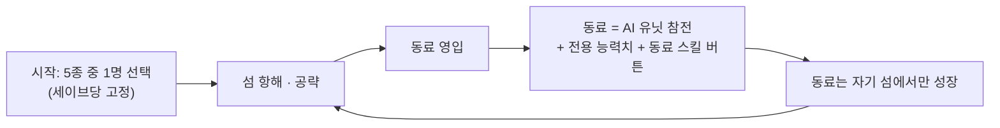

# 캐릭터 5종과 동료 시스템

> **종류**: 기획 문서 (GDD) · **상태**: Draft
> **최종 갱신**: 2026-07-21 · **관련 기획서**: [content-roadmap.md](./content-roadmap.md)

---

## 1. 개요·목적

이 게임은 **섬 5개로 이루어진 세계**에서, **캐릭터 5종 중 1명을 골라 시작**하고 **나머지 4명을 동료로 영입**해 나가는 방치형 + 능동 전투 하이브리드 RPG다. 이 문서는 캐릭터 5종의 컨셉과 동료 시스템의 구조를 확정한다.

핵심 재미 요소는 세 가지이며, 이 문서의 모든 결정은 이 셋이 **하나의 인과로 묶이도록** 설계한다.

1. **성장** — 방치와 능동 전투를 오가며 강해진다.
2. **모험** — 배를 타고 섬을 순회한다.
3. **교류** — 동료를 영입하고, 필드와 바다에서 **다른 플레이어의 존재를 본다.** 모험의 재미는 플레이어끼리 경험을 공유하는 데서 나온다.

## 2. 확정 결정 (2026-07-14 · 07-15)

| 쟁점 | 결정 | 근거 |
|------|------|------|
| **시작 캐릭터** | 5종 중 1명 선택, **세이브당 고정** | 선택의 무게가 유지되고 5종 각각이 리플레이 가치가 된다. 세이브 구조도 단순해진다 |
| **동료 영입** | 나머지 4종을 동료로 영입하는 것이 게임의 진행 방향 | 영입 여정 자체가 모험(섬 순회)의 목적이 된다 |
| **동료의 전투 참여** | **함께 싸우는 AI 유닛** — 화면에 등장해 실제로 전투한다 | 동료를 모았다는 감정 보상이 가장 크다. 본체의 방치 모드 AI와 같은 제어 구조를 공유해 비용을 낮춘다 |
| **동료 스킬 조작** | 본체 스킬 버튼 6개와 **별도의 동료 스킬 버튼** | 본체 조작 체계를 침범하지 않으면서 동료 개입의 손맛을 준다 |
| **동료 성장 장소** | 동료는 **자기 섬에서만 제대로 성장**한다 | 섬 순회 강제 장치. "한 캐릭터만 키우고 나머지는 방치"를 구조적으로 막는다 |
| **섬 이동** (07-15) | 이동 순서는 **자유** — 강제 루트를 두지 않는다 | 동료 시너지(§4.2)가 이동의 나침반이 된다. 플레이어가 본체에 맞는 동료를 찾아 **스스로 경로를 그린다** |
| **섬·스테이지 구성** (07-15) | **5섬 모두 처음부터 자유 이동**, 각 섬은 **다수의 스테이지**를 클리어하며 공략한다. **결정섬은 6번째 추가 섬**으로 계획(내용 TBD §8) | 섬별 진행도가 독립이라 자유 이동과 충돌하지 않는다. 확장 콘텐츠의 자리가 미리 확보된다 |
| **전직·스킬 습득** (07-15) | 캐릭터당 **4차 전직**. 전직하면 전용 스킬이 **공개**되고, **특정 레벨 달성 시 받는 포인트로 배운다** | 프레스티지 없는 이 게임의 장기 메타(로드맵 §3.5). 전직 = 풀 확장, 레벨 = 포인트 공급으로 성장 축이 분리된다 |
| **스킬 사용 방식** (07-15) | 슬롯 **최대 6개** 등록. 기본 공격은 **쿨타임 없이 상시**, 쿨타임 스킬(공격·버프)은 **쿨이 돌 때마다 자동 사용**. **능동 모드에서는 수동 발동 허용** | 방치와 능동이 **같은 슬롯 6개를 공유**하고 발동 주체만 다르다 — 스킬 세트를 이중으로 관리하지 않는다 |
| **동료의 전투 행동** (07-15) | 동료는 **기본 공격 + 스킬 1개**만 사용. 스킬은 평소 자동, **별도 버튼으로 수동 발동 가능** | 동료 AI의 행동 폭을 좁게 고정해 구현·밸런스 비용을 낮춘다. "별도 동료 스킬 버튼"(07-14) 결정과 정합 |

## 3. 설계 축 — 방치 친화 ↔ 능동 친화

캐릭터 5종을 나누는 축은 속성(불·얼음 등)이 아니라 **"자동으로 놔뒀을 때 잘하는가, 내가 잡아야 빛나는가"** 다.

- **이 게임만의 축이다.** 속성 구분은 어느 게임에나 있지만, 방치+능동 하이브리드라는 장르 정체성을 캐릭터 설계로 표현하는 게임은 드물다.
- **시작 선택이 플레이 스타일 선언이 된다.** 방치 위주로 즐길 사람은 수호자를, 손맛을 원하는 사람은 광전사를 고른다. 시작 캐릭터가 세이브당 고정이므로 이 선언은 그 세이브의 정체성이 된다.
- **유한형 성장과 궁합이 좋다.** 수치 인플레 대신 스택·제어·지속딜 같은 **메커니즘 숙련**으로 캐릭터를 차별화하므로, 수치 상한([content-roadmap.md §3.6](./content-roadmap.md)) 안에서도 개성이 유지된다.

**축 분포는 방치 쪽으로 기울인다** — 방치 3종(90:10, 80:20, 60:40) · 중립 1종(50:50) · 능동 1종(30:70). 방치형이 본체인 게임에서 능동 캐릭터가 2종 이상이면 장르 무게중심이 흔들린다.

## 4. 캐릭터 5종

> 캐릭터명은 컨셉 식별용 가칭이다. 최종 이름·테마 톤은 TBD(§8).

| 섬 | 캐릭터 | 전투 역할 | 방치:능동 | 핵심 메커니즘 |
|---|---|---|---|---|
| 🌴 초원섬 (좌상) | **수렵꾼** | 균형 딜러 | 60:40 | 근·원거리 스탠스 전환 |
| 🌋 화산섬 (우상) | **광전사** | 폭발 딜러 | 30:70 | 열기 스택 — 쌓을수록 강하나 과열 시 자멸 |
| 🏔 빙하섬 (좌하) | **수호자** | 탱커/제어 | 90:10 | 빙결 제어 + 최고 생존력 |
| 🏛 유적섬 (우하) | **소환사** | 서포터 | 80:20 | 소환수가 자율 전투 |
| ⚓ 항구섬 (중앙) | **거너** | 원거리 기교딜 | 50:50 | 탄환 관리 — 탄종 교체 + 재장전 타이밍 |

> 섬별 자원과 장비 대응은 **TBD**(§8)다. 이전 제안(화산=무기, 빙하=방어구, 유적=장신구)은 참고안으로만 남긴다.

### 4.1 캐릭터별 정체성 — 방치 AI와 능동 조작의 차이

이 축의 핵심은 **같은 캐릭터라도 방치와 수동의 플레이가 실제로 달라야** 한다는 점이다.

**수렵꾼 (초원섬) — 기준선.** 첫 캐릭터이자 게임의 튜토리얼. 근거리·원거리 스탠스를 전환하며 싸우고, 방치 AI는 거리에 따라 무난하게 자동 전환한다. 능동 조작 시엔 스탠스별 보너스 타이밍을 노리는 정도. **일부러 특색을 옅게** 둔다 — 기준선이 개성 있으면 나머지 4종의 개성이 상대적으로 죽는다.

**광전사 (화산섬) — 하이브리드 장르의 간판.** 공격할 때마다 열기 스택이 쌓여 데미지가 오르지만, 한계를 넘으면 과열로 자멸한다. 방치 AI는 자멸을 피하기 위해 스택을 안전선까지만 운용한다 — 방치하면 그저 그런 딜러다. 수동 조작은 한계 직전까지 스택을 태우며 최대 딜을 뽑는다. **"방치하면 평범, 잡으면 최강"** 이 정체성이며, 능동 성향 플레이어의 시작 선택지를 담당한다.

**수호자 (빙하섬) — 방치의 왕.** 적을 얼려 묶고, 죽지 않는다. 딜은 낮지만 켜두고 자도 살아남는 안정성이 정체성. 수동 조작의 이득이 거의 없게 **의도적으로** 설계한다 — "능동 조작이 항상 이득"이면 방치 친화 축이 거짓말이 되기 때문이다.

**소환사 (유적섬) — 간접 제어.** 본체는 약하고 소환수가 대신 싸운다. 소환수는 스스로 판단하므로 방치 효율이 높고, 수동 조작은 조작이 아니라 **지휘**(소환수 배치·집중 지시)다. 스킬 버튼이 "내 기술"이 아니라 "명령"이 되는 유일한 캐릭터로, 조작 다양성을 담당한다.

**거너 (항구섬) — 숙련의 축.** 탄창이 유한하고, 비우면 재장전이 필요하다. 탄종 3종 — 관통탄(직선 다수), 산탄(근접 광역), 작열탄(단일 강화) — 을 교체하며 싸운다. 방치 AI는 기본 탄만 쓰고 자동 재장전한다 — 무난하지만 평범. 수동은 적 구성에 맞춰 탄종을 갈아끼우고 **재장전을 전투 공백에 끼워 넣는 관리**로 화력이 폭발한다. 광전사(리스크 관리)와 달리 거너의 손맛은 **선택과 타이밍의 최적화**다.

### 4.2 동료일 때의 기여

동료의 기여는 **동료 스킬 + 동료 전용 능력치 상승** 두 가지다. 전용 능력치는 각 캐릭터의 전투 역할에서 그대로 나온다.

| 동료 | 동료 전용 능력치 (본체에 부여) | 동료 스킬 (별도 버튼, 예시) |
|---|---|---|
| 수렵꾼 | 공격속도 · 이동속도 · 자원 획득량 | 속사 — 스탠스 연계 연속 사격 |
| 광전사 | 공격력 · 치명타 | 열기 방출 — 폭발 광역딜 |
| 수호자 | 최대 HP · 방어력 | 빙결 장벽 — 피해 무효 + 속박 |
| 소환사 | 스킬 위력 · 쿨다운 감소 | 수호 골렘 소환 |
| 거너 | 원거리 피해 · 치명타 피해 | 집중 사격 — 단일 대상 연사 |

**동료의 전투 행동은 "기본 공격 + 스킬 1개"로 고정한다.** 스킬은 쿨이 돌 때마다 자동 사용되고, 별도 버튼으로 원하는 타이밍에 수동 발동할 수도 있다(§5). 행동 폭을 좁게 고정하는 이유는 동료 AI의 구현·밸런스 비용을 "캐릭터 수 × 스킬 수"가 아니라 **"캐릭터 수 × 1"** 로 묶기 위해서다.

**동료 영입이 곧 빌드다.** 광전사(유리대포)로 시작한 플레이어가 수호자를 영입하면 생존이 보강된다 — 내 본체의 약점을 어떤 동료로 메우느냐가 빌드가 되고, 시작 5종 × 동료 편성 조합이 M2(빌드의 깊이)의 재료가 된다.

**동료 시너지는 별도 시스템이 아니라 역할 보완에서 자연히 생긴다.** 시너지 테이블·조합 보너스 같은 추가 규칙을 만들지 않는다. 사냥(광역) 효율이 떨어지는 본체는 사냥 효율 좋은 동료를, 단일 공격이 약한 본체는 단일딜 강한 동료를 데려가면 될 뿐이다 — 위 표의 역할·전용 능력치가 이미 그 보완 관계를 담고 있다. 이 자연 보완이 섬 이동 자유(§6)의 동기 장치다: 강제 루트 없이도 플레이어는 자기 본체의 약점을 메울 동료가 있는 섬으로 스스로 향한다. **별도 보너스 수치를 두지 않는 근거**: 조합 보너스가 있으면 "정답 조합"이 생겨 편성이 사실상 강제되고, 자유로운 보완 선택이라는 의도가 죽는다.

### 4.3 스킬 구조 — 전직이 공개하고, 레벨이 포인트를 주고, 슬롯이 고른다

- **캐릭터당 4차 전직**까지 있다. 전직하면 그 차수의 **전직 전용 스킬이 공개**되어 확인할 수 있다 — 공개는 "배울 자격"이지 습득이 아니다. "전직은 기존 메커니즘의 심화"(§9) 원칙과 결합하면, 광전사의 전직 스킬은 전부 "열기"를 다루는 스킬이 된다 — 전직해도 캐릭터의 정체성은 하나로 유지된다.
- **특정 레벨을 달성하면 스킬 포인트를 받고, 포인트를 소모해 공개된 스킬을 배운다.** 성장 축이 둘로 나뉜다: **전직은 배울 수 있는 스킬의 풀을 넓히고, 레벨은 배울 재화(포인트)를 공급한다.** 로드맵 M2의 "레벨 테이블에 스킬 포인트 지급량 컬럼을 얹는다"는 계획과 정확히 맞물린다.
- 배운 스킬 중 **최대 6개를 슬롯에 등록**한다. 어떤 6개를 고르느냐가 빌드의 절반이고, 나머지 절반이 동료 편성(§4.2)이다.
- **기본 공격 스킬은 쿨타임 없이 상시 사용**된다. 쿨타임이 있는 공격·버프 스킬은 **쿨이 돌 때마다 자동 사용**된다 — 방치 상태의 기본 동작.
- **능동 모드에서는 수동 발동을 허용**한다. 자동 사용을 아껴뒀다가 원하는 타이밍에 직접 누른다 — 광전사의 "한계 직전까지 스택을 태우는" 플레이, 보스 패턴에 맞춘 버프 타이밍이 여기서 나온다. 방치와 능동이 같은 슬롯을 공유하므로 **수동 조작의 이득은 "다른 스킬"이 아니라 "더 좋은 타이밍"** 이다.

## 5. 동료 시스템 구조

- **전투 참여**: 동료는 화면에 등장해 함께 싸우는 AI 유닛이다. 동료 AI는 본체의 방치 모드 AI와 **같은 제어 구조(시전 파이프라인·타겟팅)를 공유**한다 — 동료란 "항상 방치 모드인 캐릭터"다. 단 **행동 폭은 기본 공격 + 스킬 1개로 축소**한다(§4.2): 본체 방치 AI가 슬롯 1~5를 순회하는 것과 달리, 동료는 순회 대상이 스킬 1개로 고정된다. 즉 "제어 구조 공유"는 **코드(파이프라인) 재사용**을 뜻하며, 슬롯 수까지 같다는 의미가 아니다. 각 캐릭터 방치 AI의 판단 규칙(§4.1)은 그 축소된 행동 폭 안에서 재사용된다.
- **동료 스킬 버튼**: 본체 스킬 버튼 6개와 별도로, **출전 동료마다 버튼 1개**(초상화 형태)를 둔다. 동료 스킬은 평소 쿨마다 자동 사용되며, 이 버튼은 **원하는 타이밍에 수동 발동하는 개입 수단**이다 — 안 눌러도 손해는 없고, 눌러주면 타이밍 이득을 본다. 조작 밀도가 6 + 출전 수로 제한되어 모바일 화면을 침범하지 않는다.
- **출전 슬롯 (TBD, §8)**: 영입한 동료 전원이 동시에 출전하는지, 슬롯 제한(예: 2명)을 두는지 미정. 제한을 두면 "방치용 편성 ↔ 보스전 편성" 프리셋 전환이라는 선택의 재미가 생기므로 **슬롯 제한을 권장**한다.

## 6. 세계 구조와의 연결

- **섬 이동 순서는 자유다.** 강제 루트를 두지 않는다. 대신 **동료 보완 관계**(§4.2, 내 본체의 약점을 메울 동료를 찾아간다)가 "다음에 갈 섬"을 플레이어 스스로 정하게 만든다. 모든 플레이어가 다른 경로를 그리는 것이 의도다. 섬 자원이 확정되면(§8) 자원↔장비 대응이 두 번째 유도 장치로 추가될 수 있다.
- **각 섬은 다수의 스테이지로 구성**되며, 스테이지를 클리어하며 섬을 공략한다. 섬별 진행도는 독립적이라 자유 이동과 충돌하지 않는다.
- **섬 자원·장비 대응은 TBD**(§8) — "섬 자원 ↔ 장비 종류 1:1 대응"(예: 무기는 화산섬)이 참고안으로 있다. 채택하면 "좋은 무기를 만들려면 화산섬에 가야 한다"가 성립해 섬 순회 유도 장치가 장비 시스템까지 관통한다.
- **바다 재료(낚시)는 제작의 공통 소모품** — 섬 사이 항해에도 보상을 부여한다.
- **세계는 다른 플레이어와 공유된다** — 섬의 사냥터에서도, 해역에서도 다른 플레이어의 **위치와 동작**(사냥·낚시하는 모습)이 보인다. 단 각자의 몬스터·이펙트·전투 수치는 공유하지 않는다 — 함께 있되, 전투는 각자의 것이다(상세: [content-roadmap.md §3.5](./content-roadmap.md)).
- **결정섬은 6번째 추가 섬이다** — 캐릭터 5종의 섬과 별개로, 이후에 추가할 확장 지역으로 계획한다(§9). 테마·콘텐츠·추가 시기는 미정(§8).

## 7. 마일스톤 매핑

[content-roadmap.md §5](./content-roadmap.md)의 마일스톤에 이 문서의 콘텐츠를 얹는다.

> **자유 이동(§6)과 개발 순서는 별개다.** 자유 이동은 완성된 게임의 규칙이고, 아래 표는 캐릭터·시스템을 **만드는** 순서다. 또한 로드맵 M1의 "스테이지 1~5"는 첫 섬(초원섬) 스테이지 라인의 도입부가 된다 — 섬마다 다수의 스테이지를 두는 구조(§6)와 같은 뼈대를 공유한다.

| 마일스톤 | 이 문서에서 얹는 것 | 근거 |
|---|---|---|
| **M0~M1** | **수렵꾼 본체만** (동료 없음) | 기준선 캐릭터로 코어 루프·수직 슬라이스 검증. 시작 선택 UI도 아직 불필요 |
| **M2** | **첫 동료 = 수호자** | 동료 AI의 첫 구현체로 가장 안전 — 탱커 AI는 단순하고, 광전사처럼 자멸 리스크 관리가 필요 없다. 전용 능력치(HP·방어)의 체감도 명확하다 |
| **M3** | **광전사** (시작 선택지 2종 개방) | 능동 전투 마일스톤과 정체성이 일치 — 보스전에서 열기 스택 관리가 손맛의 증명이 된다 |
| **M4 이후** | 거너 · 소환사, 시작 선택 5종 완성 | 소환사(별도 소환수 개체)는 시스템 비용이 커 최후순위. 거너(탄환 관리)는 비용이 낮아 M4 안에서 먼저 만든다 |

## 8. 리스크 · 미결정 (TBD)

| 항목 | 내용 |
|---|---|
| **동료 AI 비용** | "함께 싸우는 AI 유닛"은 세 선택지 중 가장 비싸다. 본체 방치 AI 구조를 공유해 낮추는 것이 전제이며, M2에서 수호자 1종으로 비용을 실측한 뒤 나머지를 진행한다 |
| **출전 슬롯 수** | 전원 출전 vs 슬롯 제한(2명 권장). 밸런스·화면 밀도 실측 후 M2에서 결정 |
| **동료 스킬 버튼 배치** | 본체 6버튼과의 화면 배치·크기. UI 프로토타입에서 결정 |
| **캐릭터 이름·테마 톤** | 현재 이름은 가칭. 세계관 톤(경쾌/진지)과 함께 결정 |
| **동료 영입 연출** | 영입 조건(섬 공략 진행도? 퀘스트?)과 연출 미정 |
| **결정섬(추가 섬)** | 6번째 확장 섬으로 만든다는 계획만 확정. 테마·콘텐츠·해금 조건·추가 시기 미정 |
| **섬 자원·장비 대응** | 미확정으로 되돌림(07-15). 이전 제안(화산=무기, 빙하=방어구, 유적=장신구의 1:1 대응)은 참고안으로만 유지 |
| **전직·스킬 습득 상세** | 골격은 확정(전직 = 스킬 공개, 레벨 달성 포인트 = 습득). 포인트 지급 레벨·지급량, 스킬별 습득 비용, 전직 조건은 미정 |

## 9. 확장 여지 — 지금 만들지 않되 막지 않는 것

- **동료 편성 프리셋** — 슬롯 제한이 확정되면 "방치용 ↔ 보스전용" 프리셋 전환을 추가할 수 있다. 스왑 구조에서 버린 "출근길엔 수호자, 저녁엔 광전사" 플레이가 편성 차원에서 부활한다.
- **동료 전직 연동** — 전직이 각 캐릭터 메커니즘의 심화(광전사: 과열 페널티의 보상 반전, 수호자: 빙결 광역화)로 설계되면, 동료 상태에서도 같은 축으로 성장시킬 수 있다.
- **결정섬 (6번째 섬)** — 캐릭터 5종의 섬과 별개의 확장 지역. 섬이 데이터(스테이지 라인·자원) 추가만으로 늘어나는 구조이므로, 새 캐릭터 없이 지역만 추가할 수도 있다.
- **6번째 캐릭터 이상** — 축(방치↔능동)과 섬 대응 규칙만 지키면 캐릭터 추가는 구조 변경 없이 가능하다.
