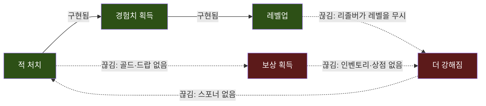
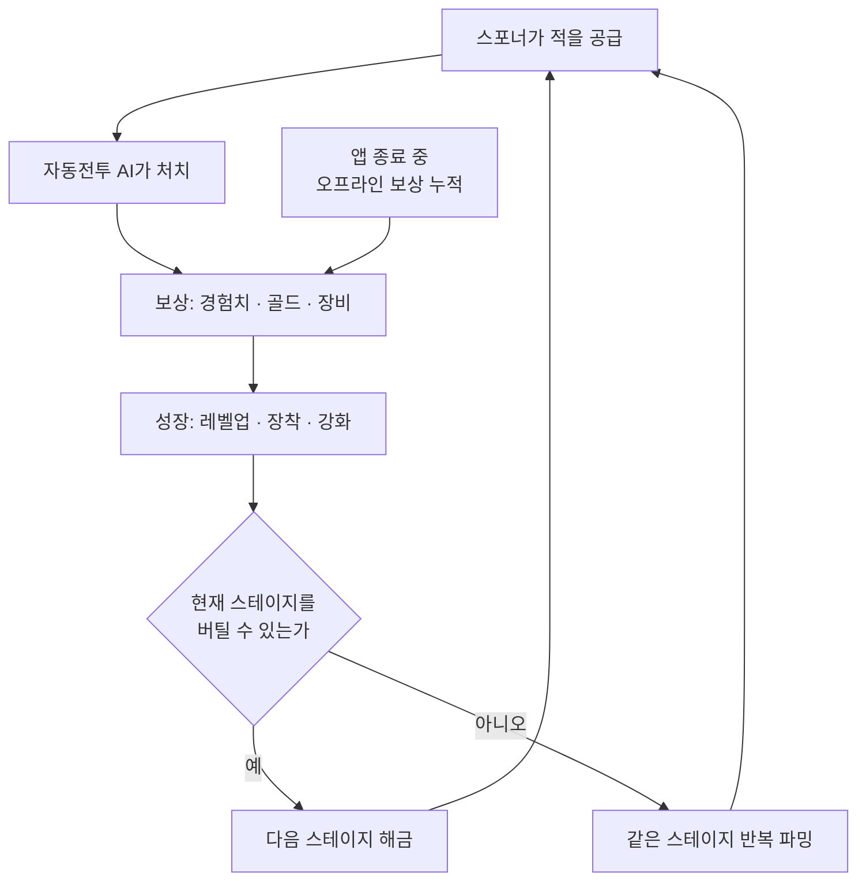
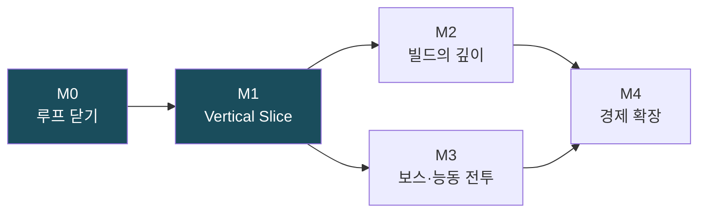

# 콘텐츠 로드맵

> **종류**: 기획 문서 (GDD) · **상태**: Draft
> **최종 갱신**: 2026-07-21 · **관련 기획서**: (이 문서가 최상위) · [characters-and-companions.md](./characters-and-companions.md)
> **관련 계획서**: [player-data-management-plan.md](../design/player-data-management-plan.md) · [skill-menu-plan.md](../design/skill-menu-plan.md) · [enemy-kill-exp-reward-plan.md](../design/enemy-kill-exp-reward-plan.md)

---

## 0. 이 문서의 출발점

이 프로젝트에는 **"어떻게 만드나(How)"** 문서가 12편 있지만, **"무엇을 왜 만드나(What·Why)"** 문서가 한 편도 없다.

증거는 문서 자신이 남겨 뒀다. `player-data-management-plan.md`와 `skill-menu-plan.md`의 머리말은 둘 다 **`관련 기획서: (링크 예정)`** 으로 빈칸을 비워 뒀고, `conventions/spec-writing.md` §0은 *"게임 재미·밸런싱 의도 등 무엇을·왜는 기획서(GDD)에 두고 링크만 건다"* 고 규정하지만 **그 GDD가 존재하지 않는다.**

그 결과 두 가지 문제가 생겼다.

1. **계획서는 있는데 순서가 없다.** 스킬 창은 전직 시스템을 선행 요구하고, 전직은 레벨 테이블을 요구하며, 이 모두는 세이브가 없으면 재기동 시 증발한다. 어느 것부터 손대야 하는지 판단할 상위 기준이 없다.
2. **시스템이 게임을 앞질렀다.** `StatType`에 `GoldGainRate`가 정의되어 있으나 **골드라는 재화 자체가 없다.** 무엇을 만들지 정하지 않은 채 시스템을 먼저 지었다는 신호다.

이 문서는 그 빠진 최상위 층을 채운다. **무엇을, 어떤 순서로, 왜 그 순서로 만드는지**를 확정한다.

## 1. 개요·목적

콘텐츠 구현의 **범위와 순서**를 정의한다. 개별 기능의 설계(How)는 `design/`·`specs/`에 위임하고, 이 문서는 **"지금 무엇을 만들 차례인가"** 라는 단 하나의 질문에만 답한다.

핵심 판단은 **"기능 목록이 아니라 루프를 기준으로 자른다"** 이다. 방치형 게임의 완성도는 콘텐츠의 개수가 아니라 **성장 사이클이 사람 손 없이 한 바퀴 도는가**로 결정된다. 따라서 마일스톤은 "스킬 10개·장비 20개" 같은 물량이 아니라 **"루프가 몇 바퀴 도는가"** 로 정의한다.

## 2. 현재 상태 진단

로드맵의 모든 우선순위는 이 진단에서 파생된다.

### 2.1 시스템은 두껍고, 게임은 비어 있다

| 층위 | 상태 | 근거 |
|------|------|------|
| **시스템(엔진)** | 과잉에 가깝게 충분 | 상태 머신 6종 · `StatType` 20종 · 3레이어 모디파이어 · 스킬 6슬롯 + 쿨다운 + 캐스트 게이트 · 자동전투 AI · `PlayerInputRouter`의 Active↔Idle 런타임 스왑 |
| **콘텐츠(게임)** | 사실상 0 | 스킬 1개(`BasicAttack`) · 버프 1개(`PowerUp`) · 장비 1개(`Dragon_Hat`) · 적 스탯 1개 · 씬 1개(`Dev/SampleScene`) |
| **게임 루프** | **닫히지 않음** | 스포너 없음 · 골드 없음 · 드랍 없음 · 세이브 없음 · 오프라인 보상 없음 · `GameManager`는 빈 스텁 |

### 2.2 가장 치명적인 결함 — 방치할 수 없는 방치형

`EnemyUnit.Die()`는 적을 `SetActive(false)` 처리하고 끝난다. **적을 다시 등장시키는 주체가 코드 어디에도 없다.**

> 지금 빌드를 켜고 5분간 자리를 비우면, 씬에 배치된 적이 전부 죽은 뒤 **아무 일도 일어나지 않는다.**

방치형의 정의(자리를 비워도 성장이 누적된다)가 코드 수준에서 성립하지 않는다. 이것이 M0의 존재 이유이며, **다른 어떤 콘텐츠보다 우선한다.**

### 2.3 두 번째 치명 결함 — 레벨을 올려도 강해지지 않는다

`PlayerBaseStatResolver.Resolve(progressionState, config)`는 **레벨 정보(`progressionState`)를 파라미터로 받고도 한 번도 사용하지 않는다.** 반환값은 전적으로 `config`의 시작 스탯이며, 코드 주석 스스로 *"샘플은 config 직접 사용"* 이라고 밝히고 있다.

> **레벨이 1이든 100이든 최대 체력·공격력이 동일하다.**

경험치 공급원(`EnemyKillReward` → `IExpReceiver`)은 최근에 배선을 마쳤지만, 그렇게 쌓은 경험치로 레벨을 올려도 **캐릭터에 아무런 변화가 없다.** 성장의 인과가 마지막 한 칸에서 끊긴다.

### 2.4 끊긴 루프

초록은 구현됨, 빨강은 부재. **사이클이 한 바퀴도 돌지 않는다.** 끊긴 세 지점(리졸버 · 스포너 · 재화)이 정확히 M0의 범위다.

## 3. 게임 목표 — 북극성 (✅ 확정: A안, 2026-07-21)

플레이어가 궁극적으로 추구하는 것이 무엇인지가 M2 이후의 순서를 결정한다. **2026-07-21 A안(캐릭터 빌드 완성)으로 확정**했다. 아래 표는 확정에 이른 후보 비교이며, 결정 근거는 표 다음에 정리한다.

| 후보 | 코드가 지지하는 근거 | 대가 |
|------|---------------------|------|
| **A. 캐릭터 빌드 완성** (전직·스킬 조합) | `PlayerProgressionConfig.PromotionTier` 필드가 **이미 존재** · `SkillLoadout.TryEquip`이 0번(기본공격)을 고정하고 1~5번만 교체 허용 = 조합 설계 의도 · `StatType` 20종 중 `CritChance`·`LifeSteal`·`ProjectileCount`·`CooldownReduction` 등 **빌드 다양성 전용 스탯이 다수 미사용 상태로 대기** | 진척도를 눈으로 볼 척도가 약함. "내가 얼마나 왔나"를 표현할 장치를 따로 만들어야 함 |
| **B. 스테이지 돌파** (무한 층 등반) | 방치형 시장의 표준 뼈대. 진척도가 숫자 하나(층)로 환원되어 가장 측정하기 쉬움 | 현재 코드에 스테이지·존 개념이 **전혀 없음**. 순수 신규 투자 |
| **C. 보스 레이드 클리어** | `PlayerInputRouter`의 Active↔Idle 스왑이 **이미 구현** — 능동 조작이 발동할 무대가 필요 · 조이스틱·`SkillButton`도 준비됨 | 보스만으로는 방치 시간의 목적이 비어 있음. 평시 루프를 따로 설계해야 함 |

**확정: A를 북극성으로, B를 척도로, C를 절정으로.** 셋은 배타적이지 않고 역할을 나눠 결합한다.

- **빌드(A)는 재미이자 궁극 목표다** — "어떻게 뚫을 것인가"를 플레이어가 선택한다. 코드 투자가 가장 두터운 방향.
- **스테이지(B)는 눈금자다** — "내가 얼마나 왔는가"를 표현한다. 재미의 원천이 아니라 진척의 표시기.
- **보스(C)는 절정이다** — 방치 자동전투로 뚫리지 않는 벽에서 능동 조작이 발동한다. **하이브리드 장르라는 이 프로젝트의 약속이 이행되는 유일한 순간.**

### 3.1 북극성이 "빌드"라는 것이 모험·교류를 종속시키지 않는다 (확정 근거)

북극성(A/B/C)은 **파워 진척의 종착점**을 고르는 물음이고, [characters-and-companions.md](./characters-and-companions.md) §1이 세운 세 재미(성장·**모험**·**교류**)는 **서로 다른 층위**다 — 경쟁하지 않는다.

- **모험(섬 순회)은 A를 추구하는 여정의 형태다.** GDD는 강제 루트 없는 자유 이동 위에, "내 본체의 약점을 메울 동료가 어느 섬에 있는가"(동료 편성 = 빌드)가 다음 목적지를 정하게 설계했다([characters](./characters-and-companions.md) §4.2·§6). 즉 **동료 영입 여정 자체가 모험의 목적**이고, 그 동료 편성이 곧 빌드(A)다. A를 북극성으로 삼으면 모험이 종속되는 것이 아니라 **모험에 "왜 저 섬에 가는가"라는 목적이 생긴다.**
- **모험을 북극성으로 삼으면 오히려 위험하다.** 탐험 자체가 목표가 되면 섬은 체크박스가 되고, GDD가 명시적으로 막으려 한 "한 캐릭터만 키우고 나머지 방치"([characters](./characters-and-companions.md) §2)가 되살아난다.
- **모험·교류는 A보다 하위가 아니라, A라는 목표가 지나가는 "길"에 깔린 이 게임만의 차별점이다.** 다른 빌드형 방치 게임과 이 게임을 가르는 질감이 바로 섬 순회(모험)와 존재 공유(교류)다. 북극성이 A라는 사실이 이 둘을 죽이지 않으며, 오히려 목적을 부여해 살린다. 또한 이 게임의 **스테이지(B)는 섬별 스테이지 라인**이라 눈금(B)과 모험이 공간적으로 겹친다.

> **확정 효과**: M2(빌드)가 M3(보스)보다 앞선다(§5.4·§5.5). **단, 이 결정은 M0·M1 착수를 막지 않는다**(§5.1) — M0·M1은 북극성과 무관하게 내용이 동일하다.

## 3.5 확정된 기획 결정 (2026-07-13 ~ 07-15)

**구조를 되돌리기 어렵게 확정하는 결정**만 여기 모은다. 나머지(스킬 개수·적 종류·밸런스 수치)는 나중에 바꿔도 구조가 흔들리지 않으므로 각 마일스톤에서 정한다.

| 쟁점 | 결정 | 이 결정이 강제하는 기술 |
|------|------|----------------------|
| **성장 스케일** | **유한형** — 스테이지·레벨에 상한이 있고 수치가 무한 인플레하지 않는다 | **`float` 유지.** 단 §3.6의 안전 상한을 기획 제약으로 지킨다 |
| **프레스티지(환생)** | **넣지 않는다** | 세이브가 단일 평면 구조로 끝난다. "리셋 대상 / 영구 보존" 이분 설계 불필요 |
| **오프라인 보상** | **공식 근사** — `초당 처치량 × 경과시간 × 효율계수` | 오프라인 보상이 **순수 함수 하나**로 격리된다. 전투 로직의 결정론적 재현·고정 타임스텝 **불필요** |
| **스테이지 구성** | **단일 씬 + 데이터 교체** — `StageDefinition`(SO)이 적 구성·난이도를 담고 런타임에 교체 | 씬 로딩·Addressables **불필요**. 스테이지 추가 = 에셋 생성 1건 |
| **시작 캐릭터** (07-14) | 캐릭터 5종 중 1명 선택, **세이브당 고정** | 세이브에 "선택 캐릭터" 축 1개 추가. 본체 교체 로직·UI **불필요** |
| **동료 구조** (07-14) | 나머지 4종은 동료로 영입 — **함께 싸우는 AI 유닛** + 동료 전용 능력치 + **별도 동료 스킬 버튼**. 동료 행동은 **기본 공격 + 스킬 1개**(자동, 버튼 수동 가능)로 고정 (07-15) | 동료 AI가 본체 방치 AI와 **같은 제어 구조를 공유**해야 한다. 상세: [characters-and-companions.md](./characters-and-companions.md) |
| **섬 이동·구성** (07-15) | **5섬 모두 처음부터 자유 이동**, 각 섬은 **다수 스테이지**로 구성. 결정섬은 6번째 **추가 섬**으로 확장 계획 | 스테이지 데이터가 **섬 단위로 그룹핑**되고, 섬별 진행도가 세이브에 독립 기록된다 |
| **스킬 사용 방식** (07-15) | 슬롯 최대 6개. 기본 공격 **무쿨 상시** + 쿨 스킬 **자동 사용**, 능동 모드에서 **수동 발동 허용** | 자동/수동이 **같은 스킬 슬롯을 공유** — 발동 주체만 교체되는 구조여야 한다. M3의 능동 전투가 "다른 스킬"이 아니라 "타이밍"의 게임이 된다 |
| **전직·스킬 습득** (07-15) | 캐릭터당 **4차 전직**. 전직 시 전용 스킬 **공개**, **레벨 달성 포인트로 습득** | 전직 데이터에 차수 축(1~4)·차수별 공개 스킬 목록이, 레벨 테이블에 포인트 지급량 컬럼이 필요하다. M2 범위의 구체화 |
| **멀티 존재 공유** (07-15) | 모든 필드 전투·해역에서 **다른 플레이어의 위치·동작을 공유**한다(사냥하는 모습, 낚시하는 모습). 단 **다른 플레이어의 몬스터·이펙트·전투 수치는 공유하지 않는다** — 각자 자기 몬스터를 잡는 개인 시뮬레이션. 근거: 모험의 재미는 플레이어끼리 **경험을 공유**하는 데서 나온다 | **전투 시뮬레이션(로컬)과 존재 동기화(presence, 네트워크)가 분리**된다. 몬스터를 공유하지 않으므로 전투 코드는 싱글 구조를 유지하고, presence 레이어를 독립 모듈로 얹는다. 서버·계정 인프라가 로드맵에 추가된다(§8) |
| **북극성** (07-21) | **A안(캐릭터 빌드 완성)** 확정. B(스테이지)는 척도, C(보스)는 절정. **모험(섬 순회)·교류(존재 공유)는 A를 추구하는 여정의 차별점**으로, A에 종속되지 않고 대등하게 유지된다(§3.1) | M2(빌드)가 M3(보스)보다 앞선다(§5.4·§5.5). 진척 척도로 스테이지(B)를 M1에 둔다. M0·M1은 이 결정과 무관하게 착수(§5.1) |

**프레스티지를 넣지 않는 대신** 장기 메타는 **전직(`PromotionTier`)** 이 담당한다. 이미 `PlayerProgressionConfig`에 필드가 존재하므로 축이 중복되지 않는다(§5.4).

### 3.6 수치 표현 제약 — float 안전 상한

`float`은 유효자리가 7이라 **`2^24 = 16,777,216`(약 1,677만)을 넘으면 정수를 정확히 표현하지 못한다.** 그 구간에서는 `16777216f + 1f == 16777216f`가 **참**이 되어, 데미지가 누락되거나 HP가 줄지 않는 버그가 조용히 발생한다.

> **기획 제약**: 최종 스테이지·최고 레벨에서의 **최대 데미지·최대 HP가 1,000만(1e7)을 넘지 않도록** 성장 곡선을 설계한다. 안전 상한(1677만)의 60% 지점을 실사용 한도로 잡아 버퍼를 둔다.

이것은 **코드가 아니라 기획으로 막는 방어**다. 곱연산 계수를 설계할 때 이 선을 상수로 취급한다. 개발 중에는 이 선을 넘으면 경고하는 어서션을 둔다.

**향후 확장 경로 (지금은 만들지 않되 막지 않는다)**: 수치가 이 상한을 넘겨야 할 일이 생기면, 교체 대상은 `float`을 쓰는 45개 파일 전체가 아니라 **수치(magnitude)가 흐르는 경로**뿐이다. 시간(`deltaTime`·쿨다운·지속시간)·속도·좌표의 `float`은 인플레이션 대상이 아니므로 **영원히 `float`으로 남는다.**

| 확장 단계 | 교체 범위 | 비용 |
|-----------|-----------|------|
| `float` → `double` | 수치 경로만 기계적 치환. **구조 불변** | 낮음 |
| `float` → `BigNumber` | 연산자 오버로드 `struct`로 감싸면 호출부는 대부분 유지. 진짜 비용은 **인스펙터 드로어·직렬화·표시 포맷터** | 높음 |

지금 추상 숫자 타입(`Num` 래퍼)을 도입하지 **않는다.** 유한형 + 프레스티지 없음 조합에서 `BigNumber`로 갈 확률이 낮은데, 모든 산술을 래퍼로 감싸면 가독성과 인스펙터 편집성을 잃는다(YAGNI). 대신 **확장 지점을 추상화하지 않고 격리만** 해 둔다.

1. **표시 경로 격리** — 숫자→문자열 변환을 `NumberFormatter` 한 곳으로 모은다. UI가 `float.ToString()`을 직접 호출하지 않는다. 타입이 바뀌어도 표시 코드는 손대지 않는다.
2. **세이브 스키마 버전** — [player-data-management-plan.md](../design/player-data-management-plan.md)의 `ISaveMigration` 계약으로 타입 변경을 흡수한다.
3. **상한 어서션** — §3.6의 1e7 선을 넘으면 개발 빌드에서 경고한다.

## 4. 코어 루프 — 닫혀야 할 사이클

M1 완료 시점에 아래 사이클이 **사람 손 없이** 돌아야 한다.

**벽(Wall)의 존재가 이 루프의 심장이다.** 벽이 없으면 무한히 진행되어 성장의 의미가 사라지고, 벽이 너무 두꺼우면 이탈한다. 벽을 만났을 때 플레이어가 선택할 수 있는 돌파 수단(레벨 · 장비 · 빌드)이 §3의 북극성을 결정한다.

## 5. 마일스톤

### 5.1 의존 구조 — 목표가 미정이어도 착수 가능한 이유

파란색(M0·M1)은 **§3의 북극성을 무엇으로 고르든 내용이 동일하다.** 스폰·재화·세이브·오프라인 보상은 방치형이라면 목표와 무관하게 반드시 필요한 기반이기 때문이다. 목표 선택은 **M2와 M3의 선후 관계만** 바꾼다.

> **따라서 목표 확정을 기다리지 않고 M0에 즉시 착수한다.** 목표는 M1이 끝나기 전까지 정하면 된다.

### 5.2 M0 — 루프 닫기 (Close the Loop)

**목적**: "방치할 수 있는 상태"를 만든다. 이 프로젝트를 방치형 게임이라고 부를 수 있게 하는 최소 조건.

| 구분 | 내용 |
|------|------|
| **포함** | **① 레벨→스탯 리졸버**(§2.3 — 레벨 테이블 도입, `PlayerBaseStatResolver`가 레벨을 실제로 반영) · **② 적 스포너**(지속 스폰 + 오브젝트 풀링) · **③ 골드 재화**(`Wallet`) + 적 처치 골드 보상(`EnemyKillReward` 확장) · **④ 세이브/로드** · **⑤ `GameManager` 실체화**(게임 루프 소유) |
| **미포함** | 스테이지 · 드랍 테이블 · 오프라인 보상 · UI 개선 · 밸런싱 수치 |
| **완료 기준(DoD)** | 앱을 켜고 **10분간 방치**했을 때: 적이 계속 리스폰되고 → 경험치·골드가 누적되고 → 레벨이 오르고 → **레벨업 순간 공격력·체력이 실제로 증가하며** → **앱을 껐다 켜도 그 진행이 남아 있다.** |

**착수 순서**: ① → ② → ③ → ④. **①을 맨 앞에 두는 이유**는 이것이 이미 배선된 경험치 파이프라인의 **마지막 한 칸**이고, 다른 어떤 것도 건드리지 않고 독립적으로 끝낼 수 있는 가장 작은 작업이기 때문이다. ②(스포너)가 없으면 ①의 효과를 오래 관찰할 수 없으므로 바로 뒤따른다.

**근거**: §2.2·§2.3의 두 결함이 남아 있는 한 **이후의 모든 콘텐츠는 검증 불가능하다.** 스킬을 10개 만들어도 5분 뒤 적이 없으면 시험할 무대가 없고, 레벨업이 스탯에 반영되지 않으면 밸런싱이라는 개념 자체가 성립하지 않는다. 세이브를 함께 넣는 이유는 **성장이 휘발되면 성장을 설계할 수 없기** 때문이다.

**기존 자산 활용**: `player-data-management-plan.md`가 세이브·재화(`WalletSaveSection`)·인벤토리를 이미 설계해 뒀다. M0는 그중 **세이브 + 재화까지만** 구현하고 인벤토리는 M1로 넘긴다.

### 5.3 M1 — Vertical Slice (진척의 척도)

**목적**: 무한 사냥터에 **목표와 눈금**을 준다. 여기까지 오면 "게임"이라고 부를 수 있고, 재미 여부를 **측정**할 수 있다.

| 구분 | 내용 |
|------|------|
| **포함** | 스테이지 개념(1~5) · 클리어 조건 · 다음 스테이지 해금 · 스테이지별 적 난이도 스케일 · **오프라인 보상** · 장비 드랍 + 인벤토리 + 장착 · HUD 실체화(현재 `DebugPlayerHud`) |
| **미포함** | 스테이지 6 이상 · 보스 · 전직 · 스킬 습득 UI · 상점 · 강화 |
| **완료 기준(DoD)** | 신규 플레이어가 스테이지 1에서 시작해 **방치만으로** 5까지 도달하고, 도중에 **최소 한 번 벽에 막혀** 장비 또는 레벨로 뚫는다. 앱을 껐다 켜면 오프라인 보상을 받는다. |

**근거**: 콘텐츠를 넓게 얇게 까는 대신 **한 바퀴를 끝까지** 돌린다. 스테이지 5개면 충분하다 — 100개를 만들어도 1개일 때 재미없으면 100개도 재미없고, 5개에서 재미있으면 100개로 늘리는 건 데이터 작업이다. **"벽에 최소 한 번 막힌다"** 를 DoD에 명시한 이유는, 벽이 없으면 성장 시스템 전체가 장식이 되기 때문이다.

### 5.4 M2 — 빌드의 깊이 (북극성 A 확정)

**목적**: 벽을 뚫는 수단을 **플레이어의 선택**으로 만든다. 지금은 레벨이 오를 뿐 플레이어가 내리는 결정이 없다.

| 구분 | 내용 |
|------|------|
| **포함** | **전직 시스템**(`PromotionTier`를 올리는 주체 — 현재 필드만 있고 올리는 코드가 없음) · 스킬 포인트(**M0에서 만든 `PlayerLevelTable`에 지급량 컬럼 추가**) · 스킬 습득/배치 UI · `SkillType` 확장(현재 Attack·Buff 2종) · **실제 스킬 콘텐츠 제작**(현재 1개) |
| **미포함** | 스킬 트리(선행 스킬) · 스킬 강화 · 룬/각인 |
| **완료 기준(DoD)** | 플레이어가 6슬롯을 **자기 선택으로** 채우고, **다른 선택이 다른 결과를 낳는다**(같은 레벨에서 빌드에 따라 클리어 스테이지가 달라진다). |

**근거**: `skill-menu-plan.md`가 UI·도메인을 설계해 뒀으나, 그 문서 스스로 **전직 시스템을 선행 과제(G1)로 지목**하고 스코프에서 제외했다. 그 선행 과제를 여기서 해소한다. `PlayerProgressionConfig.PromotionTier`가 이미 필드로 존재한다는 것은 원래부터 이 방향을 염두에 뒀다는 증거다.

> **레벨 테이블 소유권 정정**: `skill-menu-plan.md`는 `PlayerLevelTable`을 **자신이 신설**한다고 적었으나, M0의 레벨→스탯 리졸버(§5.2 ①)가 **같은 테이블을 더 먼저 필요로 한다.** 따라서 테이블 신설은 **M0로 앞당기고**, M2는 거기에 스킬 포인트 지급량 컬럼만 얹는다. 한 테이블이 레벨별 스탯과 포인트를 함께 담는 편이 기획자 입장에서도 한 곳에서 조정 가능해 낫다.

### 5.5 M3 — 보스와 능동 전투 (하이브리드 약속의 이행)

**목적**: **이 프로젝트가 존재하는 이유를 증명한다.** 하이브리드 장르를 표방하고 `PlayerInputRouter`로 Active↔Idle 스왑까지 구현해 뒀지만, **현재 능동 조작이 필요한 순간이 게임에 하나도 없다.**

| 구분 | 내용 |
|------|------|
| **포함** | 보스 스테이지(자동전투로는 뚫리지 않는 설계) · 능동 모드 전환 진입점 · 보스 공격 패턴(`EnemyAttacker` 확장) · 회피/타이밍 요소 |
| **미포함** | PvP · 레이드(멀티) · 랭킹 |
| **완료 기준(DoD)** | 플레이어가 **"지금은 직접 조작해야 한다"** 고 느끼는 순간이 최소 1회 발생하고, 능동 조작으로 뚫었을 때 방치보다 나은 결과를 얻는다. |

**근거**: `docs/README.md` §1은 이 게임을 "방치 + 능동 하이브리드"로 규정하고, 그 추상화가 **핵심 설계 판단**이라고 선언한다. 그러나 능동 모드가 발동할 콘텐츠가 없으면 그 설계는 **사용되지 않는 추상화**이며, 포트폴리오에서 가장 먼저 공격받는 지점이 된다. M3는 기능 추가가 아니라 **기존 설계의 정당화**다.

### 5.6 M4 — 경제 확장과 리텐션

**목적**: 재화의 Sink를 늘려 장기 플레이의 목적을 만든다.

| 구분 | 내용 |
|------|------|
| **포함** | 장비 강화 · 상점 · 일일 콘텐츠 · 미사용 `StatType`(`CritChance`·`LifeSteal`·`ProjectileCount` 등) 실사용화 · 스테이지 확장 |
| **미포함** | 과금 · 서버 저장 · 소셜 |
| **완료 기준(DoD)** | 골드가 **남아돌지 않는다**(Sink가 Source를 따라잡는다). |

## 6. 재화 흐름 — Source / Sink 초안

방치형의 뼈대. **모든 콘텐츠는 결국 Source 아니면 Sink다.**

| 재화 | Source (어디서 나오나) | Sink (어디서 사라지나) | 현재 상태 |
|------|----------------------|----------------------|-----------|
| **경험치** | 적 처치 · 오프라인 보상 | 레벨업(소비되어 사라짐) | Source만 구현 · **Sink가 여는 것이 미정** |
| **골드** | 적 처치 · 오프라인 보상 · 스테이지 클리어 | 장비 강화 · 상점 · 스킬 습득 | **없음** (단, `StatType.GoldGainRate`는 이미 존재) |
| **스킬 포인트** | 레벨업(레벨 테이블이 지정한 레벨에서 지급) | 스킬 습득 | 계획서상으로만 존재 |
| **장비** | 스테이지 드랍 | 장착 · 강화 재료(중복분) | `EquipmentDefinition`만 존재 · **획득 경로 없음** |

**원칙**: Sink 없는 Source는 인플레이션이고, Source 없는 Sink는 벽이다. **M0에서 골드를 추가할 때 Sink(강화·상점)를 함께 넣지 않으므로, M4까지 골드는 의도적으로 남아돈다.** 이는 인지된 부채이며 M4에서 청산한다.

## 7. 기존 계획서 매핑

이미 작성된 계획서들이 어느 마일스톤에 속하는지 확정한다. **이것이 이 로드맵의 가장 실용적인 산출물이다.**

| 계획서 | 마일스톤 | 비고 |
|--------|----------|------|
| [player-data-management-plan.md](../design/player-data-management-plan.md) | **M0** (세이브·재화) + **M1** (인벤토리·아이템) | 문서를 쪼개지 않고, 구현을 2단계로 나눠 진행 |
| [skill-menu-plan.md](../design/skill-menu-plan.md) | **M2** | 스스로 지목한 선행 과제(전직 시스템)를 M2 앞부분에서 해소 |
| [enemy-kill-exp-reward-plan.md](../design/enemy-kill-exp-reward-plan.md) | 완료 | `EnemyKillReward` 허브를 M0에서 **골드 보상까지** 확장 |

## 8. 리스크 · 미결정 (TBD)

| 항목 | 내용 | 해소 시점 |
|------|------|-----------|
| **오프라인 보상 계수** | 방식은 공식 근사로 확정(§3.5). 남은 것은 **효율계수·시간 상한**(예: 0.6배, 최대 8시간) | M1 착수 시 |
| **스포너 정책** | 지속 스폰(무한) vs 웨이브(구간) — 스테이지 클리어 조건 설계와 직결 | **M0 착수 시 (즉시)** |
| **성장 곡선 계수** | §3.6의 1e7 상한 안에서 레벨·스테이지별 스탯 증가율을 어떻게 잡을지 | M0 착수 시 |
| **`GoldGainRate`의 의미** | 이미 정의된 스탯이 골드 없이 존재. M0에서 실제 배율로 연결할지, 미사용으로 남길지 | M0 착수 시 |
| **스탯 20종 과잉** | 절반 이상이 미사용. 전부 살릴지, 일부를 잘라낼지 | M4 |
| **존재 공유(presence) 도입 시기** | §3.5에서 방향 확정. 코어 루프 검증(M0~M1)은 로컬로 가능하므로, presence는 **별도 기술 트랙**으로 진행 — 네트워크 스택 선정·위치 동기화 스파이크를 언제 시작할지 미정 | M1 종료 전 |
| **서버·계정 인프라** | 존재 공유·PvP·랭킹의 전제. 세이브를 로컬로 시작하면 이후 서버 저장 이관 경로(마이그레이션)가 필요하다 | presence 스파이크 시 |

**해소 완료** (2026-07-13, §3.5): 성장 스케일(유한형·float) · 프레스티지(미도입) · 오프라인 보상 방식(공식 근사) · 씬 구조(단일 씬 + 데이터 교체).
**해소 완료** (2026-07-21, §3·§3.5): **북극성 = A안(빌드 완성)** — B는 척도, C는 절정. 모험·교류는 A의 여정 차별점으로 대등 유지.

## 9. 다음 액션

문서 정합 액션은 **2026-07-21 전부 해소**됐다.

1. ✅ **북극성 확정** — A안(빌드 완성)으로 확정(§3·§3.1).
2. ✅ **M0 설계 명세(TDD) 작성** — [m0-close-the-loop-plan.md](../design/m0-close-the-loop-plan.md)(스포너·골드 재화·세이브).
3. ✅ **문서 위계 등록** — `conventions/spec-writing.md` §1에 "기획 문서(GDD)" 행 추가, `docs/README.md` 허브에 `gdd/` 섹션 등록.
4. ✅ **`관련 기획서` 링크 채움** — 계획서 2건뿐 아니라 `enemy-kill-exp-reward-plan.md`와 `specs/player/` 명세 8건의 `(링크 예정)` 머리말까지 GDD 링크로 교체 완료.

다음은 문서가 아니라 **구현** 트랙이다: M0 착수(§5.2, 순서 ①레벨→스탯 리졸버 → ②스포너 → ③골드 → ④세이브).
