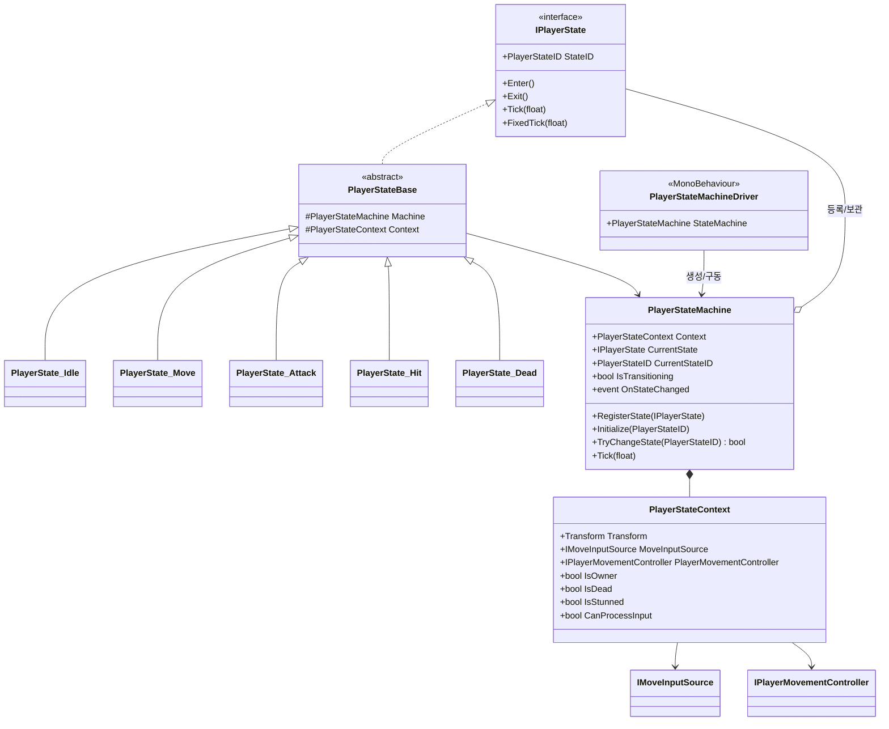
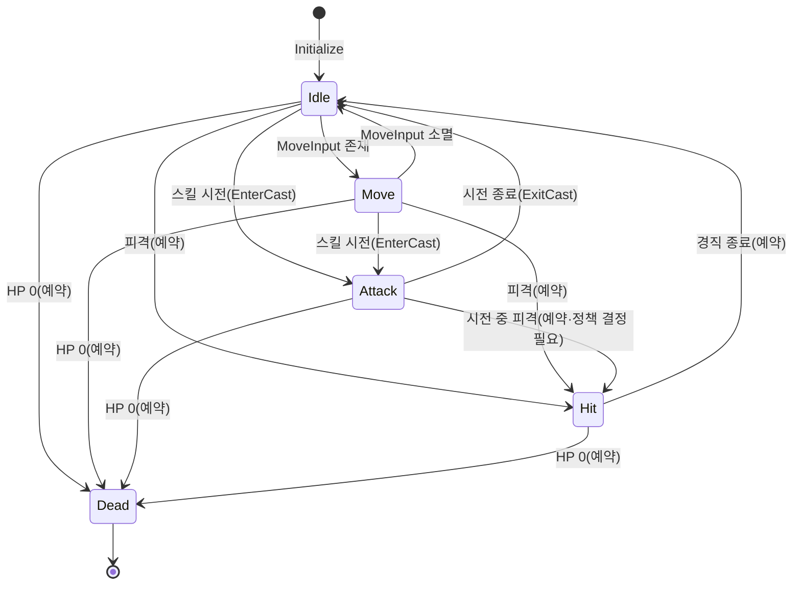
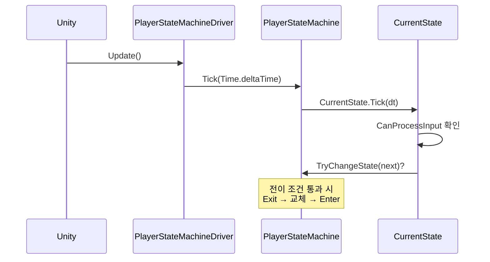

# 01. 플레이어 상태 머신 (Player State Machine)

> 위치: `Assets/Idle Game/Scripts/Features/Player/StateMachine`
> 패턴: **State Pattern** · **제어 주체 추상화(Control-Source Abstraction)**
> 관련 명세: [03. 스킬·전투 시스템](./03_Skill_Combat_System.md) — 시전 잠금은 이 상태 머신을 진실로 삼음

---

## 1. 개요

플레이어의 행동을 **상호 배타적인 상태**로 표현하고, 상태 간 전이를 안전하게 통제하는 유한 상태 머신(FSM)입니다.

핵심 책임은 두 가지입니다.

1. **행동의 배타성 보장** — "이동 중" / "시전 중" / "사망"이 동시에 성립하지 않도록 한 순간에 하나의 상태만 활성.
2. **모드 무관 동작** — 방치(AI)든 능동(플레이어)이든, 상태 머신은 **입력이 어디서 오는지 모른 채** 동일하게 작동.

두 번째가 이 설계의 차별점입니다. 상태 머신은 `IMoveInputSource`라는 추상에만 의존하므로, 조이스틱을 AI로 바꿔 끼워도 코드가 그대로입니다.

---

## 2. 요구사항 · 설계 목표

| # | 목표 | 설계적 해석 |
|---|------|-------------|
| G1 | 한 순간에 하나의 행동만 | 상태를 배타적 노드로 모델링(FSM) |
| G2 | 상태 추가에 열려 있을 것 | 각 상태 = 독립 클래스(`IPlayerState`). 상태 추가 시 기존 코드 수정 없음(OCP) |
| G3 | 전이 도중 재진입 방지 | `IsTransitioning` 가드로 Enter/Exit 중 전이 차단 |
| G4 | 플레이어/AI 모드 공용 | 입력을 `IMoveInputSource`로 추상화, 상태는 소스 종류를 모름(DIP) |
| G5 | 사망/기절 시 입력 무시 | `PlayerStateContext.CanProcessInput` 단일 게이트 |
| G6 | 멀티플레이 확장 여지 | `IsOwner`로 원격 인스턴스 입력 차단 대비 |

---

## 3. 구성 요소

| 계층 | 타입 | 역할 |
|------|------|------|
| **계약** | `IPlayerState` | 상태의 공통 계약 (`Enter`/`Exit`/`Tick`/`FixedTick`/`StateID`) |
| | `PlayerStateID` (enum) | 상태 식별자 (None/Idle/Move/Attack/Hit/Dead) |
| | `IMoveInputSource` | 이동 입력 공급 추상 (`Vector2 Move`) |
| | `IPlayerMovementController` | 이동 실행·차단 추상 (`MoveInput`, `SetMovementEnabled`) |
| | `IPlayerAnimationController` | 애니메이션 제어 추상 (현재 빈 인터페이스, 확장 예약) |
| **핵심** | `PlayerStateMachine` | 상태 등록·전이·틱 위임. 전이 안전성 보장 |
| | `PlayerStateBase` | `IPlayerState` 추상 기반. `Context`/`Machine` 참조 제공 |
| | `PlayerStateContext` | 상태가 공유하는 참조·플래그 묶음 (입력·이동·생사) |
| **구동** | `PlayerStateMachineDriver` | MonoBehaviour. 씬 참조를 주입받아 머신 생성·Update 연결 |
| **상태** | `PlayerState_Idle` | 대기 → 입력 감지 시 Move로 |
| | `PlayerState_Move` | 이동 → 입력 소멸 시 Idle로 |
| | `PlayerState_Attack` | 스킬 시전 잠금 상태 (전투 시스템이 사용) |
| | `PlayerState_Hit` | 피격 경직 (구현 예약) |
| | `PlayerState_Dead` | 사망 (구현 예약) |

> **의도된 미구현**: `PlayerState_Attack`/`Hit`/`Dead`의 본문은 현재 비어 있습니다. Attack 상태는 그 **존재 자체**가 잠금 역할을 하며(진입=시전 중), 구체 동작은 전투/피격 시스템 확장 시 채웁니다. 명세서 03의 `ICastGate` 참조.

---

## 4. 구조 다이어그램

- `PlayerStateMachine`은 상태를 `Dictionary<PlayerStateID, IPlayerState>`로 보관합니다.
- 모든 상태는 `PlayerStateContext`를 통해 입력·이동·생사 플래그를 **공유**합니다(상태마다 참조를 중복 보관하지 않음).

---

## 5. 상태 전이도

현재 구현된 전이(실선)와 확장 예약(점선)입니다.

> **잠복 이슈 — "좀비 시전"**: 시전(Attack) 중 피격/사망으로 강제 전이될 때, 스킬 컨트롤러의 시전 타이머를 함께 취소하지 않으면 잠금이 풀리지 않을 수 있습니다. `Hit`/`Dead` 상태 구현 시 `CancelCast` 연동이 필요합니다(명세서 03의 확장 항목).

---

## 6. 동작 흐름

### 6.1 프레임 구동 (Driver → Machine → State)

### 6.2 안전한 전이 (`TryChangeState`)

`TryChangeState`는 다음 가드를 순서대로 통과해야만 전이합니다.

1. **초기화 여부** — 미초기화면 예외.
2. **전이 중복 방지** — `IsTransitioning == true`면 `false` 반환(재진입 차단, G3).
3. **동일 상태** — 현재와 같은 상태면 `false`(불필요한 재진입 방지).
4. **상태 존재** — 미등록 상태 요청 시 예외.
5. 통과 → `Exit()` → `CurrentState` 교체 → `Enter()` → `OnStateChanged` 발화.

전이 본체는 `try/finally`로 감싸 **Enter/Exit 도중 예외가 나도 `IsTransitioning` 플래그가 반드시 해제**되도록 했습니다.

---

## 7. 핵심 설계 포인트 (SOLID 매핑)

| 원칙 | 적용 지점 |
|------|-----------|
| **SRP** | 머신=전이 통제, 상태=행동, Context=공유 데이터, Driver=Unity 수명주기. 네 책임이 분리됨 |
| **OCP** | 새 상태 = `PlayerStateBase` 상속 + `PlayerStateID` 추가. 머신 로직은 불변 |
| **LSP** | 모든 상태는 `IPlayerState` 계약을 지켜 서로 대체 가능. 머신은 구체 상태를 모름 |
| **ISP** | 이동 입력(`IMoveInputSource`)과 이동 실행(`IPlayerMovementController`)을 분리. 상태는 필요한 것만 의존 |
| **DIP** | 상태 머신이 조이스틱/AI 구체 클래스가 아니라 `IMoveInputSource` 추상에 의존 → 모드 교체 자유 |

### 제어 주체 추상화 — 이 시스템의 하이라이트

`Idle`/`Move` 상태는 `Context.PlayerMovementController.MoveInput`만 읽습니다. 이 값이 사람의 조이스틱에서 왔는지 AI 판단에서 왔는지 **전혀 알지 못합니다.** 덕분에:

- 방치 모드: `AutoBattleInputSource`가 "적 방향" 벡터를 공급 → 상태 머신이 자동으로 Move/Idle 전환.
- 능동 모드: `JoystickInputReader`가 손가락 입력을 공급 → 같은 상태 머신이 그대로 동작.

**모드 전환 = 입력 소스 교체.** 상태 머신·전투 파이프라인은 한 벌만 유지합니다.

---

## 8. 엣지 케이스 · 에러 처리

| 상황 | 처리 |
|------|------|
| 미등록 상태로 초기화 | `Initialize`에서 `ArgumentException` |
| `StateID == None` 등록 | `RegisterState`에서 거부 |
| 중복 상태 ID 등록 | `TryAdd` 실패 → 예외 |
| 초기화 전 전이 시도 | 예외로 조기 실패 |
| 전이 도중 재전이 | `IsTransitioning` 가드로 `false` |
| 동일 상태 재요청 | `false` (Enter/Exit 재실행 안 함) |
| 사망/기절 중 입력 | `CanProcessInput`이 `false` → 상태 `Tick`이 조기 반환 |
| Enter/Exit 중 예외 | `finally`로 전이 플래그 복구 |

---

## 9. 확장 여지 (지금 만들지 않되 막지 않을 것)

- **Hit/Dead 상태 구현** — 경직 시간, 사망 연출, 시전 강제 취소(`CancelCast`) 연동.
- **애니메이션 연동** — 현재 빈 `IPlayerAnimationController`를 상태별 트리거로 채움.
- **멀티플레이** — `IsOwner`를 이용해 원격 플레이어는 입력 무시, 상태만 동기화.
- **전이 규칙 테이블화** — 허용 전이를 데이터로 선언해 잘못된 전이를 컴파일/로드 시점에 차단.
- **계층형 상태(HFSM)** — "전투 중" 상위 상태 아래 세부 상태를 두는 확장.

---

## 10. 파일 위치

| 구분 | 파일 | 경로 |
|------|------|------|
| 계약 | `IPlayerState.cs` | `StateMachine/Contracts` |
| 계약 | `PlayerStateID.cs` | `StateMachine/Contracts` |
| 계약 | `IMoveInputSource.cs` | `StateMachine/Contracts` |
| 계약 | `IPlayerMovementController.cs` | `StateMachine/Contracts` |
| 계약 | `IPlayerAnimationController.cs` | `StateMachine/Contracts` |
| 핵심 | `PlayerStateMachine.cs` | `StateMachine/Core` |
| 핵심 | `PlayerStateBase.cs` | `StateMachine/Core` |
| 핵심 | `PlayerStateContext.cs` | `StateMachine/Core` |
| 구동 | `PlayerStateMachineDriver.cs` | `StateMachine/Core` |
| 상태 | `PlayerState_Idle/Move/Attack/Hit/Dead.cs` | `StateMachine/States` |
