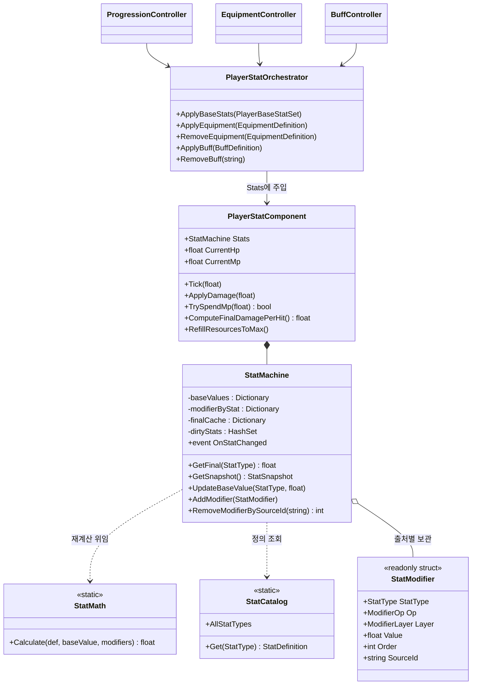
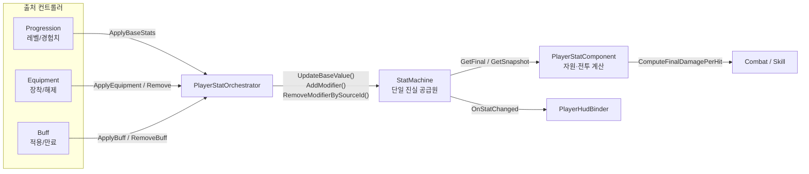
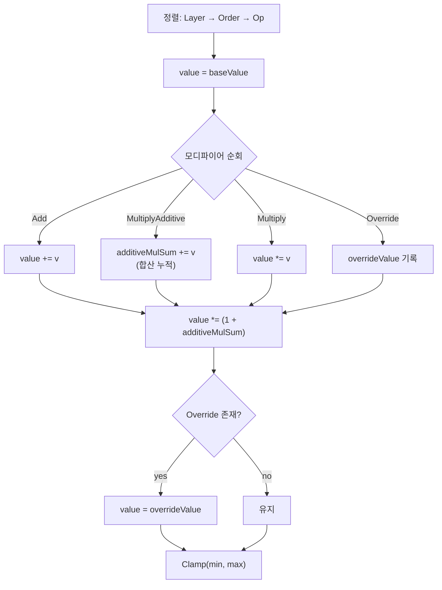
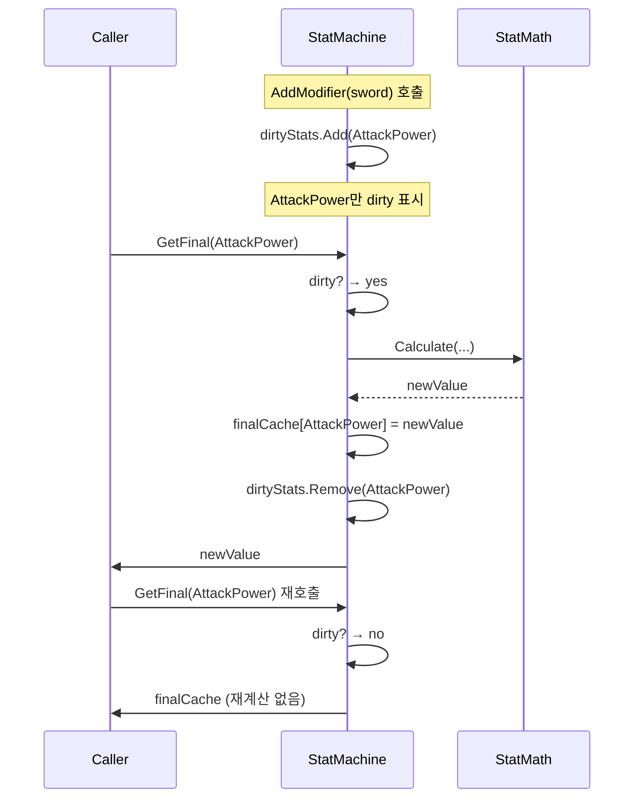

# 02. 스탯 시스템 (Stat System)

> 위치: `Assets/Idle Game/Scripts/Features/Player/Stats` · `Shared`
> 패턴: **단일 진실 공급원(Single Source of Truth)** · **dirty-flag 캐싱** · **출처 기반 모디파이어**
> 진단 리포트: [Stat_시스템_분석_및_리펙터링_안내.md](../Stat_시스템_분석_및_리펙터링_안내.md)

---

## 1. 개요

플레이어의 모든 능력치를 계산하는 시스템입니다. 레벨·장비·버프 등 **여러 출처에서 오는 보정(modifier)**을 하나의 파이프라인으로 합산해 최종 스탯을 산출합니다.

핵심 아이디어는 **"베이스값 + 모디파이어 목록 → 최종값"** 이라는 순수 계산을, 변경된 스탯만 다시 계산하는 캐싱과 결합한 것입니다.

```
최종값 = f(베이스값, [출처별 모디파이어들])
```

장비를 벗으면 그 장비의 모디파이어만 목록에서 제거되고, 관련 스탯만 dirty로 표시되어 재계산됩니다. 나머지는 캐시된 값을 그대로 씁니다.

---

## 2. 요구사항 · 설계 목표

| # | 목표 | 설계적 해석 |
|---|------|-------------|
| G1 | 여러 출처의 보정을 합산 | 모디파이어를 목록으로 누적, 연산 규칙(`ModifierOp`)에 따라 계산 |
| G2 | 출처 단위로 add/remove | 각 모디파이어에 `SourceId`("item:sword", "buff:rage") 태깅 |
| G3 | 매 프레임 전체 재계산 회피 | dirty-flag로 변경된 스탯만 재계산, 나머지 캐시 |
| G4 | 데이터 주도 밸런싱 | 스탯 정의(`StatCatalog`)와 장비/버프 정의(ScriptableObject)를 코드에서 분리 |
| G5 | 최댓값 변동 시 자원 정합성 | MaxHp 감소 시 CurrentHp 클램프 |
| G6 | 계산 로직의 테스트 용이성 | `StatMath`를 순수 정적 함수로 분리 |

---

## 3. 구성 요소

| 계층 | 타입 | 역할 |
|------|------|------|
| **값 정의 (Shared)** | `StatType` (enum) | 스탯 종류 20종 (MaxHp, AttackPower, CritChance …) |
| | `ModifierOp` (enum) | 연산 방식 (Add / MultiplyAdditive / Multiply / Override) |
| | `ModifierLayer` (enum) | 출처 계층 (Base / Equipment / Buff …) — 정렬 키 |
| | `StatModifier` (struct) | **불변** 단일 보정값 (타입·연산·값·출처) |
| | `StatDefinition` (struct) | 스탯의 기본값·최소·최대 |
| **계산 코어** | `StatCatalog` | 모든 `StatDefinition`의 등록소(정적) |
| | `StatMath` | 모디파이어 목록 → 최종값 **순수 계산** |
| | `StatMachine` | 베이스값 + 모디파이어 보관, 캐싱·이벤트 |
| | `StatSnapshot` | 특정 시점 전체 스탯 복사본 |
| **런타임** | `PlayerStatComponent` | HP/MP 자원, 데미지·힐·DPS 계산, 회복 틱 |
| **오케스트레이션** | `PlayerStatOrchestrator` | Definition → Modifier 변환 후 StatMachine에 주입 |

> `StatMachine`(스탯 계산)과 `PlayerStateMachine`(행동 상태)은 **이름만 비슷할 뿐 완전히 다른 시스템**입니다. 혼동 주의.

---

## 4. 구조 다이어그램



---

## 5. 데이터 흐름



**모든 스탯 변경은 오케스트레이터를 거쳐 `StatMachine` 하나로만 흘러갑니다.** 이것이 단일 진실 공급원 원칙이며, "장비 효과가 두 번 적용되는" 류의 버그를 구조적으로 방지합니다. (실제로 과거에 두 개의 독립 적용 경로가 있어 P0 버그가 발생 → 단일 경로로 수정. 진단 리포트 참조.)

---

## 6. 계산 파이프라인 (`StatMath.Calculate`)

모디파이어 목록을 최종값으로 접는 **순수 함수**입니다.



연산 규칙의 의미:

| `ModifierOp` | 의미 | 예 |
|--------------|------|-----|
| `Add` | 절대 가산 | 공격력 +10 |
| `MultiplyAdditive` | **합연산 그룹** — 여러 %를 더한 뒤 한 번에 곱 | +30% & +20% → ×1.5 |
| `Multiply` | 독립 곱연산 | ×2 (개별 적용) |
| `Override` | 강제 지정 — 다른 모든 연산을 무시 | 디버프로 이동속도 0 고정 |

> **설계 노트**: `MultiplyAdditive`를 한 그룹으로 합산하는 것은 "합연산 %는 서로 더해지고, 곱연산은 독립적으로 곱해진다"는 흔한 RPG 스탯 관례를 따른 것입니다. 현재 `ModifierLayer`는 정렬 키로만 쓰이며, 레이어별 그룹 곱연산은 향후 정책 결정 대상입니다(진단 리포트 P1 참조).

---

## 7. dirty-flag 캐싱 메커니즘

`StatMachine`의 성능 최적화 핵심입니다.



- **변경 시**: `MarkDirty`로 해당 스탯만 dirty 집합에 추가.
- **조회 시**: `RecalculateIfDirty`가 dirty일 때만 재계산, 아니면 캐시 반환.
- **값이 실제로 변했을 때만** `OnStatChanged` 이벤트 발화(`NearlyEqual`로 부동소수 비교).
- `StatSnapshot`은 별도 `_snapshotDirty` 플래그로 전체 복사본을 지연 생성.

---

## 8. 자원 관리 (`PlayerStatComponent`)

`StatMachine`이 "능력치의 진실"이라면, `PlayerStatComponent`는 그 위에서 **현재 자원(HP/MP)과 전투 공식**을 다룹니다.

- **회복 틱**: `Tick(dt)`에서 `HpRegen`/`MpRegen`을 반영, MaxHp/MaxMp로 클램프.
- **데미지 감쇄**: `방어력 → 감쇄율` 2단 공식
  ```
  reducedByDefense = incoming × 100 / (100 + max(0, Defense))
  final = reducedByDefense × (1 − DamageReduction)
  ```
- **기대 데미지**: 치명타 기댓값 반영
  ```
  perHit = AttackPower × ((1 − CritChance) + CritChance × CritDamage)
  DPS    = perHit × AttackSpeed
  ```
- **자원 정합성(G5)**: `OnStatChanged` 구독 → MaxHp/MaxMp 감소 시 CurrentHp/Mp를 즉시 클램프.

---

## 9. 핵심 설계 포인트 (SOLID 매핑)

| 원칙 | 적용 지점 |
|------|-----------|
| **SRP** | 계산(`StatMath`)·보관/캐싱(`StatMachine`)·정의(`StatCatalog`)·자원(`PlayerStatComponent`)·주입(`Orchestrator`) 분리 |
| **OCP** | 새 스탯 = `StatType` + `StatCatalog` 등록. 새 장비/버프 = ScriptableObject 에셋 추가. 계산 로직 불변 |
| **LSP** | 모든 모디파이어는 동일한 `StatModifier` 계약으로 다뤄져 출처와 무관하게 합산 |
| **ISP** | HUD는 `OnStatChanged`만, 전투는 `ComputeFinalDamagePerHit`만 의존 |
| **DIP** | 컨트롤러가 `StatMachine`을 직접 만지지 않고 `PlayerStatOrchestrator` 파사드에 의존 |

### 불변 모디파이어 + 출처 태깅 — 이 시스템의 하이라이트

`StatModifier`는 `readonly struct`입니다. 한 번 만들어지면 변하지 않고, 제거는 **값 변경이 아니라 목록에서 삭제**로 처리됩니다. 각 모디파이어의 `SourceId`(`"item:sword01"`, `"buff:rage"`)가 삭제의 키입니다.

```
장착:  AddModifier(sourceId="item:sword01")
해제:  RemoveModifierBySourceId("item:sword01")   // 그 장비 것만 정확히 제거
```

덕분에 "버프가 겹쳤을 때 하나만 빠진다" 같은 상태 오염이 원천 차단됩니다. 단, **저장 태그와 제거 태그의 접두사 규칙이 반드시 일치**해야 하며, 과거 이 불일치로 P0 버그가 있었습니다(진단 리포트 참조).

---

## 10. 엣지 케이스 · 에러 처리

| 상황 | 처리 |
|------|------|
| 미등록 `StatType` 조회 | `StatCatalog.Get`에서 `ArgumentOutOfRangeException` |
| 모디파이어 0개 | `StatMath`가 베이스값을 클램프만 하고 조기 반환 |
| 값 변화 미미(부동소수) | `NearlyEqual`로 이벤트 억제 (불필요한 HUD 갱신 방지) |
| MaxHp 하락 | `HandleStateChanged`가 CurrentHp를 새 상한으로 클램프 |
| MP 부족 시 스킬 | `TrySpendMp`가 `false` 반환(자원 선점 실패) |
| `Override` + 다른 연산 공존 | Override가 최종적으로 모든 값을 덮어씀 |
| 빈/공백 `SourceId` 제거 요청 | 조기 반환(0 제거) |

---

## 11. 확장 여지 (지금 만들지 않되 막지 않을 것)

- **책임 분리** — `PlayerStatComponent`를 `ResourcePool`(자원)과 `CombatCalculator`(전투 공식)로 분할.
- **레이어 그룹 곱연산** — `ModifierLayer`별로 `MultiplyAdditive`를 분리 그룹화(장비 % ≠ 버프 %).
- **변환 일원화** — Definition→Modifier 변환을 팩토리 한 곳으로 수렴.
- **배치 이벤트** — 다수 모디파이어 일괄 적용 시 `BeginBatch/EndBatch`로 이벤트 1회 병합.
- **적 스탯 재사용** — 동일 `StatMachine` 구조를 `EnemyUnit`에 적용.
- **네임스페이스 도입** — 현재 전역 네임스페이스 → `Game.Player.Stats` 등.

---

## 12. 파일 위치

| 구분 | 파일 | 경로 |
|------|------|------|
| 값 정의 | `StatType.cs`, `ModifierOp.cs`, `ModifierLayer.cs` | `Shared/Enums` |
| 값 정의 | `StatModifier.cs`, `StatDefinition.cs` | `Shared/ValueObjects` |
| 코어 | `StatCatalog.cs`, `StatMath.cs`, `StatMachine.cs`, `StatSnapshot.cs` | `Stats/Core` |
| 런타임 | `PlayerStatComponent.cs` | `Stats/Runtime` |
| 오케스트레이션 | `PlayerStatOrchestrator.cs` | `Stats/Orchestration` |
| 리졸버 | `PlayerBaseStatResolver.cs`, `IPlayerBaseStatResolver.cs` | `Stats/Resolution` |
