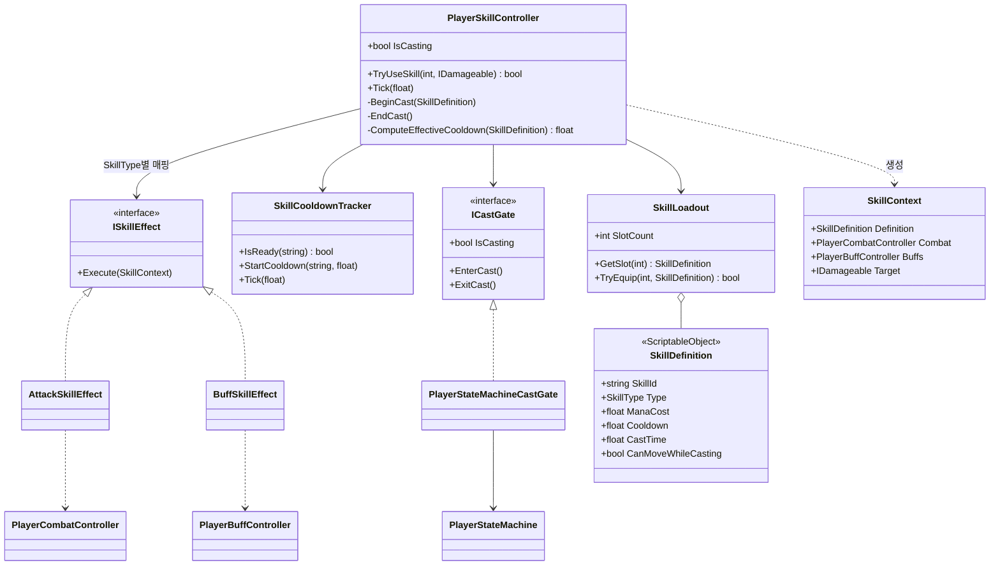
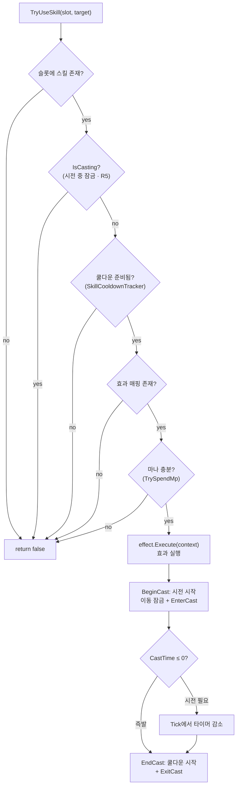
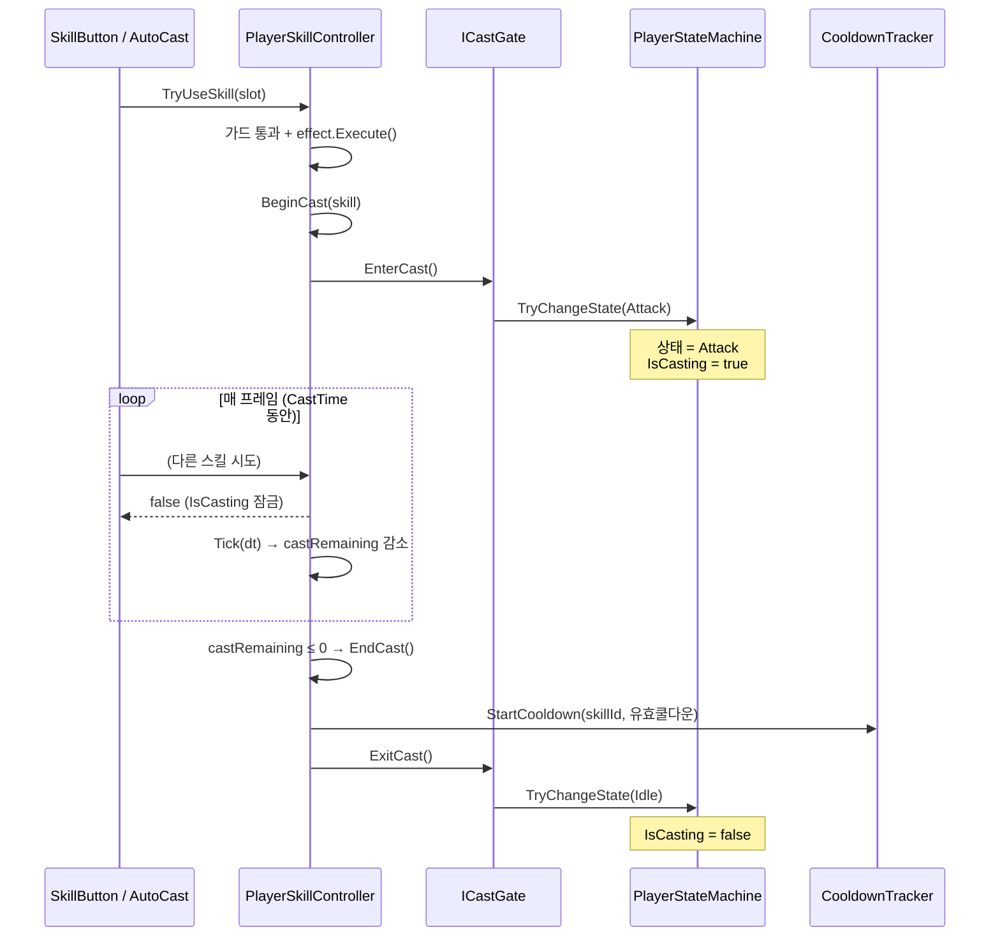
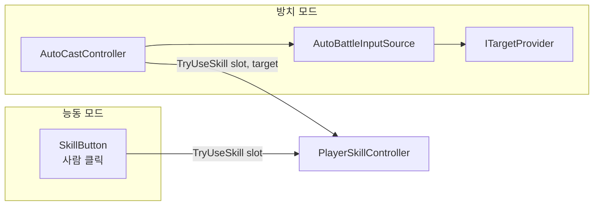

# 03. 스킬 · 전투 시스템 (Skill & Combat System)

> 위치: `Assets/Idle Game/Scripts/Features/Player/Skills` · `Combat`
> 패턴: **Strategy Pattern** · **Adapter Pattern** · **Facade(Orchestrator)**
> 구현 계획서: [Combat_Skill_Plan.md](../Combat_Skill_Plan.md)
> 관련 명세: [01. 상태 머신](./01_State_Machine.md)(시전 잠금), [02. 스탯 시스템](./02_Stat_System.md)(데미지·쿨감·마나)

---

## 1. 개요

플레이어의 모든 능동 행동을 **"스킬"이라는 단일 개념**으로 일반화한 시스템입니다. 기본 공격조차 스킬의 한 종류(`SkillType.Attack`)로 취급합니다.

핵심 책임 네 가지:

1. **편성** — 6개 슬롯에 어떤 스킬을 들고 있는가 (`SkillLoadout`).
2. **판정** — 지금 이 스킬을 쓸 수 있는가 (마나·쿨다운·시전 중 잠금).
3. **효과** — 이 스킬이 무엇을 하는가 (공격/버프 — Strategy).
4. **잠금** — 시전 중에는 다른 스킬을 막는다 (상태 머신 연동).

이 네 책임을 각각 다른 클래스로 분리하고, `PlayerSkillController`가 **오케스트레이터**로서 순서만 조율합니다.

---

## 2. 요구사항 · 설계 목표

| # | 요구사항 | 설계적 해석 |
|---|----------|-------------|
| R1 | 공격은 스킬로 작동 | 공격은 `AttackSkillEffect` 하나. 모든 행동을 스킬로 일반화 |
| R2 | 스킬 6개까지 저장 | 고정 크기 6 슬롯 `SkillLoadout` |
| R3 | 기본 공격 1 + 자유 5 | 슬롯 0 = 기본 공격(교체 불가), 1~5 = 자유 편성 |
| R4 | 버튼 클릭으로 발동 | UI → `TryUseSkill(slot)` 단방향 호출 |
| R5 | **시전 중 다른 스킬 불가** | "시전 중" = 상태 머신의 배타 상태(`ICastGate`) |
| R6 | 방치/능동 공용 | 버튼(사람)이든 `AutoCastController`(AI)든 같은 진입점 호출 |

### R5의 두 계층 — 반드시 구분

"다른 스킬을 못 쓴다"는 상황은 두 가지이며, **서로 다른 메커니즘**으로 구현됩니다.

| 계층 | 의미 | 구현 |
|------|------|------|
| **시전 중 잠금 (Global Lock)** | 시전이 끝날 때까지 *어떤* 스킬도 불가 | `ICastGate` → 상태 머신 Attack 상태 |
| **개별 쿨다운 (Per-skill CD)** | 시전 후에도 *그 스킬만* 일정 시간 불가 | `SkillCooldownTracker` (스킬별 타이머) |

---

## 3. 구성 요소

| 계층 | 타입 | 역할 |
|------|------|------|
| **데이터** | `SkillDefinition` (SO) | 스킬 1개의 불변 설계도(마나·쿨다운·시전시간·효과 파라미터) |
| | `SkillType` (enum) | Attack / Buff (확장: Debuff/Summon…) |
| **편성** | `SkillLoadout` | 6슬롯 관리, 슬롯 0 고정 규칙 |
| **재사용 규칙** | `SkillCooldownTracker` | 스킬별 남은 쿨다운 추적(순수 C#) |
| **효과(전략)** | `ISkillEffect` | "무엇을 하는가" 전략 인터페이스 |
| | `AttackSkillEffect` | 데미지 계산 → 타겟에 적용 |
| | `BuffSkillEffect` | `BuffController.Apply`에 위임 |
| | `SkillContext` | 효과 실행에 필요한 참조 묶음(값 객체) |
| **잠금(어댑터)** | `ICastGate` | 시전 중 잠금 판정 추상 |
| | `PlayerStateMachineCastGate` | 상태 머신을 잠금 장치로 어댑팅 |
| **지휘자** | `PlayerSkillController` | 판정 순서·시전 타이머 조율(오케스트레이터) |
| **전투 진입점** | `PlayerCombatController` | 스탯 → 기대 데미지/DPS 파사드 |
| **대상** | `IDamageable` | 데미지를 받을 수 있는 대상 추상 |
| **자동화** | `AutoCastController` | 방치 모드에서 자동으로 `TryUseSkill` 호출 |

---

## 4. 구조 다이어그램



- `PlayerSkillController`는 구체 효과가 아니라 `Dictionary<SkillType, ISkillEffect>`를 통해 **추상에만 의존**합니다.
- `PlayerStateMachineCastGate`는 스킬 시스템과 상태 머신을 잇는 **어댑터**입니다. 스킬 컨트롤러는 상태 머신을 직접 알지 못하고 `ICastGate`만 봅니다.

---

## 5. 스킬 사용 판정 흐름 (`TryUseSkill`)

가드 절(guard clause)을 순서대로 통과해야만 발동합니다. 하나라도 실패하면 즉시 `false`.



> **판정 순서가 곧 정책**입니다. 마나 소비(`TrySpendMp`)를 마지막에 두어, 앞선 가드에서 실패하면 마나를 소비하지 않습니다. 순서를 바꾸면 "실패했는데 마나만 빠지는" 버그가 생깁니다.

---

## 6. 시전 생명주기 (Cast Lifecycle)



**핵심: 시전 중 잠금의 진실(source of truth)은 상태 머신 하나입니다.** `IsCasting`은 `_castGate.IsCasting`을 그대로 반환하고, `ICastGate`는 상태 머신의 현재 상태가 Attack인지를 읽습니다. 스킬 컨트롤러가 별도 bool 플래그를 두지 않으므로 **"이중 진실"로 인한 불일치가 없습니다.**

---

## 7. 유효 쿨다운 계산 — 스탯 시스템 연동

쿨다운은 고정값이 아니라 스탯(`CooldownReduction`)을 반영합니다.

```
유효쿨다운 = skill.Cooldown × (1 − clamp01(CooldownReduction))
```

이 값으로 `SkillCooldownTracker.StartCooldown`을 호출합니다. 즉 스탯 시스템(명세서 02)의 변경이 전투 템포에 자동 반영됩니다. 마찬가지로 데미지도 `PlayerCombatController.GetExpectedDamagePerHit()`(= 스탯 기반 치명타 기댓값) × `DamageMultiplier`로 계산됩니다.

---

## 8. 방치 ↔ 능동 모드 통합 (R6)

같은 `TryUseSkill` 진입점을 **두 호출자**가 공유합니다.



- **능동**: `SkillButton.onClick` → `TryUseSkill(slot)`. 사람이 타이밍을 판단.
- **방치**: `AutoCastController.Tick`이 매 프레임 발동 가능한 스킬을 스스로 `TryUseSkill`. 대상은 `ITargetProvider`(최근접 적)가 선택.

컨트롤러 입장에서는 **누가 부르는지 몰라도 됩니다.** 이것이 명세서 01의 "제어 주체 추상화"가 전투 계층까지 관통하는 지점입니다.

---

## 9. 핵심 설계 포인트 (SOLID 매핑)

| 원칙 | 적용 지점 |
|------|-----------|
| **SRP** | 데이터·편성·쿨다운·효과·잠금·조율을 각각 다른 클래스로 분리 |
| **OCP** | 새 스킬 종류 = `ISkillEffect` 구현 추가 + 딕셔너리 등록. 컨트롤러 판정 로직 불변 |
| **LSP** | 모든 `ISkillEffect`는 `Execute(context)` 계약을 지켜 상호 대체 |
| **ISP** | UI는 `TryUseSkill`만, 효과는 `Execute`만, 잠금은 `ICastGate`만 의존. 뚱뚱한 인터페이스 없음 |
| **DIP** | 컨트롤러가 상태 머신·구체 효과가 아니라 `ICastGate`/`ISkillEffect` 추상에 의존 |

### Strategy + Adapter 조합 — 이 시스템의 하이라이트

- **Strategy(`ISkillEffect`)**: "무엇을 하는가"를 캡슐화. `SkillType`으로 전략을 선택하므로, 슬롯에 어떤 스킬이 들어와도 타입만 보고 올바른 효과를 실행합니다. 소환/디버프 스킬 추가 시 컨트롤러는 건드리지 않습니다.
- **Adapter(`PlayerStateMachineCastGate`)**: 상태 머신은 원래 "행동 상태"를 위한 것이지 "스킬 잠금"을 위한 것이 아닙니다. 어댑터가 그 간극을 메워, 스킬 시스템은 상태 머신의 존재를 모른 채 `ICastGate`라는 자기 언어로만 대화합니다. 나중에 잠금 방식을 바꿔도(예: 타이머 기반) 어댑터만 교체하면 됩니다.

---

## 10. 엣지 케이스 · 에러 처리

| 상황 | 처리 |
|------|------|
| 슬롯 범위 밖(0~5 외) | `GetSlot`이 `null` 반환 → `TryUseSkill` false |
| 빈 슬롯 클릭 | `null` → false (무시) |
| 슬롯 0 교체 시도 | `TryEquip`이 false (기본 공격 고정) |
| 시전 중 재시도 | `IsCasting` 가드 → false (R5) |
| 쿨다운 중 | `IsReady` false |
| 마나 부족 | `TrySpendMp` false (효과 실행 전 차단) |
| `CastTime == 0` (즉발) | `BeginCast`가 즉시 `EndCast` 호출 |
| `LinkedBuff == null`인 버프 스킬 | `BuffSkillEffect`가 조기 반환 |
| 공격 대상 없음(`target == null`) | 로그만 출력(방치 타겟팅 연결 전 임시) |
| 쿨다운 Tick 중 컬렉션 수정 | `ListPool`로 키 스냅샷 후 순회(안전) |

---

## 11. 확장 여지 (지금 만들지 않되 막지 않을 것)

- **능동 타겟팅** — 능동 공격 버튼이 실제 적을 때리도록 `target` 주입.
- **시전 취소** — Hit/Dead 전이 시 `CancelCast`로 잠금 해제("좀비 시전" 방지, 명세서 01 연동).
- **편성 데이터 분리** — 슬롯 편성을 `SkillLoadoutConfig` ScriptableObject로 추출(프리셋·세이브 기반, 계획서 12장).
- **새 효과** — `DebuffSkillEffect`, `SummonSkillEffect`, 차지/콤보 스킬.
- **글로벌 쿨다운(GCD)** — 개별 쿨다운과 분리한 공용 쿨다운 튜닝.
- **투사체/사거리** — `Range`·`ProjectileCount` 스탯을 소비하는 타겟팅 컴포넌트.

---

## 12. 파일 위치

| 구분 | 파일 | 경로 |
|------|------|------|
| 데이터 | `SkillDefinition.cs` | `Data/Definitions` |
| 데이터 | `SkillType.cs` | `Shared/Enums` |
| 편성 | `SkillLoadout.cs` | `Skills/Core` |
| 컨텍스트 | `SkillContext.cs` | `Skills/Core` |
| 쿨다운 | `SkillCooldownTracker.cs` | `Skills` |
| 효과 계약 | `ISkillEffect.cs`, `IDamageable.cs`, `ITickable.cs` | `Skills/Contracts` |
| 효과 구현 | `AttackSkillEffect.cs`, `BuffSkillEffect.cs` | `Skills/Effects` |
| 잠금 계약 | `ICastGate.cs` | `Skills/Contracts` |
| 잠금 어댑터 | `PlayerStateMachineCastGate.cs` | `Skills/Adapters` |
| 지휘자 | `PlayerSkillController.cs` | `Skills` |
| 자동화 | `AutoCastController.cs` | `Skills` |
| 전투 진입점 | `PlayerCombatController.cs` | `Combat` |
