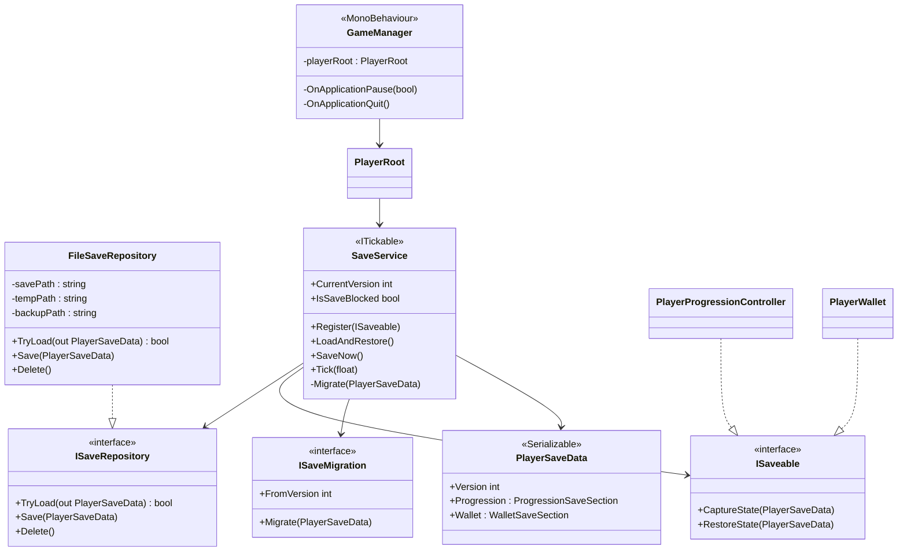
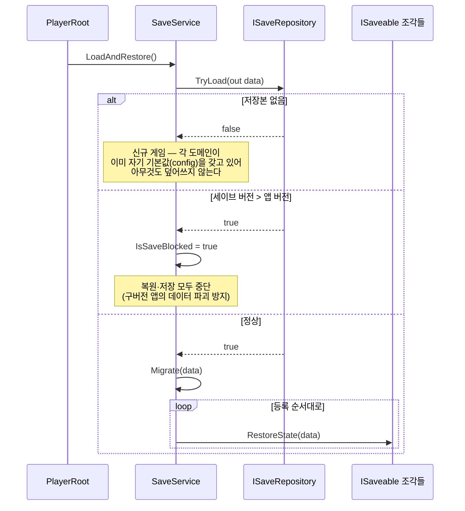
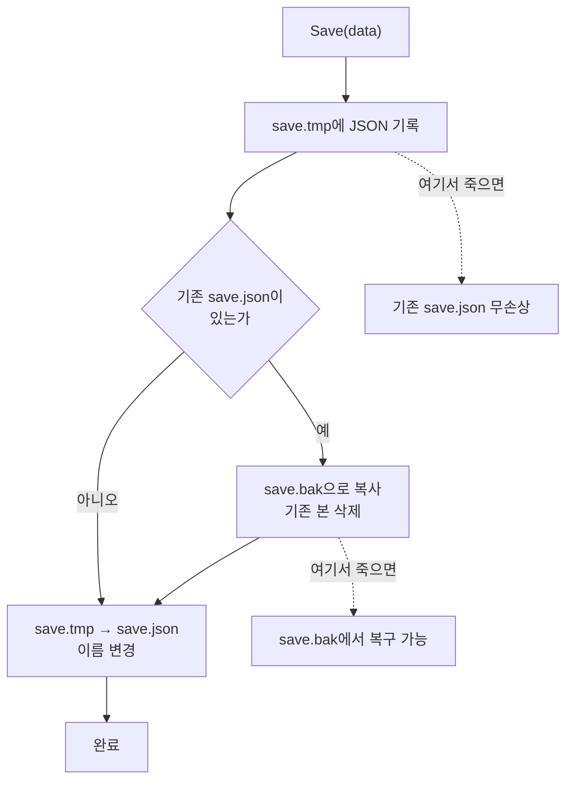
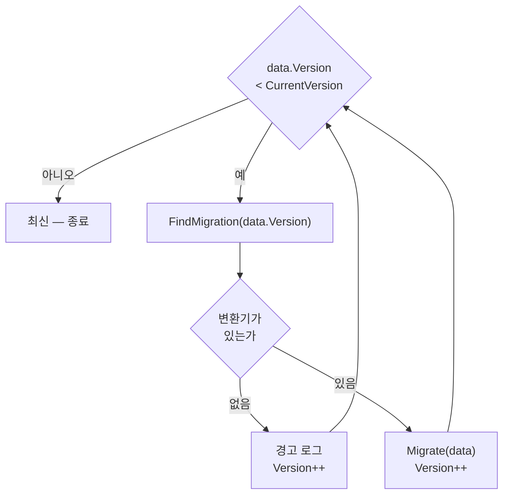

# 세이브·로드 시스템

> **종류**: 아키텍처 명세 (as-built) · **상태**: 구현 완료 — 런타임 검증(10분 방치 DoD) 대기
> **최종 갱신**: 2026-08-23 · **관련 기획서**: [content-roadmap.md](../../gdd/content-roadmap.md) §5.2 (M0 ④·⑤)
> **관련 계획서**: [player-data-management-plan.md](../../design/player-data-management-plan.md) (영속화 정본) · [m0-close-the-loop-plan.md](../../design/m0-close-the-loop-plan.md) §6.3
> **관련 명세**: [progression.md](../player/progression.md) · [player/README.md](../player/README.md)

---

## 1. 개요·목적

앱을 껐다 켜도 플레이어의 성장이 남아 있게 한다. 성장 루프의 마지막 링크로, 이것이 없으면 **성장이 휘발되어 성장을 설계할 수 없다**([content-roadmap.md](../../gdd/content-roadmap.md) §5.2).

핵심 설계 판단은 셋이다.

1. **원인을 저장하고 결과는 재계산한다.** 최종 공격력 517을 저장하지 않고 "레벨 12"를 저장한 뒤, 로드 시 `PlayerLevelTable`로 스탯을 다시 산출한다. 밸런스 패치로 성장 곡선이 바뀌면 기존 세이브도 **로드 즉시 새 곡선을 따른다.**
2. **각 도메인이 자기 섹션만 안다.** `SaveService`는 무엇이 저장되는지 모르고, 등록된 `ISaveable` 조각들을 순회할 뿐이다. 저장 대상이 늘어도 서비스는 수정되지 않는다.
3. **저장 매체는 계약 뒤에 숨는다.** 어떤 컨트롤러도 파일 경로·JSON·`persistentDataPath`를 알지 못한다. 서버 저장으로 확장할 때 호출부가 한 줄도 바뀌지 않는다([server-application-plan.md](../../design/server-application-plan.md)).

## 2. 범위(Scope)

| 구분 | 내용 |
|------|------|
| **포함** | `ISaveRepository` 계약 · `FileSaveRepository`(JSON + 원자적 쓰기 + 백업 복구) · `SaveService`(수집·복원 조율, 주기 저장, 버전 가드) · `ISaveable` 조각 계약 · `ISaveMigration` 계약(등록 0개 pass-through) · `PlayerSaveData` + `Progression`·`Wallet` 섹션 · `GameManager`의 생명주기 저장 훅 |
| **미포함(Out of scope)** | `WorldSaveSection`(오프라인 보상 기준 시각, M1) · 인벤토리·장비 섹션(M1) · 세이브 암호화·변조 방지 · 서버 저장 · 클라우드 동기화 · 다중 세이브 슬롯 |

**암호화를 넣지 않은 이유**: 현재 저장 대상은 로컬 싱글 진행도뿐이고, 변조로 이득을 보는 상대가 자기 자신이다. 서버 권위가 도입되면([server-application-plan.md](../../design/server-application-plan.md)) **검증 주체가 서버로 옮겨가므로**, 지금 클라이언트 암호화에 투자하면 그 작업은 통째로 버려진다.

## 3. 요구사항 → 설계 해석

| 요구사항 | 설계적 해석 |
|----------|-------------|
| 껐다 켜도 진행이 남는다 | `PlayerSaveData`를 섹션 구조로 저장. 저장 시점은 주기(기본 60초) + 앱 일시정지 + 종료 |
| 저장 도중 앱이 죽어도 세이브가 살아남는다 | `save.tmp` 기록 → 기존 본을 `save.bak`으로 백업 → `tmp`를 본으로 rename. **덮어쓰기 대신 이름 변경**이라 중간 상태가 없다 |
| 세이브가 깨져도 앱이 죽지 않는다 | `TryLoad`가 예외를 던지지 않는다. 본 → 백업 → 신규 게임 순으로 폴백 |
| 밸런스 패치가 기존 세이브에도 반영된다 | 레벨만 저장하고 스탯은 재계산(§5.3) |
| 앱 업데이트로 스키마가 바뀌어도 구버전 세이브를 읽는다 | `ISaveMigration`이 인접 버전 변환만 담당하고 `SaveService`가 연쇄 적용(§5.4) |
| 구버전 앱이 신버전 세이브를 파괴하지 않는다 | 세이브 버전 > 앱 버전이면 **복원과 저장을 모두 중단**(`IsSaveBlocked`) |
| 모바일 I/O가 감당할 수 있다 | 매 프레임 저장 금지. 저장이 일어난 시점에 타이머를 되감는다 |

## 4. 시스템 구조

| 구성요소 | 책임 | 알지 못하는 것 |
|---------|------|---------------|
| `SaveService` | 로드/신규 분기, 조각 수집·복원, 주기 저장, 버전 가드 | 파일·JSON·저장 경로, 무엇이 저장되는지 |
| `FileSaveRepository` | 직렬화, 원자적 쓰기, 백업 복구 | 누가 무엇을 왜 저장하는지 |
| `ISaveable` 구현 | 자기 섹션의 기록·복원 | 다른 도메인의 섹션, 저장 시점 |
| `GameManager` | 저장 **시점**(백그라운드·종료) | 무엇을 어떻게 저장하는지 |

## 5. 상세 로직

### 5.1 로드 — 신규/복원 분기

**"저장본 없음"을 예외로 다루지 않는 이유**: 첫 실행은 모든 유저가 반드시 거치는 정상 경로다. 예외로 만들면 신규 유저마다 에러 로그가 쌓이고, 진짜 장애와 구분되지 않는다.

### 5.2 저장 — 원자적 쓰기

**그냥 덮어쓰지 않는 이유**: `File.WriteAllText`로 기존 파일을 직접 덮어쓰면, 쓰기 도중 전원이 끊길 때 파일이 **잘린 상태**로 남는다. 그 시점의 세이브는 복구 불가능한 쓰레기가 된다. 임시 파일에 완성본을 만든 뒤 rename하면 파일 시스템 수준에서 중간 상태가 존재하지 않는다.

`save.bak`은 rename 직전의 짧은 공백 구간을 메운다. 최신 세션분은 잃더라도 **진행 전체를 잃지는 않는다.**

### 5.3 복원 — 원인만 저장하고 결과는 재계산

| 저장하는 것(원인) | 저장하지 않는 것(결과) | 이유 |
|---|---|---|
| `Level`, `Exp`, `PromotionTier` | `MaxHp`, `AttackPower` 등 베이스 스탯 | 밸런스 패치가 기존 세이브에도 즉시 반영된다 |
| 통화별 `(CurrencyId, Amount)` | 골드 표시 문자열 | 표기 규칙(`NumberFormatter`)이 바뀌어도 데이터는 불변 |

`PlayerProgressionController.RestoreState`는 레벨·경험치를 넣은 뒤 `RefreshBaseStats()`로 **테이블을 다시 조회**한다. 만약 최종 스탯을 저장했다면, 레벨 50의 공격력을 하향 조정해도 기존 유저는 영원히 옛 수치를 들고 다니게 된다.

### 5.4 마이그레이션 — 인접 단계의 연쇄

변환기는 **한 칸씩만**(N → N+1) 만든다. v1 세이브를 v4로 올리는 것은 세 변환기를 순서대로 통과시키는 일이다. 직행 변환기를 두면 버전 N개에 **N²/2개**가 필요하지만 단계적 방식은 **N-1개**로 끝난다. 새 버전이 생겨도 구현을 하나 추가할 뿐 기존 것은 수정되지 않는다(OCP).

**변환기를 못 찾아도 `Version++`를 실행하는 이유**: 등록 누락 시 `while` 조건이 영원히 참으로 남아 **로딩 화면에서 앱이 멈춘다.** 개발자의 등록 실수가 유저 앱을 정지시키지 않도록, 예외 대신 경고 + 강제 진행으로 처리한다.

### 5.5 저장 시점

| 시점 | 주체 | 비고 |
|------|------|------|
| 주기(기본 60초) | `SaveService.Tick` — `PlayerRoot`의 틱 순회에 얹힘 | 간격은 인스펙터(`PlayerRoot.autoSaveInterval`)에서 조정 |
| 앱 백그라운드 진입 | `GameManager.OnApplicationPause(true)` | **모바일의 실질적인 마지막 기회** |
| 앱 종료 | `GameManager.OnApplicationQuit` | 모바일에서 호출이 보장되지 않아 **유일 의존 금지** |

저장이 실제로 일어난 지점(`SaveNow`)에서 타이머를 되감는다. `Tick`이 아니라 `SaveNow`에서 리셋하는 이유는, 앱 일시정지로 방금 저장했는데도 타이머가 계속 흘러 복귀 직후 불필요한 저장이 한 번 더 일어나는 것을 막기 위해서다.

### 5.6 엣지 케이스

| 상황 | 처리 |
|------|------|
| 세이브 파일 없음 | 신규 게임으로 시작(예외 아님) |
| 본 파일 손상 | `save.bak` 복구 시도 → 실패 시 경고 후 신규 게임 폴백 |
| 저장된 레벨 > `MaxLevel` | `MaxLevel`로 클램프(밸런스 패치로 상한이 내려간 경우) |
| 저장된 경험치·전직 차수가 음수 | 0으로 클램프 |
| `Wallet` 섹션 없음(구버전) | 잔액 0으로 시작 |
| 세이브 버전 > 앱 버전 | `IsSaveBlocked` — 복원·저장 모두 중단 |
| 변환기 없는 구버전 | 경고 후 버전만 올려 통과(무한 루프 방지) |
| 저장 실패(디스크 가득 등) | 에러 로그만 남기고 계속. 다음 주기에 재시도 |
| 조립 실패로 서비스 없음 | `PlayerRoot.SaveNow()`가 조용히 무시 |

## 6. 인터페이스·의존성(경계)

| 계약 | 시그니처 | 구현 |
|------|----------|------|
| `ISaveRepository` | `bool TryLoad(out PlayerSaveData)` / `void Save(PlayerSaveData)` / `void Delete()` | `FileSaveRepository` |
| `ISaveable` | `void CaptureState(PlayerSaveData)` / `void RestoreState(PlayerSaveData)` | `PlayerProgressionController` · `PlayerWallet` |
| `ISaveMigration` | `int FromVersion` / `void Migrate(PlayerSaveData)` | **등록 0개**(계약만 확정) |
| `ITickable` | `void Tick(float)` | `SaveService`(주기 저장) |

**`ISaveable`을 도메인마다 두는 이유(SRP·OCP)**: 하나의 거대한 `SaveManager`가 모든 도메인의 내부를 읽어 DTO를 채우면, 새 저장 대상이 생길 때마다 그 클래스가 수정되고 모든 도메인의 내부 구조에 의존하게 된다. 조각 자치 구조에서는 `SaveService`가 인터페이스만 알고, 새 시스템은 **구현 후 등록만** 하면 된다.

## 7. 설계 포인트 (SOLID 매핑)

| 원칙 | 적용 |
|------|------|
| **SRP** | `SaveService`는 "언제·누구를" 조율만, `FileSaveRepository`는 "어떻게 기록"만, 각 `ISaveable`은 "자기 섹션"만 |
| **OCP** | 저장 대상 추가 = `ISaveable` 구현 + `Register` 한 줄. 스키마 버전 추가 = `ISaveMigration` 구현 하나. `SaveService`는 어느 쪽에도 수정되지 않는다 |
| **LSP** | `ISaveRepository`를 파일 → 서버로 교체해도 `SaveService`는 동일하게 동작한다 |
| **ISP** | 저장 대상은 `CaptureState`/`RestoreState` 둘만 안다. 마이그레이션·리포지토리 계약을 알 필요가 없다 |
| **DIP** | `SaveService`가 추상(`ISaveRepository`)에 의존해, 테스트에서 메모리 대역으로 교체된다(§9) |

**`SaveService`가 MonoBehaviour가 아닌 이유**: `ITickable`로 두면 `PlayerRoot`의 기존 틱 순회에 얹히므로, 주기 저장을 추가하면서 `Update()`를 한 줄도 수정하지 않는다(OCP). 부수적으로 순수 C#이라 EditMode 테스트에서 그대로 생성된다.

## 8. Unity 특화

| 항목 | 설계 |
|------|------|
| **저장 경로** | `Application.persistentDataPath`. `PlayerRoot`가 조립 시점에 주입하므로 `FileSaveRepository` 자신은 Unity 경로 규칙을 모른다 |
| **직렬화** | `JsonUtility`. M0 범위에는 딕셔너리·다형성이 없어 충분하다. 교체가 필요해지면(인벤토리 단계) **이 클래스만** 고친다 |
| **딕셔너리 회피** | `WalletSaveSection`이 `Dictionary`가 아닌 `List<CurrencyEntry>`인 이유 — `JsonUtility`가 딕셔너리를 직렬화하지 못한다 |
| **금액 타입** | `long`. 방치형 인플레이션에서 `int`(약 21억)는 중후반에 넘친다 |
| **생명주기** | `OnApplicationPause(true)`가 모바일의 실질적 마지막 기회. `OnApplicationQuit`은 OS가 백그라운드 앱을 임의로 죽이므로 보장되지 않는다 |
| **성능 예산** | 주기 저장은 기본 60초 1회. JSON 직렬화가 GC를 유발하므로 간격을 5초 미만으로 두지 않는다(`[Min(5f)]`) |
| **초기화 순서** | `Compose`(조립) → `Initialize`에서 `progression.Initialize()` → **`LoadAndRestore()`** → 장비 → 버프 → 자원 리필. 복원이 바꾸는 것은 베이스(레벨)이므로 장비·버프 적용보다 반드시 먼저다 |

## 9. 테스트 케이스

EditMode 테스트는 `Assets/Idle Game/Tests/Editor/SaveSystemTests.cs`에 있다.

| 구분 | 검증 |
|------|------|
| **왕복** | 레벨·경험치·전직 차수·골드(`long` 정밀도 포함)가 그대로 돌아온다 |
| **왕복(도메인 경유)** | 실제 컨트롤러·지갑이 채운 섹션이 신규 인스턴스에 복원된다 |
| **재계산** | 복원 후 베이스 스탯이 저장값이 아니라 `PlayerLevelTable` 산출값과 일치한다 |
| **손상** | 깨진 JSON에 예외를 던지지 않고 실패를 반환한다 |
| **백업 복구** | 본 파일만 손상되면 `save.bak`에서 직전 상태를 되살린다 |
| **없음** | 저장본이 없으면 복원을 시도하지 않는다(신규 게임) |
| **수집** | 등록된 모든 조각이 한 번씩 수집된다. 중복 등록은 1회로 접힌다 |
| **주기 저장** | 간격 전에는 저장하지 않고, **저장 직후 타이머가 리셋되어 매 프레임 저장하지 않는다** |
| **버전 가드** | 앱보다 높은 버전이면 복원·저장을 모두 거부한다 |
| **마이그레이션** | 등록된 변환기가 적용된다. 변환기가 없어도 무한 루프에 빠지지 않는다 |

저장 **정책** 검증에는 파일을 쓰지 않고 메모리 대역(`FakeSaveRepository`)을 쓴다. `ISaveRepository`가 추상이라 가능한 교체이며, 이것이 DIP의 실익이다.

## 10. 리스크·미결정(TBD)

| 항목 | 내용 |
|------|------|
| **런타임 검증 미완** | 10분 방치 DoD(리스폰 → 누적 → 레벨업 → 재기동 후 유지)를 아직 실측하지 않았다 |
| **씬 배선 미완** | `GameManager`가 `Dev/SampleScene`에 배치되지 않아, 현재는 주기 저장만 동작하고 종료 시점 저장이 걸리지 않는다 |
| **재화 식별자 타입** | `CurrencyId`가 문자열(`"gold"`)이다. 통화가 늘면 enum + 커스텀 직렬화로 옮길지 미정(정본 §11) |
| **변조 방지** | 로컬 JSON은 평문이라 수정이 자유롭다. 서버 권위 도입 시 해소 |
| **다중 슬롯** | 파일명이 `save.json` 고정. 슬롯이 필요해지면 `FileSaveRepository` 생성자 인자로 확장 |

## 11. 확장 여지 (지금 만들지 않되 막지 않을 것)

- **오프라인 보상(M1)**: `WorldSaveSection.LastSaveUtcTicks`를 섹션으로 추가하고 `ISaveable` 구현 하나를 등록한다. `SaveService`·`FileSaveRepository`는 무관하다.
- **인벤토리(M1)**: 섹션 DTO 추가 + `InventoryController`가 `ISaveable` 구현. 이때 `JsonUtility`의 다형성 한계에 부딪히면 `FileSaveRepository`만 다른 직렬화기로 교체한다.
- **서버 저장**: `ServerSaveRepository`가 `ISaveRepository`를 구현하고 `PlayerRoot`의 주입 한 줄을 바꾼다. 도메인 코드는 서버의 존재를 모른다.
- **스키마 버전 2**: `ISaveMigration` 구현 하나를 만들어 `SaveService` 생성자에 넘긴다. 호출 지점은 이미 심겨 있다.

## 12. 파일 위치

| 구분 | 파일 | 경로 |
|------|------|------|
| 계약 | `ISaveRepository` · `ISaveable` | `Scripts/Core/Save/` |
| 구현 | `FileSaveRepository` · `SaveService` | `Scripts/Core/Save/` |
| 마이그레이션 | `ISaveMigration` | `Scripts/Core/Save/Migration/` |
| 모델 | `PlayerSaveData`(+`ProgressionSaveSection`·`WalletSaveSection`·`CurrencyEntry`) | `Scripts/Core/Save/Model/` |
| 생명주기 | `GameManager` | `Scripts/Core/Game/` |
| 조립 | `PlayerRoot`(주입·등록·`SaveNow`) | `Scripts/Features/Player/Composition/` |
| 저장 대상 | `PlayerProgressionController` · `PlayerWallet` | `Scripts/Features/Player/Progression/` · `Wallet/` |
| 테스트 | `SaveSystemTests` | `Tests/Editor/` |
