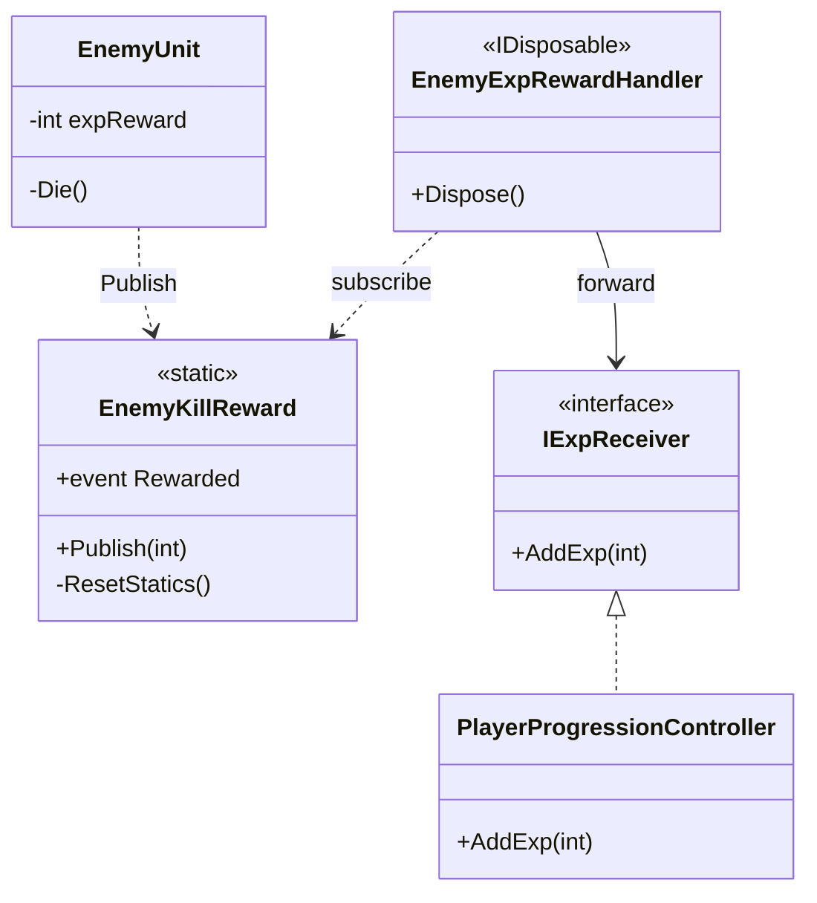
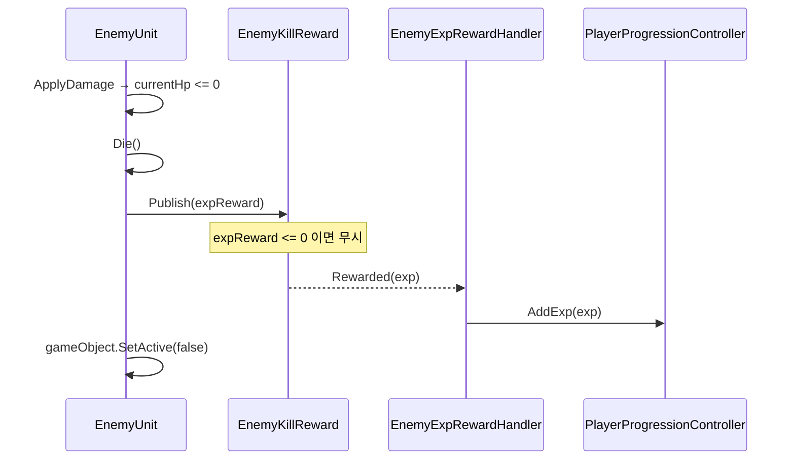
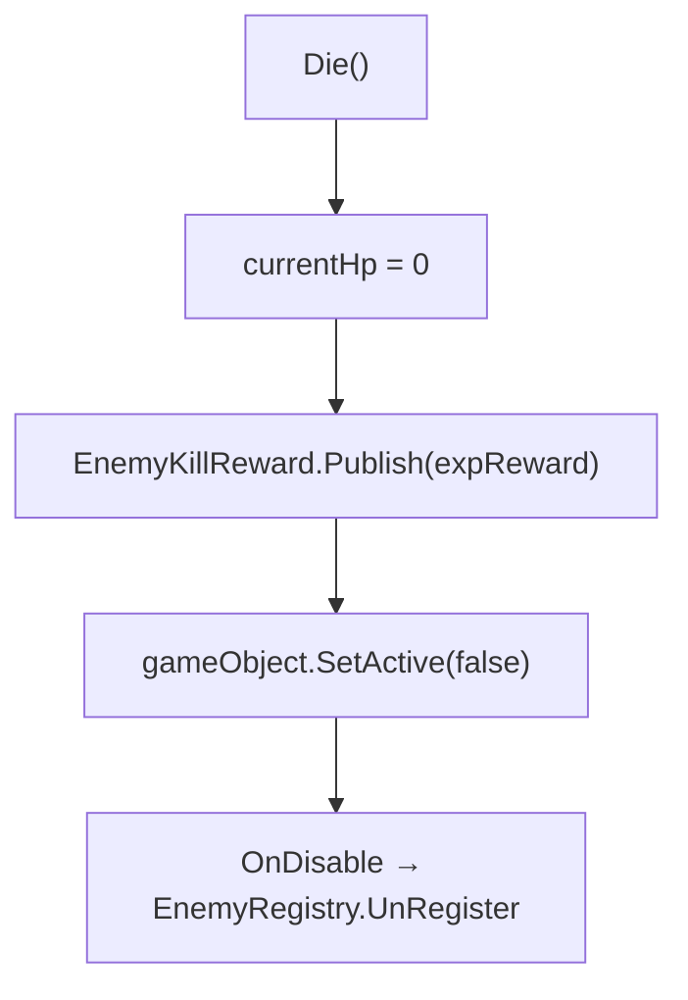
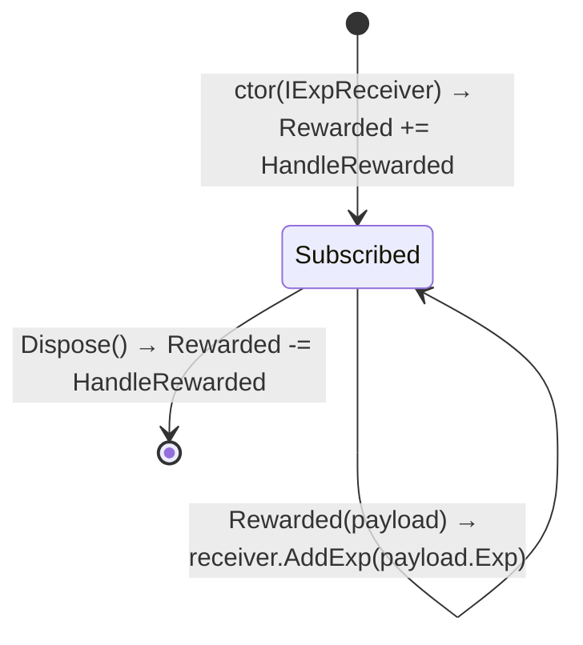

# 적 처치 경험치 보상 (Kill Exp Reward)

> **종류**: 아키텍처 명세 (as-built) · **상태**: 완료
> **최종 갱신**: 2026-08-23 · **관련 기획서**: 해당 없음
>
> **2026-07-26 계약 변경**: 허브가 `Publish(int exp)` → **`Publish(in KillRewardPayload)`** 로 전환됐고, 이벤트는 `Action<int>` → **`Action<KillRewardPayload>`** 다. 골드가 같은 허브를 타면서 보상 종류가 늘어도 발행 시그니처가 안 바뀌도록 페이로드로 감쌌다(OCP). 현행 계약은 §6.3·§7에 반영했다. 다만 이 문서는 **경험치 배선의 as-built**이므로 §4·§5의 다이어그램은 경험치 경로만 그린다(골드 브리지는 같은 허브에 대칭으로 붙는다). 골드 축 전체는 [m0-close-the-loop-plan.md](../../design/m0-close-the-loop-plan.md) §0 참조.
> **관련 명세**: [progression.md](../player/progression.md) · [combat.md](../player/combat.md) · **설계 근거**: [enemy-kill-exp-reward-plan.md](../../design/enemy-kill-exp-reward-plan.md)

---

## 1. 개요·목적

적을 처치하면 플레이어가 경험치를 얻는 **보상 배선**이다. 방치형 핵심 루프(적 처치 → 경험치 → 레벨업)의 첫 링크를 잇는다. 적(`EnemyUnit`)은 처치 보상을 **발행만** 하고 누가 받는지 모르며, 순수 C# 브리지(`EnemyExpRewardHandler`)가 이를 성장 시스템의 수신 계약(`IExpReceiver`)으로 전달한다.

핵심 판단은 **"보상 발행"과 "경험치 수신"의 결합 분리**다. 적 도메인과 성장 도메인이 서로를 직접 참조하면 [[combat]]의 `IDamageable` DIP 원칙이 깨진다. 그래서 그 사이에 정적 이벤트 허브(`EnemyKillReward`)와 브리지 어댑터를 두어 두 도메인의 상호 무지를 유지한다.

## 2. 범위(Scope)

| 구분 | 내용 |
|------|------|
| **포함** | 처치 보상 이벤트 허브(`EnemyKillReward`), 경험치 수신 계약(`IExpReceiver`), 브리지 어댑터(`EnemyExpRewardHandler`), `EnemyUnit`의 `expReward` 필드와 `Die()` 발행, `PlayerProgressionController`의 `IExpReceiver` 구현, `PlayerRoot`의 브리지 생성·Dispose 배선 |
| **미포함(Out of scope)** | 경험치 **획득량 밸런싱**(적별 수치는 데이터 조정 영역), `EnemyStat` SO 통합(현재 `EnemyUnit`이 미사용 — §12), 경험치 획득 배율(`ExpGainRate` 연동), 세이브/로드. (**레벨→스탯 리졸버**는 이 배선의 하류 과제였고 **구현 완료** — 경험치→레벨업→베이스 스탯 실증가가 성립한다. [[progression]] §6.2 참조) |

## 3. 요구사항·설계 목표

| 요구사항 | 설계적 해석 |
|----------|-------------|
| 몬스터 처치 시 경험치 획득 | `EnemyUnit.Die()`가 보상 발행 → 브리지가 `AddExp`로 전달 |
| 적이 플레이어를 몰라야 함(DIP) | 적은 `EnemyKillReward.Publish(exp)`로 **발행만**. 수신 측 미참조 |
| 성장이 적을 몰라야 함 | `PlayerProgressionController`는 `IExpReceiver`만 구현. 허브를 직접 구독하지 않음 |
| 진짜 사망에서만 지급 | 발행을 `Die()` 안, `SetActive(false)` **전**에 둠. `OnDisable`(despawn) 경로와 분리 |
| 지급량 0/음수 방어 | 허브 `Publish`가 0 이하를 무시 |
| 이벤트 구독 누수 방지 | 브리지를 `IDisposable`로, `PlayerRoot.OnDestroy`가 해제 |

## 4. 시스템 구조

| 구성요소 | 종류 | 책임 |
|----------|------|------|
| `EnemyUnit` | MonoBehaviour | 사망 판정 시 `expReward`를 허브로 발행 |
| `EnemyKillReward` | static class | 처치 보상 이벤트 허브(발행·구독·리셋). 무상태 |
| `IExpReceiver` | interface | 경험치 수신 경계 계약(`AddExp` 하나) |
| `EnemyExpRewardHandler` | class (IDisposable) | 허브↔수신을 잇는 유일한 브리지 |
| `PlayerProgressionController` | class | `IExpReceiver` 구현(기존 `AddExp` 재사용) |
| `PlayerRoot` | MonoBehaviour | 브리지 생성·Dispose(수명 관리) |

```
Enemy 도메인      EnemyUnit.Die() ──publish──> EnemyKillReward (정적 이벤트 허브)
                                                     │ (Rewarded 이벤트)
                                                     ▼
경계(브리지)                              EnemyExpRewardHandler  [IDisposable]
                                                     │ (IExpReceiver.AddExp)
                                                     ▼
Player 성장 도메인                        PlayerProgressionController : IExpReceiver
```



> 적과 성장은 서로를 참조하지 않는다. `EnemyExpRewardHandler`만 양쪽을 안다 — 이 브리지가 유일한 결합점이다.

## 5. 데이터 구조

이 시스템은 **신규 ScriptableObject를 만들지 않는다.** 지급량만 인스펙터 필드로 노출한다.

| 데이터 | 위치 | 의미 |
|--------|------|------|
| `expReward` | `EnemyUnit`의 `[SerializeField] int`(기본 10) | 이 적을 처치할 때 지급할 경험치 |

> **왜 `EnemyStat` SO가 아니라 필드인가**: 현재 `EnemyUnit`은 `EnemyStat`을 쓰지 않고 `maxHp`도 자체 serialized 필드로 들고 있다. 이 시스템은 경험치 배선에 집중하고, 적 능력치를 SO로 모으는 일은 별도 과제로 남긴다(§12). 지금은 `maxHp`와 **동일한 방식**으로 `expReward`를 두어 일관성을 지킨다. 밸런서는 프리팹의 이 필드로 적별 지급량을 코드 수정 없이 조정한다.

## 6. 상세 로직·상태

### 6.1 처치 → 경험치 전체 흐름



### 6.2 발행 시점 (풀링 오지급 방지)



- **발행은 `SetActive(false)` 전에** 한다. `OnDisable`은 풀링 despawn·씬 언로드에서도 불리므로 경험치 훅으로 쓰면 오지급이 생긴다. "실제 사망" 경로인 `Die()`에서만 발행해 이를 분리한다.
- `ApplyDamage`는 `damage <= 0f || !IsAlive`를 먼저 걸러, 이미 죽은 적에 대한 중복 `Die()`(→ 중복 발행)를 막는다.

### 6.3 허브 발행·구독 (`EnemyKillReward`)

- `Publish(in KillRewardPayload payload)`: `Exp`·`Gold`가 **모두** 0 이하면 무시(가드), 아니면 `Rewarded?.Invoke(payload)`. 하나라도 지급할 값이 있으면 발행한다.
- `Rewarded`는 `Action<KillRewardPayload>` 정적 이벤트. 브리지들이 구독/해제한다.
- 허브는 **상태를 갖지 않는다.** 다중 처치는 발행마다 독립적으로 전달돼 수신 측에서 누적된다.
- 구독자는 **둘 이상**이며 각자 자기 필드만 읽는다 — `EnemyExpRewardHandler`는 `payload.Exp`, `EnemyGoldRewardHandler`는 `payload.Gold`(ISP).

### 6.4 브리지 수명 (`EnemyExpRewardHandler`)



- 생성자에서 `IExpReceiver`를 주입받고(`null`이면 `ArgumentNullException`) 허브를 구독한다.
- `Dispose()` 후에는 발행이 와도 전달하지 않는다(구독 해제 → 누수 차단).

## 7. 인터페이스·의존성(경계)

| 계약 | 방향 | 설명 |
|------|------|------|
| `IExpReceiver.AddExp(int)` | 브리지가 **호출** | 경험치 수신 진입점. `PlayerProgressionController`가 구현(기존 `AddExp` 재사용, 0 이하 자체 무시) |
| `EnemyKillReward.Publish(in KillRewardPayload)` | `EnemyUnit`이 **호출** | 처치 보상 발행(경험치·골드를 한 페이로드로). 수신 측을 모름 |
| `EnemyKillReward.Rewarded` | 브리지들이 **구독** | `Action<KillRewardPayload>`. `EnemyExpRewardHandler`→`AddExp(payload.Exp)`, `EnemyGoldRewardHandler`→`AddGold(payload.Gold)` |
| `IGoldReceiver.AddGold(long)` | 골드 브리지가 **호출** | 골드 수신 진입점. `PlayerWallet`이 구현(잔액 `long`) |
| `EnemyExpRewardHandler(IExpReceiver)` | `PlayerRoot`가 **생성·Dispose** | 브리지 수명 관리([[combat]]의 `PlayerDeathHandler`와 동일 패턴) |

> **경계 원칙**: 적↔성장 직접 참조 금지. 모든 전달은 허브+브리지를 통과한다. 이는 [[combat]]이 `IDamageable` 뒤로 피격 소스를 숨긴 것과 같은 결이다.

## 8. 설계 포인트 (SOLID 매핑)

| 원칙 | 적용 |
|------|------|
| **SRP** | 발행(허브)·전달(브리지)·수신(컨트롤러)이 각각 한 책임 |
| **OCP** | 처치 보상에 새 반응(킬 카운트·퀘스트 등)을 추가하려면 허브에 구독자만 더한다. 기존 코드 불변 |
| **LSP** | `IExpReceiver`를 목으로 대체해 브리지를 단독 검증 가능 |
| **ISP** | `IExpReceiver`는 `AddExp` 하나만 — 보상 지급 측은 그 이상 알 필요 없음 |
| **DIP** | 적이 구체 컨트롤러가 아닌 정적 이벤트/추상에 의존. 적·플레이어 대칭([[combat]]의 `IDamageable` 계승) |

**하이라이트 패턴**
- **Observer로 도메인 결합 제거**: 적이 처치를 이벤트로 알리고 브리지가 구독. 적은 성장을 모른다.
- **브리지 어댑터**: 두 독립 도메인을 잇는 유일한 지점을 한 클래스로 격리 — 배선 변경을 국소화.
- **Disposable 수명 관리**: 구독형 어댑터가 `IDisposable` → `PlayerRoot`가 파괴 시 해제해 이벤트 누수 차단.

## 9. Unity 특화

- **정적 허브 도메인 리로드 리셋**: `EnemyKillReward`는 `static event`라 "Enter Play Mode Options"(도메인 리로드 비활성) 시 이전 세션 구독자가 잔류할 수 있다. `[RuntimeInitializeOnLoadMethod(SubsystemRegistration)]`의 `ResetStatics()`가 `Rewarded`를 `null`로 초기화한다([[combat]]의 정적 상태 잔류 주의와 동일 결).
- **발행 시점 계약**: `Die()` 안, `SetActive(false)` **전** 발행(§6.2). 순서가 뒤바뀌면 비활성화 부작용과 얽힐 수 있다.
- **순수 C# 브리지**: `EnemyExpRewardHandler`는 MonoBehaviour가 아님 → `PlayerRoot.ComposeCore`에서 생성, `OnDestroy`에서 Dispose(기존 `_deathHandler`·`_hitReaction`과 동일 수명).
- **성능 예산**: 처치 시에만 이벤트 1회 발행. 매 프레임 비용 0. `KillRewardPayload`는 `readonly struct`(값 타입)라 발행 경로에 힙 할당이 없다.

## 10. 검증 관점

> 현재 프로젝트에 EditMode 테스트 어셈블리가 없어 자동화 테스트는 미구축이다. 허브·브리지는 MonoBehaviour가 아니고 경계가 `IExpReceiver` 하나라, 목 수신자만으로 성장 스택 전체 구성 없이 단독 검증할 수 있는 구조다. 테스트 하네스 도입 시 아래를 우선 대상으로 한다.

| 대상 | 확인 항목 |
|------|-----------|
| 보상 전달 | `Publish(N)` → 구독한 `IExpReceiver.AddExp(N)` 1회 호출 |
| 0/음수 가드 | `Publish(0)`·`Publish(-x)` → 전달 없음 |
| 다중 처치 누적 | 연속 `Publish` → 수신 합산(허브 무상태) |
| 구독 해제 | `Dispose` 후 `Publish` → 전달 없음(누수 차단) |
| null 방어 | `EnemyExpRewardHandler(null)` → `ArgumentNullException` |

## 11. 리스크·미결정(TBD)

- ~~성장 루프의 다음 단절점(레벨→스탯 리졸버)~~ **해소(2026-07-21)**: `PlayerLevelTable` 기반 리졸버 구현으로 경험치 → 레벨업 → 베이스 스탯 실증가까지 이어진다([[progression]] §6.2). 이후 적 재공급(스포너, 2026-07-24)과 세이브(2026-08-23)까지 닫혀 **M0 범위의 성장 루프 단절은 남아 있지 않다**.
- **"누가 죽였는가" 미추적**: 단일 플레이어 가정이라 모든 처치를 그 플레이어의 경험치로 본다. 멀티/소환수 킬 귀속이 필요해지면 발행에 가해자 정보를 실어야 함([[combat]]의 `PlayerRegistry` 단일 플레이어 가정과 동일 한계).
- **정적 허브 잔류**: `PlayerRegistry`·`EnemyRegistry`와 같은 정적 상태 트레이드오프. 리셋 훅으로 완화하나, 멀티플레이 확장 시 서비스 주입으로 대체 필요.
- ~~**세이브 부재**~~ **해소(2026-08-23)**: 획득 경험치·레벨·골드가 `ISaveable` 조각으로 저장되어 재기동 후에도 유지된다([specs/core/save.md](../core/save.md)).

## 12. 확장 여지

- **`EnemyStat` SO 통합**: `expReward`·`maxHp`를 `EnemyStat`으로 이관해 적 능력치를 데이터로 일원화(현재 `EnemyUnit`이 SO 미사용).
- **보상 컨텍스트 확장**: 발행 페이로드를 `int`에서 구조체(위치·적 종류·킬 카운트)로 넓혀 데미지 팝업·퀘스트·드랍을 같은 허브로 확장(기존 구독자 불변).
- **경험치 획득 배율**: `ExpGainRate` 스탯([[progression]] §12)을 브리지 또는 `AddExp` 경로에 곱해 성장 가속 아이템 지원.
- **골드·드랍 보상**: 처치 보상의 형제 이벤트로 동일 패턴 재사용.

## 13. 파일 위치

| 구분 | 파일 | 경로 |
|------|------|------|
| 허브 | `EnemyKillReward` | `Features/Enemy/EnemyKillReward.cs` |
| 발행 | `EnemyUnit` | `Features/Enemy/EnemyUnit.cs` |
| 수신 계약 | `IExpReceiver` | `Features/Player/Progression/IExpReceiver.cs` |
| 브리지 | `EnemyExpRewardHandler` | `Features/Player/Progression/EnemyExpRewardHandler.cs` |
| 수신 구현 | `PlayerProgressionController` | `Features/Player/Progression/PlayerProgressionController.cs` |
| 배선 | `PlayerRoot` | `Features/Player/Composition/PlayerRoot.cs` |
