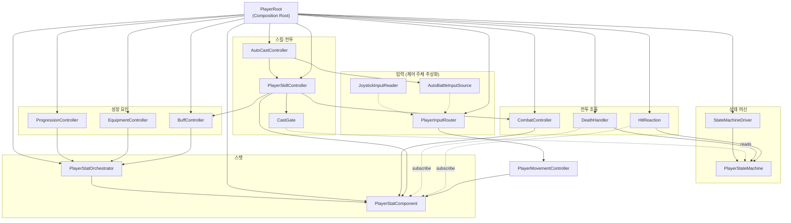
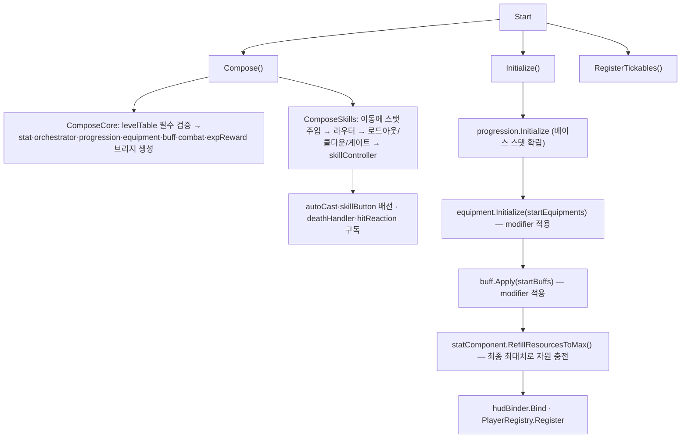

# Player 도메인 — 아키텍처 명세 인덱스

> **종류**: 아키텍처 명세 (as-built) · **상태**: 완료
> **최종 갱신**: 2026-07-22 · **상위 허브**: [docs/README.md](../../README.md)

이 폴더는 플레이어 도메인(`Features/Player`)의 **시스템별 아키텍처 명세** 모음이다. 이 문서는 (1) 전체 조립을 담당하는 **`PlayerRoot`(Composition Root) 명세**이자 (2) 각 시스템 명세로의 **인덱스**다.

---

## 0. 시스템 인덱스

코드 `Features/Player/<도메인>`를 미러링한다. **심사자용 대표 명세 추천 순서**를 함께 표기했다.

| 추천 | 시스템 | 명세 | 한 줄 요약 |
|:---:|--------|------|-----------|
| ① | 상태 머신 | [state-machine.md](./state-machine.md) | 입력 소스와 분리된 FSM. 방치·능동 공용 |
| ② | 스탯 | [stats.md](./stats.md) | 단일 진실 공급원. base+modifier 더티 캐싱 |
| ③ | 스킬 | [skills.md](./skills.md) | 시전 파이프라인 + 효과 전략 + 자동시전 |
| ④ | 전투 | [combat.md](./combat.md) | 피격/사망/경직 조율. `IDamageable` 일원화 |
| ⑤ | 입력·제어 모드 | [input.md](./input.md) | 방치↔능동 스왑(하이브리드 핵심) |
| | 이동 | [movement.md](./movement.md) | 스탯 기반 속도 물리 이동 |
| | 성장 | [progression.md](./progression.md) | 레벨·경험치→베이스 스탯 |
| | 장비 | [equipment.md](./equipment.md) | 장비=Source 태깅 modifier |
| 아키텍처 | 데이터·영속화 | [specs/core/save.md](../core/save.md) | **(구현 완료)** 세이브·로드 — 원인 저장·결과 재계산 · 원자적 쓰기 · 조각 자치. 인벤토리 등 잔여 설계는 [player-data-management-plan.md](../../design/player-data-management-plan.md) |
| | 버프 | [buffs.md](./buffs.md) | 버프=시한부 modifier |
| | 표현 | [presentation.md](./presentation.md) | HUD DTO 경계 + 스킬 버튼 |

> **미구현 스텁**: 애니메이션(`Features/Player/Animation`)은 빈 스텁이라 별도 명세를 두지 않는다. 현황은 [presentation.md §11](./presentation.md)·[state-machine.md §11](./state-machine.md) 참조.

---

## 1. 개요·목적

`PlayerRoot`는 플레이어 오브젝트 그래프의 **조립 루트(Composition Root)** 다. 직렬화된 참조를 받아 순수 C# 컨트롤러들을 생성·배선하고, 생명주기(`Start`/`Update`/`OnDestroy`)에서 `ITickable` 목록을 순회하는 **얇은 글루(glue)** 역할만 한다. 비즈니스 로직은 갖지 않고, "누가 누구에게 의존하는가"만 결정한다.

## 2. 범위(Scope)

| 구분 | 내용 |
|------|------|
| **포함** | `PlayerRoot`의 조립(`Compose`)·초기화(`Initialize`)·틱 순회(`Update`)·정리(`OnDestroy`), 제어 모드 전환 API, 에디터 디버그 훅 |
| **미포함(Out of scope)** | 각 시스템의 내부 로직(개별 명세로 위임), 씬 배치·프리팹 구성, `PlayerStateMachineDriver`의 상태머신 조립([[state-machine]]) |

## 3. 조립 대상 (구성요소)

`PlayerRoot`가 생성·보관하는 객체들:

| 필드 | 타입 | 생성 위치 | 관련 명세 |
|------|------|-----------|-----------|
| `_statComponent` | `PlayerStatComponent` | `ComposeCore` | [[stats]] |
| `_statOrchestrator` | `PlayerStatOrchestrator` | `ComposeCore` | [[stats]] |
| `_progressionController` | `PlayerProgressionController` | `ComposeCore` | [[progression]] |
| `_equipmentController` | `PlayerEquipmentController` | `ComposeCore` | [[equipment]] |
| `_buffController` | `PlayerBuffController` | `ComposeCore` | [[buffs]] |
| `_combatController` | `PlayerCombatController` | `ComposeCore` | [[combat]] |
| `_skillController` | `PlayerSkillController` | `ComposeSkills` | [[skills]] |
| `_autoCast` | `AutoCastController` | `ComposeSkills` | [[skills]] |
| `_inputRouter` | `PlayerInputRouter` | `ComposeInputRouter` | [[input]] |
| `_deathHandler` | `PlayerDeathHandler` | `ComposeSkills` | [[combat]] |
| `_hitReaction` | `PlayerHitReaction` | `ComposeSkills` | [[combat]] |
| `_expRewardHandler` | `EnemyExpRewardHandler` | `ComposeCore` | [kill-exp-reward](../enemy/kill-exp-reward.md) |

외부 참조(직렬화 주입): `PlayerStateMachineDriver`, 이동 컨트롤러(`movementBehaviour`), `SkillLoadoutConfig`, `AutoBattleInputSource`, `SkillButton[]`, 능동 입력 소스, `PlayerHudBinder`, 각종 SO(`PlayerProgressionConfig`·**`PlayerLevelTable`(필수 — null이면 `ComposeCore`가 조립을 중단한다)**·`EquipmentDefinition[]`·`BuffDefinition[]`).

## 4. 시스템 맵

`PlayerRoot`가 조립하는 전체 객체 그래프(화살표 = 의존 방향):



세 핵심 시스템(상태 머신·스탯·스킬)은 각자 독립 책임을 가지며 **`PlayerRoot`에서만** 서로 연결된다.

## 5. 데이터 구조

`PlayerRoot` 자체는 데이터를 소유하지 않고 SO 참조를 배선만 한다: `PlayerProgressionConfig`·`PlayerLevelTable`([[progression]]), `EquipmentDefinition[]`([[equipment]]), `BuffDefinition[]`([[buffs]]), `SkillLoadoutConfig`([[skills]]), `PlayerStat`([[movement]]).

## 6. 상세 로직 — 생명주기

### 6.1 조립·초기화 순서 (`Start`)



> **순서 불변식**: 베이스 스탯([[progression]]) → 장비([[equipment]]) → 버프([[buffs]])가 모두 `StatMachine`에 반영된 **뒤에** 자원을 리필한다([[stats]] §6.3). 이 순서가 깨지면 최대 HP/MP가 장비·버프 보정 전 값으로 채워진다.

### 6.2 틱 순회 순서 (`Update`)

`RegisterTickables`가 등록한 `ITickable`을 순서대로 순회:

```
stat → buff → skill → autoCast
```

`PlayerRoot`는 `for` 순회만 할 뿐 `Update`에 로직이 없다 — **새 틱 시스템 추가 시 `Update` 수정 불필요(OCP)**. 상태머신·이동은 각자 MonoBehaviour(`Driver`·`MovementController`)가 자체 `Update`/`FixedUpdate`로 구동한다.

### 6.3 정리 (`OnDestroy`)

`deathHandler`·`hitReaction`·`expRewardHandler`를 `Dispose`(이벤트 구독 해제)하고 `PlayerRegistry.Unregister` 호출 — 이벤트·전역 참조 누수 방지([[combat]], [kill-exp-reward](../enemy/kill-exp-reward.md)).

### 6.4 제어 모드 전환

`SetControlMode(mode)`/`ControlMode`로 `PlayerInputRouter`를 통해 방치↔능동 전환([[input]]). 라우터 미구성(능동 소스 미배선) 시 전환 무시.

## 7. 인터페이스·의존성(경계)

`PlayerRoot`는 조립을 위해 여러 추상을 관통한다. 각 계약의 상세는 해당 시스템 명세 §7에 있다:

| 추상 | 역할 | 명세 |
|------|------|------|
| `IMoveInputSource` | 이동 입력 공급(조이스틱/자동) | [[input]] |
| `IPlayerMovementController` / `IMoveInputConsumer` / `IStatDrivenMovement` | 이동 제어·주입 | [[movement]] |
| `IReadOnlyStats` | 최종 스탯 읽기 | [[stats]] |
| `ICastGate` | 시전 잠금 | [[skills]] |
| `IDamageable` | 피격 수신 | [[combat]] |
| `ITargetProvider` | 타겟 선택 | [[input]] |
| `ITickable` | 프레임 갱신 | [[skills]] |

**직렬화 인터페이스 해석**: Unity가 인터페이스를 인스펙터에 직렬화하지 못하므로, `MonoBehaviour` 필드로 받아 `SerializedInterface.TryResolve`(또는 `as` 캐스트)로 변환한다. 미배선/타입 불일치 시 경고 로그 후 해당 배선을 건너뛰어 **부분 조립에도 크래시 없이** 동작한다.

## 8. 설계 포인트 (SOLID 매핑)

| 원칙 | 적용 |
|------|------|
| **SRP** | `PlayerRoot`는 조립·수명·틱 순회만. 모든 비즈니스 로직은 개별 컨트롤러 |
| **OCP** | 새 틱 시스템은 `ITickable` 등록으로 추가. `Update` 불변 |
| **LSP/ISP** | 배선이 전부 최소 인터페이스 경유 → 구현 교체·목 주입 자유 |
| **DIP** | 컨트롤러들이 MonoBehaviour가 아닌 순수 C#이고, 인터페이스로만 상호 참조. `PlayerRoot`만 구체 생성을 안다 |

**하이라이트 패턴**
- **Composition Root**: 객체 생성·의존 연결을 단 한 곳에 모아, 나머지 클래스를 생성자 주입만 받는 순수 로직으로 유지.
- **방어적 부분 조립**: 각 배선 단계가 null 체크·경고 후 폴백 → 미완성 프리팹에서도 실행/디버그 가능.
- **틱 소유권 집중**: 순수 C# 시스템의 `Update`를 `PlayerRoot`가 대행 → MonoBehaviour 수 최소화, 실행 순서 명시적 제어.

## 9. Unity 특화

- **초기화 순서 계약**: `PlayerStateMachineDriver.Awake`(상태머신 준비)가 `PlayerRoot.Start`(조립)보다 먼저 실행됨을 전제로, `Start`에서 `driver.StateMachine`을 안전 참조.
- **에디터 디버그 분리**: `DebugApply*` 훅은 `#if UNITY_EDITOR`. `PlayerDebugCommands`(ContextMenu)가 호출, 빌드 제외([[presentation]]).
- **성능 예산**: `Update`는 `_tickables` 리스트 `for` 순회(가상 호출 N회). 프레임당 할당 없음.

## 10. 리스크·미결정(TBD)

각 시스템의 TBD는 해당 명세 §11에 있다. 조립 관점의 교차 이슈:

- **초기화 순서 암묵 의존**: 베이스→장비→버프→리필 순서가 코드 배치로만 보장됨(명시 계약 아님). 순서 재배치 시 자원 리필 버그 위험.
- ~~`PlayerStateMachineCastGate` 기본 인자~~ **해소(2026-07-22)**: 생성자 기본값을 제거해 필수 인자로 전환, 미사용 `Attack` 상태도 제거([[skills]] §11, [[state-machine]] §11).
- **전역 정적 `PlayerRegistry`**: 싱글 플레이어 가정([[combat]] §11).

## 11. 확장 여지

- **DI 컨테이너 이관**: 수동 조립을 VContainer/Zenject 등으로 이관 여지(현재는 명시적 수동 주입이 학습·추적에 유리).
- **다중 캐릭터**: `PlayerRoot`를 다인스턴스화하려면 `PlayerRegistry` 전역 정적을 서비스로 교체 필요.
- **런타임 재조립**: 클래스 전환·장비 교체 UI 등은 개별 컨트롤러의 확장 지점 활용([[skills]]·[[equipment]]).

## 12. 파일 위치

| 구분 | 파일 | 경로 |
|------|------|------|
| 조립 루트 | `PlayerRoot` | `Features/Player/Composition/PlayerRoot.cs` |
| 유틸 | `SerializedInterface` | `Shared/Utils/SerializedInterface.cs` |
| (시스템별 파일) | — | 각 시스템 명세 §13 참조 |
