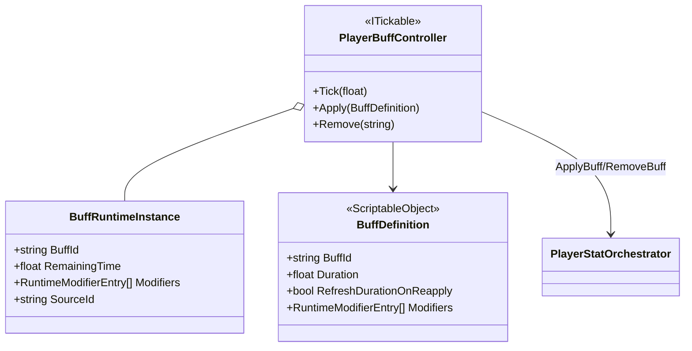
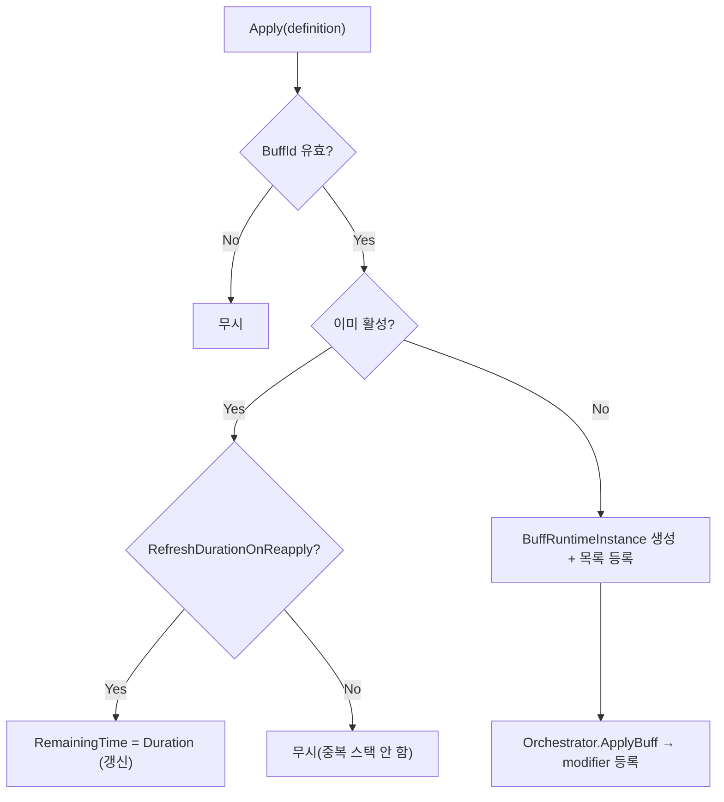
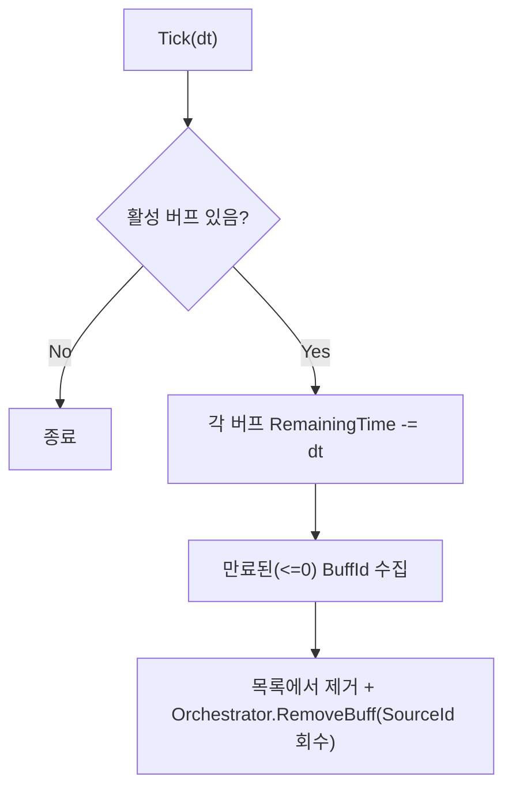

# Player 버프 (Buffs)

> **종류**: 아키텍처 명세 (as-built) · **상태**: 완료
> **최종 갱신**: 2026-07-10 · **관련 기획서**: (링크 예정)

---

## 1. 개요·목적

플레이어의 **시간제한 버프를 적용·유지·만료**하는 시스템이다. 버프의 스탯 보정치를 스탯 시스템([[stats]])에 modifier로 얹고, 지속시간이 다하면 자동으로 회수한다.

핵심 판단은 **버프 = 시한부 modifier 묶음**이라는 모델이다. 장비([[equipment]])와 동일한 `SourceId` 태깅 회수 구조를 쓰되, **남은 시간(`RemainingTime`)** 을 매 프레임 감소시켜 만료 시 스스로 제거하는 `ITickable`이라는 점이 다르다. 스킬([[skills]])의 `BuffSkillEffect`가 이 시스템의 주 진입점이다.

## 2. 범위(Scope)

| 구분 | 내용 |
|------|------|
| **포함** | 버프 컨트롤러(`PlayerBuffController`), 버프 런타임 인스턴스(`BuffRuntimeInstance`), 버프 정의(`BuffDefinition`), modifier 생성 도우미(`StatModifierFactory`) |
| **미포함(Out of scope)** | modifier 합성·회수([[stats]]), 버프를 **발동**하는 스킬 효과([[skills]]의 `BuffSkillEffect`), 디버프·상태이상 전용 로직(현재 동일 파이프라인) |

## 3. 요구사항·설계 목표

| 요구사항 | 설계적 해석 |
|----------|-------------|
| 버프가 지속시간 후 자동 만료 | `ITickable.Tick`에서 `RemainingTime` 감소·만료 회수 |
| 같은 버프 재적용 시 갱신 정책 선택 | `RefreshDurationOnReapply`로 지속시간 리셋 여부 결정 |
| 만료/해제 시 그 버프 보정만 제거 | `SourceId = "buff:{BuffId}"` 태깅 회수 |
| 버프 효과를 데이터로 정의 | `BuffDefinition`(SO)의 modifier 목록 |

## 4. 시스템 구조

| 구성요소 | 종류 | 책임 |
|----------|------|------|
| `PlayerBuffController` | class (`ITickable`) | 활성 버프 목록 관리, 지속시간 감소·만료 회수 |
| `BuffRuntimeInstance` | class | 활성 버프 1건의 런타임 상태(남은 시간 등) |
| `BuffDefinition` | ScriptableObject | 버프 데이터(지속시간·갱신정책·modifier) |
| `StatModifierFactory` | static class | 연산별 `StatModifier` 생성 도우미 |

## 5. 데이터 구조

### `BuffDefinition` (ScriptableObject)

| 필드 | 의미 |
|------|------|
| `BuffId` | 고유 식별자. `SourceId`·중복 판정 키 |
| `Duration` | 지속시간(초). 기본 5 |
| `RefreshDurationOnReapply` | 재적용 시 지속시간 리셋 여부(기본 true) |
| `Modifiers` | `RuntimeModifierEntry[]` — 스탯 보정 목록([[stats]] §5.3) |

## 6. 상세 로직·상태

### 6.1 적용·재적용 (`Apply`)

- **스택 없음**: 같은 `BuffId`는 중첩되지 않고, 정책에 따라 시간만 갱신하거나 무시.

### 6.2 만료 (`Tick`)

- **2단계 회수**: 순회 중 딕셔너리 수정을 피하려 만료 키를 `ListPool<string>`으로 모은 뒤 일괄 제거(GC 없음).

### 6.3 시작 버프

`PlayerRoot.Initialize`가 `startBuffs[]`를 순회하며 `Apply`. 장비([[equipment]]) 적용 후, 자원 리필([[stats]]) 전에 실행돼 버프 보정이 최대 자원에 반영된다.

## 7. 인터페이스·의존성(경계)

| 계약 | 방향 | 설명 |
|------|------|------|
| `Apply(BuffDefinition)` | 외부가 **호출** | `BuffSkillEffect`([[skills]])·시작 조립이 버프 발동 |
| `Remove(string)` | 외부가 **호출** | 조기 해제(디스펠 등) |
| `PlayerStatOrchestrator.ApplyBuff`/`RemoveBuff` | 이 계층이 **호출** | 스탯 반영([[stats]]) |
| `ITickable.Tick` | `PlayerRoot`가 **순회** | 지속시간 감소·만료 처리 |

> **경계 원칙**: 버프 컨트롤러도 스탯 합성을 모른다. `SourceId` 규약(`buff:`)만 `Orchestrator`와 공유. 장비와 유일하게 다른 책임은 **시간 관리**뿐이다.

## 8. 설계 포인트 (SOLID 매핑)

| 원칙 | 적용 |
|------|------|
| **SRP** | 컨트롤러는 "활성 버프 + 시간"만. 스탯 반영은 `Orchestrator`, 합성은 `StatMachine` |
| **OCP** | 새 버프는 데이터(`BuffDefinition`)만 추가. 파이프라인 불변 |
| **DIP** | 컨트롤러가 `PlayerStatOrchestrator` 추상 창구에만 의존 |

**하이라이트 패턴**
- **시한부 Source 태깅**: 장비의 정적 회수 구조에 "시간" 축을 더해 자동 만료 회수.
- **GC 없는 만료 순회**: `ListPool`로 만료 키를 대여/반납 — 매 프레임 힙 할당 회피.
- **재적용 정책 데이터화**: 갱신/무시 정책을 SO 플래그로 노출해 코드 없이 튜닝.

## 9. Unity 특화

- **`ITickable` 소유권**: `PlayerRoot`가 `Tick` 순회(등록 순서 stat→buff→skill→autoCast). 자체 `Update` 없음.
- **순수 C# 컨트롤러**: `BuffDefinition`만 SO(에디터 자산).
- **성능 예산**: 프레임당 활성 버프 수만큼 감산. 만료 시에만 재계산 트리거. `ListPool`로 할당 0.

## 10. 테스트 케이스

| 대상 | 확인 항목 |
|------|-----------|
| 적용 반영 | `Apply` 후 해당 스탯 상승 |
| 자동 만료 | `Duration` 경과 후 modifier 회수·스탯 원복 |
| 재적용 갱신 | `RefreshDurationOnReapply=true` 시 시간 리셋 |
| 재적용 무시 | `false` 시 중복 스택 안 됨 |
| 조기 해제 | `Remove` 시 즉시 회수 |
| 만료 순회 안전 | 다중 동시 만료 시 순회 중 예외 없음 |

## 11. 리스크·미결정(TBD)

- **미사용 모델 `TimedBuffData`**: `BuffRuntimeInstance`와 역할이 겹치는 별도 클래스가 존재하나 미사용 → 정리 대상.
- **`StatModifierFactory` 미사용**: 연산별 생성 도우미가 있으나 현재 경로는 `Orchestrator`가 `RuntimeModifierEntry`를 직접 변환. 중복 → 통합/제거 검토.
- **스택 미지원**: 동일 버프 중첩(예: 3스택)이 불가. 스택형 버프가 필요하면 인스턴스 목록/카운트 모델 필요.
- **디버프 구분 부재**: 디버프도 동일 파이프라인. 해제 저항·디스펠 정책이 생기면 분기 필요([[stats]] `ModifierLayer.Debuff`는 이미 존재).

## 12. 확장 여지

- **스택형 버프**: `BuffRuntimeInstance`에 스택 수를 더해 중첩 강도 지원.
- **주기 효과**: `Tick`에 "초당 회복" 같은 도트(DoT/HoT)를 추가(시간 축 재활용).
- **버프 UI**: 활성 버프 목록·잔여 시간을 HUD로 노출([[presentation]]).
- **면역/해제**: 층(`Debuff`) 기반 디스펠·면역 규칙 추가.

## 13. 파일 위치

| 구분 | 파일 | 경로 |
|------|------|------|
| 컨트롤러 | `PlayerBuffController` | `Features/Player/Buffs/PlayerBuffController.cs` |
| 런타임 | `BuffRuntimeInstance` | `Features/Player/Stats/Models/BuffRuntimeInstance.cs` |
| 모델(미사용) | `TimedBuffData` | `Features/Player/Stats/Models/TimedBuffData.cs` |
| 팩토리 | `StatModifierFactory` | `Features/Player/Stats/Factories/StatModifierFactory.cs` |
| 데이터 | `BuffDefinition` | `Data/Definitions/BuffDefinition.cs` |
