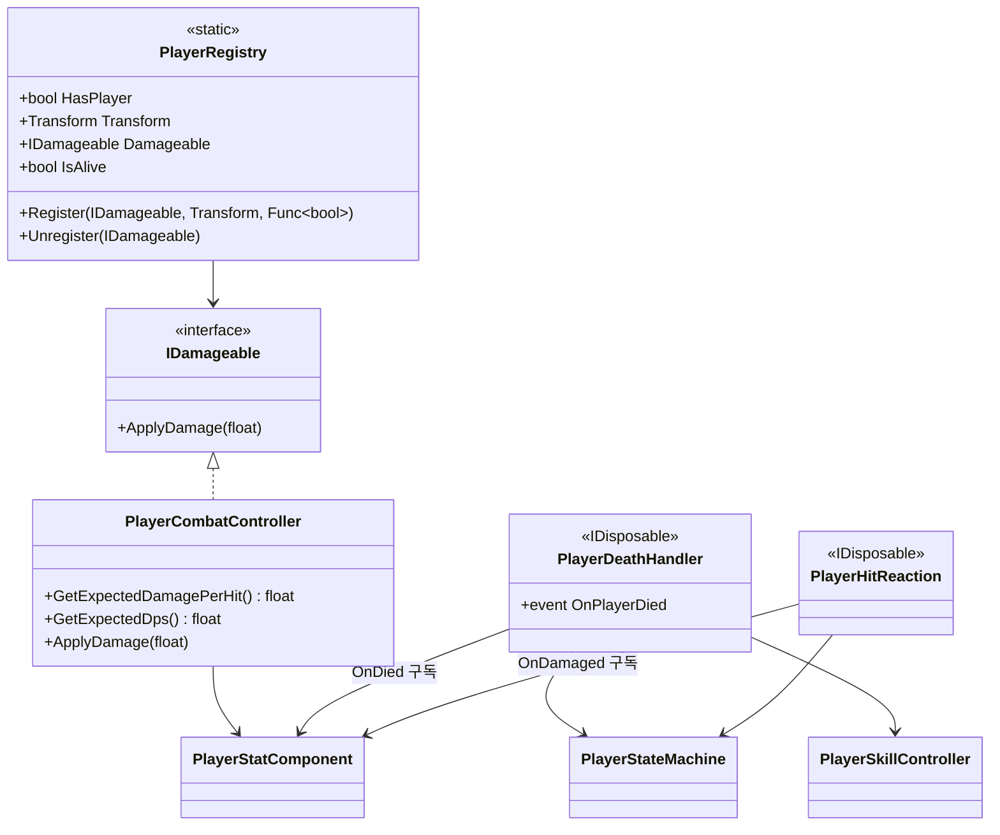
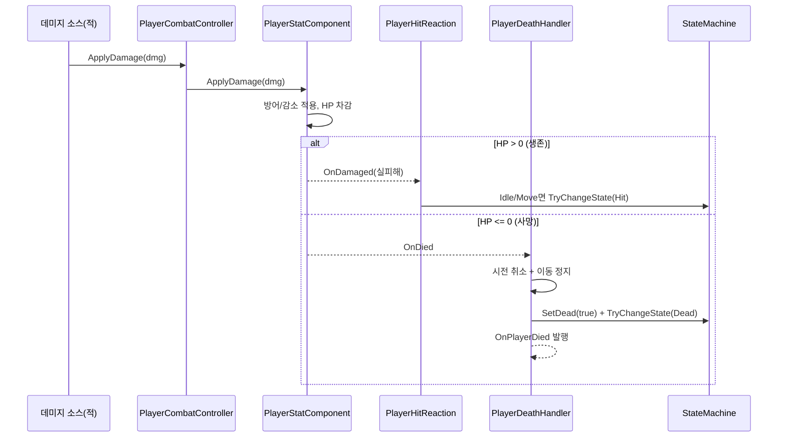

# Player 전투 진입점 (Combat)

> **종류**: 아키텍처 명세 (as-built) · **상태**: 완료
> **최종 갱신**: 2026-07-10 · **관련 기획서**: (링크 예정)

---

## 1. 개요·목적

플레이어의 **피격 수신·사망 조율·피격 반응·전역 노출**을 담당하는 얇은 조율 계층이다. 자체 로직은 거의 없고, 스탯 시스템([[stats]])의 자원 이벤트(`OnDied`/`OnDamaged`)와 상태머신([[state-machine]])·스킬([[skills]])·이동([[movement]])을 **배선**한다.

핵심 판단은 **피격 소스의 일원화**다. 적·플레이어를 가리지 않고 `IDamageable.ApplyDamage(float)` 하나로 데미지를 가한다. 데미지를 주는 쪽은 상대가 플레이어인지 적인지 몰라도 되고(DIP), "맞으면 무슨 일이 일어나는가(경직/사망)"는 이 계층이 이벤트로 반응해 결정한다.

## 2. 범위(Scope)

| 구분 | 내용 |
|------|------|
| **포함** | 피격 수신 창구(`PlayerCombatController`), 사망 연동(`PlayerDeathHandler`), 피격 경직 연동(`PlayerHitReaction`), 플레이어 전역 접근점(`PlayerRegistry`) |
| **미포함(Out of scope)** | 실제 데미지 산출·자원 차감·사망 판정([[stats]]의 `PlayerStatComponent`), 상태 전이 엔진([[state-machine]]), 적의 공격 로직(Enemy 도메인), 게임오버 UI(상위 시스템이 `OnPlayerDied` 구독) |

## 3. 요구사항·설계 목표

| 요구사항 | 설계적 해석 |
|----------|-------------|
| 적/플레이어가 서로를 몰라도 피격 가능 | `IDamageable` 단일 계약으로 피격 통일 |
| 사망 시 여러 시스템이 일관되게 반응 | `OnDied` 구독 → 시전취소·이동정지·`Dead` 전이를 한 곳(`DeathHandler`)에서 조율 |
| 피격 경직이 시전·사망을 방해하지 않아야 | `Idle`/`Move`에서만 `Hit` 전이 |
| 적이 플레이어 위치·생존을 조회 가능 | `PlayerRegistry`로 위치·`IDamageable`·생존 프로브 노출 |
| 이벤트 구독 누수 방지 | `IDisposable`로 구독 해제, `PlayerRoot.OnDestroy`가 호출 |

## 4. 시스템 구조

| 구성요소 | 종류 | 책임 |
|----------|------|------|
| `PlayerCombatController` | class (`IDamageable`) | 피격 수신 창구. 데미지를 `PlayerStatComponent`로 위임. 기대 데미지/DPS 조회 |
| `PlayerDeathHandler` | class (`IDisposable`) | `OnDied` 구독 → 시전취소·이동정지·`Dead` 전이 조율 |
| `PlayerHitReaction` | class (`IDisposable`) | `OnDamaged` 구독 → 생존 시 `Hit` 경직 전이 |
| `PlayerRegistry` | static class | 현재 플레이어의 `IDamageable`·`Transform`·생존 프로브 전역 노출 |

## 5. 데이터 구조

이 시스템은 **ScriptableObject 데이터를 갖지 않는다.** 모든 수치는 스탯 시스템([[stats]])에서 온다.

## 6. 상세 로직·상태

### 6.1 피격 → 반응 전체 흐름

### 6.2 사망 조율 (`PlayerDeathHandler.HandleDied`)

`OnDied`(HP 0 도달, 1회) 수신 시 **순서대로**:
1. `skillController.CancelCast()` — 진행 중 시전 정리(쿨다운·`ExitCast` 없이 상태만 정리, [[skills]] §11).
2. `movementController.SetMovementEnabled(false)` — 이동 정지.
3. `Context.SetDead(true)` + `TryChangeState(Dead)` — 상태머신 전이.
4. `OnPlayerDied` 발행 — 게임오버 UI 등 상위 연동.

> **설계 결정**: `DeathHandler`가 `Dead`로 직접 전이하므로, `CancelCast`는 `Idle` 복귀를 하지 **않는다**. 시전 취소와 상태 전이의 책임을 분리해 이중 전이를 피한다.

### 6.3 피격 경직 (`PlayerHitReaction.HandleDamaged`)

`OnDamaged`(생존 피격) 수신 시 **`Idle`/`Move`일 때만** `Hit` 전이:

| 현재 상태 | 반응 |
|-----------|------|
| `Idle` / `Move` | `Hit` 전이(경직) |
| `Casting` | 무시 — 시전 중단 방지 |
| `Dead` | 무시 — `IsDead` 가드 |
| `Hit` | 상태머신이 동일 상태 재전이 무시 → 경직 **갱신 안 됨** |

### 6.4 전역 접근점 (`PlayerRegistry`)

- `PlayerRoot.Initialize`에서 `Register(combatController, transform, () => !IsDead)`.
- `PlayerRoot.OnDestroy`에서 `Unregister`.
- 적의 타겟 제공자([[input]]의 `NearestEnemyTargetProvider` 등)가 플레이어 위치·생존을 조회. `EnemyRegistry`(적 목록)와 대칭 구조.

## 7. 인터페이스·의존성(경계)

| 계약 | 방향 | 설명 |
|------|------|------|
| `IDamageable.ApplyDamage` | 외부가 **호출** | 적 등 데미지 소스의 유일한 피격 진입점. `PlayerCombatController`가 구현 |
| `PlayerStatComponent.OnDied`/`OnDamaged` | 이 계층이 **구독** | 자원 이벤트가 사망/경직 반응의 근원 |
| `PlayerStateMachine.TryChangeState` | 이 계층이 **호출** | `Dead`/`Hit` 전이 요청([[state-machine]]) |
| `PlayerSkillController.CancelCast` | 이 계층이 **호출** | 사망 시 시전 중단([[skills]]) |
| `PlayerDeathHandler.OnPlayerDied` | 외부로 **발행** | 게임오버 UI 등 상위 시스템 훅 |
| `PlayerRegistry.*` | 외부가 **조회** | 적 AI가 플레이어를 찾는 전역 창구 |

> **경계 원칙**: 이 계층은 "판정"을 하지 않는다. 데미지 계산·사망 판정은 [[stats]]가, 상태 전이는 [[state-machine]]가 한다. Combat은 **이벤트를 받아 올바른 순서로 하위 시스템을 호출**하는 조율자(orchestrator)일 뿐이다.

## 8. 설계 포인트 (SOLID 매핑)

| 원칙 | 적용 |
|------|------|
| **SRP** | 수신(`Combat`)·사망조율(`Death`)·경직조율(`Hit`)·전역노출(`Registry`)이 각각 한 책임 |
| **OCP** | 사망/피격 시 새 반응 추가는 별도 구독자 클래스로 확장(기존 핸들러 불변) |
| **LSP** | `PlayerCombatController`는 어떤 `IDamageable` 소비처에서도 대체 가능 |
| **ISP** | `IDamageable`은 `ApplyDamage` 하나만 — 데미지 소스는 그 이상 알 필요 없음 |
| **DIP** | 데미지 소스가 구체 플레이어가 아닌 `IDamageable` 추상에 의존. 적/플레이어 대칭 |

**하이라이트 패턴**
- **Observer로 도메인 결합 제거**: 스탯이 사망/피격을 이벤트로 알리고, 반응자들이 구독. 스탯은 상태머신·스킬을 모른다.
- **Disposable 수명 관리**: 구독형 어댑터가 `IDisposable` → `PlayerRoot`가 파괴 시 해제해 이벤트 누수 차단.
- **대칭 레지스트리**: `PlayerRegistry`(플레이어 1) ↔ `EnemyRegistry`(적 N)로 상호 탐색 구조를 대칭화.

## 9. Unity 특화

- **순수 C# 어댑터**: 4개 클래스 모두 비-MonoBehaviour. `PlayerRoot`가 `new`로 생성·주입.
- **전역 정적 상태 주의**: `PlayerRegistry`는 `static`이라 씬 전환·도메인 리로드 간 잔류 위험. `Unregister`를 `OnDestroy`에서 반드시 호출(§11).
- **생존 프로브 델리게이트**: `Func<bool>`(`() => !IsDead`)로 등록 시점의 상태가 아닌 **실시간 생존 여부**를 조회하게 해 stale 상태 방지.

## 10. 테스트 케이스

| 대상 | 확인 항목 |
|------|-----------|
| 피격 위임 | `ApplyDamage` 호출이 `PlayerStatComponent.ApplyDamage`로 전달 |
| 사망 순서 | `OnDied` 시 시전취소→이동정지→`Dead` 전이→`OnPlayerDied` 순 |
| 경직 조건 | `Idle`/`Move`에서만 `Hit` 전이, `Casting`/`Dead`에선 무시 |
| 경직 미갱신 | 이미 `Hit`이면 재전이 무시로 경직 시간 리셋 안 됨 |
| 구독 해제 | `Dispose` 후 이벤트 발생해도 핸들러 미호출 |
| 레지스트리 | `Register`/`Unregister` 후 `HasPlayer`·`IsAlive` 정합 |

## 11. 리스크·미결정(TBD)

- **`PlayerRegistry` 전역 정적**: 싱글 플레이어 가정. 멀티플레이/다중 플레이어 시 리스트·서비스 주입으로 대체 필요. 도메인 리로드 시 정적 잔류 위험(주석의 §3-H 트레이드오프).
- **경직 갱신 부재**: 연타 피격 시 경직이 갱신되지 않아(첫 `Hit`만 유효) 짧은 무적처럼 보일 수 있음 — 의도 여부 확정 필요.
- **`OnPlayerDied` 소비처 미정**: 현재 게임오버/리스폰 연결이 비어 있음. 방치형 자동 부활 정책과 함께 결정.
- **라이프스틸 미연동**: `LifeSteal` 스탯이 정의됐으나([[stats]]) 이 계층의 데미지 처리와 연결돼 있지 않음.

## 12. 확장 여지

- **데미지 타입/속성**: `IDamageable.ApplyDamage(float)`를 데미지 구조체(속성·크리티컬 여부)로 확장 여지 — 지금은 float로 단순화.
- **피격 반응 다양화**: 넉백·무적시간·피격 이펙트를 `OnDamaged` 추가 구독자로 확장(기존 로직 불변).
- **레지스트리 서비스화**: `PlayerRegistry`를 인터페이스+DI로 바꿔 테스트·멀티플레이 대응.

## 13. 파일 위치

| 파일 | 경로 |
|------|------|
| `PlayerCombatController` | `Features/Player/Combat/PlayerCombatController.cs` |
| `PlayerDeathHandler` | `Features/Player/Combat/PlayerDeathHandler.cs` |
| `PlayerHitReaction` | `Features/Player/Combat/PlayerHitReaction.cs` |
| `PlayerRegistry` | `Features/Player/Combat/PlayerRegistry.cs` |
| `IDamageable` (계약) | `Features/Player/Skills/Contracts/IDamageable.cs` |
