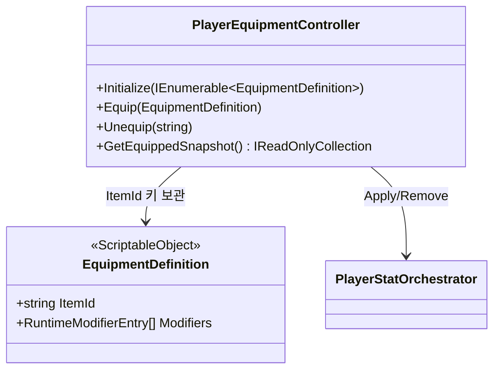
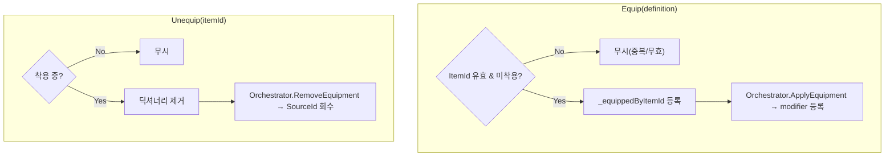

# Player 장비 (Equipment)

> **종류**: 아키텍처 명세 (as-built) · **상태**: 완료
> **최종 갱신**: 2026-07-10 · **관련 기획서**: [content-roadmap.md](../../gdd/content-roadmap.md) §6 (재화·장비 흐름) · [characters-and-companions.md](../../gdd/characters-and-companions.md) §6 (섬 자원↔장비, TBD)

---

## 1. 개요·목적

플레이어의 **장비 착용/해제 상태를 관리**하고, 각 장비의 스탯 보정치를 스탯 시스템([[stats]])에 **modifier로 반영**하는 시스템이다.

핵심 판단은 **장비 = modifier 묶음**이라는 모델이다. 장비를 착용하면 그 장비의 `SourceId`(`item:{ItemId}`)로 태깅된 modifier가 `StatMachine`에 등록되고, 해제하면 같은 `SourceId`의 modifier만 정확히 회수된다. 컨트롤러는 "무엇이 착용됐는가"만 알고, 스탯 합성은 [[stats]]에 완전히 위임한다.

## 2. 범위(Scope)

| 구분 | 내용 |
|------|------|
| **포함** | 장비 컨트롤러(`PlayerEquipmentController`), 장비 정의(`EquipmentDefinition`), 장비→modifier 변환 도우미(`EquipmentFactory`·`EquipmentRuntimeData`) |
| **미포함(Out of scope)** | modifier 합성·회수([[stats]]), 인벤토리·드롭·강화(상위 시스템), 장비 부위 슬롯 관리(미구현, §11) |

## 3. 요구사항·설계 목표

| 요구사항 | 설계적 해석 |
|----------|-------------|
| 착용/해제가 스탯에 즉시 반영 | `Orchestrator.ApplyEquipment`/`RemoveEquipment`로 modifier 등록/회수 |
| 해제 시 그 장비 보정치만 정확히 제거 | `SourceId = "item:{ItemId}"` 태깅으로 출처별 회수 |
| 같은 장비 중복 착용 방지 | `ItemId` 키 딕셔너리로 중복 차단 |
| 시작 장비를 데이터로 지정 | `PlayerRoot`의 `startEquipments[]` 주입 |

## 4. 시스템 구조

| 구성요소 | 종류 | 책임 |
|----------|------|------|
| `PlayerEquipmentController` | class | 착용 목록 관리, 착용/해제를 `Orchestrator`로 반영 |
| `EquipmentDefinition` | ScriptableObject | 장비 데이터(`ItemId` + modifier 목록) |
| `EquipmentRuntimeData` | class | 장비 런타임 표현(ItemId + `StatModifier` 목록) |
| `EquipmentFactory` | static class | `EquipmentDefinition` → `EquipmentRuntimeData` 변환 |

## 5. 데이터 구조

### `EquipmentDefinition` (ScriptableObject)

| 필드 | 의미 |
|------|------|
| `ItemId` | 고유 식별자. `SourceId`·중복 판정 키 |
| `Modifiers` | `RuntimeModifierEntry[]` — 스탯·연산·층·값·순서 목록([[stats]] §5.3) |

## 6. 상세 로직·상태

### 6.1 착용/해제

- 착용 목록은 `Dictionary<string, EquipmentDefinition>`(ItemId 키) — 중복 착용을 O(1)로 차단.
- 실제 modifier 변환은 `Orchestrator.ApplyRuntimeModifiers`가 수행([[stats]] §6.4).

### 6.2 초기 장비 (`Initialize`)

`PlayerRoot.Initialize`가 `startEquipments[]`를 넘기면 순회하며 `Equip`. 베이스 스탯([[progression]]) 확립 **후**, 자원 리필([[stats]]) **전**에 실행돼 장비 보정이 최대 HP/MP에 반영된다.

## 7. 인터페이스·의존성(경계)

| 계약 | 방향 | 설명 |
|------|------|------|
| `Equip`/`Unequip` | 외부가 **호출** | 인벤토리 UI·시작 조립이 착용 조작 |
| `PlayerStatOrchestrator.ApplyEquipment`/`RemoveEquipment` | 이 계층이 **호출** | 스탯 반영([[stats]]) |
| `GetEquippedSnapshot` | 외부가 **조회** | 착용 목록 표시(방어적 복사본 반환) |

> **경계 원칙**: 장비 컨트롤러는 스탯 합성 규칙을 모른다. `SourceId` 규약(`item:`)만 `Orchestrator`와 공유하고, "이 보정이 최종값에 어떻게 반영되는가"는 [[stats]]의 책임이다.

## 8. 설계 포인트 (SOLID 매핑)

| 원칙 | 적용 |
|------|------|
| **SRP** | 컨트롤러는 착용 목록만, 스탯 반영은 `Orchestrator`, 합성은 `StatMachine` |
| **OCP** | 새 스탯 종류의 장비도 데이터(`Modifiers`)만 추가하면 됨. 코드 불변 |
| **DIP** | 컨트롤러가 `PlayerStatOrchestrator` 추상 창구에만 의존 |

**하이라이트 패턴**
- **Source 태깅 회수**: 착용/해제를 `SourceId` 기반 등록/회수로 대칭화 — 부분 회수·중복 방지가 문자열 키 하나로 성립.
- **데이터 주도 장비**: 장비 효과가 전부 SO 데이터라, 밸런서가 코드 없이 새 장비 생성.
- **방어적 스냅샷**: `GetEquippedSnapshot`이 `ToList()` 복사본을 반환해 내부 딕셔너리 노출 차단.

## 9. Unity 특화

- **순수 C# 컨트롤러**: `PlayerRoot`가 생성. `EquipmentDefinition`만 SO(에디터 자산).
- **초기화 순서 민감**: §6.2 — base→장비→버프→자원리필 순서에 의존.
- **성능 예산**: 착용/해제 시에만 modifier 등록·재계산 트리거. 매 프레임 비용 없음(`ITickable` 아님).

## 10. 테스트 케이스

| 대상 | 확인 항목 |
|------|-----------|
| 착용 반영 | `Equip` 후 해당 스탯 최종값 상승 |
| 중복 차단 | 같은 `ItemId` 재착용 시 modifier 중복 등록 안 됨 |
| 해제 회수 | `Unequip` 후 그 장비 modifier만 사라지고 다른 장비 유지 |
| 무효 방어 | `ItemId` 공백/null이면 무시 |
| 스냅샷 격리 | 반환 컬렉션 수정이 내부 상태에 영향 없음 |

## 11. 리스크·미결정(TBD)

- **장비 부위(슬롯) 없음**: `EquipmentRuntimeData` 주석에 "장비 부위를 구분할 머신 필요"라고 명시. 현재는 `ItemId` 중복만 막을 뿐, "무기 슬롯 1개" 같은 부위 제약이 없다 → 슬롯 시스템 필요.
- **`EquipmentFactory`·`EquipmentRuntimeData` 프로덕션 경로 미사용**: `Orchestrator`가 `RuntimeModifierEntry`를 직접 변환하므로 이 팩토리/런타임 데이터는 실제 조립 경로에 없다(프로토타입 예제 `ExampleEquipment`에만 잔존). 중복 로직 → 통합 또는 제거 대상.
- **강화/등급 미반영**: 장비 강화·랜덤 옵션이 데이터 모델에 없음.

## 12. 확장 여지

- **부위 슬롯 머신**: 부위별 단일 착용을 강제하는 슬롯 관리자 추가(컨트롤러 확장).
- **세트 효과**: 특정 조합 착용 시 추가 modifier를 `Runtime` 층([[stats]])으로 부여.
- **런타임 옵션**: 강화 수치를 `EquipmentRuntimeData.Modifiers`에 병합해 인스턴스별 보정 지원(팩토리 재활용 지점).

## 13. 파일 위치

| 구분 | 파일 | 경로 |
|------|------|------|
| 컨트롤러 | `PlayerEquipmentController` | `Features/Player/Equipment/PlayerEquipmentController.cs` |
| 데이터 | `EquipmentDefinition` | `Data/Definitions/EquipmentDefinition.cs` |
| 런타임 | `EquipmentRuntimeData` | `Features/Player/Stats/Models/EquipmentRuntimeData.cs` |
| 팩토리 | `EquipmentFactory` | `Features/Player/Stats/Factories/EquipmentFactory.cs` |
| 직렬화 | `RuntimeModifierEntry` | `Shared/Serialization/RuntimeModifierEntry.cs` |
