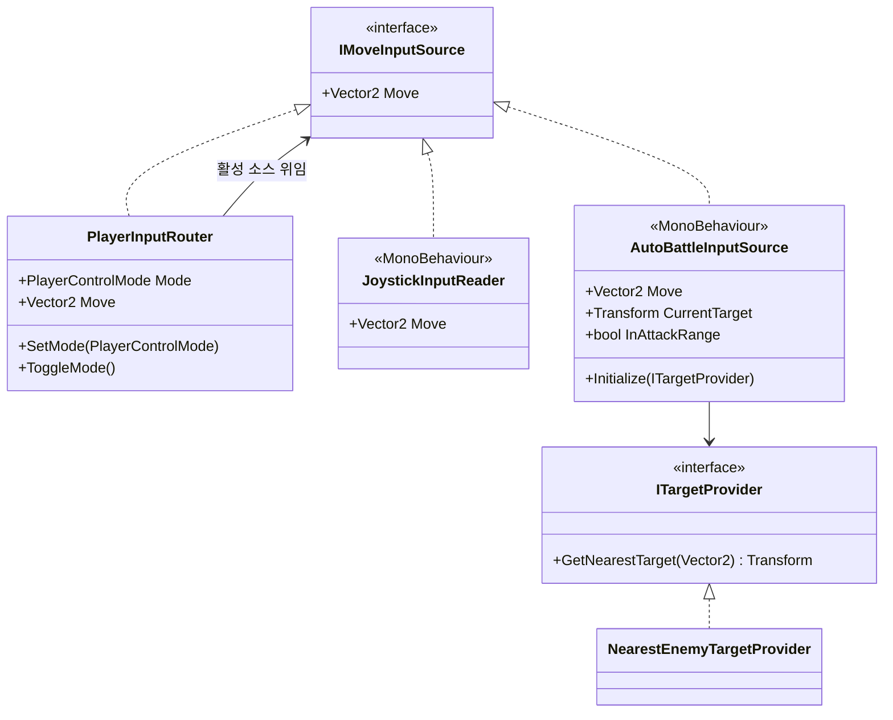
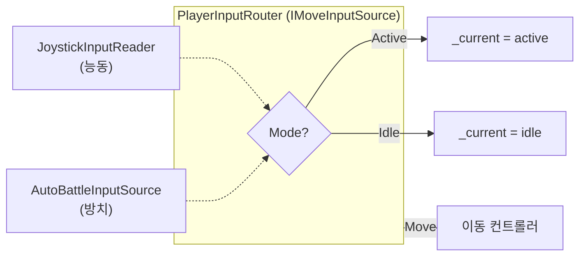
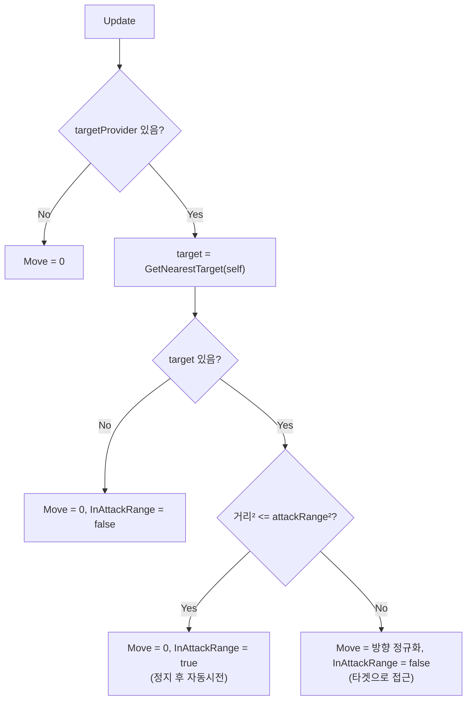

# Player 입력·제어 모드 (Input)

> **종류**: 아키텍처 명세 (as-built) · **상태**: 완료
> **최종 갱신**: 2026-07-10 · **관련 기획서**: [content-roadmap.md](../../gdd/content-roadmap.md) §3.5 (능동↔방치 제어 모드) · [characters-and-companions.md](../../gdd/characters-and-companions.md) §4.1 (방치↔능동 정체성)

---

## 1. 개요·목적

플레이어의 **이동 입력을 공급**하고, **방치(자동전투)↔능동(조이스틱) 두 제어 주체를 런타임에 전환**하는 시스템이다. 이 프로젝트의 하이브리드 장르(방치+능동)를 성립시키는 **핵심 스왑 지점**이다.

핵심 판단은 **"누가 이동을 결정하는가"를 `IMoveInputSource` 하나로 추상화**한 것이다. 사람의 조이스틱과 AI의 자동전투가 같은 계약을 구현하고, `PlayerInputRouter`가 둘을 감싸 활성 소스를 교체한다. 이동·상태머신은 라우터 하나만 바라보므로, 모드 전환이 하위 시스템에 **투명**하게 반영된다.

## 2. 범위(Scope)

| 구분 | 내용 |
|------|------|
| **포함** | 입력 계약(`IMoveInputSource`), 제어 모드(`PlayerControlMode`), 소스 라우터(`PlayerInputRouter`), 능동 입력(`JoystickInputReader`), 방치 입력(`AutoBattleInputSource`), 타겟 선택 계약·구현(`ITargetProvider`/`NearestEnemyTargetProvider`) |
| **미포함(Out of scope)** | 입력을 소비해 실제로 물체를 움직이는 로직([[movement]]), 자동시전 트리거([[skills]]의 `AutoCastController`), 적 목록 관리(Enemy 도메인의 `EnemyRegistry`), 스킬 버튼 UI([[presentation]]) |

## 3. 요구사항·설계 목표

| 요구사항 | 설계적 해석 |
|----------|-------------|
| 방치·능동을 별도 코드로 만들지 않는다 | 두 소스가 `IMoveInputSource` 구현. 이동은 소스 종류를 모름 |
| 런타임에 모드 전환(보스전 진입 등) | `PlayerInputRouter.SetMode`로 활성 소스 교체 |
| 소비처가 소스 교체를 몰라도 되어야 | 라우터 자신이 `IMoveInputSource` → 소비처는 라우터만 참조 |
| 자동전투가 접근·정지·타겟을 스스로 판단 | `AutoBattleInputSource`가 사거리 기반 이동/정지 결정 |
| 타겟 선택 정책을 교체 가능 | `ITargetProvider` 추상(최근접/최저HP 등) |

## 4. 시스템 구조

| 구성요소 | 종류 | 책임 |
|----------|------|------|
| `IMoveInputSource` | interface | 이동 입력 벡터 공급 계약(`Move`) |
| `PlayerControlMode` | enum | `Active`(능동) / `Idle`(방치) |
| `PlayerInputRouter` | class (`IMoveInputSource`) | 활성 소스로 위임하는 라우터. 모드 소유·전환 |
| `JoystickInputReader` | MonoBehaviour (`IMoveInputSource`) | Unity Input System 조이스틱 입력 |
| `AutoBattleInputSource` | MonoBehaviour (`IMoveInputSource`) | 타겟 추적·사거리 판단 자동 이동 |
| `ITargetProvider` | interface | 타겟 선택 계약(`GetNearestTarget`) |
| `NearestEnemyTargetProvider` | class | 최근접 생존 적 선택 |

## 5. 데이터 구조

| 값 | 위치 | 의미 |
|----|------|------|
| `attackRange = 2f` | `AutoBattleInputSource` (직렬화) | 자동전투 정지·공격 개시 사거리 |
| `moveAction` | `JoystickInputReader` (직렬화) | Unity Input System `InputActionReference` |

> 능동/방치 소스는 `PlayerRoot`가 `initialControlMode`로 초기 모드를 지정한다([[README]] 조립 참조).

## 6. 상세 로직·상태

### 6.1 모드 전환 (`PlayerInputRouter`)

- `Move`는 `_current?.Move ?? Vector2.zero` — 소스 미연결 시 안전하게 정지.
- `SetMode`/`ToggleMode`는 `PlayerRoot.SetControlMode` 또는 디버그 훅이 호출.
- 소비처(이동)는 라우터만 참조하므로 전환이 **투명**하다.

### 6.2 자동전투 이동 판단 (`AutoBattleInputSource.Update`)

`InAttackRange`·`CurrentTarget`은 `AutoCastController`가 읽어 자동시전을 트리거한다([[skills]] §6.5). 즉 **이동과 시전의 접점**이 이 두 프로퍼티다.

### 6.3 타겟 선택 (`NearestEnemyTargetProvider`)

`EnemyRegistry.All`을 순회하며 생존(`IsAlive`) 적 중 거리 제곱이 최소인 대상을 선택한다. `sqrMagnitude` 비교로 제곱근 연산을 피한다.

### 6.4 능동 입력 (`JoystickInputReader`)

Unity Input System의 `performed`/`canceled` 콜백으로 `Move` 벡터를 갱신한다. `OnDisable`에서 구독 해제 + `Move=0`으로 입력 잔류를 차단한다.

## 7. 인터페이스·의존성(경계)

| 계약 | 방향 | 설명 |
|------|------|------|
| `IMoveInputSource.Move` | 외부가 **소비** | 이동·상태머신이 읽는 유일한 입력 창구 |
| `PlayerInputRouter.SetMode` | `PlayerRoot`가 **호출** | 모드 전환 소유권은 조립 루트에 있음 |
| `AutoBattleInputSource.Initialize(ITargetProvider)` | `PlayerRoot`가 **주입** | 타겟 정책 주입 |
| `InAttackRange`/`CurrentTarget` | `AutoCastController`가 **읽음** | 자동시전 트리거 신호 |
| `ITargetProvider.GetNearestTarget` | 자동전투가 **호출** | 타겟 선택. `EnemyRegistry` 조회 |

> **경계 원칙**: 라우터가 `IMoveInputSource`를 **구현하면서 동시에 소비**한다(Composite/Proxy). 덕분에 소비처는 "여러 소스가 있고 전환된다"는 사실 자체를 모른 채 단일 소스처럼 사용한다.

## 8. 설계 포인트 (SOLID 매핑)

| 원칙 | 적용 |
|------|------|
| **SRP** | 라우팅(`Router`)·능동입력(`Joystick`)·방치판단(`AutoBattle`)·타겟선택(`Provider`)이 각각 한 책임 |
| **OCP** | 새 입력 소스(제스처·네트워크)나 새 타겟 정책을 인터페이스 구현으로 추가. 소비처 불변 |
| **LSP** | 조이스틱/자동전투/라우터가 모두 `IMoveInputSource`로 상호 대체 가능 |
| **ISP** | `IMoveInputSource`(`Move`만)·`ITargetProvider`(선택만)로 계약 최소화 |
| **DIP** | 이동·자동시전이 구체 소스가 아닌 추상에 의존 |

**하이라이트 패턴**
- **Proxy/Composite 라우터**: `PlayerInputRouter`가 자신도 소스이면서 내부 소스를 감싸 전환을 은닉 — 하이브리드 장르의 단일 스왑 지점.
- **Strategy 타겟 선택**: `ITargetProvider`로 타겟 정책을 전략화.
- **폴백 안전성**: 소스·타겟 미연결 시 항상 `Vector2.zero` 반환으로 미조립 상태에서도 크래시 없이 정지.

## 9. Unity 특화

- **MonoBehaviour 소스**: `Joystick`·`AutoBattle`은 씬 오브젝트(Input System 콜백·`transform` 필요). 라우터·타겟 제공자는 순수 C#.
- **직렬화 인터페이스 우회**: `IMoveInputSource`는 인스펙터에 직접 직렬화 불가 → `MonoBehaviour` 필드로 받아 `PlayerRoot`가 `as IMoveInputSource`로 변환.
- **`Update` 타이밍**: `AutoBattleInputSource`가 `Update`에서 타겟·이동을 갱신 → 이동 컨트롤러의 `ReadInput`(`Update`)이 같은 프레임에 소비.
- **성능 예산**: 타겟 선택이 프레임당 적 수 N 선형 순회(`sqrMagnitude`). 적이 많아지면 공간 분할·캐싱 고려(§12).

## 10. 테스트 케이스

| 대상 | 확인 항목 |
|------|-----------|
| 모드 전환 | `SetMode(Idle)` 후 `Move`가 방치 소스 값 반영 |
| 토글 | `ToggleMode` 반복 시 Active↔Idle 교대 |
| 소스 미연결 | 활성 소스 null이면 `Move==Vector2.zero` |
| 사거리 진입 | 타겟이 `attackRange` 내면 `Move==0`, `InAttackRange==true` |
| 접근 | 사거리 밖이면 정규화된 방향 벡터, `InAttackRange==false` |
| 타겟 없음 | 생존 적 없으면 `CurrentTarget==null`, 정지 |

> 라우터·타겟 제공자는 순수 C#이라 목 소스로 EditMode 검증 가능.

## 11. 리스크·미결정(TBD)

- **`attackRange` 이원화**: 자동전투 사거리(`AutoBattleInputSource.attackRange`, 직렬화 상수)가 스탯의 `Range`([[stats]])와 별개다. 사거리 스탯을 이동/자동전투가 읽도록 통합할지 미결정.
- **타겟 순회 비용**: `NearestEnemyTargetProvider`가 매 프레임 전체 적을 순회. 대규모 방치 전투 시 병목 가능.
- **입력 데드존 위치**: 데드존 처리는 이동 컨트롤러가 하고([[movement]]), 라우터는 원시 값을 전달 — 소스별 데드존 정책이 필요하면 재배치.

## 12. 확장 여지

- **새 제어 주체**: 네트워크(원격 플레이어)·리플레이·튜토리얼 스크립트 입력을 `IMoveInputSource`로 추가.
- **타겟 정책 확장**: "최저 HP"·"최고 위협"·"지정 우선" 등을 `ITargetProvider` 구현으로 교체([[README]]의 확장 예시).
- **다중 모드**: 현재 2모드(Active/Idle). 반자동 등 3모드 이상은 라우터의 소스 맵 확장으로 수용.

## 13. 파일 위치

| 구분 | 파일 | 경로 |
|------|------|------|
| 계약 | `IMoveInputSource` | `Features/Player/StateMachine/Contracts/IMoveInputSource.cs` |
| 모드 | `PlayerControlMode` | `Features/Player/Input/PlayerControlMode.cs` |
| 라우터 | `PlayerInputRouter` | `Features/Player/Input/PlayerInputRouter.cs` |
| 능동 | `JoystickInputReader` | `Features/Player/Input/JoystickInputReader.cs` |
| 방치 | `AutoBattleInputSource` | `Features/Player/Input/AutoBattleInputSource.cs` |
| 타겟 | `ITargetProvider` · `NearestEnemyTargetProvider` | `Features/Enemy/*.cs` |
