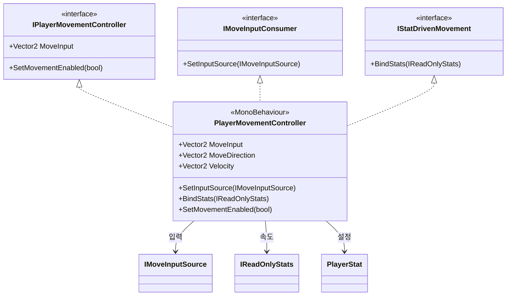
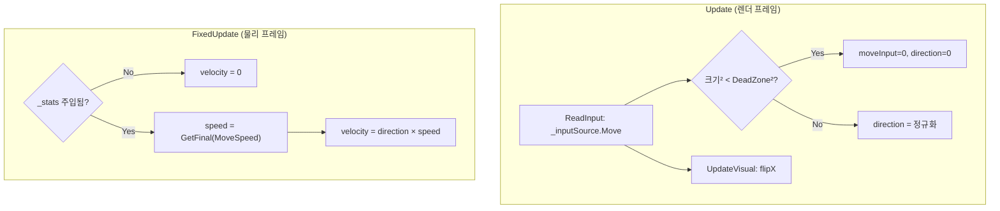
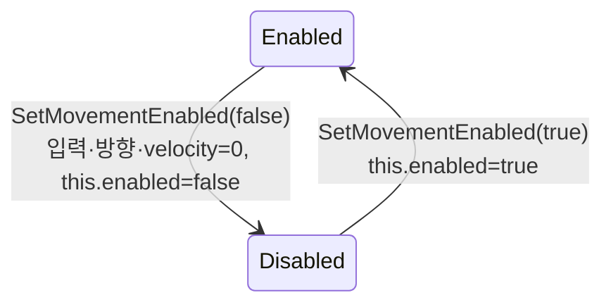
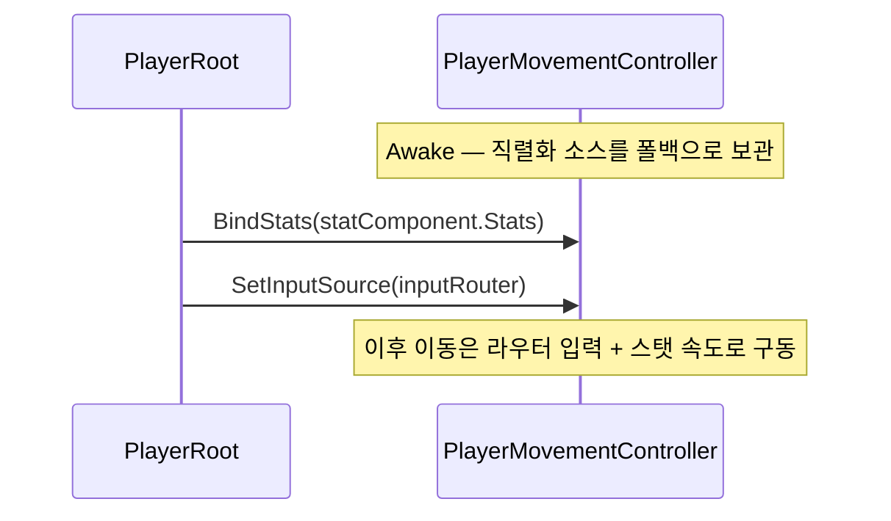

# Player 이동 (Movement)

> **종류**: 아키텍처 명세 (as-built) · **상태**: 완료
> **최종 갱신**: 2026-07-10 · **관련 기획서**: [content-roadmap.md](../../gdd/content-roadmap.md) · [characters-and-companions.md](../../gdd/characters-and-companions.md) §4.1 (거리 기반 스탠스·이동)

---

## 1. 개요·목적

플레이어를 **물리(Rigidbody2D)로 이동**시키는 컨트롤러다. 입력 소스([[input]])에서 방향을, 스탯 시스템([[stats]])에서 속도를 받아 실제 속도(velocity)를 구동하고, 스프라이트 방향 전환도 처리한다.

핵심 판단은 **이동속도의 단일 출처(Single Source of Truth)** 다. 과거 이동 컨트롤러가 자체 SO에서 속도를 읽던 구조를 폐기하고, `IReadOnlyStats`를 주입받아 `MoveSpeed` 스탯을 읽는다. 이렇게 해서 장비·버프로 변동된 이동속도가 **자동으로** 이동에 반영된다. 입력 소스도 주입식(`IMoveInputConsumer`)이라, 방치↔능동 전환이 이동 컨트롤러에 투명하다.

## 2. 범위(Scope)

| 구분 | 내용 |
|------|------|
| **포함** | 물리 이동 컨트롤러(`PlayerMovementController`), 상태머신용 이동 계약(`IPlayerMovementController`), 입력 소스 주입 계약(`IMoveInputConsumer`), 스탯 주입 계약(`IStatDrivenMovement`), 이동 설정 데이터(`PlayerStat`) |
| **미포함(Out of scope)** | 입력 값 생성([[input]]), 이동속도 스탯 계산([[stats]]), 이동 허용/차단을 **결정**하는 로직([[state-machine]]의 `Hit`/`Dead`가 `SetMovementEnabled` 호출), 애니메이션([[README]] 참조) |

## 3. 요구사항·설계 목표

| 요구사항 | 설계적 해석 |
|----------|-------------|
| 장비/버프 이동속도 변동이 즉시 반영 | `IReadOnlyStats.GetFinal(MoveSpeed)`를 매 물리 프레임 조회 |
| 방치↔능동 전환이 이동에 투명 | `IMoveInputConsumer.SetInputSource`로 라우터 주입 |
| 경직·사망 시 즉시 정지 | `IPlayerMovementController.SetMovementEnabled(false)` |
| 미세 입력 흔들림 제거 | `PlayerStat.InputDeadZone`으로 데드존 처리 |
| 이동 방향에 맞춰 스프라이트 반전 | `useSpriteFlip` 옵션 기반 `flipX` |
| 물리 안정성 | Rigidbody2D를 코드로 일관 설정(중력0·회전잠금·보간·연속충돌) |

## 4. 시스템 구조

| 구성요소 | 종류 | 책임 |
|----------|------|------|
| `PlayerMovementController` | MonoBehaviour | 입력·스탯 → Rigidbody2D velocity 구동, 스프라이트 반전, 이동 on/off |
| `IPlayerMovementController` | interface | 상태머신용: `MoveInput` 조회·`SetMovementEnabled` |
| `IMoveInputConsumer` | interface | 입력 소스 런타임 주입(`SetInputSource`) |
| `IStatDrivenMovement` | interface | 스탯 소스 주입(`BindStats`) |
| `PlayerStat` | ScriptableObject | 이동 설정 값(데드존·스프라이트 반전) |

## 5. 데이터 구조

### `PlayerStat` (ScriptableObject)

**전투 수치를 담지 않는다** — 그것은 `StatMachine`이 소유([[stats]]). 이 SO는 이동 컨트롤러의 순수 설정 값만 보관한다.

| 필드 | 의미 |
|------|------|
| `InputDeadZone` | 이 크기 이하 입력은 0으로 무시(미세 흔들림 차단) |
| `useSpriteFlip` | 이동 방향에 따른 좌우 스프라이트 반전 사용 여부 |

## 6. 상세 로직·상태

### 6.1 프레임 파이프라인

- **입력(방향)은 `Update`**, **이동(물리)은 `FixedUpdate`** 로 분리 — 물리 안정성 확보.
- 스탯 미주입 상태에서는 정지(velocity 0) — 조립 순서 안전장치.

### 6.2 이동 on/off (`SetMovementEnabled`)

`this.enabled=false`로 `Update`/`FixedUpdate`를 정지시키고, 잔류 velocity·입력을 0으로 청소한다. `OnDisable`에서도 velocity를 0으로 방어. 호출 주체는 상태머신의 `Hit`(경직)·`Dead`(사망)와 스킬 시전([[skills]] `CanMoveWhileCasting`).

### 6.3 입력·스탯 주입 흐름

`Awake`의 직렬화 `inputSourceBehaviour`는 **조립 전 폴백**이다. `PlayerRoot`가 라우터를 주입하면 방치↔능동 전환이 반영된다. 라우터 미배선 시엔 폴백 소스를 그대로 사용해 동작을 보존한다([[README]] 조립).

## 7. 인터페이스·의존성(경계)

| 계약 | 방향 | 설명 |
|------|------|------|
| `IPlayerMovementController.MoveInput` | 상태머신이 **읽음** | `Idle`/`Move` 전이 판정용([[state-machine]]) |
| `IPlayerMovementController.SetMovementEnabled` | 외부가 **호출** | 경직·사망·시전 시 이동 차단 |
| `IMoveInputConsumer.SetInputSource` | `PlayerRoot`가 **주입** | 입력 라우터 연결([[input]]) |
| `IStatDrivenMovement.BindStats` | `PlayerRoot`가 **주입** | 이동속도 스탯 소스 연결([[stats]]) |
| `IReadOnlyStats.GetFinal(MoveSpeed)` | 이동이 **읽음** | 이동속도의 단일 출처 |

> **경계 원칙**: 이동 컨트롤러는 세 계약(`IPlayerMovementController`/`IMoveInputConsumer`/`IStatDrivenMovement`)을 **분리** 구현한다. 상태머신은 이동 상태만, 조립 루트는 주입만 필요로 하므로, 각 소비처가 필요한 계약만 참조한다(ISP).

## 8. 설계 포인트 (SOLID 매핑)

| 원칙 | 적용 |
|------|------|
| **SRP** | 이동 컨트롤러는 "방향×속도→물리 구동"만. 입력 생성·속도 계산은 외부 |
| **OCP** | 입력 소스·스탯 소스를 주입으로 교체. 이동 로직 수정 없이 소스 변경 |
| **LSP** | 어떤 `IMoveInputSource`·`IReadOnlyStats`로도 대체 가능 |
| **ISP** | 이동의 세 관심사를 3개 인터페이스로 분리 — 소비처별 최소 계약 |
| **DIP** | 구체 조이스틱/StatMachine이 아닌 추상에 의존 |

**하이라이트 패턴**
- **SoT 이동속도**: velocity를 매 물리 프레임 스탯에서 재계산 → 버프 만료/장비 교체가 별도 통지 없이 반영.
- **주입식 폴백**: 직렬화 소스를 기본값으로 두고 런타임 주입으로 덮어써, 미조립 상태에서도 독립 실행·테스트 가능.
- **Update/FixedUpdate 분리**: 입력 샘플링과 물리 적분을 각자 올바른 루프에 배치.

## 9. Unity 특화

- **컴포넌트 강제**: `[RequireComponent(Rigidbody2D, SpriteRenderer)]`·`[DisallowMultipleComponent]`로 배치 실수 방지.
- **Rigidbody2D 설정(`ConfigureRigidBody`)**: 중력0·회전잠금·`Interpolate`·`Continuous` 충돌 — 탑다운 2D 이동에 맞춘 코드 설정(인스펙터 의존 제거).
- **`linearVelocity` 직접 구동**: 힘(force)이 아닌 속도 직접 설정으로 즉각 반응성 확보(방치 게임의 결정론적 이동).
- **성능 예산**: 프레임당 스탯 조회 1회 + 벡터 연산 소수. GC Alloc 없음.

## 10. 테스트 케이스

| 대상 | 확인 항목 |
|------|-----------|
| 데드존 | `InputDeadZone` 이하 입력이 방향 0으로 처리 |
| 속도 반영 | `MoveSpeed` 변경 시 다음 물리 프레임 velocity 변화 |
| 스탯 미주입 | `BindStats` 전 velocity 0 유지 |
| 이동 차단 | `SetMovementEnabled(false)` 시 velocity·입력 0, 컴포넌트 비활성 |
| 소스 스왑 | `SetInputSource` 교체 후 새 소스 입력 반영 |
| 스프라이트 반전 | `useSpriteFlip` on 시 방향 x부호에 따라 flipX |

> `MoveInput` 판정·데드존은 순수 로직이나, 물리 구동은 PlayMode 통합 테스트가 적합.

## 11. 리스크·미결정(TBD)

- **가속/감속 없음**: velocity를 즉시 목표값으로 설정 → 관성·감속이 없다. 게임 필 튜닝 시 보간 필요할 수 있음.
- **`playerStat` null 방어 부재**: `ReadInput`이 `playerStat.InputDeadZone`을 직접 참조 — SO 미배선 시 NRE. 조립 검증 필요.
- **시전 후 이동 복원 단순화**: 시전 종료 시 무조건 `SetMovementEnabled(true)`([[skills]] `EndCast` 주석: "특정 상태에 따른 이동 복원 추가" TBD) — 경직/사망과 겹칠 때 복원 우선순위 미정.
- **스프라이트 반전 방향 규약**: `x>0`일 때 `flipX=true`가 에셋 기본 방향과 일치하는지 확인 필요(에셋 의존).

## 12. 확장 여지

- **이동 보간**: 목표 velocity로의 가속/감속 곡선 추가(로직 국소 변경).
- **상태별 이동 계수**: 시전 중 감속 등은 스탯 modifier([[stats]])나 상태별 계수로 확장.
- **8방향/그리드 이동**: `MoveDirection` 정규화 단계에 스냅 로직 삽입 여지.
- **애니메이션 연동**: `MoveDirection`/`Velocity`를 애니메이터 파라미터로 노출([[state-machine]] `IPlayerAnimationController` 연동과 함께).

## 13. 파일 위치

| 구분 | 파일 | 경로 |
|------|------|------|
| 컨트롤러 | `PlayerMovementController` | `Features/Player/Movement/PlayerMovementController.cs` |
| 계약 | `IPlayerMovementController` | `Features/Player/StateMachine/Contracts/IPlayerMovementController.cs` |
| 계약 | `IMoveInputConsumer` | `Features/Player/Movement/IMoveInputConsumer.cs` |
| 계약 | `IStatDrivenMovement` | `Features/Player/Movement/IStatDrivenMovement.cs` |
| 데이터 | `PlayerStat` | `Data/Definitions/PlayerStat.cs` |
