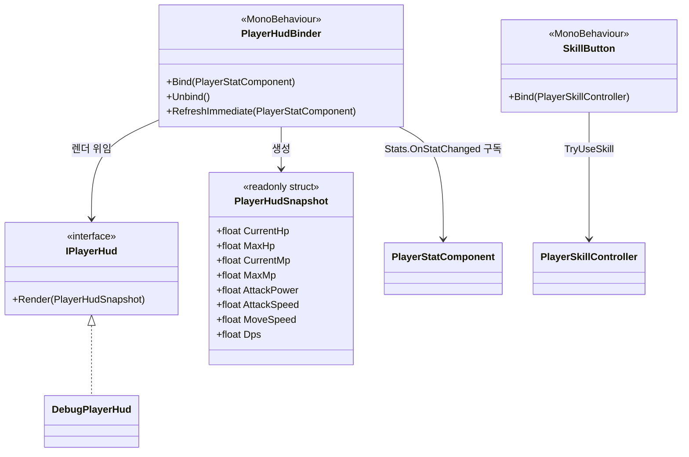
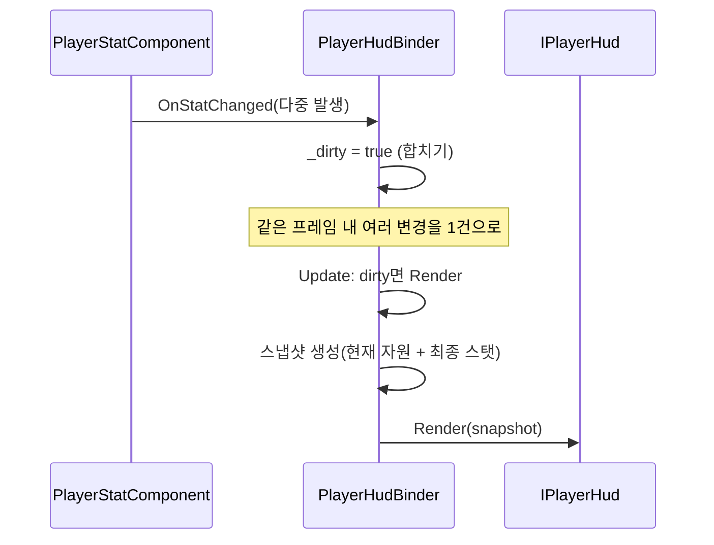
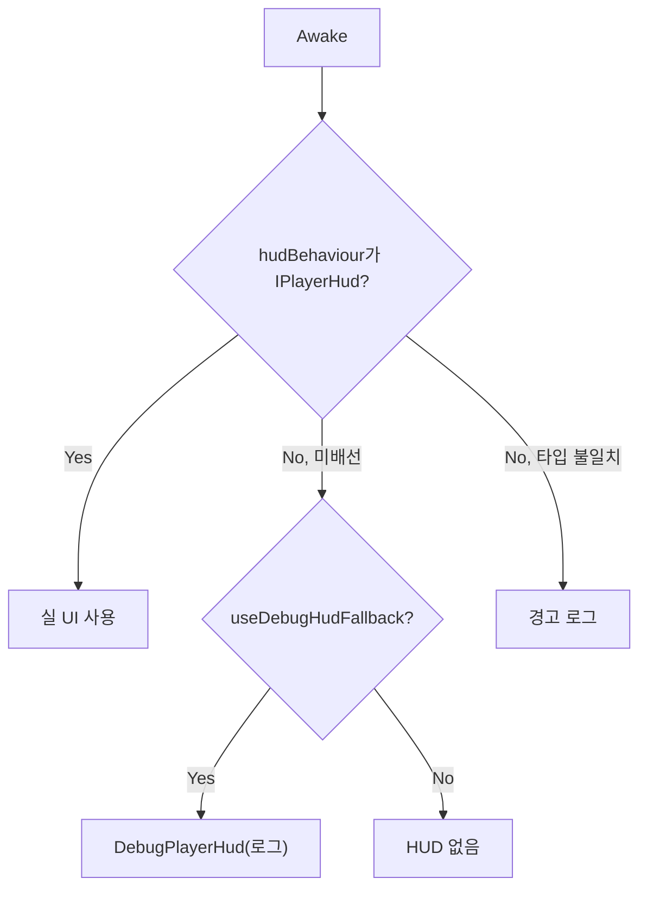

# Player 표현 계층 (Presentation)

> **종류**: 아키텍처 명세 (as-built) · **상태**: 완료
> **최종 갱신**: 2026-07-10 · **관련 기획서**: [content-roadmap.md](../../gdd/content-roadmap.md) §5.3 (HUD 실체화) · [characters-and-companions.md](../../gdd/characters-and-companions.md) §5 (동료 스킬 버튼)

---

## 1. 개요·목적

플레이어 상태를 **화면에 표시**(HUD)하고 **입력을 받는**(스킬 버튼) UI 경계 계층이다. 도메인 로직(스탯·스킬)과 UI 구현 사이에 **DTO 스냅샷·인터페이스**를 두어, 실제 UI가 없어도(로그 HUD) 시스템이 돌아가고 나중에 UI로 무손실 교체된다.

핵심 판단은 **프레젠테이션이 도메인 내부 구조에 의존하지 않게 하는 경계**다. HUD는 `StatMachine`을 직접 읽지 않고 `PlayerHudSnapshot`(값 DTO)만 받으며, 스탯 변경은 `PlayerHudBinder`가 **프레임당 1회로 합쳐** 렌더 폭주를 막는다.

## 2. 범위(Scope)

| 구분 | 내용 |
|------|------|
| **포함** | HUD 표시 계약(`IPlayerHud`), HUD DTO(`PlayerHudSnapshot`), 스탯↔HUD 어댑터(`PlayerHudBinder`), 로그 HUD(`DebugPlayerHud`), 스킬 버튼(`SkillButton`), 에디터 디버그 명령(`PlayerDebugCommands`) |
| **미포함(Out of scope)** | 스탯 계산·자원([[stats]]), 스킬 시전([[skills]]), 실제 UI 위젯(체력바 프리팹 등 — `IPlayerHud` 구현으로 후속), 애니메이션(§11) |

## 3. 요구사항·설계 목표

| 요구사항 | 설계적 해석 |
|----------|-------------|
| UI 없이도 동작·검증 가능 | `DebugPlayerHud`(로그) 폴백. `IPlayerHud`로 실 UI 교체 |
| HUD가 도메인 내부에 결합되지 않아야 | `PlayerHudSnapshot` DTO만 전달 |
| 스탯 다중 변경 시 렌더 폭주 방지 | 변경을 dirty 플래그로 모아 `Update` 프레임당 1회 렌더 |
| 스킬 버튼이 시전 파이프라인 재사용 | 버튼 클릭 → `TryUseSkill(slot)` 단일 진입점 |
| 디버그 관심사를 조립 루트에서 분리 | `PlayerDebugCommands`(에디터 전용)로 격리 |

## 4. 시스템 구조

| 구성요소 | 종류 | 책임 |
|----------|------|------|
| `IPlayerHud` | interface | HUD 렌더 계약(`Render(snapshot)`) |
| `PlayerHudSnapshot` | readonly struct | HUD 표시용 값 DTO(HP/MP/ATK/DPS 등) |
| `PlayerHudBinder` | MonoBehaviour | 스탯 변경 구독→프레임 합치기→스냅샷 생성→HUD 위임 |
| `DebugPlayerHud` | class (`IPlayerHud`) | 로그 기반 임시 HUD |
| `SkillButton` | MonoBehaviour | 슬롯 버튼 클릭→스킬 시전 |
| `PlayerDebugCommands` | MonoBehaviour (에디터 전용) | ContextMenu 디버그 훅 |

## 5. 데이터 구조

### `PlayerHudSnapshot` (readonly struct, DTO)

HUD가 필요로 하는 **값만** 담은 불변 스냅샷: `CurrentHp/MaxHp`, `CurrentMp/MaxMp`, `AttackPower`, `AttackSpeed`, `MoveSpeed`, `Dps`. `StatMachine` 내부 구조를 노출하지 않는 경계 역할.

## 6. 상세 로직·상태

### 6.1 HUD 갱신 (프레임 합치기)

- 초기화·장비/버프 다중 적용 시 `OnStatChanged`가 연쇄 발생 → dirty로 합쳐 **프레임당 1회**만 렌더.
- `RefreshImmediate`: 디버그 명령·`Bind` 직후 즉시 1회 렌더(합치기 우회).
- `Bind`/`Unbind`/`OnDestroy`로 구독 수명 관리(이벤트 누수 방지).

### 6.2 HUD 구현 선택 (`PlayerHudBinder.Awake`)

### 6.3 스킬 버튼 (`SkillButton`)

`PlayerRoot`가 `Bind(skillController)`로 배선 → 버튼 클릭 시 `TryUseSkill(slotIndex)` 호출(타겟 없이). 능동 모드의 수동 시전 진입점([[skills]]). `OnDestroy`에서 리스너 해제.

### 6.4 에디터 디버그 (`PlayerDebugCommands`)

`#if UNITY_EDITOR`로 전체가 감싸여 빌드 제외. ContextMenu로 `PlayerRoot`의 디버그 훅(데미지·버프·경험치·모드전환)을 호출. 조립 루트에서 디버그 관심사를 분리.

## 7. 인터페이스·의존성(경계)

| 계약 | 방향 | 설명 |
|------|------|------|
| `IPlayerHud.Render` | `Binder`가 **호출** | HUD 구현 위임(로그↔실 UI 교체) |
| `PlayerStatComponent.Stats.OnStatChanged` | `Binder`가 **구독** | 스탯 변경 신호. `StatMachine`(`.Stats`)이 발행([[stats]]) |
| `PlayerSkillController.TryUseSkill` | `SkillButton`이 **호출** | 시전 진입점([[skills]]) |
| `PlayerRoot.Debug*` 훅 | `DebugCommands`가 **호출** | 에디터 디버그(내부 API) |
| `Bind(...)` | `PlayerRoot`가 **호출** | HUD·버튼 배선 |

> **경계 원칙**: 프레젠테이션은 도메인을 **읽기·트리거만** 한다. HUD는 DTO만 받아 도메인 타입에 무지하고, 버튼은 시전 결과를 판단하지 않고 파이프라인에 위임한다. 이 단방향 경계로 UI를 자유롭게 교체·삭제할 수 있다.

## 8. 설계 포인트 (SOLID 매핑)

| 원칙 | 적용 |
|------|------|
| **SRP** | 어댑터(`Binder`)·표시(`IPlayerHud`)·입력(`SkillButton`)·디버그(`DebugCommands`)가 각각 한 책임 |
| **OCP** | 새 HUD는 `IPlayerHud` 구현 추가로 교체. `Binder` 불변 |
| **LSP** | `DebugPlayerHud`·실 UI가 상호 대체 가능 |
| **ISP** | `IPlayerHud`는 `Render` 하나. HUD는 그 이상 몰라도 됨 |
| **DIP** | `Binder`가 구체 UI가 아닌 `IPlayerHud` 추상에 의존 |

**하이라이트 패턴**
- **DTO 경계**: `PlayerHudSnapshot`(readonly struct)로 도메인↔UI를 격리 — UI가 스탯 내부에 결합되지 않음.
- **프레임 합치기(coalescing)**: dirty 플래그로 다중 변경을 1렌더로 — 초기화 폭주 방지.
- **Null Object 폴백**: `DebugPlayerHud`가 실 UI 부재 시 시스템을 정상 동작시킴.
- **디버그 격리**: 에디터 전용 컴파일 가드로 프로덕션 코드 오염 차단.

## 9. Unity 특화

- **직렬화 인터페이스 우회**: `hudBehaviour`(`MonoBehaviour`)를 `as IPlayerHud`로 변환(인스펙터 직렬화 한계 대응).
- **`readonly struct` DTO**: `in` 파라미터로 전달해 값 복사 비용 최소화(GC 없음).
- **수명 관리**: `Bind`에서 구독, `Unbind`/`OnDestroy`에서 해제 — 씬 파괴 시 이벤트 누수 차단.
- **성능 예산**: 렌더는 dirty일 때만. 스냅샷 생성은 struct라 힙 할당 없음. `DebugPlayerHud`의 문자열 보간은 디버그 전용.

## 10. 테스트 케이스

| 대상 | 확인 항목 |
|------|-----------|
| 프레임 합치기 | 한 프레임 다중 `OnStatChanged` → `Render` 1회 |
| 즉시 렌더 | `RefreshImmediate` 시 dirty 무관 1회 |
| 폴백 | `hudBehaviour` 미배선 + fallback on → 로그 HUD |
| 타입 경고 | `IPlayerHud` 미구현 behaviour 배선 시 경고 |
| 구독 해제 | `Unbind` 후 `OnStatChanged` 발생해도 미렌더 |
| 버튼 시전 | 클릭 시 해당 슬롯 `TryUseSkill` 호출 |

## 11. 리스크·미결정(TBD)

- **애니메이션 미구현**: `PlayerAnimationController`(`Features/Player/Animation`)는 `IPlayerAnimationController`를 구현하지만 **본문이 빈 스텁**이다. 계약 자체도 멤버가 없어([[state-machine]]) 상태 전이가 애니메이션과 연결되지 않는다 → 표현 계층의 최우선 미구현 항목.
- **스킬 버튼 상태 표시 없음**: 쿨다운·MP 부족 시 버튼 비활성/게이지 표시가 없다. `SkillCooldownTracker`([[skills]]) 구독 필요.
- **`RefreshImmediate` 인자 미사용**: 파라미터 `statComponent`를 받지만 내부 `_statComponent`를 쓴다 — 시그니처 정리 여지.
- **실 UI 부재**: 체력바·자원바·DPS 표시 등 실제 위젯이 아직 없음(로그로만 검증).

## 12. 확장 여지

- **실 UI HUD**: `IPlayerHud`를 구현한 uGUI/UI Toolkit 위젯으로 교체(`Binder` 불변).
- **스킬 버튼 피드백**: 쿨다운 마스크·MP 부족 표시·아이콘(`SkillDefinition.Icon`) 바인딩.
- **버프/상태 표시**: 활성 버프 아이콘·잔여 시간 HUD([[buffs]]).
- **애니메이션 계약 구현**: `OnStateChanged`([[state-machine]]) 구독으로 상태별 애니메이션 재생.

## 13. 파일 위치

| 구분 | 파일 | 경로 |
|------|------|------|
| 계약 | `IPlayerHud` | `Features/Player/Presentation/IPlayerHud.cs` |
| DTO | `PlayerHudSnapshot` | `Features/Player/Presentation/PlayerHudSnapshot.cs` |
| 어댑터 | `PlayerHudBinder` | `Features/Player/Presentation/PlayerHudBinder.cs` |
| 로그 HUD | `DebugPlayerHud` | `Features/Player/Presentation/DebugPlayerHud.cs` |
| 버튼 | `SkillButton` | `Features/Player/Presentation/SkillButton.cs` |
| 디버그 | `PlayerDebugCommands` | `Features/Player/Presentation/PlayerDebugCommands.cs` |
| 애니메이션(스텁) | `PlayerAnimationController` | `Features/Player/Animation/PlayerAnimationController.cs` |
