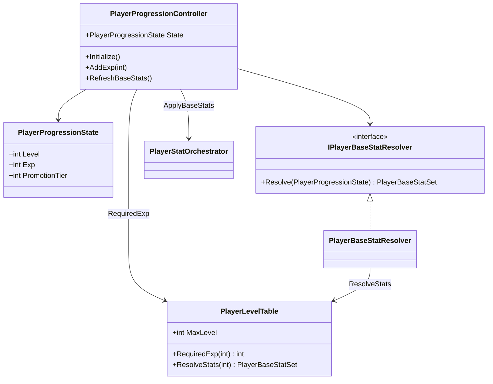
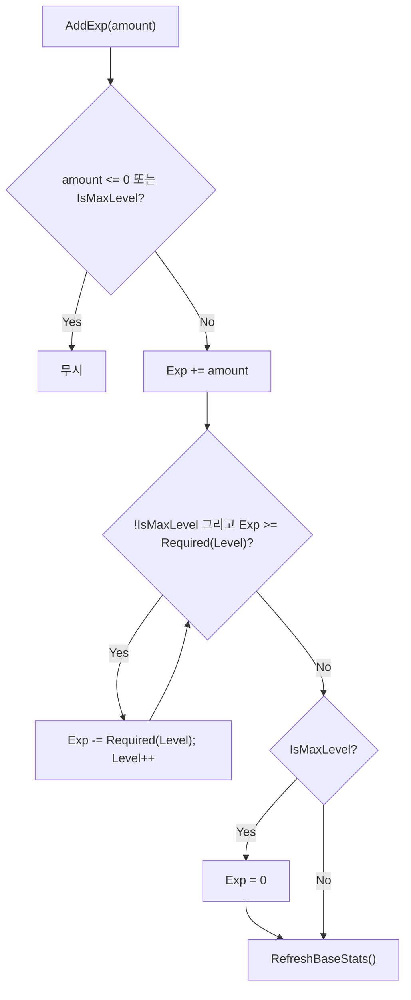
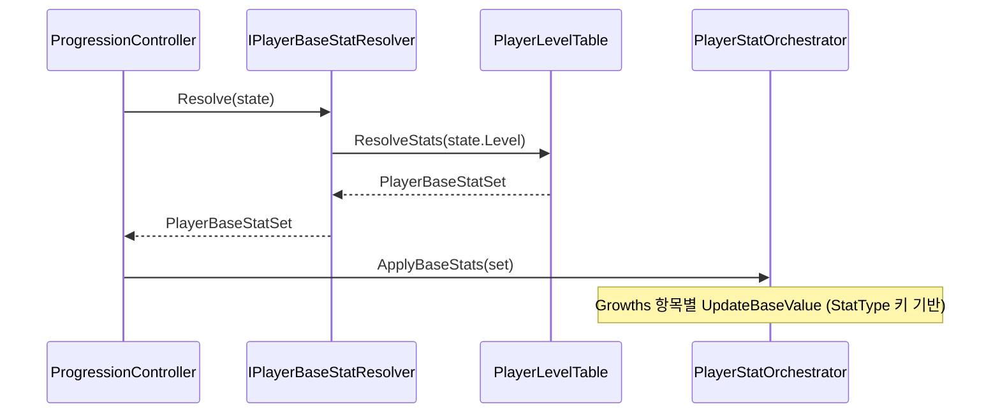

# Player 성장 (Progression)

> **종류**: 아키텍처 명세 (as-built) · **상태**: 완료
> **최종 갱신**: 2026-07-22 · **관련 기획서**: [content-roadmap.md](../../gdd/content-roadmap.md) §2.3·§5.2 (레벨→스탯) · [characters-and-companions.md](../../gdd/characters-and-companions.md) §4.3 (전직·스킬 습득) · **설계 근거**: [m0-close-the-loop-plan.md](../../design/m0-close-the-loop-plan.md) §5.1 (레벨 테이블·리졸버)

---

## 1. 개요·목적

플레이어의 **레벨·경험치·승급 상태를 관리**하고, 그 결과를 **베이스 스탯**으로 환산해 스탯 시스템([[stats]])에 반영하는 시스템이다. 경험치 획득 → 레벨업 → 베이스 스탯 재계산의 순환을 담당한다.

핵심 판단은 **"성장 상태의 소유"와 "베이스 스탯 산출 규칙"의 분리**다. 컨트롤러는 레벨/경험치 상태만 들고, "레벨→스탯" 환산은 `IPlayerBaseStatResolver`에 위임한다. 성장 규칙(필요 경험치·레벨별 스탯)의 단일 진실 공급원은 `PlayerLevelTable`(SO)이며, 리졸버는 이를 조회해 산출한다. 전직·연구 보정을 합산하는 확장은 리졸버 교체/수정만으로 가능하게 열려 있다.

> **갱신(2026-07-21)**: 종전의 "샘플 리졸버가 레벨을 무시해 레벨업해도 스탯이 안 오름" 단절이 해소되었다. `PlayerLevelTable` 신설과 리졸버 구현(커밋 `58906bd`·`686a470`·`2969838`)으로 경험치 → 레벨업 → 베이스 스탯 실증가가 동작한다. 계약도 `Resolve(state, config)`에서 `Resolve(state)`로 바뀌어 config 의존이 제거되었다.

## 2. 범위(Scope)

| 구분 | 내용 |
|------|------|
| **포함** | 성장 컨트롤러(`PlayerProgressionController`), 성장 상태(`PlayerProgressionState`), 베이스 스탯 환산 계약·구현(`IPlayerBaseStatResolver`/`PlayerBaseStatResolver`), 성장 규칙 데이터(`PlayerLevelTable`), 시작 상태 설정(`PlayerProgressionConfig`) |
| **미포함(Out of scope)** | 베이스 스탯을 `StatMachine`에 실제 적용하는 로직([[stats]]의 `PlayerStatOrchestrator.ApplyBaseStats`), 장비·버프 성장([[equipment]]·[[buffs]]) |

> **갱신(2026-07-11)**: 종전 out of scope였던 "경험치를 **주는** 주체"가 이제 배선되었다. 적 처치 보상이 `IExpReceiver.AddExp`로 경험치를 지급한다. 배선 상세(허브·브리지)는 성장 도메인이 아니라 [적 처치 경험치 보상 계획서](../../design/enemy-kill-exp-reward-plan.md)에 있고, 이 명세는 **수신 계약(`IExpReceiver`) 구현 사실만** 기록한다.

## 3. 요구사항·설계 목표

| 요구사항 | 설계적 해석 |
|----------|-------------|
| 경험치 누적 시 자동 레벨업 | `AddExp`에서 필요 경험치 초과분을 while로 소진하며 다중 레벨업 |
| 레벨업이 스탯에 즉시 반영 | 레벨 변경 후 `RefreshBaseStats` → `Orchestrator.ApplyBaseStats` |
| 성장 산출 규칙을 교체 가능 | `IPlayerBaseStatResolver` 추상. 전직·연구 보정은 리졸버에 합산해 확장 |
| 초기 상태를 데이터로 지정 | `PlayerProgressionConfig`(SO)의 시작 레벨/경험치/전직 차수 |
| 성장 규칙을 데이터로 지정 | `PlayerLevelTable`(SO)의 경험치 곡선·스탯 성장 목록. 기획자가 코드 수정 없이 밸런스 조정 |

## 4. 시스템 구조

| 구성요소 | 종류 | 책임 |
|----------|------|------|
| `PlayerProgressionController` | class | 경험치 누적·레벨업·베이스 스탯 갱신 조율 |
| `PlayerProgressionState` | class | 런타임 성장 상태(Level·Exp·PromotionTier) |
| `IPlayerBaseStatResolver` | interface | `(상태) → PlayerBaseStatSet` 환산 계약 |
| `PlayerBaseStatResolver` | class | `PlayerLevelTable` 조회 구현(레벨 실반영) |
| `PlayerLevelTable` | ScriptableObject | 성장 규칙의 단일 진실 공급원(필요 경험치·레벨별 스탯) |
| `PlayerProgressionConfig` | ScriptableObject | 시작 상태(신규 게임 진입점)만 |

## 5. 데이터 구조

### `PlayerProgressionConfig` (ScriptableObject) — 시작 상태

| 필드 | 의미 |
|------|------|
| `StartLevel`·`StartExp`·`PromotionTier` | 런타임 상태 초기값(신규 게임 진입점). 레벨은 `[1, MaxLevel]`로 클램프 |

> 종전의 시작 베이스 스탯 필드(`StartMaxHp` 등 8종)는 **제거**되었다. "시작 상태"와 "성장 규칙"을 분리해 스탯의 진실 공급원을 `PlayerLevelTable` 하나로 만들기 위함이다(SRP).

### `PlayerLevelTable` (ScriptableObject) — 성장 규칙

| 그룹 | 필드 | 의미 |
|------|------|------|
| 레벨 상한 | `MaxLevel`(기본 100) | 최고 레벨. 도달 시 경험치 수신 중단, 잔여 경험치 0 수렴 |
| 경험치 곡선 | `BaseRequiredExp`(기본 100)·`ExpGrowthRate`(기본 1.12) | `Required(level) = BaseRequiredExp × ExpGrowthRate^(level-1)` |
| 스탯 성장 | `Growths[]`(`StatType`·`BaseValue`·`PerLevel`) | `Value(level) = BaseValue + PerLevel × (level-1)` (선형). 목록에 없는 스탯은 레벨로 오르지 않음 |

> 기획자는 이 SO로 성장 곡선을 코드 수정 없이 조정한다. 에디터 `OnValidate`가 최고 레벨 스탯이 float 안전 상한(`1e7`, [content-roadmap.md](../../gdd/content-roadmap.md) §3.6)을 넘으면 경고한다. 스탯 성장을 지수 대신 **선형**으로 둔 것도 같은 이유(유한형 기획 결정).

## 6. 상세 로직·상태

### 6.1 경험치·레벨업 (`AddExp`)

- 필요 경험치: `Required(level) = BaseRequiredExp × ExpGrowthRate^(level-1)` — 공식은 `PlayerLevelTable.RequiredExp`가 소유한다(코드 상수 아님). 곡선이 int 범위를 넘으면 `int.MaxValue`로 클램프(설정 실수 방어).
- while 루프로 **한 번의 대량 경험치 획득에 다중 레벨업**을 지원(오프라인 보상·보스 처치 대비).
- **최고 레벨 정책**: `IsMaxLevel`이면 경험치 수신을 무시하고, 도달 시 잔여 경험치를 0으로 수렴시킨다(표시·저장 모두 단순화).

### 6.2 베이스 스탯 갱신 (`RefreshBaseStats`)

베이스 스탯은 **base 값**으로 반영된다(modifier 아님, [[stats]] §6.4). 레벨업은 스탯의 뿌리를 갱신하고, 장비·버프는 그 위에 modifier로 얹힌다.

`PlayerBaseStatSet`은 고정 필드(MaxHp, AttackPower, …)가 아니라 **`StatType` 키 기반** 컬렉션이다. 새 스탯을 레벨 성장에 참여시키는 일이 `PlayerLevelTable.Growths`에 항목을 추가하는 데이터 작업만으로 끝난다(OCP).

## 7. 인터페이스·의존성(경계)

| 계약 | 방향 | 설명 |
|------|------|------|
| `IExpReceiver.AddExp(int)` | 외부가 **호출** | 경험치 수신 진입점. `PlayerProgressionController`가 구현. 적 처치 브리지(`EnemyExpRewardHandler`)가 이 계약으로만 성장을 안다 |
| `IPlayerBaseStatResolver.Resolve` | 내부 **위임** | 성장 산출 규칙(교체 가능) |
| `PlayerStatOrchestrator.ApplyBaseStats` | 이 계층이 **호출** | 베이스 스탯 반영([[stats]]) |
| `PlayerProgressionController.State` | 외부가 **조회** | HUD 등 성장 상태 표시([[presentation]]) |

> **경계 원칙**: 컨트롤러는 스탯을 **직접** 만지지 않는다. `Orchestrator` API를 통해서만 반영해, "성장이 스탯을 바꾼다"는 사실이 `SourceId`/base 경로로 일관되게 추적된다.

## 8. 설계 포인트 (SOLID 매핑)

| 원칙 | 적용 |
|------|------|
| **SRP** | 상태 소유(Controller/State)·환산 규칙(Resolver)·반영(Orchestrator)이 분리 |
| **OCP** | 실무 성장 공식은 새 `IPlayerBaseStatResolver` 구현으로 교체. 컨트롤러 불변 |
| **LSP** | 어떤 리졸버로도 대체 가능. 컨트롤러는 구현을 모름 |
| **DIP** | 컨트롤러가 구체 리졸버가 아닌 추상에 의존(생성자 주입) |

**하이라이트 패턴**
- **Strategy 성장 규칙**: 레벨→스탯 산출을 리졸버로 전략화 — 게임 규칙 변경을 국소화.
- **상태/규칙 분리**: 세이브 대상(상태)과 계산 로직(규칙)을 갈라 직렬화·테스트를 단순화.

## 9. Unity 특화

- **순수 C# 컨트롤러**: MonoBehaviour 아님. `PlayerRoot`가 생성·`Initialize` 호출.
- **초기화 순서**: `PlayerRoot.Initialize`에서 **가장 먼저** `progressionController.Initialize()` → 베이스 스탯 확립 후 장비·버프가 modifier를 얹고, 마지막에 자원 리필([[stats]] §6.3).
- **성능 예산**: 경험치 획득 시에만 계산. 매 프레임 비용 없음(`ITickable` 아님).

## 10. 테스트 케이스

| 대상 | 확인 항목 |
|------|-----------|
| 단일 레벨업 | 필요치 초과 경험치로 Level+1, 잔여 Exp 정확 |
| 다중 레벨업 | 대량 경험치로 여러 레벨 상승, while 종료 조건 |
| 음수/0 방어 | `AddExp(0)`·음수 무시 |
| 최고 레벨 | `MaxLevel` 도달 시 `AddExp` 무시, 잔여 Exp 0 수렴, `RequiredExpForNextLevel = int.MaxValue` |
| 곡선 클램프 | 과도한 `ExpGrowthRate` 설정에서 `RequiredExp`가 `int.MaxValue`로 클램프 |
| 스탯 반영 | 레벨 변경 후 `ApplyBaseStats` 호출·base 갱신. 레벨 1↔100에서 테이블 공식값과 일치 |
| 리졸버 교체 | 목 리졸버 주입 시 산출값이 스탯에 반영 |

## 11. 리스크·미결정(TBD)

> **해소(2026-07-21)** — 종전 TBD였던 "샘플 리졸버가 레벨 미반영"·"경험치 공식 하드코딩"은 `PlayerLevelTable` 신설과 리졸버 구현으로 해소되었다(§1 갱신 참조). 구현 전 진단은 `docs/reports/base-stat-resolver-level-scaling.md`에 기록으로 남아 있다.

- **미사용 모델 `PlayerProgressionData`**: `Level`·`BaseHp` 등을 가진 별도 클래스가 있으나 컨트롤러는 `PlayerProgressionState`만 사용. 필드명 오타(`AttakPower`·`Defence`)도 존재 → 정리/삭제 대상(`docs/reports/unused-duplicate-models-cleanup.md`).
- **`PromotionTier` 미사용**: 승급 상태가 있으나 산출에 반영되지 않음. 전직 시스템(M2)에서 `PlayerBaseStatResolver.Resolve`에 차수별 보정을 합산할 예정(리졸버 주석에 명시, 호출부 불변 — OCP).
- **세이브 부재**: 레벨·경험치가 재기동 시 초기화된다. M0 ④(세이브/로드, `docs/design/player-data-management-plan.md` 1단계)에서 해소 예정.

## 12. 확장 여지

- **전직·연구 보정**: `PlayerBaseStatResolver.Resolve`에 `PromotionTier`·연구 보정을 합산(M2). 계약이 상태만 받으므로 호출부는 그대로다.
- **스킬 포인트 컬럼**: 전직/스킬 창(M2)에서 `PlayerLevelTable`에 `SkillPointRewards[]` 컬럼만 추가한다(`docs/design/skill-menu-plan.md` §6.4).
- **세이브/로드**: `PlayerProgressionState`가 순수 데이터라 직렬화 저장의 토대.
- **경험치 배율**: `ExpGainRate` 스탯([[stats]])을 `AddExp`에 곱해 성장 가속 아이템 지원 여지.

## 13. 파일 위치

| 구분 | 파일 | 경로 |
|------|------|------|
| 컨트롤러 | `PlayerProgressionController` | `Features/Player/Progression/PlayerProgressionController.cs` |
| 수신 계약 | `IExpReceiver` | `Features/Player/Progression/IExpReceiver.cs` |
| 상태 | `PlayerProgressionState` | `Features/Player/Stats/Models/PlayerProgressionState.cs` |
| 계약 | `IPlayerBaseStatResolver` | `Features/Player/Stats/Resolution/IPlayerBaseStatResolver.cs` |
| 구현 | `PlayerBaseStatResolver` | `Features/Player/Stats/Resolution/PlayerBaseStatResolver.cs` |
| 모델 | `PlayerBaseStatSet` | `Features/Player/Stats/Models/PlayerBaseStatSet.cs` |
| 데이터 | `PlayerProgressionConfig` | `Data/Definitions/PlayerProgressionConfig.cs` |
| 데이터 | `PlayerLevelTable` | `Data/Definitions/PlayerLevelTable.cs` |
