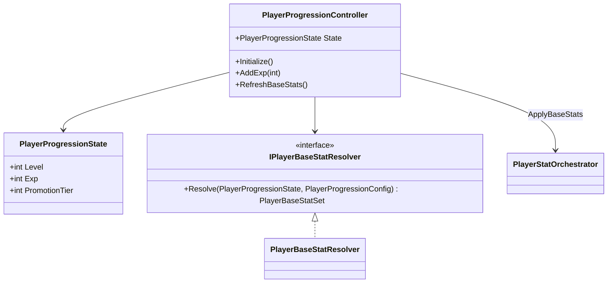
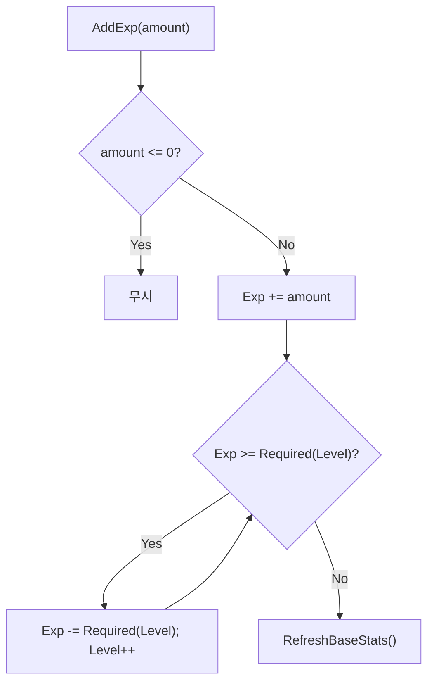
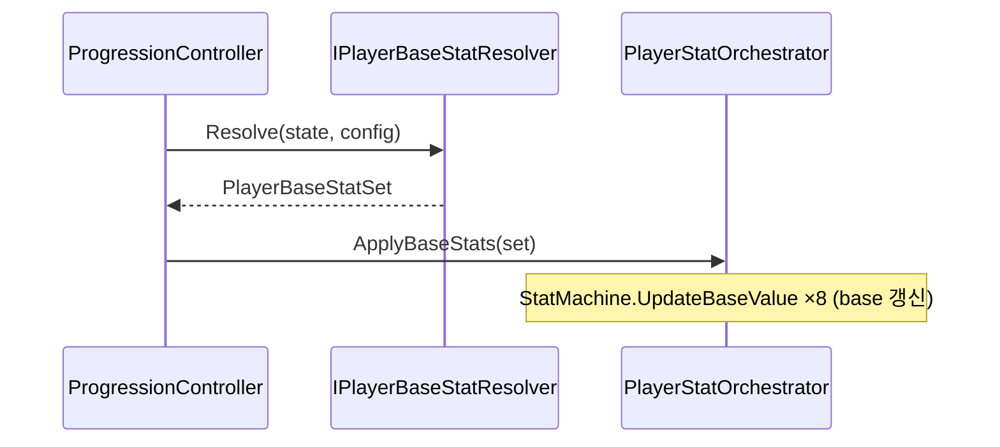

# Player 성장 (Progression)

> **종류**: 아키텍처 명세 (as-built) · **상태**: 완료
> **최종 갱신**: 2026-07-11 · **관련 기획서**: (링크 예정)

---

## 1. 개요·목적

플레이어의 **레벨·경험치·승급 상태를 관리**하고, 그 결과를 **베이스 스탯**으로 환산해 스탯 시스템([[stats]])에 반영하는 시스템이다. 경험치 획득 → 레벨업 → 베이스 스탯 재계산의 순환을 담당한다.

핵심 판단은 **"성장 상태의 소유"와 "베이스 스탯 산출 규칙"의 분리**다. 컨트롤러는 레벨/경험치 상태만 들고, "레벨→스탯" 환산은 `IPlayerBaseStatResolver`에 위임한다. 지금은 config 값을 그대로 쓰는 샘플 리졸버지만, 레벨 테이블·클래스·승급·연구를 합산하는 실무 리졸버로 **교체 가능**하게 열어 두었다.

## 2. 범위(Scope)

| 구분 | 내용 |
|------|------|
| **포함** | 성장 컨트롤러(`PlayerProgressionController`), 성장 상태(`PlayerProgressionState`), 베이스 스탯 환산 계약·구현(`IPlayerBaseStatResolver`/`PlayerBaseStatResolver`), 성장 설정(`PlayerProgressionConfig`) |
| **미포함(Out of scope)** | 베이스 스탯을 `StatMachine`에 실제 적용하는 로직([[stats]]의 `PlayerStatOrchestrator.ApplyBaseStats`), 장비·버프 성장([[equipment]]·[[buffs]]) |

> **갱신(2026-07-11)**: 종전 out of scope였던 "경험치를 **주는** 주체"가 이제 배선되었다. 적 처치 보상이 `IExpReceiver.AddExp`로 경험치를 지급한다. 배선 상세(허브·브리지)는 성장 도메인이 아니라 [적 처치 경험치 보상 계획서](../../design/enemy-kill-exp-reward-plan.md)에 있고, 이 명세는 **수신 계약(`IExpReceiver`) 구현 사실만** 기록한다.

## 3. 요구사항·설계 목표

| 요구사항 | 설계적 해석 |
|----------|-------------|
| 경험치 누적 시 자동 레벨업 | `AddExp`에서 필요 경험치 초과분을 while로 소진하며 다중 레벨업 |
| 레벨업이 스탯에 즉시 반영 | 레벨 변경 후 `RefreshBaseStats` → `Orchestrator.ApplyBaseStats` |
| 성장 산출 규칙을 교체 가능 | `IPlayerBaseStatResolver` 추상. 샘플→실무 리졸버 교체 |
| 초기 상태를 데이터로 지정 | `PlayerProgressionConfig`(SO)의 시작 레벨/경험치/스탯 |

## 4. 시스템 구조

| 구성요소 | 종류 | 책임 |
|----------|------|------|
| `PlayerProgressionController` | class | 경험치 누적·레벨업·베이스 스탯 갱신 조율 |
| `PlayerProgressionState` | class | 런타임 성장 상태(Level·Exp·PromotionTier) |
| `IPlayerBaseStatResolver` | interface | `(상태, config) → PlayerBaseStatSet` 환산 계약 |
| `PlayerBaseStatResolver` | class | 샘플 구현(config 직접 사용) |
| `PlayerProgressionConfig` | ScriptableObject | 시작 상태 + 시작 베이스 스탯 |

## 5. 데이터 구조

### `PlayerProgressionConfig` (ScriptableObject)

| 그룹 | 필드 | 의미 |
|------|------|------|
| 시작 상태 | `StartLevel`·`StartExp`·`PromotionTier` | 런타임 상태 초기값 |
| 시작 베이스 스탯 | `StartMaxHp`·`StartAttackPower`·`StartAttackSpeed`·`StartMoveSpeed`·`StartDefense`·`StartMaxMana`·`StartHpRegen`·`StartManaRegen` | 리졸버가 베이스 스탯으로 환산 |

> 밸런서는 이 SO로 시작 능력치를 코드 수정 없이 조정한다.

## 6. 상세 로직·상태

### 6.1 경험치·레벨업 (`AddExp`)

- 필요 경험치: `RequiredExpForNextLevel(level) = 100 + (level-1)×20` (선형 증가, 코드 상수).
- while 루프로 **한 번의 대량 경험치 획득에 다중 레벨업**을 지원.

### 6.2 베이스 스탯 갱신 (`RefreshBaseStats`)

베이스 스탯은 **base 값**으로 반영된다(modifier 아님, [[stats]] §6.4). 레벨업은 스탯의 뿌리를 갱신하고, 장비·버프는 그 위에 modifier로 얹힌다.

## 7. 인터페이스·의존성(경계)

| 계약 | 방향 | 설명 |
|------|------|------|
| `IExpReceiver.AddExp(int)` | 외부가 **호출** | 경험치 수신 진입점. `PlayerProgressionController`가 구현. 적 처치 브리지(`EnemyExpRewardHandler`)가 이 계약으로만 성장을 안다 |
| `IPlayerBaseStatResolver.Resolve` | 내부 **위임** | 성장 산출 규칙(교체 가능) |
| `PlayerStatOrchestrator.ApplyBaseStats` | 이 계층이 **호출** | 베이스 스탯 반영([[stats]]) |
| `PlayerProgressionController.State` | 외부가 **조회** | HUD 등 성장 상태 표시([[presentation]]) |

> **경계 원칙**: 컨트롤러는 스탯을 **직접** 만지지 않는다. `Orchestrator` API를 통해서만 반영해, "성장이 스탯을 바꾼다"는 사실이 `SourceId`/base 경로로 일관되게 추적된다.

## 8. 설계 포인트 (SOLID 매핑)

| 원칙 | 적용 |
|------|------|
| **SRP** | 상태 소유(Controller/State)·환산 규칙(Resolver)·반영(Orchestrator)이 분리 |
| **OCP** | 실무 성장 공식은 새 `IPlayerBaseStatResolver` 구현으로 교체. 컨트롤러 불변 |
| **LSP** | 어떤 리졸버로도 대체 가능. 컨트롤러는 구현을 모름 |
| **DIP** | 컨트롤러가 구체 리졸버가 아닌 추상에 의존(생성자 주입) |

**하이라이트 패턴**
- **Strategy 성장 규칙**: 레벨→스탯 산출을 리졸버로 전략화 — 게임 규칙 변경을 국소화.
- **상태/규칙 분리**: 세이브 대상(상태)과 계산 로직(규칙)을 갈라 직렬화·테스트를 단순화.

## 9. Unity 특화

- **순수 C# 컨트롤러**: MonoBehaviour 아님. `PlayerRoot`가 생성·`Initialize` 호출.
- **초기화 순서**: `PlayerRoot.Initialize`에서 **가장 먼저** `progressionController.Initialize()` → 베이스 스탯 확립 후 장비·버프가 modifier를 얹고, 마지막에 자원 리필([[stats]] §6.3).
- **성능 예산**: 경험치 획득 시에만 계산. 매 프레임 비용 없음(`ITickable` 아님).

## 10. 테스트 케이스

| 대상 | 확인 항목 |
|------|-----------|
| 단일 레벨업 | 필요치 초과 경험치로 Level+1, 잔여 Exp 정확 |
| 다중 레벨업 | 대량 경험치로 여러 레벨 상승, while 종료 조건 |
| 음수/0 방어 | `AddExp(0)`·음수 무시 |
| 스탯 반영 | 레벨 변경 후 `ApplyBaseStats` 호출·base 갱신 |
| 리졸버 교체 | 목 리졸버 주입 시 산출값이 스탯에 반영 |

## 11. 리스크·미결정(TBD)

- **성장 루프의 다음 단절점(레벨→스탯 리졸버)**: 이제 적 처치로 경험치가 들어와 레벨이 오르지만, 아래 "샘플 리졸버" 항목대로 `PlayerBaseStatResolver`가 레벨을 무시해 **스탯이 오르지 않는다**. 경험치 공급원이 배선된 지금, "레벨은 오르는데 강해지지 않음"이 곧바로 체감된다 → **다음 우선 과제**(`docs/reports/base-stat-resolver-level-scaling.md`).
- **미사용 모델 `PlayerProgressionData`**: `Level`·`BaseHp` 등을 가진 별도 클래스가 있으나 컨트롤러는 `PlayerProgressionState`만 사용. 필드명 오타(`AttakPower`·`Defence`)도 존재 → 정리/삭제 대상.
- **경험치 공식 하드코딩**: `RequiredExpForNextLevel`이 코드 상수. 레벨 테이블 SO로 이관 여지.
- **샘플 리졸버**: `PlayerBaseStatResolver`가 config를 그대로 반환(레벨 미반영). 레벨업해도 베이스 스탯이 실제로는 안 오른다 → 실무 리졸버 구현 필요(주석에 명시됨).
- **`PromotionTier` 미사용**: 승급 상태가 있으나 산출에 반영되지 않음.

## 12. 확장 여지

- **실무 리졸버**: 레벨 테이블 + 클래스 + 승급 + 영구 연구를 합산하는 `IPlayerBaseStatResolver` 구현으로 교체(구조가 이미 열려 있음).
- **세이브/로드**: `PlayerProgressionState`가 순수 데이터라 직렬화 저장의 토대.
- **경험치 배율**: `ExpGainRate` 스탯([[stats]])을 `AddExp`에 곱해 성장 가속 아이템 지원 여지.

## 13. 파일 위치

| 구분 | 파일 | 경로 |
|------|------|------|
| 컨트롤러 | `PlayerProgressionController` | `Features/Player/Progression/PlayerProgressionController.cs` |
| 수신 계약 | `IExpReceiver` | `Features/Player/Progression/IExpReceiver.cs` |
| 상태 | `PlayerProgressionState` | `Features/Player/Stats/Models/PlayerProgressionState.cs` |
| 계약 | `IPlayerBaseStatResolver` | `Features/Player/Stats/Resolution/IPlayerBaseStatResolver.cs` |
| 구현 | `PlayerBaseStatResolver` | `Features/Player/Stats/Resolution/PlayerBaseStatResolver.cs` |
| 모델 | `PlayerBaseStatSet` | `Features/Player/Stats/Models/PlayerBaseStatSet.cs` |
| 데이터 | `PlayerProgressionConfig` | `Data/Definitions/PlayerProgressionConfig.cs` |
