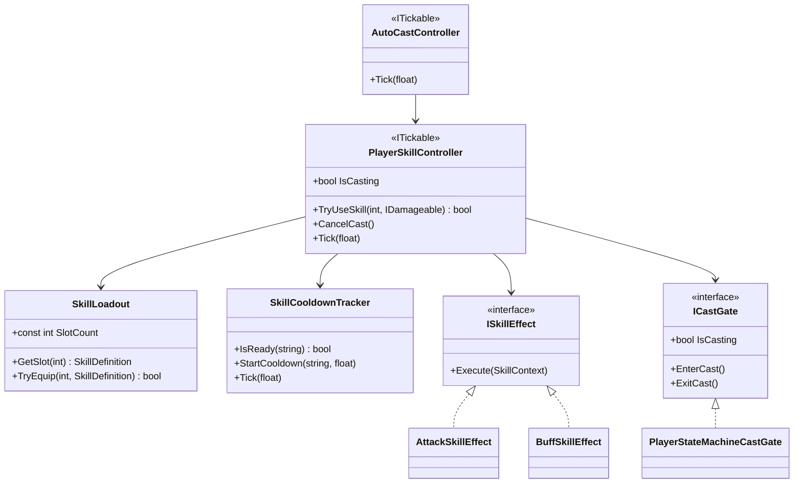
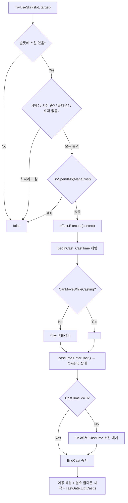
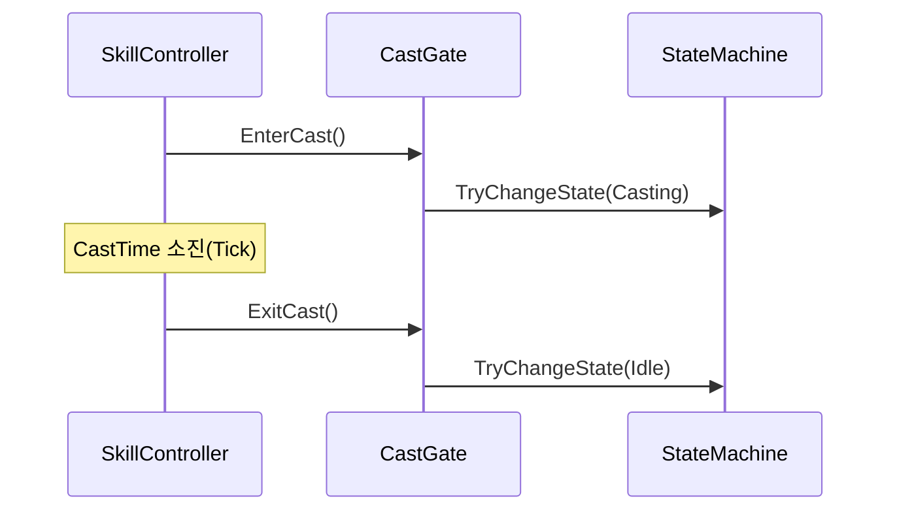
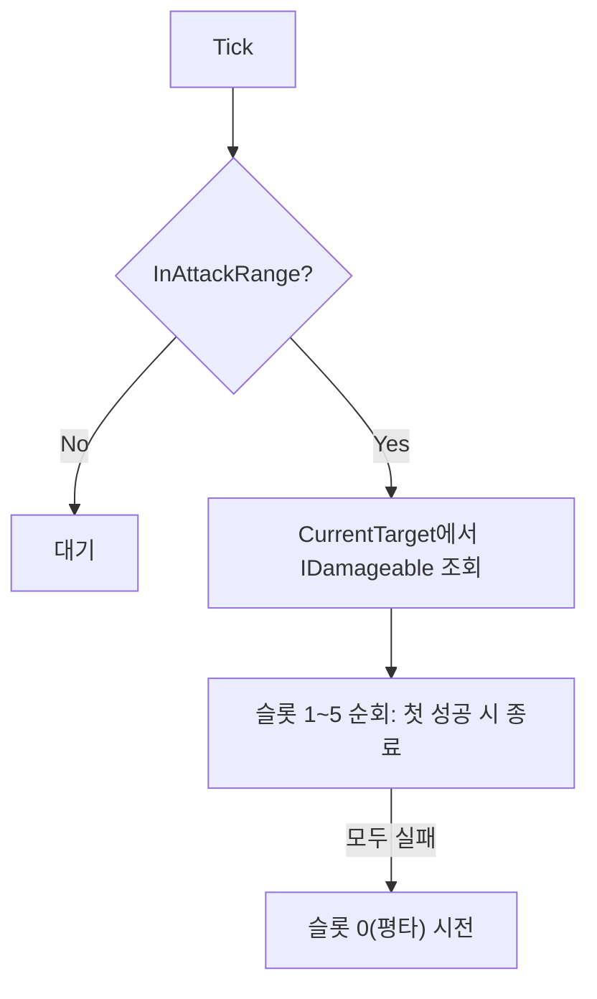

# Player 스킬 시스템 (Skills)

> **종류**: 아키텍처 명세 (as-built) · **상태**: 완료
> **최종 갱신**: 2026-07-10 · **관련 기획서**: (링크 예정)
> **관련 계획서**: [combat-skill-plan.md](../../design/combat-skill-plan.md)

---

## 1. 개요·목적

플레이어의 **스킬 편성·시전·쿨다운·자동전투**를 담당하는 시스템이다. 6슬롯 로드아웃(0번=평타, 1~5번=스킬)을 두고, 시전 절차(MP 소모 → 효과 실행 → 시전 시간 → 쿨다운)를 단일 컨트롤러가 처리한다.

핵심 판단은 **시전 절차(공통)와 스킬 효과(가변)의 분리**다. "MP 있는지, 쿨다운 됐는지, 시전 중인지" 같은 절차는 `PlayerSkillController`가 한 번만 구현하고, "공격이냐 버프냐" 같은 효과는 `ISkillEffect` 구현체로 위임한다. 새 스킬 종류는 효과만 추가하면 되고, **시전을 누가 트리거하는가(플레이어 버튼 / AI 자동)** 는 `TryUseSkill` 호출자만 다를 뿐 동일한 파이프라인을 탄다.

## 2. 범위(Scope)

| 구분 | 내용 |
|------|------|
| **포함** | 시전 파이프라인(`PlayerSkillController`), 6슬롯 편성(`SkillLoadout`), 쿨다운 추적(`SkillCooldownTracker`), 효과 계약·구현(`ISkillEffect`/`AttackSkillEffect`/`BuffSkillEffect`), 시전 컨텍스트(`SkillContext`), 상태머신 연동 어댑터(`ICastGate`/`PlayerStateMachineCastGate`), 자동시전(`AutoCastController`), 데이터 정의(`SkillDefinition`·`SkillLoadoutConfig`) |
| **미포함(Out of scope)** | 실제 피격 판정·데미지 산출([[combat]]의 `PlayerCombatController`), 버프 수명 관리([[buffs]]), 자동전투의 타겟 선택·사거리 판정([[input]]의 `AutoBattleInputSource`), 스킬 버튼 UI([[presentation]]) |

## 3. 요구사항·설계 목표

| 요구사항 | 설계적 해석 |
|----------|-------------|
| 방치·능동 모드가 같은 시전 절차를 공유 | `TryUseSkill(slot, target)` 단일 진입점. 버튼/자동 모두 이 API 호출 |
| 새 스킬 효과 추가 시 컨트롤러 불변 (OCP) | 효과를 `ISkillEffect`로 분리, `SkillType→효과` 딕셔너리 등록 |
| 시전 중 이동·중복시전을 제어 | `CanMoveWhileCasting` 플래그 + `IsCasting` 가드 |
| 시전이 애니메이션/상태와 어긋나지 않아야 | `ICastGate`로 상태머신 `Casting` 진입/복귀를 동기화 |
| 쿨다운 감소(CDR) 스탯 반영 | `EndCast`에서 `CooldownReduction` 스탯으로 실효 쿨다운 산출 |
| 편성을 데이터로 교체 가능 | `SkillLoadoutConfig`(SO)로 프리셋화. 조립은 `PlayerRoot` |

## 4. 시스템 구조

| 구성요소 | 종류 | 책임 |
|----------|------|------|
| `PlayerSkillController` | class (`ITickable`) | 시전 절차 총괄: 검증→효과실행→시전→쿨다운 |
| `SkillLoadout` | class | 6슬롯 편성. 0번 평타 고정, 1~5번 장착 |
| `SkillCooldownTracker` | class | skillId별 남은 쿨다운 추적·감소 |
| `SkillContext` | class | 효과 실행에 필요한 참조 묶음(정의·전투·버프·타겟) |
| `ISkillEffect` | interface | 스킬 효과 실행 계약(`Execute`) |
| `AttackSkillEffect` | class | 공격 효과: 데미지 × 배수 → 타겟 |
| `BuffSkillEffect` | class | 버프 효과: 연결된 버프 적용 |
| `ICastGate` | interface | 시전 상태 잠금/해제 추상 |
| `PlayerStateMachineCastGate` | class | 상태머신 `Casting`↔`Idle` 전이 어댑터 |
| `AutoCastController` | class (`ITickable`) | 사거리 내 자동 시전(방치 모드) |
| `SkillDefinition` | ScriptableObject | 스킬 데이터(코스트·타이밍·효과 파라미터) |
| `SkillLoadoutConfig` | ScriptableObject | 6슬롯 편성 프리셋 |



## 5. 데이터 구조

### 5.1 `SkillDefinition` (ScriptableObject)

| 필드 | 의미 | 사용 조건 |
|------|------|-----------|
| `SkillId` | 쿨다운 추적 키(문자열) | 전체 |
| `DisplayName`·`Icon` | 표시용 | UI |
| `Type` | `Attack` / `Buff` → 효과 라우팅 | 전체 |
| `ManaCost` | 시전 시 소모 MP | 전체 |
| `Cooldown` | 기본 쿨다운(초). CDR 적용 전 | 전체 |
| `CastTime` | 시전 시간(초). 0이면 즉발 | 전체 |
| `DamageMultiplier` | 평타 대비 데미지 배수 | `Type==Attack` |
| `LinkedBuff` | 적용할 버프 정의 | `Type==Buff` |
| `CanMoveWhileCasting` | 시전 중 이동 허용 여부 | 전체 |

### 5.2 `SkillLoadoutConfig` (ScriptableObject)

- `BasicAttack`: 슬롯 0(평타) 고정.
- `EquippedSkills[]`: 슬롯 1~5. "전사용/마법사용" 프리셋을 데이터로 분리해, 편성=데이터·조립=`PlayerRoot`로 역할을 가른다.

## 6. 상세 로직·상태

### 6.1 시전 파이프라인 (`TryUseSkill` → `BeginCast` → `EndCast`)



> **주의(설계 결정)**: 효과 실행(`effect.Execute`)은 `BeginCast` **이전**에 일어난다. 즉 이 시스템은 "시전 완료 후 발동"이 아니라 **"즉시 발동 후 후딜(CastTime) 동안 잠금"** 모델이다. §11에서 이 트레이드오프를 다룬다.

### 6.2 시전 검증 순서 (게이트)

`TryUseSkill`은 다음 순서로 조기 반환한다. **MP 소모는 모든 검증을 통과한 뒤 마지막에** 이뤄져 실패 시 자원이 새지 않는다.

```
슬롯 존재 → !사망 → !시전중 → 쿨다운 준비됨 → 효과 등록됨 → MP 충분(여기서 실제 차감)
```

### 6.3 쿨다운 추적 (`SkillCooldownTracker`)

- `IsReady`: 딕셔너리에 키가 **없으면** 준비됨(쿨다운 중인 것만 보관하는 sparse 방식).
- `Tick`: `ListPool<string>`으로 키를 빌려 순회하며 감소(순회 중 딕셔너리 수정 회피 + GC 없음).
- 실효 쿨다운 = `Cooldown × (1 − Clamp01(CooldownReduction))` — `EndCast`에서 스탯 조회.

### 6.4 상태머신 연동 (`ICastGate`)



`IsCasting`은 상태머신의 현재 상태가 `Casting`인지로 판정한다 — 시전 상태의 **단일 진실 공급원이 상태머신**이라, 컨트롤러가 별도 플래그를 들고 어긋날 여지를 없앴다.

### 6.5 자동시전 (`AutoCastController`, 방치 모드)



스킬(1~5)을 **우선** 시도하고 모두 쿨다운/MP 부족이면 평타(0)로 폴백한다. 사거리 판정·타겟 선택은 `AutoBattleInputSource`가 담당([[input]]).

## 7. 인터페이스·의존성(경계)

| 계약 | 방향 | 설명 |
|------|------|------|
| `TryUseSkill(slot, target)` | 외부가 **호출** | 스킬 버튼([[presentation]])·자동시전이 트리거하는 단일 진입점 |
| `ISkillEffect.Execute` | 내부 **위임** | 효과별 구현. `SkillType`으로 라우팅 |
| `ICastGate` | 외부에 **의존** | 시전 잠금을 상태머신에 위임(구현 교체 가능). [[state-machine]] |
| `IDamageable.ApplyDamage` | 효과가 **호출** | 공격 효과의 데미지 전달 대상(적/플레이어 공용) |
| `PlayerCombatController.GetExpectedDamagePerHit` | 효과가 **읽음** | 데미지 기준값. [[combat]] |
| `CancelCast()` | 외부가 **호출** | 사망·경직 시 외부(사망 처리기)가 시전 중단 |

> **경계 원칙**: 스킬 컨트롤러는 상태 전이를 **직접** 하지 않고 `ICastGate` 뒤로 숨긴다. 상태머신 구조가 바뀌어도 스킬 로직은 불변이며, 테스트에서는 목 게이트로 교체된다.

## 8. 설계 포인트 (SOLID 매핑)

| 원칙 | 적용 |
|------|------|
| **SRP** | 절차(`Controller`)·편성(`Loadout`)·쿨다운(`Tracker`)·효과(`Effect`)·상태연동(`Gate`)이 각각 한 책임 |
| **OCP** | 새 스킬 종류 = `ISkillEffect` 구현 + 딕셔너리 등록. 파이프라인 코드 불변 |
| **LSP** | 모든 효과가 `ISkillEffect`로 대체 가능. 컨트롤러는 구체 효과를 모름 |
| **ISP** | `ICastGate`(3메서드)·`IDamageable`(1메서드)로 계약을 최소화 |
| **DIP** | 컨트롤러가 상태머신·이동의 구체가 아닌 `ICastGate`·`IPlayerMovementController` 추상에 의존 |

**하이라이트 패턴**
- **Strategy(효과)**: `SkillType → ISkillEffect` 매핑으로 효과를 전략화.
- **Adapter(게이트)**: 스킬 도메인과 상태머신 도메인을 `ICastGate`로 느슨하게 접합.
- **자원 안전 검증 순서**: MP 차감을 최종 게이트로 배치해 부분 실패 시 자원 누수 방지.
- **Sparse 쿨다운**: 쿨다운 중인 스킬만 딕셔너리에 보관 → 슬롯 수와 무관하게 순회 비용 최소.

## 9. Unity 특화

- **효과 인스턴스 재사용**: `AttackSkillEffect`/`BuffSkillEffect`는 상태를 갖지 않아 컨트롤러 생성 시 1회 인스턴스화 후 공유(GC·할당 없음).
- **쿨다운 순회 GC 회피**: `SkillCooldownTracker.Tick`이 `UnityEngine.Pool.ListPool`로 키 리스트를 대여/반납 → 매 프레임 힙 할당 없음.
- **틱 소유권**: `PlayerSkillController`·`AutoCastController`가 `ITickable`이라 `PlayerRoot`가 순회. 자체 `Update` 없음(테스트 용이).
- **성능 예산**: 시전 1회 = 딕셔너리 조회 몇 회 + 효과 실행. 자동시전은 프레임당 최대 6슬롯 순회(사거리 밖이면 조기 반환).

## 10. 테스트 케이스

| 대상 | 확인 항목 |
|------|-----------|
| 검증 순서 | 쿨다운 중/MP 부족/시전 중일 때 `TryUseSkill`이 `false`, MP 미차감 |
| MP 원자성 | 검증 실패 시 `TrySpendMp` 미호출(자원 누수 없음) |
| 즉발 스킬 | `CastTime==0`이면 `BeginCast`에서 즉시 `EndCast`, 쿨다운 시작 |
| CDR 반영 | `CooldownReduction=0.5`면 실효 쿨다운 절반 |
| 시전 잠금 | 시전 중 `TryUseSkill` 재호출 `false` |
| 이동 제어 | `CanMoveWhileCasting=false`면 시전 중 이동 비활성 → 종료 시 복원 |
| 자동시전 폴백 | 슬롯 1~5 전부 쿨다운이면 평타(0) 시전 |
| 취소 | `CancelCast` 시 이동 복원, 시전 상태 정리 |

> 컨트롤러는 `ICastGate`·`IPlayerMovementController`·`IDamageable` 목으로 EditMode 검증 가능.

## 11. 리스크·미결정(TBD)

- **효과 실행 시점**: 효과가 `BeginCast` **전**에 실행되어, `CastTime`은 "시전 후딜"로 동작한다. "시전 완료 후 발동(선딜)" 모델이 필요하면 `EndCast` 시점 실행으로 옮겨야 한다.
- **`CastGate` 기본 인자 불일치**: `PlayerStateMachineCastGate` 생성자 기본값은 `castStateID = Attack`이지만, `PlayerRoot`는 `Casting`을 명시 주입한다. 기본값 경로로 생성하면 미사용 `Attack` 상태로 전이되어 §[[state-machine]]의 TBD와 얽힌다. → 기본값을 `Casting`으로 맞추는 정리 필요.
- **`CancelCast` vs `EndCast` 비대칭**: `CancelCast`는 쿨다운을 시작하지 않고 `ExitCast`도 하지 않는다(호출자가 상태 전이 책임). 경직 후 `Casting` 잔류 가능성 — 호출 규약을 문서화/방어 필요.
- **버프 효과의 타겟**: `BuffSkillEffect`는 항상 자신에게 버프를 적용한다. 아군 버프/타겟 버프 확장 시 `SkillContext.Target` 활용 필요.

## 12. 확장 여지

- **새 효과 종류**: 소환·디버프·투사체 등은 `ISkillEffect` 구현 + `SkillType` 추가 + 딕셔너리 등록으로 확장(파이프라인 불변).
- **런타임 편성 UI**: `SkillLoadout.TryEquip`이 이미 슬롯 교체를 지원 → 세이브/편성 화면의 토대.
- **타겟팅 정책**: 현재 자동시전은 `AutoBattleInputSource`의 최근접 타겟에 고정. `ITargetProvider` 교체로 "최저 HP" 등 정책 확장 가능([[input]]).
- **차지/토글 스킬**: `CastTime` 기반 구조를 확장해 홀드 차지·유지형 스킬 수용 여지.

## 13. 파일 위치

| 구분 | 파일 | 경로 |
|------|------|------|
| 컨트롤러 | `PlayerSkillController` | `Features/Player/Skills/PlayerSkillController.cs` |
| 편성 | `SkillLoadout` | `Features/Player/Skills/Core/SkillLoadout.cs` |
| 컨텍스트 | `SkillContext` | `Features/Player/Skills/Core/SkillContext.cs` |
| 쿨다운 | `SkillCooldownTracker` | `Features/Player/Skills/SkillCooldownTracker.cs` |
| 자동시전 | `AutoCastController` | `Features/Player/Skills/AutoCastController.cs` |
| 계약 | `ISkillEffect`·`ICastGate`·`IDamageable`·`ITickable` | `Features/Player/Skills/Contracts/*.cs` |
| 효과 | `AttackSkillEffect`·`BuffSkillEffect` | `Features/Player/Skills/Effects/*.cs` |
| 어댑터 | `PlayerStateMachineCastGate` | `Features/Player/Skills/Adapters/PlayerStateMachineCastGate.cs` |
| 데이터 | `SkillDefinition`·`SkillLoadoutConfig` | `Data/Definitions/*.cs` |
| 열거형 | `SkillType` | `Shared/Enums/SkillType.cs` |
