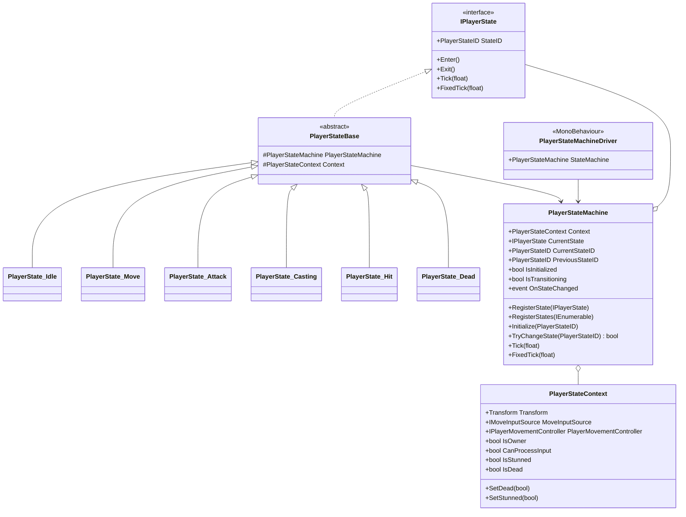
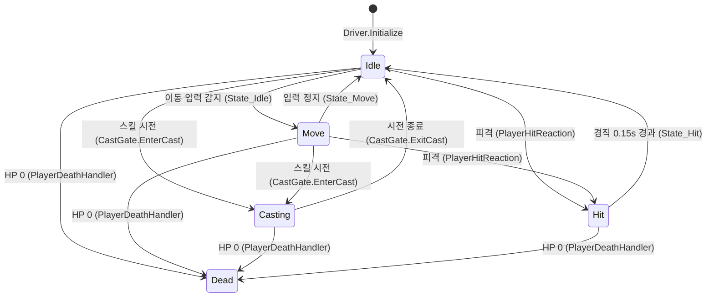
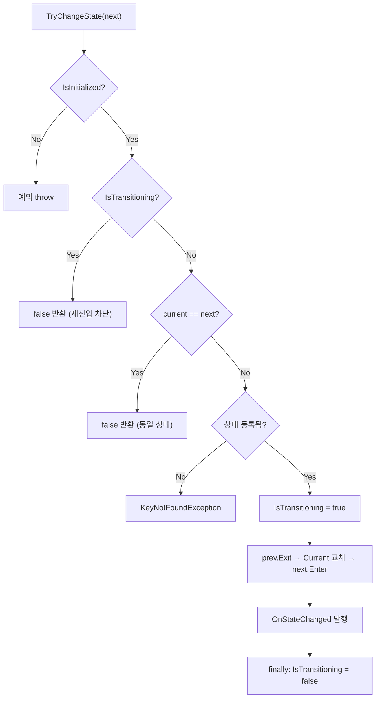

# Player 상태 머신 (State Machine)

> **종류**: 아키텍처 명세 (as-built) · **상태**: 완료
> **최종 갱신**: 2026-07-10 · **관련 기획서**: (링크 예정 — [[game-genre-hybrid-idle-combat]])

---

## 1. 개요·목적

플레이어의 **행동 상태(Idle·Move·Casting·Hit·Dead 등)를 명시적으로 관리**하는 유한 상태 머신(FSM)이다. "지금 이동해도 되는가", "피격 경직 중인가", "죽었는가" 같은 판정을 각 상태 클래스로 분리해, 이동·스킬·전투 시스템이 상태를 조건 없이 신뢰할 수 있게 한다.

핵심 판단은 **입력 소스와 상태 로직의 분리**다. 상태 머신은 "누가 입력을 넣는가(플레이어 조이스틱 / AI 자동전투)"를 알지 못하고, `IMoveInputSource`·`IPlayerMovementController` 추상에만 의존한다. 덕분에 방치 모드와 능동 모드가 **동일한 상태 머신**을 공유한다.

## 2. 범위(Scope)

| 구분 | 내용 |
|------|------|
| **포함** | 상태 등록·초기화·전이 엔진(`PlayerStateMachine`), 상태 계약(`IPlayerState`), 6개 상태 구현, MonoBehaviour 구동기(`PlayerStateMachineDriver`), 상태가 참조하는 컨텍스트(`PlayerStateContext`) |
| **미포함(Out of scope)** | 전이를 **유발하는** 쪽의 로직 — 피격→`Hit`([[combat]]의 `PlayerHitReaction`), 사망→`Dead`(`PlayerDeathHandler`), 시전→`Casting`([[skills]]의 `PlayerStateMachineCastGate`). 상태 머신은 전이 요청을 **받아 처리**할 뿐, 언제 전이할지는 각 도메인이 결정한다. 애니메이션 재생(현재 `IPlayerAnimationController`는 빈 계약) |

## 3. 요구사항·설계 목표

| 요구사항 | 설계적 해석 |
|----------|-------------|
| 방치·능동 두 모드가 같은 상태 흐름을 쓴다 | 상태는 `IMoveInputSource` 추상만 읽는다. 입력 소스 교체로 모드 전환 |
| 전이 도중 재진입(reentrancy)으로 상태가 깨지지 않아야 | `IsTransitioning` 가드로 전이 중 재전이 차단 |
| 새 상태 추가 시 엔진을 수정하지 않아야 (OCP) | `RegisterState`로 딕셔너리에 등록. 엔진은 상태 종류를 모름 |
| 잘못된 상태 조작을 조기에 검출 | 미등록/중복/미초기화 시 예외를 던져 조립 단계에서 실패 |
| 로직을 EditMode 테스트로 검증 | 엔진·상태는 순수 C#. MonoBehaviour는 구동기(Driver)로 격리 |

## 4. 시스템 구조

| 구성요소 | 종류 | 책임 |
|----------|------|------|
| `IPlayerState` | interface | 상태 계약: `StateID`, `Enter/Exit`, `Tick/FixedTick` |
| `PlayerStateID` | enum | 상태 식별자 (None·Idle·Move·Attack·Casting·Hit·Dead) |
| `PlayerStateMachine` | class (순수 C#) | 상태 등록·초기화·전이 엔진. 전이 이벤트 발행 |
| `PlayerStateContext` | class (순수 C#) | 상태들이 공유하는 읽기 맥락(Transform·입력·이동·플래그) |
| `PlayerStateBase` | abstract class | 상태 공통 베이스. `StateMachine`·`Context` 접근 제공 |
| `PlayerState_*` | class ×6 | 개별 상태 구현 |
| `PlayerStateMachineDriver` | MonoBehaviour | Unity 생명주기와 엔진의 접합. 조립·`Tick`/`FixedTick` 펌프 |



## 5. 데이터 구조

이 시스템은 **ScriptableObject 데이터를 갖지 않는다.** 유일한 튜닝 상수는 코드 상수다.

| 값 | 위치 | 의미 |
|----|------|------|
| `StunDuration = 0.15f` | `PlayerState_Hit` | 피격 경직 시간(초). 게임 필 튜닝 대상 → 확장 시 SO로 이관 여지 |

## 6. 상세 로직·상태

### 6.1 전이 다이어그램

전이 화살표 옆에 **전이를 요청하는 주체**를 표기했다. 상태 머신 자체가 결정하는 전이는 상태 이름만, 외부 도메인이 요청하는 전이는 클래스명을 적었다.



### 6.2 상태별 동작

| 상태 | Enter | Tick | Exit | 비고 |
|------|-------|------|------|------|
| `Idle` | — | 이동 입력 있으면 `Move`로 | — | `CanProcessInput`일 때만 판정 |
| `Move` | — | 이동 입력 없으면 `Idle`로 | — | 실제 이동은 이동 컨트롤러가 별도 수행 |
| `Attack` | — | — | — | **현재 진입 경로 없음** (§11) |
| `Casting` | — | — | — | 표식(marker) 상태. 진입/복귀는 `CastGate`가 구동 |
| `Hit` | 경직 on, 이동 off, 타이머 세팅 | 타이머 소진 시 `Idle`로 | 경직 off, 이동 on | `StunDuration` 동안 입력 차단 |
| `Dead` | 사망 플래그 on, 이동 off | — | — | 최종 상태(terminal). 부활 전이 미구현 |

### 6.3 전이 엔진 처리 순서 (`TryChangeState`)



### 6.4 입력 처리 가드 (`CanProcessInput`)

`Idle`·`Move`의 입력 판정은 `Context.CanProcessInput`가 `true`일 때만 수행한다.

```
CanProcessInput = IsOwner && !IsDead && !IsStunned
```

- `IsOwner`: 멀티플레이 대비 소유권 플래그(현재 기본 `true`)
- `IsStunned`: `Hit` 상태가 켜고 끔 → 경직 중 이동 전이 차단
- `IsDead`: `Dead` 상태가 켬 → 사망 후 입력 무시

## 7. 인터페이스·의존성(경계)

| 계약 | 방향 | 설명 |
|------|------|------|
| `IMoveInputSource` | 상태 머신이 **소비** | 이동 입력 벡터 공급. 조이스틱/자동전투가 구현 → [[input]] |
| `IPlayerMovementController` | 상태 머신이 **소비** | `MoveInput` 조회·`SetMovementEnabled` 호출 → [[movement]] |
| `IPlayerAnimationController` | 상태 머신이 **소비** | 현재 **빈 계약**(멤버 없음). 애니메이션 연동 자리만 확보 |
| `PlayerStateMachine.StateMachine` (via Driver) | 외부에 **노출** | `PlayerRoot`가 이 참조를 꺼내 `CastGate`·`DeathHandler`·`HitReaction`에 주입 |
| `OnStateChanged` 이벤트 | 외부로 **발행** | `(prev, next)` 상태 전이 통지. HUD·연출 훅 지점 |

> **경계 원칙**: 상태 머신은 전이를 **받는** 쪽이다. "언제 죽는가/맞는가/시전하는가"는 각 도메인([[combat]]·[[skills]])이 판단해 `TryChangeState`를 호출한다. 이 단방향 규칙이 상태 머신을 도메인 독립적으로 유지한다.

## 8. 설계 포인트 (SOLID 매핑)

| 원칙 | 적용 |
|------|------|
| **SRP** | 엔진(`PlayerStateMachine`)은 전이만, 상태 클래스는 자기 상태의 규칙만, 구동기(`Driver`)는 Unity 접합만 담당 |
| **OCP** | `RegisterState` 딕셔너리 등록 구조 — 새 상태를 추가해도 엔진 코드 불변 |
| **LSP** | 모든 상태가 `PlayerStateBase`(→`IPlayerState`)를 대체 가능. 엔진은 구체 상태를 모름 |
| **ISP** | `IMoveInputSource`(`Move`만), `IPlayerMovementController`(이동 제어만)로 계약을 잘게 분리 |
| **DIP** | 엔진·상태는 인터페이스에만 의존. MonoBehaviour 종속은 `Driver`로 격리 → 순수 C# 테스트 가능 |

**하이라이트 패턴**: 전이 로직을 `try/finally`로 감싸 `IsTransitioning` 플래그를 **항상 복구**한다. 상태의 `Enter/Exit`에서 예외가 나도 상태 머신이 "전이 중" 상태로 고착되지 않는다.

## 9. Unity 특화

- **초기화 순서**: `PlayerStateMachineDriver.Awake()`에서 `SerializedInterface.TryResolve`로 직렬화된 MonoBehaviour를 인터페이스로 해석 → 상태 6개 생성·등록 → `Initialize(Idle)`. `PlayerRoot`(`Start`)보다 먼저 실행되어, `Root`가 `Start`에서 `driver.StateMachine`을 안전하게 참조한다.
- **틱 이원화**: `Update`→`Tick`(입력·전이 판정), `FixedUpdate`→`FixedTick`(물리성 행동). 현재 `FixedTick`을 쓰는 상태는 없다.
- **직렬화 인터페이스**: Unity는 인터페이스를 인스펙터에 직렬화하지 못한다. `MonoBehaviour` 필드로 받아 `SerializedInterface.TryResolve`로 변환하는 우회를 사용한다(`Shared/Utils/SerializedInterface.cs`).
- **성능 예산**: 전이는 딕셔너리 조회 1회 + 델리게이트 호출. 프레임당 상태 1개만 `Tick`. GC Alloc 없음(전이 시 이벤트 델리게이트 제외).

## 10. 테스트 케이스

| 대상 | 확인 항목 |
|------|-----------|
| 미초기화 전이 | `Initialize` 전 `TryChangeState` 호출 시 예외 |
| 중복 등록 | 같은 `StateID` 재등록 시 `ArgumentException` |
| 동일 상태 전이 | `current == next`면 `false` 반환, `Exit/Enter` 미호출 |
| 재진입 차단 | `Enter` 안에서 다시 `TryChangeState` 호출 시 `false` |
| 경직 복구 | `Hit` 진입 후 0.15s 경과 시 `Idle` 복귀 + 이동 재활성화 |
| 입력 가드 | `IsStunned`/`IsDead`일 때 `Idle`이 `Move`로 전이하지 않음 |

> 엔진·상태는 순수 C#이라 `IMoveInputSource`·`IPlayerMovementController` 목(mock)만 있으면 EditMode에서 전 케이스 검증 가능하다.

## 11. 리스크·미결정(TBD)

- **`Attack` 상태 미사용**: `PlayerStateID.Attack`와 `PlayerState_Attack`가 등록되어 있으나 `TryChangeState(Attack)` 호출처가 **없다**. 현재 평타·스킬은 모두 `Casting`으로 처리된다. → 평타를 `Casting`과 구분할지, `Attack` 상태를 제거할지 결정 필요.
- **`IPlayerAnimationController` 빈 계약**: 멤버가 없어 상태 전이가 애니메이션과 연결되지 않는다. `OnStateChanged` 구독 방식으로 연동할지 상태 `Enter`에서 직접 호출할지 미결정.
- **`Dead`는 terminal**: 부활/리스폰 전이가 없다. 방치형 특성상 사망 후 자동 부활이 필요하면 전이 추가 필요.
- **오타성 예외 타입**: 미초기화 시 `InvalidImplementationException`(VisualScripting)을 던진다 — 의미상 `InvalidOperationException`이 적절. 동작에는 영향 없음.

## 12. 확장 여지

- **전이 규칙 테이블화**: 현재 각 상태가 자기 전이를 `Tick`에서 직접 호출한다. 허용 전이표(from→to 화이트리스트)를 엔진에 두면 잘못된 전이를 중앙에서 막을 수 있다(지금은 만들지 않되 구조가 막지 않음).
- **계층적 상태(HSM)**: `Casting`·`Attack`을 "행동 중" 상위 상태로 묶는 확장 여지. 현재 플랫 구조로 충분.
- **상태별 애니메이션 바인딩**: `OnStateChanged` 이벤트가 이미 열려 있어, 애니메이션 컨트롤러를 구독시키면 엔진 수정 없이 연동 가능.

## 13. 파일 위치

| 구분 | 파일 | 경로 |
|------|------|------|
| 계약 | `IPlayerState` | `Features/Player/StateMachine/Contracts/IPlayerState.cs` |
| 계약 | `PlayerStateID` | `Features/Player/StateMachine/Contracts/PlayerStateID.cs` |
| 계약 | `IMoveInputSource` | `Features/Player/StateMachine/Contracts/IMoveInputSource.cs` |
| 계약 | `IPlayerMovementController` | `Features/Player/StateMachine/Contracts/IPlayerMovementController.cs` |
| 계약 | `IPlayerAnimationController` | `Features/Player/StateMachine/Contracts/IPlayerAnimationController.cs` |
| 코어 | `PlayerStateMachine` | `Features/Player/StateMachine/Core/PlayerStateMachine.cs` |
| 코어 | `PlayerStateContext` | `Features/Player/StateMachine/Core/PlayerStateContext.cs` |
| 코어 | `PlayerStateBase` | `Features/Player/StateMachine/Core/PlayerStateBase.cs` |
| 코어 | `PlayerStateMachineDriver` | `Features/Player/StateMachine/Core/PlayerStateMachineDriver.cs` |
| 상태 | `PlayerState_Idle/Move/Attack/Casting/Hit/Dead` | `Features/Player/StateMachine/States/*.cs` |
| 유틸 | `SerializedInterface` | `Shared/Utils/SerializedInterface.cs` |
