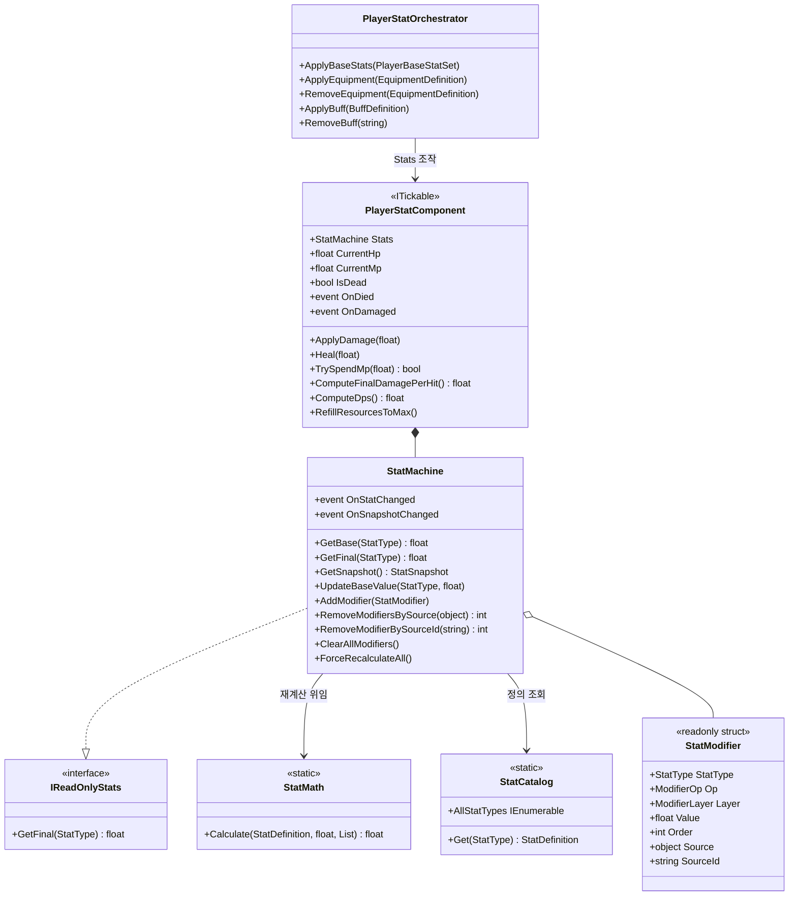
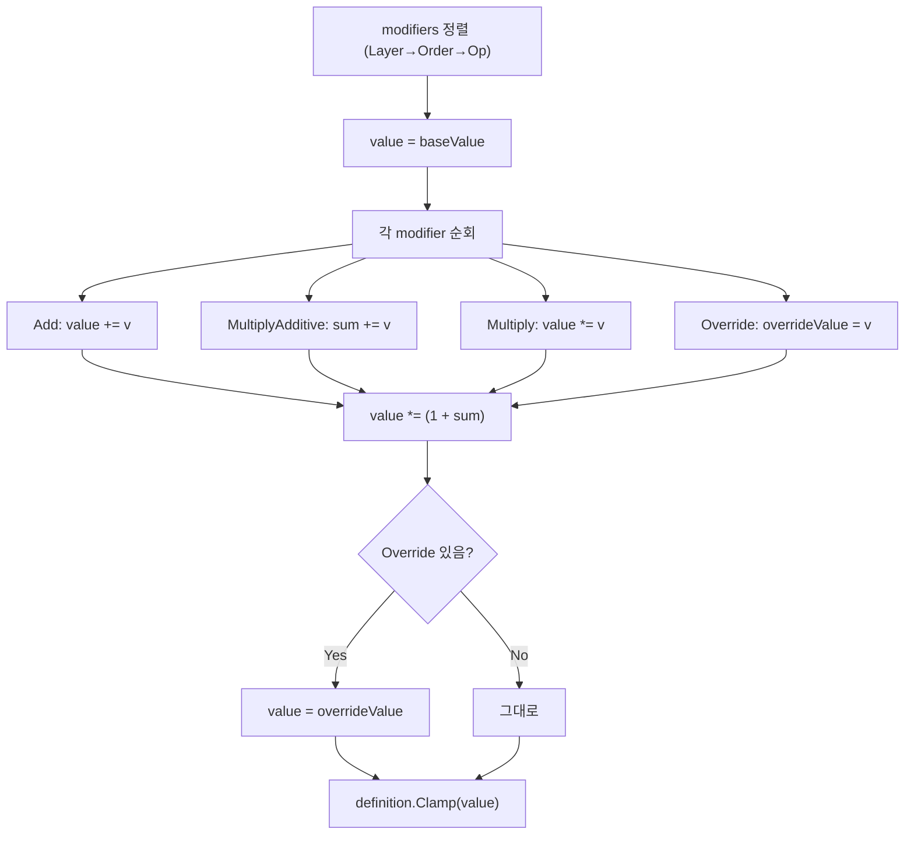
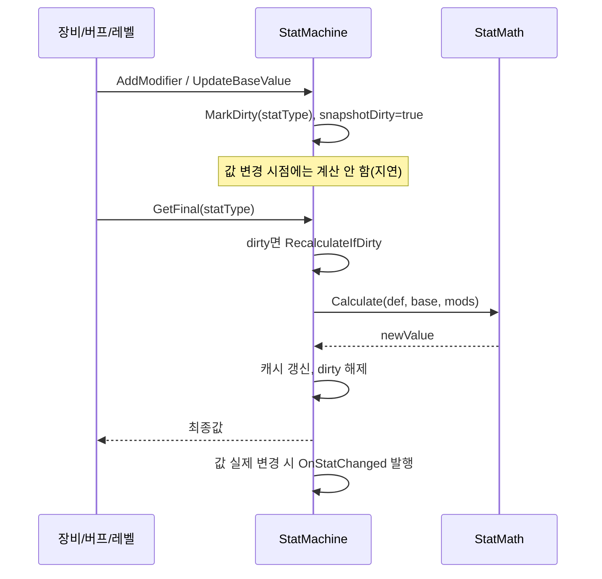

# Player 스탯 시스템 (Stats)

> **종류**: 아키텍처 명세 (as-built) · **상태**: 완료
> **최종 갱신**: 2026-07-10 · **관련 기획서**: (링크 예정)
> **관련 리포트**: [Stat 시스템 분석·리팩터링 안내](../../reports/stat-system-refactoring-guide.md)

---

## 1. 개요·목적

플레이어의 모든 능력치를 **단일 진실 공급원(Single Source of Truth)** 으로 관리하는 시스템이다. HP·공격력·이동속도 같은 20종 스탯을 `base 값 + 다층 modifier`로 계산하고, 그 **최종값 하나만** 이동·전투·HUD가 읽는다.

핵심 판단은 **"성장 요인의 출처(레벨·장비·버프)"와 "계산 규칙"의 분리**다. 레벨업은 base를, 장비·버프는 modifier를 조작할 뿐, 최종값을 어떻게 합성하는지는 `StatMachine`/`StatMath`만 안다. 이동 컨트롤러가 이동속도를 SO에서 읽던 과거 구조를 폐기하고, **모든 소비처가 `StatMachine`을 읽도록** 배선을 일원화한 것이 이 시스템의 목표다.

## 2. 범위(Scope)

| 구분 | 내용 |
|------|------|
| **포함** | 스탯 계산 엔진(`StatMachine`)·합성 규칙(`StatMath`)·정의 카탈로그(`StatCatalog`), 자원/파생 스탯 런타임(`PlayerStatComponent`), 성장 요인을 modifier로 번역하는 오케스트레이터(`PlayerStatOrchestrator`), 값 객체(`StatModifier`·`StatDefinition`·`StatSnapshot`), 읽기 계약(`IReadOnlyStats`) |
| **미포함(Out of scope)** | modifier를 **공급하는** 쪽 — 장비([[equipment]])·버프([[buffs]])·레벨([[progression]])의 데이터·수명 관리. 이들은 `Orchestrator` API를 호출할 뿐이다. 데미지를 **가하는** 주체([[combat]]) |

## 3. 요구사항·설계 목표

| 요구사항 | 설계적 해석 |
|----------|-------------|
| 이동·전투·HUD가 스탯을 한 곳에서 읽어야 | `IReadOnlyStats.GetFinal` 단일 조회 경로. SO 직접 참조 금지 |
| 장비 착용/해제·버프 만료가 스탯에 즉시 반영 | `SourceId` 기반 modifier 등록/제거. 출처별로 정확히 회수 |
| 매 프레임 20종 재계산은 낭비 | **더티 플래그 + 스탯별 캐시**. 바뀐 스탯만 재계산 |
| 계산 규칙(합연산·곱연산 순서)이 일관돼야 | `StatMath`가 Layer→Order→Op 순으로 정렬 후 단일 공식 적용 |
| 값이 비정상 범위로 튀지 않아야 | `StatDefinition.Clamp`로 스탯별 min/max 강제 |
| 스탯 변화에 반응(HUD 갱신 등)해야 | `OnStatChanged`·`OnSnapshotChanged` 이벤트 발행 |

## 4. 시스템 구조

| 구성요소 | 종류 | 책임 |
|----------|------|------|
| `StatType` | enum | 20종 스탯 식별자 |
| `StatDefinition` | readonly struct | 스탯별 기본값·min·max·`Clamp` |
| `StatCatalog` | static class | `StatType → StatDefinition` 정적 카탈로그 |
| `StatModifier` | readonly struct | 단일 보정치(Op·Layer·Value·Order·SourceId) |
| `StatMath` | static class | modifier 리스트 → 최종값 합성 공식 |
| `StatMachine` | class | base·modifier 보관, 더티 캐싱, 최종값·스냅샷 계산, 이벤트 |
| `IReadOnlyStats` | interface | 최종값 읽기 전용 계약(`GetFinal`) |
| `StatSnapshot` | class | 특정 시점 전 스탯의 불변 복사본 |
| `PlayerStatComponent` | class (`ITickable`) | 자원(HP/MP)·리젠·데미지/힐·파생 스탯(DPS 등) |
| `PlayerStatOrchestrator` | class | 성장 요인(base/장비/버프)을 `StatMachine` 조작으로 번역 |



## 5. 데이터 구조

### 5.1 스탯 카탈로그 (`StatCatalog`, 코드 상수)

20종 스탯의 `(기본값, min, max)`를 코드에 고정한다. 대표 예:

| StatType | 기본값 | min | max | 비고 |
|----------|-------|-----|-----|------|
| `MaxHp` | 100 | 1 | ∞ | |
| `AttackPower` | 10 | 0 | ∞ | |
| `AttackSpeed` | 1 | 0.05 | 10 | 초당 공격 횟수 |
| `CritChance` | 0.05 | 0 | 1 | 확률(0~1) |
| `CritDamage` | 1.5 | 1 | 10 | 배수 |
| `MoveSpeed` | 5 | 0 | 100 | |
| `DamageReduction` | 0 | 0 | 0.95 | 상한 95% |
| `CooldownReduction` | 0 | 0 | 0.8 | 상한 80% |

> **기획자 조정 포인트**: 현재 카탈로그는 **코드 상수**다. base 값의 캐릭터별 조정은 `PlayerProgressionConfig`(SO)에서 하고([[progression]]), 카탈로그의 min/max는 밸런스 상한선 역할을 한다. → §11 참조.

### 5.2 modifier 층(`ModifierLayer`) — 정렬·합성 우선순위

```
Base=100 → Equipment=200 → Passive=300 → Buff=400 → Debuff=500 → Runtime=600
```

`StatMath`는 Layer → Order → Op 순으로 정렬한 뒤 합성한다.

### 5.3 연산 종류(`ModifierOp`)

| Op | 의미 | 합성 방식 |
|----|------|-----------|
| `Add` | 가산 | `value += v` |
| `MultiplyAdditive` | 증가율 합산 | 모두 더한 뒤 `value *= (1 + Σ)` |
| `Multiply` | 독립 곱연산 | `value *= v` |
| `Override` | 강제 설정 | 최종적으로 `value = v` (최우선) |

`RuntimeModifierEntry`(직렬화용 struct)가 SO에서 이 값들을 담고, `Orchestrator`가 `StatModifier`로 변환한다.

## 6. 상세 로직·상태

### 6.1 최종값 합성 공식 (`StatMath.Calculate`)



**합성 순서 예**: base 10 · `Add +5` · `MultiplyAdditive +0.2, +0.3` · `Multiply ×2`
→ `(10+5) = 15` → `15 × 2 = 30` → `30 × (1+0.5) = 45`.

### 6.2 더티 캐싱



- **스탯 단위 더티**: 바뀐 스탯만 `_dirtyStats`에 표시 → 조회 시 해당 스탯만 재계산(pull 방식).
- **스냅샷 더티**: 전 스탯 조회가 필요할 때만 `StatSnapshot`을 재생성.
- **변화 임계**: `|old-new| < 0.0001`이면 변화로 보지 않아 이벤트·재세팅을 생략(부동소수 노이즈 차단).

### 6.3 자원·파생 스탯 (`PlayerStatComponent`)

| 기능 | 로직 |
|------|------|
| 리젠(`Tick`) | `HP += HpRegen·dt`, `MP += MpRegen·dt`, `[0, Max]` 클램프 |
| 피격(`ApplyDamage`) | `방어 감쇠 = dmg × 100/(100+Def)` → `× (1-DamageReduction)` → HP 차감 |
| 사망 판정 | HP ≤ 0 → `IsDead=true`, `OnDied` **1회** 발행. 그 외 `OnDamaged(실피해)` 발행 |
| `MaxHp/MaxMp` 하향 | `OnStatChanged` 구독 → 현재 자원이 새 최대치를 초과하면 잘라냄 |
| DPS 계산 | `perHit = ATK × ((1-critChance) + critChance×critDmg)`, `DPS = perHit × AttackSpeed` |
| 초기화 마감 | `RefillResourcesToMax()` — base·장비·버프 적용 후 HP/MP를 최종 최대치로 채움 |

### 6.4 성장 요인 번역 (`PlayerStatOrchestrator`)

성장 요인별로 **경로가 다르다**:

| 입력 | 경로 | 회수 키 |
|------|------|---------|
| 베이스 스탯(레벨/성장) | `UpdateBaseValue` (base 갱신) | — (덮어씀) |
| 장비 | modifier 등록, `SourceId = "item:{ItemId}"` | ItemId |
| 버프 | modifier 등록, `SourceId = "buff:{BuffId}"` | BuffId |

`SourceId` 문자열 네임스페이스(`item:`/`buff:`)로 출처를 구분해, 해제·만료 시 해당 출처의 modifier만 정확히 제거한다.

## 7. 인터페이스·의존성(경계)

| 계약 | 방향 | 설명 |
|------|------|------|
| `IReadOnlyStats.GetFinal` | 외부에 **노출** | 이동·전투·HUD의 유일한 스탯 조회 창구. `StatMachine`이 구현 |
| `PlayerStatOrchestrator` 공개 메서드 | 외부가 **호출** | 장비/버프/레벨 컨트롤러가 성장 요인 적용/제거 시 호출 |
| `PlayerStatComponent.ApplyDamage` | 외부가 **호출** | [[combat]]이 피격을 이 진입점으로 일원화 |
| `OnDied` / `OnDamaged` | 외부로 **발행** | 사망→`Dead` 전이, 피격→`Hit` 전이의 근원 이벤트 |
| `OnStatChanged` / `OnSnapshotChanged` | 외부로 **발행** | HUD·이동 등 스탯 변화 구독처 |

> **경계 원칙**: 이동/전투는 스탯을 **읽기만**(`IReadOnlyStats`) 한다. 스탯을 **쓰는** 권한은 `Orchestrator`를 통해서만 열려 있어, 누가 스탯을 바꿨는지가 `SourceId`로 항상 추적된다.

## 8. 설계 포인트 (SOLID 매핑)

| 원칙 | 적용 |
|------|------|
| **SRP** | 계산(`StatMath`)·보관/캐싱(`StatMachine`)·자원(`PlayerStatComponent`)·번역(`Orchestrator`)이 각각 한 책임 |
| **OCP** | 새 스탯은 `StatType`+`StatCatalog` 항목 추가로 끝. 계산 공식·엔진 불변. 새 연산은 `ModifierOp`+`StatMath` case 추가 |
| **LSP** | `StatMachine`은 `IReadOnlyStats`로 완전 대체 가능. 소비처는 구현을 모름 |
| **ISP** | 소비처는 `GetFinal` 하나만 필요 → `IReadOnlyStats`로 최소 계약만 노출(전체 `StatMachine` API 비의존) |
| **DIP** | 이동·전투·HUD가 구체 `StatMachine`이 아닌 추상(`IReadOnlyStats`)에 의존 |

**하이라이트 패턴**
- **Pull 기반 더티 캐싱**: 변경은 표시만, 계산은 조회 시. 프레임당 무의미한 20종 재계산을 제거.
- **Source 태깅**: `object Source`(참조 동일성)와 `string SourceId`(문자열 키) 두 회수 경로 제공 — 런타임 인스턴스 기반/데이터 기반 회수를 모두 지원.
- **값 객체 불변성**: `StatModifier`·`StatDefinition`을 `readonly struct`로 두어 공유·복사 안전성 확보.

## 9. Unity 특화

- **비-MonoBehaviour 코어**: `StatMachine`·`StatMath`·`PlayerStatComponent`는 순수 C#. `PlayerRoot`가 `new`로 생성 → EditMode 테스트 용이.
- **성능 예산**: 조회당 최악 O(해당 스탯의 modifier 수 · log). 정렬은 modifier 리스트 변경 시에만. modifier 리스트는 초기 용량 8로 예약해 재할당 최소화. `GetSnapshot`은 `Dictionary` 복사(GC Alloc)이므로 **매 프레임 호출 금지** — 이벤트 기반 갱신 권장.
- **초기화 순서 의존**: base→장비→버프 적용이 모두 끝난 뒤 `RefillResourcesToMax()` 호출(§6.3). `PlayerRoot.Initialize` 마지막 단계에서 1회.

## 10. 테스트 케이스

| 대상 | 확인 항목 |
|------|-----------|
| 합성 공식 | Add/MultiplyAdditive/Multiply/Override 조합이 §6.1 예상값과 일치 |
| Override 우선 | Override 존재 시 다른 연산 무시하고 강제값 |
| Clamp | max 초과·min 미만 입력이 경계로 수렴(`DamageReduction` 0.95 상한 등) |
| 더티 캐싱 | modifier 미변경 시 재계산 생략(`Calculate` 호출 횟수 검증) |
| Source 회수 | `SourceId="item:X"` 제거 시 그 출처 modifier만 사라짐 |
| 자원 클램프 | `MaxHp` 하향 시 `CurrentHp`가 초과분 잘림 |
| 사망 1회성 | HP 0 도달 시 `OnDied` 정확히 1회 |
| 데미지 공식 | 방어/감소율 적용 후 실피해가 기대값과 일치 |

## 11. 리스크·미결정(TBD)

- **카탈로그 하드코딩**: `StatCatalog`의 20종 정의가 코드 상수라 밸런서가 min/max를 코드 수정 없이 못 바꾼다. → `StatDefinition` SO 카탈로그로 이관 여지(§12).
- **base 조작 vs modifier**: 레벨업이 `UpdateBaseValue`로 base를 덮어쓴다. 성장 출처가 여럿(레벨+승급+연구)이 되면 base 자체도 `ModifierLayer.Base` modifier로 표현하는 편이 회수·조합에 유리할 수 있음(리포트 참조).
- **`Accuracy`/`Evasion`/`LifeSteal`/`Range` 등 미소비 스탯**: 카탈로그에 정의됐으나 아직 전투 로직이 사용하지 않는 스탯이 있다. 향후 전투 확장 시 소비처 연결 필요.
- **`StatSnapshot` 할당 비용**: 스냅샷 조회가 매번 딕셔너리를 복사한다. 고빈도 사용 시 풀링/불변 뷰 검토.

## 12. 확장 여지

- **SO 기반 카탈로그**: `StatDefinition`을 `ScriptableObject`로 만들면 밸런서가 에디터에서 스탯 정의를 조정(지금은 만들지 않되 `StatCatalog.Get` 경유라 교체가 국소적임).
- **조건부 modifier**: "HP 50% 이하일 때 공격력 +20%" 류는 현재 정적 modifier로 표현 불가 → modifier에 조건 델리게이트를 붙이는 확장 여지.
- **스탯 간 파생 규칙**: 현재 파생 계산(DPS 등)이 `PlayerStatComponent` 메서드에 흩어져 있다. 파생 스탯도 카탈로그화해 일관 조회 가능.

## 13. 파일 위치

| 구분 | 파일 | 경로 |
|------|------|------|
| 코어 | `StatMachine` | `Features/Player/Stats/Core/StatMachine.cs` |
| 코어 | `StatMath` | `Features/Player/Stats/Core/StatMath.cs` |
| 코어 | `StatCatalog` | `Features/Player/Stats/Core/StatCatalog.cs` |
| 코어 | `StatSnapshot` | `Features/Player/Stats/Core/StatSnapshot.cs` |
| 계약 | `IReadOnlyStats` | `Features/Player/Stats/Core/IReadOnlyStats.cs` |
| 런타임 | `PlayerStatComponent` | `Features/Player/Stats/Runtime/PlayerStatComponent.cs` |
| 오케스트레이션 | `PlayerStatOrchestrator` | `Features/Player/Stats/Orchestration/PlayerStatOrchestrator.cs` |
| 리졸버 | `IPlayerBaseStatResolver` · `PlayerBaseStatResolver` | `Features/Player/Stats/Resolution/*.cs` |
| 모델 | `PlayerBaseStatSet` | `Features/Player/Stats/Models/PlayerBaseStatSet.cs` |
| 값 객체 | `StatModifier` · `StatDefinition` | `Shared/ValueObjects/*.cs` |
| 열거형 | `StatType` · `ModifierOp` · `ModifierLayer` | `Shared/Enums/*.cs` |
| 직렬화 | `RuntimeModifierEntry` | `Shared/Serialization/RuntimeModifierEntry.cs` |
